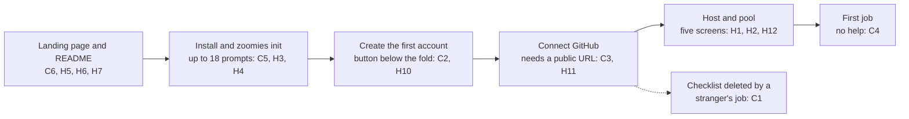
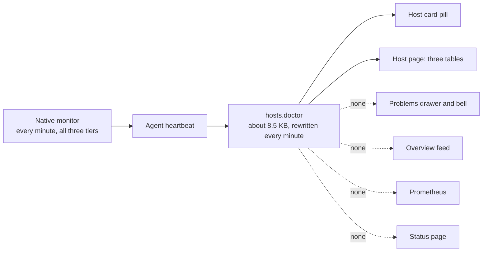

# UI audit — conversion, first run and mobile

Audited at commit `0b4734c`, 1 October 2026. The findings below are as they
were written, with the corrections made after fact-checking marked
**Correction**; [what has been done since](#what-has-been-done-since) says which
of them have been changed and which were left, and why.

**Verdict.** The product is better than its front door. Once a fleet is
populated the UI is genuinely strong: dense, honest, accessible, and the
scheduler explains itself in plain English. But before a visitor sees any of
that they must survive up to eighteen terminal prompts, a sign-up form whose
button is off-screen, a GitHub step that refuses the home labs the landing page
courts, and a checklist that deletes itself when a stranger's job arrives. And
the page that sells it breaks on the phone it is most likely to be opened on
first. Fix the funnel, not the dashboard.

> **Part 2** audits one feature in the same format: [host OS health
> (Zoomies Doctor) in the web UI](#part-2--host-os-health-zoomies-doctor-in-the-web-ui),
> at `df596c9`. Its findings are numbered `DC`, `DH` and `DN`, after the
> appendices below.

## What has been done since

The follow-up is PR #563. Every fix there comes with the test that would have
caught it, and where a finding's own suggestion was not followed this says why.

| Finding | Status | What changed |
| --- | --- | --- |
| **C1** checklist deletes itself | Fixed | The checklist reads the fleet's own running and finished jobs, so a job on somebody else's runner, or one still queued, does not retire it. The regression test delivers a signed `workflow_job` for `ubuntu-latest` the way GitHub does; it failed on the old binary at the assertion that matters. |
| **C2** sign-up buries its button | Fixed for desktop | The card leads with the 72px mark instead of the 298px lockup and drops the email field (H10). At 1440×900 the card is 924px tall and the button ends at 875px, inside the fold; it was 1,250px and 271px below it. The setup token has a help icon listing where the line is for `zoomies logs`, Compose, a started container, systemd and a PaaS. On a phone the button still ends at 913px of 812, which a form on a phone is allowed to do. |
| **C3** Connect GitHub refuses the home lab | Fixed in the dialog | For a loopback address the dialog says what polling costs, links the setting and the tunnel page, and offers the installer's "create it anyway" as an explicit tick. With no address at all it still stops, because there is nothing to give GitHub. The Quick start has the "No public address?" note. |
| **C4** no first-job moment | Done, less one link | Once a pool exists the checklist's last step, and the pool's own page, hand over a complete `workflow_dispatch` file with the pool's label in it, a copy button and the three steps. When the first job of the fleet's own starts, the checklist gives way to the runner, the wait and the run time. The Quick start's §5 is a whole file. |
| **C5** nobody can see it work first | Done, less the hosted demo | `zoomies demo` runs a throwaway controller with the seeded fleet on `127.0.0.1`, nothing asked of the outside world, deleted on Ctrl-C. `install.sh --demo` runs it from a temporary directory with no sudo and no prompts. |
| **C6** landing page scrolls sideways | Fixed | The hero's glow stops at the page edge and the install command wraps at a space. |
| **H1** dashboard of zeros | Partly | The three timing tiles say `--` until there is something to time. The repeated instruction, the duplicate Create a pool button and the long empty page are untouched. |
| **H2** five screens | Copy only | The page header no longer promises seven steps (the simple path is five, the advanced nine). The screens are as they were. |
| **H10** unused email | Fixed | Removed from sign-up; still settable under Settings → Users. |
| **N1**, **N6**, **N7**, **N9**, **N10** | Fixed | The events panel blames a filter only when its choices are what hold lines back. The light docs theme's sidebar titles and footer line and Material's six syntax colours clear 4.5:1. Summary tiles and a pool's configuration keep paragraphs and bars out of their definition lists. The docs' progress bar has a name. The checklist's first row has no blank band. |

### Left alone, and why

* **The hosted demo, a measured "five minutes", and the funnel measurement**
  (C5 parts 3 and 4, H13). They need infrastructure, a CI job, or a decision
  about whether a self-hosted project's installer and site should report
  anything at all. None is mine to take.
* **"Create it on GitHub" with the file prefilled** (C4). GitHub's `value=`
  parameter on the new-file page could not be checked from where this was done,
  and a link that might quietly drop the file's contents is worse than none.
  The card hands over the file and the steps instead. Having Zoomies create and
  dispatch the file itself is a decision about writing to a customer's
  repository.
* **A setup-token link that fills the form** (C2 step 4). A fragment never
  reaches the server or its logs, but the address lands in terminal scrollback,
  shell history and browser history, and the setup token is what proves the
  person is the operator. Changes to how a first account is authorised need a
  threat review, which is the owner's. The rest of C2 kept what its authors
  chose on purpose: the lede and the "Then:" paragraph, the per-field hints and
  the confirmation field.
* **The installer's default** (the last step of C3). See the correction there:
  the premise was wrong, and the default it suggested would have been worse.
* **Judgement calls**, each a decision about the product's shape rather than a
  fix: H3 (an express install), H4 (the Quick start's order), H5 to H7 (the
  landing page's hierarchy and copy), H8 and H9 (phone type sizes and list
  order, which are design-system choices), H11 (the warning on the page every
  path lands on), H12 (the navigation's twelve sections), N2 to N5, N8 (a
  treegrid changes how rows are reached from the keyboard), N11 and N12.

## Read this first

### The brief assumes a trial and a paywall. There isn't one.

Zoomies is AGPL-3.0 and self-hosted. A search of `web/src`, `internal/`, `docs/`
and the site overrides finds no billing, plan, seat, licence-key or trial logic,
no upgrade modal and no upsell. Every "upgrade" in the UI is a software version
bump (`web/src/lib/hosts/HostCard.svelte`, `web/src/lib/state/upgrade.svelte.ts`).
The only monetisation touchpoint in the repository is `.github/FUNDING.yml`, a
Ko-fi link that GitHub renders as a Sponsor button.

So I audited the conversion that does exist. "Start a free trial" becomes
**get to a first job running on your own runner**, and "paywall" becomes
**anything that stops or interrupts a visitor before that moment**.



### How I tested

I built the binary at `0b4734c` and drove a real Chromium (Playwright 1.63)
against it at **1440×900** and **375×812** (touch, 2× density), in light and
dark. Controllers I ran: the project's seeded demo fleet; its empty first-run
fixture (authentication on); its fleet-in-trouble fixture; its connect fixture
with a fake GitHub; and two installs configured the way the installer would
leave them (an `https` external URL, and the `http://localhost` one that the
installer proposes for a loopback listener). I built the marketing site with
`mkdocs` and drove it the same way.

Across 19 app routes, the sign-up and sign-in pages, and 6 site pages I measured
sideways scroll, tap-target sizes, font sizes (by characters, not by element),
and ran axe-core against WCAG 2.0 to 2.2 A and AA.

Each finding carries an evidence tag:

* **Reproduced** — I made it happen in a running build.
* **Measured** — a number from the browser.
* **Code-verified** — read in the source, not executed end to end.
* **Judgement** — my opinion; argue with it.

I did not test with people, and the repository has no analytics (see H13), so
nothing here is a conversion *rate*. It is where the funnel is narrow.

### What I measured and threw away

So nobody chases ghosts: the two warnings in the first-run Problems drawer
(`external_url.missing`, `poll.disabled`) are that fixture's configuration, not
a fresh install's. The process-backend warnings are my sandbox running as root.
The demo fleet's red "9" is the harness (poller off, no external URL,
authentication disabled) plus faults the seed plants on purpose (a cordoned host,
two failed runners, dangerous pools), so I make **no** alarm-fatigue claim. The raw Mermaid
source in my landing-page capture was because my sandbox blocks `unpkg.com`
(see N5 for the real issue). The `audit (0b4734c)` footer is my build stamp. And
the fixed bottom bar floating mid-page in full-page phone screenshots is a
capture artefact, not a bug.

### How the Critical section is ordered

By users affected × severity ÷ effort, so the cheap, certain wins come first.

| Severity | Findings |
| --- | --- |
| Critical | 6 |
| High impact | 13 |
| Nice to have | 12 |

## What is already good — do not "fix" it

* **The populated Overview.** Clear hierarchy, honest status colours, sparklines
  that earn their space, and a feed that says `scaled zoomies-demo-linux-x64
  4 -> 5: 1 job queued > 30s`. It is the best proof-of-value screen in the
  product, and the funnel below exists to get people to it.
* **Contrast.** axe found **zero** colour-contrast failures across 15 app routes,
  in light and dark, at both widths.
* **In-app phone layout does not overflow.** None of 19 routes, two themes,
  scrolls sideways at 375px. `web/tests/mobile.spec.ts` earns its keep.
* **Nothing interrupts.** No dialog opens by itself (every `open = true` in
  `web/src` sits behind a click or a key), and the only persistent toast in the
  app is the administrator-reset-password notice (`web/src/App.svelte:93-105`).
* **Weight.** The app shell is 102.3 KB gzipped against a 200 KB budget, and the
  hero screenshots are 141 KB and 143 KB.
* **Honest recovery.** The checklist never offers a button that leads to a
  refusal (`FirstRun.svelte:1-19`), and the pool wizard's no-GitHub dead end says
  so and carries a Connect GitHub button.
* **The sign-in page.** A real value proposition, three proof points, one
  screen, and a tidy phone layout. Its transparent logo on a black panel is what
  the sign-up card should have used (C2).
* **Radical honesty on the site.** "What is qualified" is rare and builds trust
  with the right reader. The problem is presentation (H7), not substance.

## Your four checks, answered

**1. Upgrade or paywall modals before value.** None exist, and nothing opens
unprompted. The only first-run overlay is a transient toast after sign-up, whose
second sentence tells you to read the checklist you are already looking at (H1).

**2. Several simultaneous upsells; nagware.** There are no upsells. The closest
equivalent is **three parallel "do this next" prompts for one action** on a clean
fresh Overview (the checklist, the post-sign-up toast and the empty Pools panel's
button), five when the controller has any advisory (the warnings bar and the bell
badge join in). That is H1. The Sponsor button is
GitHub's own, driven by `.github/FUNDING.yml`; the product and the docs never
ask for money.

**3. Broken or cramped mobile.** *Broken:* the landing page (C6) scrolls sideways
and clips its install command, and the Connect dialog's second tab is cut
mid-word (N3). *Cramped:* between half and three-quarters of text is 12px or
smaller, the bottom navigation is 11px, and list pages bury the list (H8, H9).
The in-app layout itself never overflows.

**4. Onboarding answers collected but never used.** One clear case: the
sign-up's **Email** field is stored and shown, then never used for anything,
because the product has no mail capability at all (H10). On the other side, the
product *does* honour several choices: the single-host answer removes the "Add a
host" step (the checklist reads "Three steps", not "Four"); the checklist's
`runs-on` line is derived from the pool's real labels (code-verified); and the
theme follows the OS. It does **not** honour "I'm trying this locally" (C3), and
the pool wizard's header miscounts its own steps in both modes (H2).

---

# 1. Critical

## C1. The setup checklist deletes itself the moment a stranger's job arrives

* **Pass:** First-time user
* **Evidence:** Reproduced end to end.
* **Where:** `web/src/lib/overview/FirstRun.svelte:89` (`hasJobs`), `:113`
  (`show`), `:134-144` (`dismiss()` and the effect that calls it); route `/`
  (Overview), desktop and 375px. For contrast,
  `web/src/lib/overview/FleetMetrics.svelte:165-166` reads the fleet-scoped
  counters.
* **Problem:** `hasJobs` sums `queued_jobs + running_jobs + completed + failed`
  from the *unscoped* totals, which count every job GitHub reports for the
  organisation, including those on GitHub-hosted runners. The effect at `:142`
  then persists the dismissal to `localStorage` the moment that sum is non-zero.

  Reproduction: fresh controller, connect an installation, and the checklist
  reads "Three steps between here and a job running on your own runner". Deliver
  one signed `workflow_job` `queued` webhook for `runs-on: ubuntu-latest`
  (HTTP 202). The checklist vanishes live, `zoomies.firstrun.dismissed` becomes
  `"1"`, and it stays gone after a reload. At that instant `GET /api/v1/stats`
  says `queued_jobs: 1` but `fleet.queued_jobs: 0`, and there are no pools.

  Any organisation with other CI activity — nearly every organisation you want —
  loses its guide the first time any other workflow queues a job after GitHub is
  connected, before a host, pool or workflow exists, and lands on an Overview of
  zeros with no next step, at the moment of highest intent. The component's own
  header says it goes away "once a job has run *here*". The code never checks
  "here".
* **Fix:**

  ```ts
  // web/src/lib/overview/FirstRun.svelte
  /**
   * This fleet's own work has started or finished. Reads the fleet-scoped
   * counters -- what FleetMetrics shows with "Other runners" off -- because the
   * unscoped totals include every job GitHub reports. A queued job has not run,
   * so it does not count either: a job stuck in the queue is exactly when the
   * checklist should stay.
   */
  const hasJobs = $derived.by(() => {
    const own = fleet.stats?.fleet;
    return !!own && (own.running_jobs ?? 0) + (own.completed ?? 0) > 0;
  });
  ```

  Leave the effect at `:142` alone; with this definition it is correct. Add a
  case to `web/tests/connect.spec.ts` (it already has the fake GitHub and an
  installation): POST a signed `workflow_job` for `ubuntu-latest`, then assert
  "Finish setting up" is still visible and `zoomies.firstrun.dismissed` is
  unset. Recipe in Appendix C.

## C2. The sign-up form buries its own submit button

* **Pass:** First-time user
* **Evidence:** Measured.
* **Where:** `web/src/routes/Bootstrap.svelte` (whole card; hint at `:222`;
  Confirm at `:307-333`; Email at `:335-351`);
  `web/src/lib/components/Logo.svelte` (`lockup`: `lockupWidth =
  Math.max(220, size * 3.1)`, drawn on `var(--z-brand-black)`); route `/` while
  `session.phase === 'bootstrap'` (every container install); 1440×900 and
  375×812.
* **Problem:** The card is **1,250px tall**. At 1440×900 the "Create the
  account" button's top edge is at y = 1171, **271px below the fold**; on a phone
  it is at 1172px, 1.4 screens down. Why:
  * A **298×298 hard-edged black tile** (the lockup frame) sits on a dark-grey
    card, or on a white one in the light theme. It eats a third of the fold
    before the first field.
  * Two paragraphs (eight lines on desktop) explain a form the reader is
    already looking at.
  * The first field asked is the one the visitor understands least: a
    32-character token to dig out of a log. Its hint, `docker compose logs
    zoomies | grep 'setup token'`, is right for Compose only (wrong for
    `docker run`, systemd or a PaaS), wraps awkwardly at the pipe, and is not
    copyable.
  * Five fields where three are needed: Confirm duplicates the reveal toggle,
    and Email is never used (H10).

  Everything on this card was written by someone who already knows the product.
  The visitor has a Docker terminal open in another window and wants to be done.
* **Fix:**
  1. Logo: `variant="full" size={40}` (inline paw and wordmark, about 140×40) or
     `variant="mark" size={56}`. Keep the lockup for the sign-in page, where it
     is transparent on its black panel.
  2. Copy: replace the lede and the "Then:" paragraph with one sentence: "Create
     the first administrator. This form closes as soon as it exists." The
     post-sign-up toast and the checklist already carry the rest.
  3. Fields: Setup token, Username, Password (keep the reveal toggle and the
     strength hint, and keep `autocomplete="new-password"` so password managers
     save it). Delete "Confirm the password". Delete Email (H10).
  4. Token delivery: print a ready-to-click address beside the token in the
     controller's log and the installer's closing summary, and prefill from it.
     A fragment never reaches the server or its logs:

     ```svelte
     <!-- Bootstrap.svelte -->
     onMount(() => {
       const token = new URLSearchParams(location.hash.slice(1)).get('setup');
       if (!token) return;
       setupToken = token;
       history.replaceState(null, '', location.pathname); // out of history at once
       usernameInput?.focus();
     });
     ```

     Replace the single-line hint with a small tab strip (Compose, Docker,
     systemd, PaaS), each with a `CopyButton`.
  5. Gate it: in `web/tests/first-run.spec.ts` assert the submit button's bottom
     edge is inside the viewport at 1440×900 and at 375×812.

## C3. Connect GitHub refuses the home lab the landing page courts — and the browser is stricter than the terminal

* **Pass:** First-time user
* **Evidence:** Reproduced.
* **Where:** `web/src/lib/installations/ConnectDialog.svelte:486-487`
  (`localExternal`, `notReachable`), `:859-885` (the block), `:1322` (the
  disabled button); `internal/installer/manifest.go:305-345`
  (`checkWebhookReachable`, the three-way choice); `install.sh:687-693`;
  `docs/home-lab.md:38-45`; `docs/quickstart.md` (containers "move the last three
  steps to the browser"); route `/installations` → Connect GitHub; both
  viewports.
* **Problem:** On a controller started with
  `ZOOMIES_EXTERNAL_URL=http://localhost:8095` (the default `zoomies init`
  proposes for a loopback listener), the dialog says "GitHub cannot reach Zoomies …
  Set `server.external_url` to the address GitHub can reach, restart the
  controller, and come back." "Continue to GitHub" stays **disabled even after a
  valid organisation is typed**. On an `https` external URL it enables
  immediately.

  The block offers a config *key* rather than a UI label, no link, no override,
  and no mention of the tunnel advice that exists. The terminal installer, in
  the same state, offers three answers: enter another address; "Create it
  anyway — I will fix the App's webhook URL on GitHub" (poller mode); or skip
  GitHub for now. The dialog's own comment says "The terminal installer refuses
  this; so does this", which is not what the installer does.

  Container installs (Compose, Docker) do the GitHub step in the browser by
  design, so those evaluators have no override at all. And the docs endorse the
  blocked configuration: `docs/home-lab.md` says a controller "at home, on one of
  the machines … falls back to polling". The landing page's second section is
  "Your home lab belongs in the pack". Home labs are the people with no public
  URL.

  Fairness: the guard is right in spirit, because an App's webhook URL is fixed
  at creation. And on the installer and Compose paths `ZOOMIES_EXTERNAL_URL` is
  *required*, so the *empty* variant of this message is unreachable by those
  routes. The loopback variant is the one that bites.
* **Fix:** Keep the guard as the default and give the dialog the installer's
  three answers.

  ```svelte
  <!-- ConnectDialog.svelte, inside {#if notReachable} .blocked -->
  <div class="blocked-actions">
    <Button variant="secondary" size="sm"
            href="/settings/configuration?setting=server.external_url">
      Open the setting
    </Button>
    <Button variant="ghost" size="sm" target="_blank"
            href="https://zoomies.sh/home-lab/#where-the-controller-goes">
      No public address? Use a tunnel
    </Button>
  </div>
  <Checkbox bind:checked={acceptPolling}
            label="Create it anyway -- scaling reacts in tens of seconds until the webhook URL is reachable" />
  ```

  and at `:1322`: `disabled={(notReachable && !acceptPolling) || !target.trim() ||
  Boolean(targetError)}`. The deep-link scheme is the one
  `web/src/lib/problems/ProblemItem.svelte:145` already uses. The Quick start
  also needs a "No public address?" box after step 3.

  **Correction.** The first draft went on to say `install.sh:692` should default
  the external-URL prompt to `http://<detected hostname>:<port>` instead of
  dying on an empty answer. Two things in that were wrong. `install.sh` asks for
  an external URL only when `--mode single` or `--mode controller` is passed;
  the bare one-liner leaves it to `zoomies init`, which already proposes
  `http://localhost:<port>` and accepts Enter. And a hostname default would have
  been the worse answer: it is not loopback, so the dialog's guard would let it
  through, and the App would be created with an address GitHub cannot reach
  either. Nothing in `install.sh` was changed for this.

## C4. There is no "first job" moment — the product never helps you run one

* **Pass:** First-time user
* **Evidence:** Code-verified (a search of `web/src` for smoke, test job, dispatch
  or sample workflow returns nothing; the CLI has no `doctor` or `smoke`).
* **Where:** `web/src/lib/overview/FirstRun.svelte:255-282` (step 5; its only
  button is "Rewrite workflows" → `/migrate`); `web/src/lib/pools/RunsOnPreview.svelte`
  (a single `runs-on:` line); `docs/quickstart.md:215-250` (§5).
* **Problem:** Activation is the moment a job runs on your runner and you watch
  it in the UI. Today that needs you to pick a repo, edit a real workflow and
  push to a real branch — or to run the Migrate wizard, which opens pull
  requests on real repositories, and which is the checklist's only button.
  Nothing is safe, complete and one click: no full workflow, no
  `workflow_dispatch`, no test button, and no celebration when it works.

  The Quick start's snippet is not a workflow file. It starts at `jobs:` with no
  `on:` trigger (GitHub rejects a file without one) and runs `make test`, which
  presumes a project with a Makefile. An evaluator with a fresh organisation
  drifts away at the last step before value, and it is the only step with no
  help.
* **Fix:** Add a "Run a test job" card to step 5 of the checklist and to
  `web/src/routes/PoolDetail.svelte` beside `RunsOnPreview`:

  ```yaml
  name: Zoomies smoke test
  on: workflow_dispatch
  jobs:
    hello:
      runs-on: zoomies-linux-x64   # the pool's own runsOn() value
      steps:
        - run: |
            echo "Hello from $(hostname)"
            uname -a
            sleep 5
  ```

  Two buttons. **Copy workflow**, and **Create it on GitHub →**, which opens
  GitHub's prefilled new-file page,
  `https://github.com/<owner>/<repo>/new/<default-branch>?filename=.github/workflows/zoomies-smoke-test.yml&value=<urlencoded yaml>`
  (no extra App permission; confirm the `value` parameter against your target
  before shipping). Reuse the repository picker in
  `web/src/lib/migrate/StepRepositories.svelte`.

  When `fleet.stats.fleet.completed > 0`, replace the card with a success state:
  "Your first job ran on *{runner}* — waited *{wait}*, started in *{startup}*"
  with a link to the job; only then retire the checklist (C1). Make the Quick
  start's §5 a complete file. Phase two: the App already holds `contents`,
  `workflows` and `actions: write` (quickstart permission table), so Zoomies
  could create and dispatch the file itself behind a confirm dialog.

## C5. Nobody can see the product work before the install marathon

* **Pass:** First-time user
* **Evidence:** Code-verified (prompt inventory in Appendix B) and measured (a
  seeded controller was healthy within four seconds).
* **Where:** `install.sh`; `internal/installer/installer.go`,
  `internal/installer/manifest.go`; `docs/index.md:183-200` ("Five minutes to a
  running fleet") and `:236-241`; `docs/ui.md:20,582` (the only places
  `ZOOMIES_SEED_DEMO` is mentioned); the landing-page and README heroes (static
  screenshots only).
* **Problem:** The only way to experience Zoomies is to answer **up to 18
  interactive prompts** (2 in `install.sh`, 12 in `zoomies init`, 4 around the
  GitHub App) and make two round trips to github.com. Fourteen of the eighteen
  have a default the visitor has no basis to question; four need real input
  (username, password twice, organisation). "Five minutes" is asserted three
  times and measured never.

  **Correction.** The first draft said 4, 10 and 4, and five needing input,
  counting the external-URL and port prompts as `install.sh`'s. They are asked
  only with `--mode single` or `--mode controller`; on the bare one-liner they
  are `zoomies init`'s, and both have defaults (Appendix B).

  The populated product is the best thing here, and the repo already ships a
  deterministic demo fleet. It is an environment variable mentioned in a
  migration paragraph. There is no hosted demo, no `zoomies demo`, no sample-data
  switch. Every visitor not ready to hand a VM and a GitHub organisation to an
  unknown project leaves without seeing the one screen that sells it.
* **Fix:**
  1. `zoomies demo` in `cmd/zoomies`: set `ZOOMIES_SEED_DEMO=true`,
     `ZOOMIES_DISABLE_AUTH=true`, `ZOOMIES_BIND=127.0.0.1:8080`,
     `ZOOMIES_AGENT_EMBEDDED=false` and a database under `os.MkdirTemp`; print
     the URL, open the browser, delete the directory on Ctrl-C. It is essentially
     the configuration `web/tests/support/serve.mjs` already runs.
  2. `install.sh --demo`: download the binary to a temporary directory and exec
     `zoomies demo`. No sudo, no service, no prompts.
  3. Landing hero: a second action beside the install command, "Try the demo",
     pointing at a hosted read-only controller on the same seed (a `viewer`-role
     account, reset hourly).
  4. Replace "five minutes" with a figure measured by a clean-VM job in CI and
     printed in the installer's closing summary (H3).

## C6. The landing page's only CTA is clipped on a phone, and the page scrolls sideways

* **Pass:** Designer
* **Evidence:** Measured.
* **Where:** `docs/stylesheets/zoomies.css:783` (`.zoomies-hero::before {
  inset: -3rem -2rem 30% }`, no clipping), `:906` (`.zoomies-install pre >
  code`: `padding: .95em 4.4em .95em 1.1em; font-size: .78rem`);
  `docs/index.md:20-30`; docs-site route `/` at 375×812.
* **Problem:** `document.scrollWidth` is **399px in a 375px window** — 24px of
  sideways scroll. I bisected it to `.zoomies-hero`: the decorative glow bleeds
  `2rem` past the gutter. The install command renders as
  `curl -fsSL https://zoomies.sh/i[copy chip]`, with the chip covering
  `nstall.sh | sh`, so the most important string on the site cannot be read on
  the device where shared links open first. The CSS comment above `.zoomies-hero`
  says the command "must scroll inside its own box rather than … push everything
  else off the edge"; the pseudo-element then did exactly that. axe also flags
  the scrollable code regions as not keyboard-focusable (4 nodes).
* **Fix:**

  ```css
  /* docs/stylesheets/zoomies.css */
  @media screen and (max-width: 44.9375em) {
    .zoomies-hero::before { inset: -3rem 0 30%; }      /* stay inside the gutter */
    .md-typeset .zoomies-install pre > code {
      white-space: pre-wrap;                            /* wrap rather than hide under the chip */
      word-break: break-all;
      font-size: 0.74rem;
    }
  }
  ```

  Copying is unaffected (the chip copies the text, not the layout). Add a 375px
  `scrollWidth <= innerWidth` assertion to the site workflow so it cannot come
  back.

---

# 2. High impact

## H1. A new operator's Overview is a dashboard of zeros that repeats itself

* **Pass:** First-time user
* **Evidence:** Measured and reproduced.
* **Where:** `web/src/routes/Overview.svelte:119-144`;
  `web/src/lib/overview/{FleetMetrics,PoolUtilisation,EventsFeed,ActiveJobs}.svelte`;
  `web/src/lib/insights/HostCapacityMap.svelte`; `web/src/routes/Bootstrap.svelte:160-163`
  (the toast); route `/`, first run; 1440 and 375.
* **Problem:** An empty fleet's Overview is **2.5 screens on desktop and 4.7 on a
  phone**. Beneath the checklist: six tiles of `0` / `0ms`; a warnings strip; an
  empty Pools panel with its own enabled "Create a pool" button (the checklist
  deliberately greys that action until GitHub is connected, per
  `FirstRun.svelte:1-19`); a feed; an empty Active jobs panel; and a Host
  capacity chart with a dozen toggles and a time slider over no data.

  The same instruction is repeated by the checklist, the post-sign-up toast
  ("Next: connect a GitHub App. The checklist on the Overview says what is left"
  — shown on the page that *is* the checklist) and the Pools empty state: three
  prompts on a clean install, five whenever the controller has any advisory,
  because the warnings bar and the bell badge join in. Two filled primary buttons
  compete inside the checklist ("Connect GitHub" and "Add a host"; after
  connecting, "Add a host" and "Create a pool").

  And `Median queue wait`, `Runner startup p50` and `Registration p50` read
  **`0ms`** with no data. The comment at `FleetMetrics.svelte:190` says `"0ms" is
  a claim, and "--" is the truth`, but the API returns `0`, so a tile that has
  never been measured reports perfect performance.
* **Fix:**
  1. In `Overview.svelte`, while `setupPending`, render only `<FirstRun/>` plus
     one sentence ("This page fills in once your first job has run"). Hide
     `FleetMetrics`, `ProblemsSummary`, the split and `HostCapacityMap`; the flag
     already hides `FleetActivity` at `:125`.
  2. Only the first unblocked step is `variant="primary"`; the rest are
     `secondary` (`FirstRun.svelte:189,213,246`).
  3. Drop the toast's second sentence.
  4. `FleetMetrics.svelte`: show `NO_VALUE` when there is nothing to measure.
     `const hasWaits = (others ? stats?.completed : stats?.fleet?.completed) > 0;`
     then `formatDuration(hasWaits ? medianWait : undefined)` and the same for
     the two startup tiles (or have the API omit the fields at zero samples,
     which matches the author's comment).
  5. Hide the Pools empty-state button while there is no installation.

## H2. Creating the first pool takes five screens, and the page header miscounts them

* **Pass:** First-time user
* **Evidence:** Measured.
* **Where:** `web/src/lib/pools/PoolWizardForm.svelte` (Setup, Target, Labels,
  Docker, Review); `web/src/routes/PoolWizard.svelte:30`; route `/pools/new`;
  both viewports.
* **Problem:** On the seeded fleet, with one installation and every default
  accepted, "Automatic" ("Name it, label it, done.") is **five screens and five
  clicks** (four Next, then Create), on desktop and phone alike. The header says
  "Seven steps: …". The stepper and footer in Automatic say "Step 1 of 5", and
  Advanced says "Step 1 of 9", so the sentence is wrong in both modes.

  With no GitHub connected the wizard lets you through Setup and then stops at
  step 2 with Next disabled (clearly explained, with a Connect GitHub button),
  but the Overview's empty-pool button sends people here, so they have spent a
  decision on a form that cannot finish. For a first pool the answers are known:
  a name from the kennel, a derived label, the only installation, Docker none.
* **Fix:**
  1. When `installations.length === 1` and the mode is Automatic, open on a
     single Review screen: the editable name, `RunsOnPreview`, a one-line summary
     of size and min/max, **Create pool**, and a text button **Customise →** that
     switches to Advanced.
  2. `PoolWizard.svelte:30`: derive the sentence from the active step list or
     delete the enumeration.
  3. With zero installations, render the Connect GitHub empty state instead of
     the wizard.
  4. Playwright: the happy path takes one click.

## H3. Installation asks up to 18 questions, and the first has no default

* **Pass:** First-time user
* **Evidence:** Code-verified (inventory in Appendix B).
* **Where:** `install.sh:668-713` (build channel, external URL — `:692` exits on
  an empty answer — and port), `:1686` (Continue?);
  `internal/installer/installer.go:381,419,1513,1791,1831,1869,1985,1998,2002,2035`;
  `internal/installer/manifest.go:121,361,414`.
* **Problem:** `curl | sh` itself asks two things before it has downloaded
  anything: which build to install ("Latest stable / Development", asked of
  everyone though only contributors want the second option) and whether to
  continue. The other sixteen come from `zoomies init`: twelve about the host and
  four about the GitHub App. Questions such as "How should the controller be
  reached?" can only be answered by someone who already operates it. (With
  `--mode single` or `--mode controller` the script also asks for an external
  hostname, with **no default** and an exit on Enter, and a port.)

  **Correction.** The first draft said the first thing the one-liner asks is
  that external hostname. It is not: the bare one-liner never asks it.
* **Fix:**
  1. `install.sh`: drop the "Which build?" prompt (keep `--version dev` for the
     contributors who want it), and let the external-URL prompt that
     `--mode single` asks accept Enter with the same `http://localhost:<port>`
     `zoomies init` proposes. (Not a hostname: see the correction under C3.)
  2. Add `zoomies init --express`, offered as the first choice ("Express: single
     host, detected runtime, loopback, systemd — asks for an administrator and a
     GitHub organisation, nothing else"). It skips backend, capacity, listener,
     service and review when detection has one sensible answer.
  3. Print the elapsed install time in the closing summary, and publish it (C5).

## H4. The Quick start explains Elastic CPU before you have run a job

* **Pass:** First-time user
* **Evidence:** Measured.
* **Where:** `docs/quickstart.md:60` (§2, ≈55 lines), `:115` (§3, the permission
  table), `:145` (§4, ≈70 lines), `:215` (§5, "Run something"); docs-site route
  `/quickstart/`: 10 screens on desktop, 17.4 on a phone.
* **Problem:** The title promises "about five minutes". The only step that
  produces value is §5, on line 215 of 339. Before it come a deployment chooser,
  an eight-row permission table, a nine-row pool-defaults table, and four
  paragraphs on Size per runner, Elastic CPU, Operating system and Docker in jobs
  — reference material for someone who has not yet seen a job run.
* **Fix:** Reorder to Install → Connect GitHub → Create the default pool (three
  lines; defaults table collapsed in a `??? note`) → **Run a test job** (the C4
  workflow) → "Make it yours". Move Elastic CPU, Operating system and Docker in
  jobs to `docs/hosts-and-pools.md`, which already exists. `pymdownx.details` is
  enabled in `mkdocs.yml`, so collapsible blocks need no new dependency.

## H5. The landing page's hierarchy sends the visitor to a niche before the product

* **Pass:** Designer
* **Evidence:** Measured and judgement.
* **Where:** `docs/index.md:16-35` (hero), `:51-62` (home lab, with the first
  filled button), `:82+` (feature grid), `:283-300` (comparison);
  `docs/stylesheets/zoomies.css:936-960` (`.popular`), `:964-981`
  (`.zoomies-grid`); desktop 1440 and phone.
* **Problem:**
  * The hero's call to action is a code block. The first filled button on the
    page is "Connect your private hosts →", for one segment, just over two
    screens down (y = 1,863px at 1440×900). Nothing says "Quick start" in button
    form.
  * The header carries no persistent "Install" or "Quick start" button.
  * `Popular:` chips look like navigation, not a decision.
  * Nine feature cards of 6 to 9 lines each end in an **orphan** at 1440px (4 + 4
    + 1, then a wide card): a single card alone on the last row of a four-column
    grid reads as unfinished.
  * The comparison table, the strongest persuasion on the page, is about 70% of
    the way down, rendered at half the content width on desktop, and on a phone
    the **Zoomies column is the one clipped off the right edge**.
  * The page is 8.4 screens on desktop and **15.2 on a phone**.
* **Fix:**
  1. After `.zoomies-install` add `<p class="actions">` with **Quick start →**
     (`.md-button--primary`) and **See the web UI** (`.md-button`). The `.actions`
     row already exists for the closing CTA.
  2. Override Material's `partials/header.html` in `overrides/` to add a
     right-aligned "Quick start" button beside the repository block.
  3. Move "Why not something else" directly under the product screenshot and the
     home-lab section after "What you get".
  4. Make the grid 3 × 3: `.zoomies-grid { grid-template-columns:
     repeat(3, minmax(0, 1fr)); }` at `min-width: 60em`, `1fr` below. Cut each
     card to two sentences and link out.
  5. `.zoomies-compare table { width: 100% }`; on phones put the Zoomies column
     **first** (reorder the Markdown columns: Zoomies, ARC, Static runners).

## H6. The hero says "Zoomies", not what you get

* **Pass:** Designer
* **Evidence:** Judgement.
* **Where:** `docs/index.md:18-27`; `README.md:7-20`;
  `docs/stylesheets/zoomies.css:841-843` (`.quiet` → `--md-default-fg-color--lighter`).
* **Problem:** The headline is a pun that needs decoding ("Give your GitHub
  Actions runners the Zoomies."). The product's name is set in the `--lighter`
  foreground (`.quiet`), visibly dimmer than the line above it. The sentence
  beneath lists mechanisms ("fresh ephemeral runner", "autoscaling across your
  own hosts", "no Kubernetes, no database server") instead of an outcome. Nothing in the first
  screen says faster, cheaper or safer, and no number appears. The project
  dogfoods itself ("every job but the arm64 and Windows legs runs on a Zoomies
  fleet"), so real numbers exist and are unused.
* **Fix:** Keep the pun as the eyebrow. Make the H1 the outcome, for example
  "Self-hosted GitHub Actions runners that start in seconds and vanish after every
  job." Replace the lede with a three-item proof row using figures from the
  project's own CI fleet, stated with their date and window (median runner
  startup, median queue wait, leftover state between jobs: none). **Do not** quote
  the demo fleet's figures; they are fixtures. Remove `.quiet` from the brand
  word (`zoomies.css:841`).

## H7. "What is qualified" is the least readable text on the most trust-sensitive part of the page

* **Pass:** Designer
* **Evidence:** Measured and judgement.
* **Where:** `docs/index.md:262-281`; `README.md:21-24`; the home page on desktop
  and phone.
* **Problem:** A paragraph of about 150 words whose key sentence runs 123 words
  with nested clauses and two semicolons ("… exercised on every pull request, on the `process` backend
  against a fake GitHub, on amd64 and on arm64; the Docker backend is unit-tested
  against a fake Engine API, and while no *test* here starts a container, this
  repository's own CI does — …"), sits mid-page. On a phone it is about 20 lines. The
  README opens with "Read it before you put anything precious on this." *above the
  badges and the screenshot*. The honesty is an asset; the presentation reads as
  "not production-ready, good luck", and it appears three times (this section,
  "A word about self-hosted runners", and the Safe defaults card).
* **Fix:** Replace the paragraph with a four-row status table (Controller and
  agents; Docker backend; Podman backend; Windows agent) with the columns
  **Tested on every PR**, **Dogfooded in CI**, **Not yet run**, each cell a short
  phrase. Link `roadmap/support-and-measurement.md` for the long form. In the
  README, move the italic disclaimer under the screenshot and link the same
  table. Merge the three trust sections into one.

## H8. On a phone, half to three-quarters of the text is 12px or smaller, and tap targets fail WCAG 2.2

* **Pass:** Designer
* **Evidence:** Measured.
* **Where:** `web/src/lib/styles/tokens.css:186-189` (`--z-text-2xs` 11px,
  `-xs` 12px, `-sm` 13px); `web/src/lib/shell/Nav.svelte` (`.phone .label`,
  `font-size: var(--z-text-2xs)`); `web/src/lib/shell/TopBar.svelte:184,257-264,429`
  (the `.home` logo link); `web/src/lib/components/Checkbox.svelte:72-73`
  (`--z-control-box: 15px`); every grid; 375px.
* **Problem:** By characters on screen at 375px: Overview **65%** at or below
  12px, Hosts **75%**, Jobs **64%**, Pools **48%**, Runners **48%**; the smallest
  text is 10.5px. The phone gets the desktop type scale: only inputs step up to
  16px. The bottom bar, the primary navigation, uses **11px labels**.

  Targets, with a coarse pointer confirmed (`matchMedia('(pointer: coarse)')` is
  true in my emulation and in Playwright's own Pixel 7 descriptor, which the
  project's mobile suite uses): standard buttons are **32px** (`md`) and **24px**
  (`sm`) tall, because the 44px `--z-control-touch` is applied only to a short
  list (segmented choices, chips, sliders, column grips and the sign-in form's
  `lg`; `docs/ui-guidelines.md:442-447`). That clears WCAG 2.2 AA's 24px floor
  but is under the 44px that Apple and Google recommend. And WCAG 2.2
  `target-size` (2.5.8, AA) still fails on every grid page — Pools 25 nodes,
  Jobs 22, Runners 18, Queue 14, Audit 8, Hosts 7 on desktop — from the grid's
  resize and reposition buttons (measured 12×40 and 20×24 despite the coarse
  block at `DataGrid.svelte:1639`), the select-all checkbox (15×15) and link rows
  20px tall; plus the 22×22 logo link on the phone's top bar.

  The 13px base is a documented, deliberate decision for "a dense operational
  tool" (`docs/ui-guidelines.md:377-380`), and I am not arguing for 16px on
  desktop. But the same guidelines say "a phone is not a narrow desktop", and the
  stated phone requirement is one-handed reading at 3am. That argues for a
  phone scale.
* **Fix:** A uniform one-pixel step on touch screens keeps the hierarchy and
  avoids reflowing the layout:

  ```css
  /* web/src/lib/styles/tokens.css */
  @media (max-width: 768px), (pointer: coarse) {
    :root {
      --z-text-2xs: 0.75rem;     /* 11 -> 12 */
      --z-text-xs: 0.8125rem;    /* 12 -> 13 */
      --z-text-sm: 0.875rem;     /* 13 -> 14 */
      --z-text-base: 0.9375rem;  /* 14 -> 15 */
    }
  }
  ```

  Re-run `web/tests/mobile.spec.ts`; its no-sideways-scroll assertion is the
  regression gate. Then:
  * `.phone .label` in `Nav.svelte` → `var(--z-text-xs)`;
  * `.home` in `TopBar.svelte` gets `min-width` and `min-height:
    var(--z-control-touch)` under `pointer: coarse`;
  * extend the `Button.svelte:208` coarse block from `.lg` to `.md`
    (`height: var(--z-control-touch)`) and give `.sm` 32px; check the toolbars
    still wrap;
  * give the checkbox a label hit area with 44px of padding under
    `pointer: coarse`;
  * find why the grid's resize and reposition buttons measure 12×40 under the
    coarse block at `DataGrid.svelte:1639`, and either grow them to 24px or hide
    them on touch, where `lib/actions/columnGesture.ts` already provides the
    gesture.

## H9. On a phone, list pages put the list below their summaries

* **Pass:** Designer
* **Evidence:** Measured.
* **Where:** `web/src/routes/Runners.svelte`, `Hosts.svelte`, `Pools.svelte`,
  `Jobs.svelte`; `web/src/routes/Overview.svelte:119-144`; 375×812, demo fleet.
* **Problem:** Distance from the top of the page to the first row or card of the
  thing the page is named after: **Hosts 3.4 screens**, **Runners 2.5**, **Jobs
  2.0**, **Pools 1.4**. Runners spends its first screens on six tiles, a
  "provisioning demand" strip and a lifecycle explainer with a five-row legend.
  Hosts adds a seven-state machine strip, mostly zeros, and the capacity chart
  ahead of the first host. Whole pages are long: Usage 6.8 screens, Overview 6.6,
  Hosts 6.6, Pool detail 6.3.

  On the Overview the Activity matrix (a year of days) sits above the live tiles:
  "Queued jobs" starts 626px down, 77% of the way through the first screen. The
  project's own phone use case is "an operator woken at 3am reading a dashboard
  one-handed" (`web/tests/mobile.spec.ts`), and that operator wants problems,
  then live counts, then the list.
* **Fix:** On the phone breakpoint put the list first and fold the explainers.
  Wrap "Runner lifecycle", "Provisioning demand" and the machine-state strip in a
  `<details>` that is closed under 768px (use the phone flag in
  `$lib/state/viewport.svelte`). In `Overview.svelte`, give `.stack` children an
  `order` under `@media (max-width: 768px)`: problems, live tiles, split, then the
  matrix. Settings → Configuration (29.2 phone screens) already has search and a
  section index; leave it.

## H10. The sign-up asks for an email the product can never use

* **Pass:** First-time user
* **Evidence:** Code-verified.
* **Where:** `web/src/routes/Bootstrap.svelte:34,145,335-351`;
  `web/src/lib/settings/UsersPanel.svelte:536,635`; no mail sender anywhere in
  `internal/` or `cmd/`.
* **Problem:** "Email — Optional. Used only to identify the account." It is stored
  (`users.email`), shown as a grey second line in the Users table, and filled from
  OIDC claims. But there is no SMTP, no mail provider and no feature that sends
  or reads it: not password reset ("Forgotten it? An administrator can reset
  it." on the sign-in page), not alerts, not invitations (`UsersPanel`: "Send it
  to them over something private; it is not emailed."). On the one form between
  a visitor and the product it is a fifth field that does nothing.
* **Fix:** Remove it from `Bootstrap.svelte`; the API already treats it as
  optional (`internal/api/handlers_auth.go:124`), so there is no backend change.
  Delete the `fieldErrors.email` plumbing. Keep it in Settings → Users for
  display. If notifications arrive later, ask then, and say why.

## H11. The page every path sends you to opens with a warning and two identical buttons

* **Pass:** First-time user
* **Evidence:** Reproduced.
* **Where:** `web/src/routes/Installations.svelte:220` (header button),
  `:244-256` (empty state and its button), `:317` (unconditional
  `<WebhookHealth/>`); `web/src/lib/installations/WebhookHealth.svelte`; route
  `/installations`, first run; both viewports.
* **Problem:** Zero connections, and the page shows "Connect GitHub" top right,
  "Connect GitHub" again about 300px lower, and then a full **Webhook delivery** panel:
  "Check reachability", an **amber** callout ("No webhook has been received, so
  the controller is polling GitHub … reacts more slowly and spends more of the
  API quota"), an "Every delivery" filter and an empty table, for a connection
  that cannot exist yet. On a phone, "Refresh" comes before "Connect GitHub" in
  the action row. The first impression of the step everybody must pass is a
  warning about something that cannot have happened.
* **Fix:** Render `<WebhookHealth/>` only when there is at least one installation
  (`Installations.svelte:317`). With none, show the empty state alone and drop
  the header button on desktop. On phones, put the primary action first in the
  row.

## H12. Navigation offers twelve sections to someone who needs a handful

* **Pass:** First-time user
* **Evidence:** Judgement.
* **Where:** `web/src/lib/shell/sections.ts:56-72`;
  `web/src/lib/shell/Nav.svelte`, `NavMenu.svelte`; first run, desktop sidebar and
  the phone's More sheet.
* **Problem:** A fleet with no installation, pool or job shows Pools, Runners,
  Queue, Workflows, Usage, Hosts, Providers, Installations, Migrate, Audit and
  Settings. Runners, Queue, Workflows and Usage are empty until the first job,
  Audit matters to a second administrator, and Providers is an advanced feature.
  The only guidance toward Installations is the checklist. The vocabulary alone (pool,
  host, runner, installation, provider, machine, cordon, drain, slot) is a wall
  for a visitor who has not yet seen one running.
* **Fix:** Derive a `setupMode` from the same state `FirstRun` uses (no
  installation or no pool) and render only Overview, Installations, Hosts, Pools,
  Migrate (the checklist's own last step) and Settings, with the rest behind a
  "More" disclosure. Keep every `g`-chord
  live. Lift the filter once the fleet's own first job has completed (the C1
  definition).

## H13. Nothing measures the funnel

* **Pass:** First-time user
* **Evidence:** Code-verified.
* **Where:** `mkdocs.yml`, `overrides/main.html` (no analytics block);
  `install.sh` (served as a static file); a search for common analytics
  providers across `overrides/`, `docs/javascripts/` and `hooks/` returns nothing.
* **Problem:** There is no visitor analytics, no count of `install.sh` fetches,
  and no event on "copy install command" or "Install Zoomies". There is, rightly,
  no telemetry in the product. So every number in this audit measures the UI, not
  people: nobody can say what fraction of visitors copy the command, what
  fraction finish `zoomies init`, or where they stop. You cannot fix a funnel you
  cannot see.
* **Fix:** Cookieless, self-hostable analytics on the **docs site only**
  (Plausible, Umami or GoatCounter; no consent banner needed), added in
  `overrides/main.html` inside ``. Custom events for a click
  on the copy chip inside `.zoomies-install`, a click on `.md-button--primary`,
  and 50% and 90% scroll depth on `/quickstart/`. Count installs by serving
  `install.sh` through an edge function that logs a hit and redirects to the raw
  file. Say on the landing page that the product itself sends no telemetry; for
  this audience that is a selling point.

---

# 3. Nice to have

## N1. The Recent events empty state blames a filter the user never touched

* **Pass:** First-time user
* **Where:** `web/src/lib/overview/EventsFeed.svelte:150-155`; route `/`, first run.
* **Problem:** The title switches on `everything` (whether any kinds are hidden),
  not on whether hidden kinds hold entries. On a brand-new fleet, two kinds are
  hidden by default, so the panel says "Nothing in the kinds you are watching —
  2 kinds of event are switched off for this browser. Choose above turns them back
  on." The last sentence is also garbled.
* **Fix:** Title "Nothing has happened yet" whenever the unfiltered feed is empty;
  mention hidden kinds only when they hold entries, and write it as: `Use
  "Choose" above to show them.`

## N2. Duplicate "Other runners" switch, and a Refresh button on a page that says nothing needs pressing

* **Pass:** Designer
* **Where:** `web/src/routes/Overview.svelte:102-110` and
  `web/src/lib/overview/ActiveJobs.svelte` (same preference, same label, one page).
* **Problem:** Two identical switches bound to one preference, a screen apart.
  "Refresh" sits beside a page whose subtitle promises it updates live.
* **Fix:** Keep the page-level switch; make the panel text link to it instead of
  repeating it. Collapse Refresh to an icon-only button on phones.

## N3. The Connect dialog on a phone clips its second tab and orphans a step

* **Pass:** Designer
* **Evidence:** Measured (screenshot at 375px).
* **Where:** `web/src/lib/installations/ConnectDialog.svelte` (the `Tabs` and the
  stepper); `web/src/lib/components/Tabs.svelte`; route `/installations` → Connect
  GitHub; 375px.
* **Problem:** The second tab reads "Use an App you already h" — clipped mid-word
  with no ellipsis, no wrap and no scroll cue — and the three-step indicator wraps,
  leaving "3 Install it" alone on a row.
* **Fix:** Shorten the label to "Existing App", or let `Tabs` scroll with an edge
  fade. Under 480px collapse the stepper to "Step 1 of 3 — Describe the App".

## N4. The Connect dialog's first step front-loads advanced options and gives no reason for a disabled button

* **Pass:** First-time user
* **Where:** `web/src/lib/installations/ConnectDialog.svelte:954-970` (App name,
  API base URL), `:1322` (`disabled`).
* **Problem:** "App name" and a GitHub-Enterprise "API base URL" are shown to
  everyone, though nearly all want the defaults. "A single repository" is the
  route for a personal account, but the label never says so; the caveat only
  appears after you pick it. A greyed "Continue to GitHub" says nothing about why.
* **Fix:** Put App name and API base URL in a closed `<details>` titled
  "Advanced". Label the radio "A single repository (or a personal account)". Keep
  the button enabled and put the reason in the field error on click, or add
  `aria-describedby` helper text beside it.

## N5. The "How it works" diagram falls back to raw source when its CDN is blocked

* **Pass:** Designer
* **Evidence:** Reproduced in a sandbox that blocks `unpkg.com`.
* **Where:** `docs/index.md:64-80`; `mkdocs.yml:105-114` (Mermaid fence).
* **Problem:** Material fetches Mermaid from `unpkg.com` at runtime. Blocked (a
  corporate proxy, a privacy extension), the visitor sees the diagram's source code
  in the middle of the landing page. It also contradicts the site's own stance of
  self-hosting fonts so that no third party is involved (`mkdocs.yml:44-50`).
* **Fix:** Self-host Mermaid via `extra_javascript` (check in the built page's
  network panel that Material does not also fetch its own copy), or pre-render the
  diagram to SVG at build time. Add a `<noscript>` list of the six steps.

## N6. Two marginal contrast failures on the light docs theme

* **Pass:** Designer
* **Evidence:** Measured (axe `color-contrast`, `/quickstart/`, 12 nodes desktop, 10 phone).
* **Where:** `docs/stylesheets/zoomies.css` (light scheme block).
* **Problem:** `--md-default-fg-color--lighter: #6e737c` on `#f6f7f9` is 4.45:1
  (the sidebar section titles); Material's default keyword colour `#3f6ec6` on the
  code background `#eef0f3` is 4.32:1 (YAML and HTML tag names). Both need 4.5:1.
* **Fix:** In the `[data-md-color-scheme='default']` block set
  `--md-default-fg-color--lighter: #666b74;` (5.0:1) and
  `--md-code-hl-keyword-color: #3a66b8;` (4.88:1).

## N7. A malformed definition list on seven pages

* **Pass:** Designer
* **Evidence:** Measured (axe `definition-list`).
* **Where:** `web/src/lib/components/MetricGrid.svelte:13-31`; used by Usage, Jobs,
  Runners, Pools, Providers, Installations and Hosts.
* **Problem:** Each `.metric` group inside the `<dl>` holds a `<dt>`, a `<dd>`, and
  then a bare `<p>` and a `<div class="meter">`. Only `dt` and `dd` are valid
  there, so screen readers lose the grouping.
* **Fix:** Move the detail into the `<dd>` (`<dd>{item.value}<span
  class="detail">{item.detail}</span></dd>`) and make the meter `aria-hidden`
  decoration inside it.

## N8. Expandable rows inside a plain grid

* **Pass:** Designer
* **Evidence:** Measured (axe `aria-conditional-attr`, Workflows, 2 nodes).
* **Where:** `web/src/lib/components/DataGrid.svelte:1025` (`role="grid"`), used by `web/src/routes/Workflows.svelte`.
* **Problem:** Rows carry `aria-expanded` inside a `role="grid"`, which only a
  `treegrid` supports.
* **Fix:** Use `role="treegrid"` whenever rows can expand.

## N9. An unnamed progress bar on every docs page

* **Pass:** Designer
* **Evidence:** Measured (axe `aria-progressbar-name`, 1 node, every page).
* **Where:** `mkdocs.yml:45` (`navigation.instant.progress`) → Material's `.md-progress`.
* **Fix:** Give it an accessible name from `overrides/main.html`
  (`document.querySelector('.md-progress')?.setAttribute('aria-label', 'Loading page')`)
  or drop the feature.

## N10. A dead band in the checklist's first row on a phone

* **Pass:** Designer
* **Where:** `web/src/lib/overview/FirstRun.svelte:167` (an empty
  `<div class="action">`) with the phone rule at `:412-423`.
* **Problem:** The "Create an administrator — Done" row renders an empty action
  cell that takes `min-height` plus a top margin on narrow screens, leaving a blank
  band of roughly 60px before the divider.
* **Fix:** Do not render the empty div, or add `.action:empty { display: none }`.

## N11. The docs and the code disagree about the phone's bottom bar

* **Pass:** Designer
* **Where:** `docs/ui-guidelines.md:935-937` ("Overview, Pools, Runners, Jobs")
  versus `web/src/lib/shell/sections.ts` (`primary: true` on Workflows, not Jobs).
* **Fix:** Pick one. If Jobs is the better tab for a 3am operator, move the flag;
  otherwise correct the guideline.

## N12. The "NEW" announcement is a three-line pill above the headline on a phone

* **Pass:** Designer
* **Where:** `docs/index.md:16`; `docs/stylesheets/zoomies.css:796-830,1208`.
* **Problem:** On a phone the announcement wraps to three lines (about 75px) above
  the H1, so the first thing read is a feature teaser, not the value proposition,
  and it pushes the headline and the install command down.
* **Fix:** Hide `.eyebrow` under 45em, or keep it to one line with
  `white-space: nowrap; overflow: hidden; text-overflow: ellipsis`.

---

# Appendix A — measurements

All at the audited commit, in Chromium. "Screens" is page height ÷ viewport height.

### Sideways scroll at 375px

| Surface | Result |
| --- | --- |
| 19 app routes × light and dark | none scrolls sideways |
| Sign-up and sign-in pages | none |
| Docs home (`/`) | **399px in a 375px window** (C6) |
| Docs quick start, FAQ, costs, UI tour, private hosts | none |

### Page height, in screens (desktop / phone)

| Page | Desktop | Phone |
| --- | --- | --- |
| Overview, empty fleet | 2.5 | 4.7 |
| Overview, demo fleet | 2.4 | 6.6 |
| Pools | 1.1 | 1.8 |
| Pool detail | 2.4 | 6.3 |
| Runners | 1.9 | 3.3 |
| Jobs | 1.3 | 2.6 |
| Hosts | 2.7 | 6.6 |
| Usage | 2.4 | 6.8 |
| Settings → Configuration | 16.5 | 29.2 |
| Docs home | 8.4 | 15.2 |
| Docs quick start | 10.0 | 17.4 |

### Share of characters on screen by font size

| Page | At or below 12px (desktop) | At or below 12px (phone) | At or below 13px (phone) |
| --- | --- | --- | --- |
| Overview | 64.9% | 64.9% | 92.4% |
| Runners | 48.2% | 47.6% | 96.8% |
| Pools | 49.6% | 48.2% | 93.1% |
| Hosts | 75.1% | 75.4% | 95.2% |
| Jobs | 64.3% | 64.4% | 93.6% |

### axe-core (WCAG 2.0 to 2.2, A and AA)

| Rule | Where | Nodes |
| --- | --- | --- |
| `color-contrast` (app) | all 15 routes, both themes, both widths | **0** |
| `target-size` | Pools, Jobs, Runners, Queue, Workflows, Audit, Hosts (desktop) | 25, 22, 18, 14, 18, 8, 7 |
| `definition-list` | seven pages using `MetricGrid` | 1 to 2 each |
| `aria-conditional-attr` | Workflows | 2 |
| `color-contrast` (docs, light) | `/quickstart/` | 12 desktop, 10 phone |
| `scrollable-region-focusable` | docs home, phone | 4 |
| `aria-progressbar-name` | every docs page | 1 |

### Sign-up form geometry (C2)

| | 1440×900 | 375×812 |
| --- | --- | --- |
| Card height | 1,250px | about 1,250px |
| Submit button top | y = 1171 (271px below the fold) | y = 1172 (1.4 screens) |
| Logo tile | 298×298 | 298×298 |

# Appendix B — the installer's prompts, default path

The default is a native single host, Docker present, organisation target.
Conditional prompts (certificate files, trusted proxies, a port clash) add more;
flags and detection remove some.

| # | Prompt | Source | Default? |
| --- | --- | --- | --- |
| 1 | Which build should be installed? | `install.sh:671` | yes (latest) |
| 2 | Continue? | `install.sh:1686` | yes |
| 3 | What is this host? | `installer.go:419` | yes (single) |
| 4 | How should Zoomies run on this host? | `installer.go:1513` | yes |
| 5 | Which backend should run your jobs? | `installer.go:1791` | yes |
| 6 | How many runners may this host hold? | `installer.go:1831` | yes |
| 7 | How should the controller be reached? | `installer.go:1869` | yes (loopback) |
| 8 | Which port should Zoomies use? | `installer.go:1881` | yes (8080) |
| 9 | External hostname or URL | `installer.go:1948` | yes (`http://localhost:<port>`, which is C3's trap) |
| 10 | Username | `installer.go:1985` | none |
| 11 | Password | `installer.go:1998` | none |
| 12 | Password again | `installer.go:2002` | none |
| 13 | How should Zoomies be kept running? | `installer.go:2035` | yes (systemd) |
| 14 | Install with these settings? | `installer.go:381` | yes |
| 15 | Create the GitHub App now? | `manifest.go:121` | yes |
| 16 | Whose runners will this fleet manage? | `manifest.go:361` | yes (organisation) |
| 17 | Organisation login | `manifest.go:377` | none |
| 18 | App name | `manifest.go:414` | yes (optional) |

Fourteen accept Enter; four need real input (10, 11, 12, 17). After these the
operator completes the App on github.com (create, then install) and returns.

**Correction.** The first draft listed an external-hostname prompt (no default,
"exits if empty") and a port prompt at `install.sh:687` and `:699` as the
script's second and third. They exist, but are asked only when `--mode single`
or `--mode controller` is passed; the bare one-liner never reaches them, and
rows 8 and 9 are the ones it meets, both with defaults. Line numbers throughout
are those of the audited commit.

# Appendix C — reproducing the three that need setup

Everything uses the project's own fixtures; nothing was changed in the repo.

**C1 (checklist deletion).** Build with `make build`. Run
`node web/tests/support/serve-connect.mjs 8096 /tmp/fakegithub.json` (an empty
controller, authentication off, and a fake GitHub). In the browser open
`/installations` → Connect GitHub → **Use an App you already have** and fill it
from `/tmp/fakegithub.json`, including a webhook secret you choose. Confirm
`/` shows "Finish setting up". Then POST a signed delivery:

```sh
SECRET='the webhook secret you typed into the form'
INSTALL_ID=$(jq -r .installationId /tmp/fakegithub.json)
BODY=$(printf '{"action":"queued","workflow_job":{"id":900001,"run_id":800001,"run_attempt":1,"workflow_name":"CI","name":"build","labels":["ubuntu-latest"],"status":"queued","created_at":"2026-10-01T05:00:00Z","head_branch":"main","head_sha":"aaaaaaaaaaaaaaaaaaaaaaaaaaaaaaaaaaaaaaaa"},"repository":{"full_name":"acme/widgets"},"installation":{"id":%s}}' "$INSTALL_ID")
SIG=$(printf '%s' "$BODY" | openssl dgst -sha256 -hmac "$SECRET" | sed 's/^.* //')
curl -s -o /dev/null -w '%{http_code}\n' -X POST http://127.0.0.1:8096/webhooks/github \
  -H 'content-type: application/json' -H 'x-github-event: workflow_job' \
  -H "x-github-delivery: $(uuidgen)" -H "x-hub-signature-256: sha256=$SIG" -d "$BODY"
```

Expect `202`, the checklist gone, and `localStorage['zoomies.firstrun.dismissed']`
equal to `"1"`. `GET /api/v1/stats` shows `queued_jobs: 1`, `fleet.queued_jobs: 0`.

**C3 (Connect wall).**
`ZOOMIES_EXTERNAL_URL=http://localhost:8095 ZOOMIES_BIND=127.0.0.1:8095 zoomies controller`,
create the account, then Installations → Connect GitHub, and type an organisation.
Compare with `ZOOMIES_EXTERNAL_URL=https://zoomies.example.com`.

**C6 (landing page).** `mkdocs build -d /tmp/site`, serve it, open `/` at 375px and
compare `document.documentElement.scrollWidth` with `innerWidth`. To find the cause,
hide each child of `.zoomies-hero` in turn; the pseudo-element is not in
`querySelectorAll('*')`, which is why a naive overflow scan misses it.

Screenshots were captured throughout and deliberately not committed, to keep
binaries out of the repository; the recipes above regenerate any of them.


---

# Part 2 — Host OS health (Zoomies Doctor) in the web UI

Audited at commit `df596c9`, 6 October 2026. Scope: the OS checks the native
Zoomies binary runs, and everything the web UI does with them — what it lets an
operator **see**, what it lets them **control**, and what it **automates**. The
findings are numbered `DC` (critical), `DH` (high impact) and `DN` (nice to have)
so they cannot be confused with Part 1's `C`, `H` and `N`.

**Verdict.** The collector is the best-engineered part of this feature and the
web UI throws most of it away. Every host runs a careful read-only check every
minute, in three tiers, with reasons for every skip — and the operator is shown
a 16-pixel pill that counts the wrong things, ranks a reboot above a disk-space
error, sits three screens down a phone, and feeds nothing else in the product.
Zoomies has a complete attention system (Problems, the bell, the Overview feed,
the status page, Prometheus, MCP, one-click remedies) and OS health plugs into
none of it. A health monitor that nobody is told about is a log file with a
badge. Wire it into the attention system first, then fix what the pill says.



## Read this first

### The brief assumes a trial and a paywall. There still isn't one.

Part 1 established this at `0b4734c`; I searched again at `df596c9`. `web/src`
has no billing, plan, pricing, trial or upsell logic (the hits for "checkout" are
`git checkout`), and every "upgrade" is a software version bump. So, as in
Part 1, the conversion that exists is mapped like this:

* "Start a free trial" becomes **an operator reaches a host that is tuned for CI
  and stays that way** — which needs them to *trust* the signal and *act* on it.
* "Paywall" becomes **anything that discredits the signal or interrupts that
  path**: a number that disagrees with the CLI, a warning the docs say to ignore,
  an instruction the page cannot help with.
* "Nagware" has a twin: **alarm fatigue**. Part 1 declined to make that claim for
  the demo fleet because its warnings were planted. Here it is deterministic and
  I make it (DC1).

### The design constraints I kept

The docs are explicit that **OS tuning is CLI-only**: the controller never dials
an agent, never runs a root command on a host, and `web/tests/host-health.spec.ts`
asserts the host page has no apply or tune button. I am not proposing to change
that. Every fix below stays inside it: more visibility, controls the REST API
already has (cordon), copyable commands, and one read-only "check now" task that
rides the queue the agent already long-polls (DH6).

### How I tested

I built `df596c9` (`make build`) and drove real Chromium (Playwright, the
repository's own `playwright-core`) at **1440×900** and **375×812** (touch, 2×),
in light and dark, against a real controller with authentication off.

* **Fake agents, real API.** I enrolled eight hosts through `POST
  /api/v1/join-tokens` and `POST /api/v1/agent/join`, and heartbeated them every
  30 seconds with doctor reports whose ids, titles, tiers, rationale and reason
  text are copied from `internal/hosttune/checks.go`, `kernel.go` and
  `dedicated.go`. The counts quoted below ("15 warnings") are **my fixtures'**.
  The *mechanism* is not: I verified it by running the real engine (below).
* **The real engine.** On this sandbox (Ubuntu 24.04) `zoomies doctor` prints
  **1 warning**, while `zoomies doctor --tier dedicated --json` — what the monitor
  publishes and what the installed host-health service runs — contains **3**:
  `cgroup.version` (safe), `tmp.tmpfs` (aggressive, optional) and `journal.size`
  (dedicated).
* **The seeded demo.** `ZOOMIES_SEED_DEMO=true` gives three hosts and **zero**
  doctor reports.
* **Also read:** the Problems API (`GET /api/v1/problems`), `/metrics`, the host
  payloads, the MCP `list_hosts` tool, the CLI, and the docs.

Evidence tags, as in Part 1: **Reproduced**, **Measured**, **Code-verified**,
**Judgement**.

### What I measured and threw away

So nobody chases ghosts. "Different build", "Cannot lend CPU" and the amber
"Agent version guidance" box appear on every card because my fake agents report
version `dev` and no capabilities; they are not findings. The bell's "5" is the
harness (authentication off, no external URL, poller off) plus
`host.version_behind` for the same reason; none of the five is about OS health,
which is DC3. `build-04`'s report has `reboot_pending: true` while its
`kernel.pending` row says OK: my fixture, since the real engine sets one from the
other (`engine.go:377-379`); the UI reads the flag, so no finding depends on it.
The 19-digit `fs.file-max` in my fixture is a guess at a kernel default, so I
use the *recommended* values (`524288`, `2097152`) as evidence in DN2 instead. I
did not measure the `host.updated` frame rate; DH7 rests on payload size and the
code. Colour contrast, the focus ring and page-level overflow all passed; see the
next section.

### What is already good — do not "fix" it

* **The read-only boundary and the consent model.** Right call; keep it.
* **Honest edges.** A 3-minute staleness rule, a `container` flag for partial
  reports, and a `reason` on every skip ("root access is needed to read this
  setting"). Few products say *why* they could not check.
* **The check id under every title** (`inotify.watches`). It is exactly what
  `zoomies tune --only` takes (DH3 builds on it).
* **Live without a reload.** The health pill updated from a heartbeat with the
  page untouched; `host-health.spec.ts` covers it.
* **Accessibility basics.** Pill text contrast **9.4:1** dark, **4.6:1** light
  (measured, computed over the card background); a 2px focus ring on the link;
  no page-level sideways scroll at 375px; the table scroller is a named,
  keyboard-focusable region; status is text *and* colour.
* **The CLI's brief output is the model for the web.** One line when well, three
  rows when not, a `[fixable]` mark, one hint. DC1, DC2 and DH3 are mostly "do
  what the CLI already does".
* **`docs/host-health.md`** is thorough and honest about what Zoomies will not do.

### What has been done since

Started on 6 October 2026. DC1, DC2, DC4 and DC5 were UI only. DC3 is not: it adds a field
to the API, three problem codes, three metrics and a column to the CLI, so it
needed the OpenAPI change, and where it did not follow a finding's own
suggestion the row says why.

| Finding | Status | What changed |
| --- | --- | --- |
| **DC1** badge counts the wrong tiers | Fixed in the UI, then on the server | `healthSummary` counts the safe tier without optional checks, as `zoomies doctor` does. Against the same fixtures: `build-01` 15 → 6 warnings (the CLI's 6), `build-02` 9 warnings → "Health OK". Other tiers show as "Suggestion" and say they do not count. The server-side `Summary` has since landed with DC3, as `hosttune.Report.Summary` sent as `doctor.summary`, and the badge reads it instead of counting for itself. It differs from the sketch in two ways: it has a `counted` field, which is how a page tells "every check passed" from "every check was skipped", and no `reboot_pending`, which stays on the report so there is one copy of it to disagree with. |
| **DC2** worst finding hidden | Fixed | An error now outranks a reboot and both are said (`build-04`: "1 health error · reboot pending", danger tone). The host page opens with **Needs attention**, findings sort above passing checks, passing and skipped rows fold away when there is something to find, and every row has an id to link to. `build-04`'s phone page is 2,788px, from 5,237px. The fixture's disk error is not a state the real engine produces; see the correction under DC2. |
| **DC3** nothing consumes the report | Done, less one blind spot | The controller counts each report once, as `doctor.summary` (`counted`, `warnings`, `errors`, `skipped`, `suggestions`) beside `doctor.results`, worked out on every read and never stored, and the badge, the problems, the metrics, the feed and `zoomies hosts list` all read it. Three problems, none with a remedy: `host.os_health` (a warning for counted warnings, an error only when a counted check could not run), `host.health_stale` (a warning, after ten minutes without a report from a host that is still heartbeating) and `host.reboot_pending` (info, saying whether the host can be rebooted now). A host with no report, one that is offline and a container's partial report raise nothing. They are exempt from the public status page rather than given a sentence in `publicSentences`, as the sketch said: they say whether a machine's settings match a recommendation, not whether a job will run, and a stock fleet carries some of them for ever. Three series, `zoomies_host_os_checks{host,state}`, `zoomies_host_reboot_pending` and `zoomies_host_health_report_age_seconds`, which are counts and never a check's name; four feed lines (a host that needs attention, has an error, has cleared, is waiting for a reboot) and none for a host's first report; an `os health` column in `zoomies hosts list`; `list_hosts` tells an assistant to read the summary before the results; and the three problems link to the host's own page. A pending reboot is counted once, as the reboot, so a host whose only finding is a reboot raises `host.reboot_pending` and not `host.os_health`; `zoomies doctor` counts the kernel check as a warning as well, so its own total is one higher for that check. Also not as sketched: the text names checks from the controller's own list and carries no current value, because a value such as free disk moves with every report and would send the problem list to every open tab each minute; the series label is `state`, not `status`; the column is headed `os health`. **Not detected:** a stopped host-health service on a Docker or Compose install, whose container then sends a fresh partial report that nothing judges. `docs/host-health.md` says so. |
| **DC4** first screen says "8 healthy"; the OS signal is 1.5 to 3.3 screens down | Fixed in the UI | The heartbeat reads **Connected** and not "Healthy": the status pill on a card, the capacity map's status dots, the Add a host flow, the summary line (`8 hosts · 8 connected · 0 of 16 runner slots in use`), the tile (**Hosts connected**, "Sending heartbeats"), the other tile's "Connected, uncordoned, compatible hosts" and the Overview's "slots on 3 connected hosts". Labels only: the pill's key, tone and shape, `host.healthy`, `stats.hosts.healthy`, `zoomies_hosts{state="healthy"}`, the `host.unhealthy` problem code and the CLI's and the assistant tools' own words are untouched, so "healthy" now means only the OS report **in the web UI**; the same word in Go output is a follow-up. A **Need attention** tile (amber above zero) counts the hosts whose health pill is amber or red and current, and links to `/hosts?health=attention`; a row above the cards (**All**, **Need attention**, **Report stale**, **No report**, each with its count) filters them, is kept in the address as `?health=attention`, `?health=stale` or `?health=no-report` so a view can be shared, replaces the history entry rather than pushing one, and is not remembered, because a filter that came back by itself would hide hosts for no visible reason. The capacity map is folded behind a **Host capacity map** button, a native button with `aria-expanded`, and the browser remembers whether it was open (`zoomies.hosts.map.open`, written only when somebody chooses); a `Button` is 32px high at every width, so on a phone the toggle takes the 44px touch height itself, as the filter chips do. Folded, the map is not built, so its day of samples is not fetched and its timer does not run; the test counts the requests. Measured on the demo fleet (three hosts, none with an OS report), the first card's heading `boundingBox().y`: at 1440×900 it went from **1,323px to 691px**, so the first host is now on the first screen (the first pill, 1,379px to 747px; the audit's 1,395px was taken on a larger fleet); at 375×812 it went from **2,581px to 1,513px** (the pill, 2,637px to 1,569px), which is still the second screen, because six tiles in two columns and the filter row stand above it. The Hosts chunk grew by 1.5 KB gzipped and the app shell did not move (110.7 KB of 200 KB). It differs from the sketch. The rename is the label alone, and two more strings that said "healthy" for a heartbeat moved with it. The tile counts what the pill calls amber or red and *current*, by asking `healthSummary` as the card does, so a host whose agent is not connected, or whose report is older than three minutes, is **Report stale** and not **Need attention**: its pill is the neutral "Health stale" or "Reboot pending · stale", and a tile that disagreed with the pill under it would be worse than none. The three buckets are exclusive and do not add up to **All** (a host with a clean report is in none), the page says so, and at zero the tile says how many hosts have no current report, because "0" beside silent hosts reads as calm. The map is folded rather than moved below the cards, since a chart that is on every visit is not context for the cards under it, and the choice stays the operator's. The summary line has no "need attention" clause: the tile is on the first screen. The eight capacity-map tests (four in `hosts.spec.ts`, two in `mobile.spec.ts`, one in `configuration.spec.ts` with two visits, and the Hosts rows of `visual-insights.spec.ts`) open the map first, through one shared `openHostCapacityMap`. |
| **DC5** "drain the host" and cannot; commands not host-specific, cannot be copied | Fixed in the UI | An operator's host page now opens with a **Next step** panel, ahead of the report and the findings, whenever the host has a counted finding or a pending reboot, and also while the host is cordoned. It says how many runners are on the host and whether it takes new work, offers **Cordon this host** or **Uncordon this host** through `cordon()` in `web/src/lib/hosts/actions.ts` (the Hosts card menu calls the same function; the command palette keeps its own copy, because it is app shell code and importing this would move these lines into the shell), and says **Idle and cordoned: safe to reboot now** once the host is connected, the controller has confirmed the cordon and `active_runners` is exactly 0. One **Copy command** button copies `sudo zoomies doctor --interactive`, under a line that names the host and its address. Measured on a host with two warnings and a pending reboot: at 1440×900 the cordon button is at y = 414 and Copy command at y = 518, above "Needs attention" at y = 794; at 375×812 they are at y = 556 and y = 774 of a 1,770px page, with "Needs attention" at y = 1,084. There is no before to put beside that: the page had one sentence, in the first panel, and the action it named was a card menu on another page. A pending reboot's text on the page now follows the controller's own (`host_health_problems.go`): cordon, never drain, because drain stops a runner that is still busy after five minutes, and "drain" appears nowhere on the page. It differs from the sketch in several ways. Operators only, so a viewer keeps a sentence in the report that names the role cordoning needs. A runner count that is missing, or belongs to a host that is not connected, is never read as an empty host: the verdict is "Check before rebooting", where `?? 0` would have said idle. A count above zero is runners and not jobs, because a runner kept warm for a pool never finishes by itself, so the panel says so and links to the host's busy runners. The button reads "Cordon this host" and not "Cordon {name}", and the host's name is never in the copied text: the agent writes it, and a name with a newline in it must not put a second command on somebody's clipboard. `tune --dry-run` is not offered beside `doctor --interactive`, since pasting both runs both; it stays in the sentence a viewer sees. No panel for a container's partial report, whose reboot flag the pill and the controller both ignore (the page used to print "A reboot is pending" for it), and an unknown verdict for a host that is not connected. No green "Idle and cordoned" badge, because green means idle, healthy and success and a cordon is `--z-draining`; the verdict is a sentence. "Safe to reboot now" does not wait for `reboot_pending`: it is true of any connected, cordoned host with no runner on it, and the sentence under it changes with the flag. And the sketch gated the panel on a finding or a reboot alone, which left a host that had been rebooted, come back clean and stayed cordoned with no way to uncordon it from its own page, so the panel also stays while the host is cordoned. Then it says the host is cordoned and nothing is waiting on it, offers only **Uncordon this host**, and has no command to copy. |
| **DH7** report rewritten and re-broadcast every minute | Partly | `doctor.summary` exists (DC3), and nothing else of the fix was done. `results` is still in every host payload, in `list_hosts`, in each `host.updated` frame and in the support bundle; there is no `/hosts/{id}/doctor` route and no `host_health` tool; and the agent still rewrites the row and publishes a frame for every report, so the payload is as large as it was, plus the summary. The owner's decision was that the API is additive and carries no `stale` field, so the part of the fix that reshapes the OpenAPI is still open. The new consumers were written to be quiet about it: a refreshed report with the same verdict changes no problem text and sends no `problems.updated`, and the feed's signal holds the verdict and never `checked_at`. |
| **DN5** who can read it | Decided, documented | The owner's decision is that it stays as it is: anyone who can read hosts, a signed-in viewer or a `hosts:read` token, can read the check detail. `docs/host-health.md` now says so, with every route and scope it travels by (`hosts:read` over REST and MCP, `runners:read` in a runner's detail, `events:read` in `host.updated`, the admin-only support bundle, and the problems, which name up to three failing checks with no value) and that the text in it is the host's own. No route splits `summary` from `results`. |

Everything else here is open.

### How this part is ordered

By users affected × severity ÷ effort. DC1 and DC2 are small and certain, and
should ship first; DC3 is the largest and the most valuable.

| Severity | Findings |
| --- | --- |
| Critical | 5 (DC1–DC5) |
| High impact | 7 (DH1–DH7) |
| Nice to have | 6 (DN1–DN6) |

## 1. Critical

### DC1. The badge counts checks the docs say not to apply: a host whose every safe check passes reads "9 warnings"

* **Pass:** Designer and First-time user
* **Evidence:** Reproduced (fixtures), Measured (real engine), Code-verified.
* **Where:** `web/src/lib/hosts/health.ts:18-20` (the counts) and `:40-46` (the
  label); `internal/hosttune/monitor.go:50` (`m.Engine.Run(c, Dedicated)`);
  `internal/installer/host_health.go:20` (`doctor --watch --tier dedicated`);
  `web/src/lib/hosts/HostCard.svelte:101,450` and
  `web/src/routes/HostDetail.svelte:23`. Routes `/hosts` and `/hosts/:id`, both
  viewports.
* **Problem:** Every report carries all three tiers, and `healthSummary` counts
  every `warn` in it: safe, aggressive and dedicated, optional or not, fixable or
  advice-only. The page's own copy says the opposite
  (`HostDetail.svelte:99`: "These changes are never included in safe or
  aggressive defaults"), as do the docs: aggressive checks need `--tier
  aggressive` "explicitly" and are "not offered by the installer"; dedicated ones
  are "only for a host running nothing but Zoomies".

  The CLI agrees with the docs, not the UI. `zoomies doctor` defaults to the
  safe tier and prints at most three rows (`briefRows`), and `Actionable` and
  `Optional` exist on every result (`engine.go:213-214,376`) and are ignored by
  the UI. Real engine, same machine: CLI **1 warning**, published report **3**.
  Fixtures: `build-02`, with all 14 safe checks passing, is an amber **"9
  warnings"**; `build-01` is **"15 warnings"**.

  Any stock Ubuntu host has `vm.swappiness=60` and a `/tmp` that is not tmpfs, so
  two aggressive warnings are permanent from day one, and the dedicated tier adds
  a warning per service the host merely *has* (`multipathd`, `apport`,
  `motd-news`, `udisks2`, `cloud-init`, the journal). The operator opens Hosts
  and sees a wall of amber about settings the docs tell them not to change; follows
  the page's advice, runs `zoomies doctor`, and gets a smaller number. Both
  numbers cannot be right, so neither is trusted, and the two warnings that
  matter (disk, file watches) are buried in the noise they were meant to survive.
* **Fix:** Count what the CLI counts, in one place, on the server, so the UI, CLI,
  MCP, Problems and metrics cannot drift (DC3 and DH7 reuse it).

  ```go
  // internal/hosttune/engine.go
  // Summary is the one count every surface agrees on: the safe tier, without
  // optional suggestions -- what `zoomies doctor` shows by default. The other
  // tiers are choices an operator opts into, so a host that has not made them is
  // not unwell.
  type Summary struct {
  	Warnings, Errors, Skipped, Suggestions int
  	RebootPending                          bool
  }

  func (r Report) Summary() Summary { /* count Tier==Safe && !Optional; the rest are Suggestions */ }
  ```

  Add `summary` to `HostDoctor` in `api/openapi.yaml`, run `go run
  internal/api/gen_openapi.go` and `make openapi`, and fill it in
  `internal/controller/views.go:240`. In the UI:

  ```ts
  // web/src/lib/hosts/health.ts
  const { warnings, errors, skipped, suggestions } = report.summary;
  ```

  Show the rest quietly: `Health OK` with the hint "+9 optional suggestions",
  and "No warnings · 9 suggestions" on the host page. Tests that must change or
  be added: `web/unit/host-health.test.ts` (a report with one safe OK and five
  dedicated warnings is `Health OK`), `host-health.spec.ts` (the same through the
  heartbeat), and `internal/hosttune` (`Summary` against a three-tier report).

### DC2. The worst finding is the hardest to find: a reboot outranks a disk-space error, and the page lists 29 rows in catalogue order

* **Pass:** Designer and First-time user
* **Evidence:** Reproduced, Code-verified.
* **Where:** `web/src/lib/hosts/health.ts:32-39` (`reboot_pending` returns before
  `errors` is looked at); `web/src/routes/HostDetail.svelte:89-143` (tables in
  engine order). `/hosts/:id`, both viewports.
* **Problem:** `build-04` has a `disk.space` **error** (3% free, so the next job
  fails) and a pending reboot. The header badge says amber **"Reboot pending"**.
  The error appears only as "1 error(s)" in a sentence, and its row is the tenth
  in the Safe table, under nine rows of green "OK". The `danger` tone cannot be
  shown while a reboot is pending at all.

  The page is 3,219px tall on desktop and 5,237px on a phone for 29 rows, of
  which three matter. It has no "what do I do first" and no way to hide the 12
  passing and 7 skipped rows. A health page that makes you read 29 rows to find
  the red one has the hierarchy of a log file.

  **Correction.** The first draft called `build-04`'s disk finding an error, and
  the same example runs through this part: the verdict, DC3's problem and its
  sketch, DN6 and Appendix D. The real engine never reports a nearly full disk
  as an error. `diskCheck` returns a **warning** below 10% free or 10 GiB
  (`checks.go:382-407`), and a check errors only on a `daemon.json` that is not
  valid JSON (`checks.go:291`), `df` output it cannot read (`:396`, `:400`) or a
  read that failed unexpectedly (`unavailable`, `engine.go:396-403`). So the
  fixture's disk error is not a state the engine produces, and a real
  `build-04` would show a warning. The finding stands, and is wider than the
  first draft said: the old badge returned on `reboot_pending` before it read
  the errors **and** the warnings, so any finding, of either kind, was hidden
  behind a reboot. The fix is unchanged, because it already said every state
  that applies; the header it gives the fixture is "1 warning · reboot
  pending", in the pending tone, and not the danger one. (Code-verified.)
* **Fix:** Severity order, and say every state that applies:

  ```ts
  // web/src/lib/hosts/health.ts -- error beats warning beats reboot beats OK
  const parts: string[] = [];
  if (errors) parts.push(pluralise(errors, 'error'));
  if (warnings) parts.push(pluralise(warnings, 'warning'));
  if (report.reboot_pending) parts.push('reboot pending');
  if (parts.length)
    return { label: parts.join(' · '), tone: errors ? 'danger' : 'pending', hint, stale };
  ```

  `pluralise` lives in `lib/format.ts`, which has no imports, so the node unit test
  can still load `health.ts` through a relative import.

  On the host page, a **Needs attention** panel above the tier tables, listing
  every counted warning and error (error first), each as title, "now `65536`,
  want `524288`" and the rationale, linking to its row. Give each row an id
  (`<tr id={check.id}>`; there are none today, which also blocks DC3's deep
  links). Inside the tables, sort by status (error, warn, ok, skip) and put the
  passing and skipped rows in a closed `<details>` titled "19 passing or skipped
  checks". Expected result for `build-04`: header "1 health error · reboot pending",
  the disk row first, the page about one screen.

### DC3. Nothing consumes the report: no problem, no event, no metric, no status, no alert

* **Pass:** First-time user
* **Evidence:** Reproduced (live controller), Code-verified.
* **Where:** `internal/controller/problems.go:742` (`hostProblems`, no doctor);
  `internal/controller/metrics.go`; `web/src/lib/feed/changes.ts:62-68`
  (`hostSignal` tracks `healthy`, `cordoned`, `throttle`, `incompatible`,
  `holding`); `web/src/lib/state/notifications.svelte.ts`;
  `internal/mcp/tools.go:237-249`; `cmd/zoomies/hosts.go`; `docs/problem-codes.md`.
* **Problem:** With eight hosts reporting a disk error, a pending reboot, a stale
  report and a 15-warning host, `GET /api/v1/problems` returned **5 items, none
  about OS health**; `/metrics` has no health series; the Overview says "0 of 16
  slots on 8 healthy hosts"; and `host.updated` does not move the feed, because
  `hostSignal` does not look at `doctor`.

  This product has an excellent attention system: a codebook with severities and
  audiences, a bell with snooze, a feed, a public status page, Prometheus,
  `zoomies problems`, MCP `list_problems`, and one-click remedies. It was built so
  that operators are *told*. The OS collector runs every minute and produces
  exactly the things that fail jobs next week (`disk.space`, `docker.logs`
  without rotation, `files.service`), and the only way to learn any of it is to
  open Hosts, scroll past a chart (DC4), and notice a pill. A feature that only
  works if someone goes looking will not work on the day it matters.
* **Fix:** Three problem codes beside `hostProblems`, severity capped so the
  codebook's meaning of "error" is kept:

  ```go
  // internal/controller/problems.go
  // hostHealthProblems turns each host's OS report into problems. Counted
  // results only (see hosttune.Report.Summary): the aggressive and dedicated
  // tiers are choices, not faults, so they never raise one.
  //
  // host.os_health        warning; error when a counted check could not run (a
  //                       daemon.json that is not valid JSON, say). A nearly full
  //                       disk is a warning.
  //   Title:  "host build-04 has 2 OS settings below the recommendation"
  //   Detail: "File watches 65536, want 524288; Docker log rotation off."
  //   Fix:    "on build-04 run `sudo zoomies doctor --interactive`; Zoomies
  //            never changes the OS without that consent."
  // host.health_stale     warning; a connected host that sent a report once and
  //                       has not for ten minutes -- the health service stopped.
  // host.reboot_pending   info; "build-04 can be rebooted now: nothing is
  //                       running on it" when ActiveRunners == 0.
  ```

  Register each in `problemAudience` (`problems.go:128`, the fleet audience),
  `publicSentences` (`status.go:245`; `status_test.go` and
  `problems_audience_test.go` fail without both) and `docs/problem-codes.md`. A
  host with no report, or one that is offline (`host.unhealthy` already speaks),
  raises nothing. Snooze and dismissal come free from
  `notifications.svelte.ts`.

  The rest of the attention system, each small:

  * **Metrics** in `metrics.go`, with rows in `docs/metrics.md`:
    `zoomies_host_os_checks{host,status}`, `zoomies_host_reboot_pending{host}`,
    `zoomies_host_health_report_age_seconds{host}`.
  * **Feed.** Add `attention` and `rebootPending` to `HostSignal`
    (`changes.ts:62-68`) and entries in `feed/entries.ts`, so "build-04: reboot
    became pending" shows once, at the moment it changed.
  * **CLI and MCP.** A `HEALTH` column in `zoomies hosts list`; one sentence in
    `list_hosts`'s description saying it carries OS health (today it says
    "health, last heartbeat, capacity" and means the heartbeat).

### DC4. On the Hosts page the first screen says "8 healthy", and the OS signal is 1.5 to 3.3 screens down

* **Pass:** Designer and First-time user
* **Evidence:** Measured.
* **Where:** `web/src/routes/Hosts.svelte:280` (summary line), `:331-367`
  (`MetricGrid`; the tile at `:347`), `:371` (`MachineBand`), `:379` (capacity
  map), `:390` (cards); `web/src/lib/hosts/HostCard.svelte:449-451`. Desktop and
  375px.
* **Problem:** At 1440×900 the first card's health pill is at **y = 1,395**; on a
  375×812 phone it is at **y = 2,659** of a 9,189px page, 3.3 screens down, behind
  five tiles and a day-long chart. Everything above it says the fleet is fine:
  "8 hosts · 8 healthy", and a tile titled "Hosts reporting healthy 8 / 8 — Live
  fleet health".

  "Healthy" there means *the agent sent a heartbeat in 90 seconds*
  (`store.HeartbeatTimeout`). On the cards the green "Healthy" pill sits beside
  "Health OK" for the OS, so a host can be "Healthy · 15 warnings" and
  "Healthy · Reboot pending", and on `build-03` the page says "Healthy · Health
  OK" in two adjacent pills. One word, two meanings, side by side.
* **Fix:** Name the two things differently, and bring the second one to the top.

  ```svelte
  <!-- web/src/routes/Hosts.svelte -->
  const attention = $derived(
    hosts.filter((h) => ['danger', 'pending'].includes(healthSummary(h.doctor, now, h.healthy).tone)),
  );
  <!-- summary: "8 hosts · 8 connected · 2 need attention · 0 of 16 slots in use" -->
  { label: 'Hosts connected', value: `${healthy} / ${hosts.length}`, detail: 'Sending heartbeats' },
  { label: 'Need attention', value: String(attention.length), tone: attention.length ? 'warning' : 'neutral',
    detail: 'OS settings below the recommendation, or a reboot pending' },
  ```

  Rename the status pill's label for hosts from "Healthy" to "Connected"
  (`status.ts:713`, the label only; the colour mapping is fixed and stays).
  `MetricGrid` already supports `tone: 'warning'`. Add a filter row above the
  cards ("All 8 · Need attention 2 · Report stale 1 · No report 1") and move the
  capacity map below the cards, or collapse it by default and remember the choice
  in `prefs`. The cards are the page's job; the chart is context.

### DC5. The page says "drain the host" and cannot; its commands are not host-specific and cannot be copied

* **Pass:** First-time user
* **Evidence:** Reproduced, Code-verified.
* **Where:** `web/src/routes/HostDetail.svelte:81-87`; the cordon action at
  `web/src/routes/Hosts.svelte:204`; `web/src/lib/components/CopyButton.svelte`.
  `/hosts/:id`, both viewports.
* **Problem:** The only call to action on the page is "A reboot is pending.
  Drain the host before rebooting manually." Cordoning is a real, existing,
  one-call operation (`cordonHost`), but it lives in a card menu on another page,
  so the operator must go back, find the card among eight, open "…" and cordon,
  then return — and the page never shows runners active, cordoned state, or the
  one fact they need: *is it safe to reboot now?*

  The second instruction, "Review changes locally with `sudo zoomies doctor
  --interactive`", does not say *where*. "Locally" is a machine the page knows
  the name and address of; a fleet of twenty hosts makes the operator remember
  which. There is no copy button, and on a phone the command wraps mid-flag
  (`doctor` / `--interactive`).
* **Fix:** A **Next step** panel, shown when a counted finding or a pending reboot
  exists and the viewer is an operator. It uses only what the API already has.

  ```svelte
  <!-- web/src/routes/HostDetail.svelte -->
  {#if canOperate && (attention.length || report.reboot_pending)}
    <Panel title="Next step">
      <p>{host.active_runners ?? 0} active · {host.cordoned ? 'cordoned' : 'taking new work'}</p>
      {#if report.reboot_pending && host.cordoned && !host.active_runners}
        <p><Badge tone="idle" label="Idle and cordoned" /> Safe to reboot now.</p>
      {/if}
      <Button variant="secondary" onclick={() => cordon(host, !host.cordoned)}>
        {host.cordoned ? 'Uncordon' : 'Cordon'} {host.name}
      </Button>
      <!-- On {host.name}{host.address ? ` (${host.address})` : ''}: -->
      <CopyButton value="sudo zoomies doctor --interactive" label="Copy command" />
    </Panel>
  {/if}
  ```

  Extract `cordon()` from `Hosts.svelte:204` into `web/src/lib/hosts/actions.ts` so
  both pages share it (it already uses `fleet.optimistic`, `cordonHost` and
  `toasts`). Name the copy button "Copy command": `host-health.spec.ts` asserts no
  button matching `/apply|tune/i`, and that guarantee should keep holding. Add a
  spec case: cordon from the host page, then assert "Cordoned" on the card.

## 2. High impact

### DH1. The health pill looks like a label, is 16px tall, and never says what is wrong

* **Pass:** Designer
* **Evidence:** Measured.
* **Where:** `web/src/lib/hosts/HostCard.svelte:450-452` and the `.badges > a` rule
  near `:931`; desktop and 375px.
* **Problem:** The link is **77×16px** (67–116px wide across the fixtures) with
  11px text. WCAG 2.2 target size (2.5.8) asks for 24×24, and Part 1's H8 already
  names this class of problem on phones. It is the same shape as the three
  non-interactive pills beside it; on desktop the only cue is a pointer cursor on
  hover, and on touch there is none. The sentence that says what is wrong lives
  in the `title` attribute (`"…15 warning(s), 0 error(s), 7 skipped check(s)."`),
  which a tap never shows: tapping navigates. So on a phone the card says "15
  warnings" and not one word of which.
* **Fix:** A trailing chevron so it reads as a link, a 24px hit area, and the
  finding as text on the card:

  ```css
  /* HostCard.svelte -- a 16px pill gets a 24px target on the 4px scale */
  .badges > a { display: flex; padding-block: var(--z-space-1); }
  .badges > a:hover :global(.badge) { text-decoration: underline; }
  ```

  ```svelte
  <a href="/hosts/{host.id}#{top?.id ?? ''}" aria-label="Host health for {host.name || host.id}">
    <Badge label={health.label} tone={health.tone} size="sm" title={health.hint}>
      {health.label}<ChevronRight size={12} aria-hidden="true" />
    </Badge>
  </a>
  {#if health.top}<p class="health-line">{health.top}</p>{/if}
  <!-- health.top: "File watches, Docker log rotation and 1 more", from the Needs attention list (DC2) -->
  ```

### DH2. Partial, unsupported and stale reports read as health

* **Pass:** First-time user
* **Evidence:** Reproduced.
* **Where:** `web/src/lib/hosts/health.ts:21-49`;
  `web/src/routes/HostDetail.svelte:79-88`. `/hosts` and `/hosts/:id`.
* **Problem:**
  * `edge-container` (a containerised agent with no host collector) has 12 of 14
    checks skipped. Its pill is a green **"Health OK"**, and its page header says
    the same, over a panel that reads "Partial report from the container… 12
    skipped check(s)". The qualifier is in the sentence and the tooltip; the
    label is a claim.
  * `mac-mini` gets "Review changes locally with `sudo zoomies doctor
    --interactive` or preview them with `sudo zoomies tune --dry-run`", although
    the docs say non-Linux hosts report unsupported checks and tuning is
    unavailable there.
  * `stale-06` says "Report is stale **or** the host is unreachable". The page
    knows which (`host.healthy`), and the fix for each is different.
* **Fix:**

  ```ts
  // health.ts, after the counts
  const partial = report.container || skipped * 2 >= counted;
  if (partial && !errors && !warnings)
    return { label: 'Partly checked', tone: 'neutral', hint, stale };
  // stale: say which, in the label and the panel
  //   reachable   -> 'Report stale'  "The agent is connected but sent no report for 13 minutes.
  //                  If this host runs in a container, check `systemctl status zoomies-host-health`."
  //   unreachable -> 'Last report 13m ago' (neutral); host.unhealthy already says the rest
  ```

  Hide the "Review changes locally" sentence unless `report.os === 'linux'`.

### DH3. On a phone the check tables hide the explanation: 720px of table in a 349px region

* **Pass:** Designer
* **Evidence:** Measured, Reproduced.
* **Where:** `web/src/routes/HostDetail.svelte:104-139` and the CSS at `:160-176`
  (`min-width: 9rem` on five columns). 375px.
* **Problem:** Each of the three tables is `scrollWidth 720` in `clientWidth 349`.
  "Current" is cut mid-number ("10485…", "922337…"); "Recommended" and the whole
  "Why / details" column, the useful one, are off-screen to the right, with no
  fade, shadow or hint that anything scrolls. Page-level overflow is zero, which
  is why the existing spec passes: the problem is inside the scroller. The phone
  user sees a list of names and badges and can never learn why anything is
  flagged.
* **Fix:** Below the narrow breakpoint, render each check as a card, not a table.
  The repo already has `web/src/lib/state/viewport.svelte.ts`; use it, so the
  markup is a real list rather than `display: block` table cells, which drops
  table semantics in some assistive technology.

  ```svelte
  {#if viewport.narrow}
    <ul class="check-list">
      {#each checks as check (check.id)}
        <li id={check.id}>
          <header><strong>{check.title}</strong><Badge ... /></header>
          <p>Now <code>{check.current || '—'}</code>, want <code>{check.recommended || '—'}</code></p>
          <p class="why">{check.rationale}</p>
          {#if check.reason}<small>{check.reason}</small>{/if}
        </li>
      {/each}
    </ul>
  {:else}<table>…</table>{/if}
  ```

  Add a mobile case to `host-health.spec.ts` asserting that "Leave room for new
  builds." is visible without horizontal scrolling at 375px.

### DH4. Fixable and advice-only look identical, and no row gives its command

* **Pass:** Designer and First-time user
* **Evidence:** Reproduced, Code-verified.
* **Where:** `web/src/routes/HostDetail.svelte:114-137` (no use of `actionable` or
  `optional`); for contrast `cmd/zoomies/doctor.go:291,510` (the `[fixable]`
  mark) and `internal/hosttune/engine.go:376`.
* **Problem:** In `build-01` the Work directory filesystem row is amber "Warning"
  with "advice only; review mount settings and drain before changing them" in
  small print; the File watches row is the same amber "Warning" and `tune` can fix
  it in one command. Two different calls to action, one badge. The CLI separates
  them and the web discards the field that does.

  Control stops at visibility here: the page shows `inotify.watches` under the
  title, which is precisely the argument `zoomies tune --only` takes, and then
  makes the operator type it.
* **Fix:** Show the field. In the Status cell, `Warning` becomes **Fixable** (a
  tick-shaped icon) when `check.actionable && !check.optional`, **Advice** when
  not, and **Optional** when `check.optional`; tones unchanged. For a fixable
  row, a copy button for `sudo zoomies tune --only {check.id} --dry-run`, as one
  icon button in the row, named "Copy command for {check.title}". For an
  advice row, no button at all.

### DH5. A host with no report gets a dead end

* **Pass:** First-time user
* **Evidence:** Reproduced.
* **Where:** `web/src/routes/HostDetail.svelte:71-76`; `web/src/lib/hosts/health.ts:9-15`.
* **Problem:** `old-agent-07` lands on "No health report yet — Check
  zoomies-host-health.service for a container deployment, or update the native
  agent. Run zoomies doctor directly on the host for an immediate report." with a
  body of one line: "No tuning can be applied from this page." That is a
  negative non-answer, shown in every state, in place of the next step. The three
  possible causes (an old agent; a container install without the host service; a
  report that has not arrived yet) need different actions and the page names none.
  The card already has `upgrade_command` for a remote agent behind "Agent version
  guidance"; this page does not use it.
* **Fix:** Choose the sentence from fields the host already carries, and delete
  "No tuning can be applied from this page.":

  ```ts
  // Old agent (host.upgrade_command present):  "This agent is too old to send OS reports."
  //                                            + the copyable host.upgrade_command
  // Embedded or containerised controller agent: "Install the host health service:" + `sudo zoomies upgrade`
  // Anything else, joined in the last 5 minutes: "The first report arrives within a minute of the agent starting."
  ```

### DH6. The fix → clear loop is invisible, and "Refresh" does not re-check anything

* **Pass:** First-time user
* **Evidence:** Code-verified.
* **Where:** `web/src/routes/HostDetail.svelte:51-53` (the `host.updated`
  subscription), the `onrefresh` on the page header; `internal/hosttune/monitor.go`
  (interval one minute).
* **Problem:** The satisfying moment is: run `tune`, watch the row go amber to
  green. The page gets there silently, up to a minute later, with no cue that
  anything changed, and its **Refresh** button re-fetches a cached row at most 60
  seconds old. On a health page "Refresh" promises "check again", and that is not
  what it does. Part 1's N2 flagged the same pattern on pages where nothing
  needs pressing.
* **Fix:** Three small steps.
  1. Say what the button does, and that the page is live: remove it here and show
     "Checked 20s ago · checks every minute" under the title.
  2. In the `host.updated` handler, diff the previous and new `results` by id and
     toast "File watches is now OK" for each warn→ok, and "Docker log rotation
     now needs attention" for each ok→warn.
  3. Optional: a **Check now** button for operators that queues a read-only
     `host_health_refresh` task on the queue the agent already long-polls (the
     same inversion `stream_logs` uses; the controller still never dials the
     agent). The agent runs `Engine.Run` once and heartbeats the result. It
     changes no host setting, so the boundary holds.

### DH7. The report is rewritten and re-broadcast every minute, and it is 84% of every host payload

* **Pass:** Designer (it governs how live the UI can be)
* **Evidence:** Measured (sizes), Code-verified (cadence).
* **Where:** `internal/controller/agents.go:746-756` (`CheckedAt.After` is true
  every minute, so `SetHostDoctor` and `c.publishHost(h)` run); `internal/hosttune/monitor.go`;
  `internal/mcp/tools.go:237-249` (`list_hosts` returns `/hosts` whole).
* **Problem:** The doctor object is **8.4–8.6 KB** of a **10.1–10.3 KB** host view
  with 29 results: about 84%. Because `checked_at` always moves, every host takes a
  row write and a `host.updated` frame to every open tab each minute, and every
  card repaints, with nothing different to say. The root `CLAUDE.md` says a
  host's view is "computed after every pass and sent only when they change"; this
  breaks that. The same payload is what an assistant gets from the MCP
  `list_hosts` tool when it only asked about free slots. I did not measure the
  frame rate, so the per-minute figure is from the code and the monitor's
  one-minute interval.
* **Fix:** Follow the pattern the controller already uses. Put `summary` (DC1) and
  a server-computed `stale` in `HostView.doctor`, drop `c.publishHost(h)` when only
  `checked_at` moved, and let the pass publish when the view changes. Keep
  `results` out of the list payload: add `GET /api/v1/hosts/{id}/doctor` for the
  host page and an MCP `host_health` tool, then run `make openapi`. Do this
  after DC1, which creates the `summary` it relies on, and note it changes the
  OpenAPI shape, so it is the one item here that needs the owner.

## 3. Nice to have

### DN1. Copy: raw plural markers, a leaked developer TODO, jargon titles, one sentence three times

* **Pass:** Designer
* **Evidence:** Reproduced.
* **Where:** `web/src/lib/hosts/health.ts:24`; `internal/hosttune/dedicated.go:98`;
  `web/src/routes/HostDetail.svelte:100`; the check titles in `dedicated.go`.
* **Problem:** The panel prints "15 warning(s), 0 error(s), 7 skipped check(s)".
  Two rows (`apt-daily.timer`, `apt-daily-upgrade.timer`) show "…leave automatic
  updates enabled **(maintenance scheduler TODO)**", an engineering note in an
  operator's UI. Titles read "Dedicated host: snapd.service". "Applying a change
  requires consent in the CLI" appears on every tier panel.
* **Fix:** `pluralise()`. Change the reason to "…leave automatic updates enabled;
  a maintenance window is not configured." Title "Disable snapd (dedicated hosts
  only)". State the consent rule once, under the page title, and give each tier
  panel one line on why you would choose it.

### DN2. Numbers without separators or units

* **Pass:** Designer
* **Evidence:** Reproduced.
* **Where:** `HostDetail.svelte:134` (`{check.current}`, `{check.recommended}`).
* **Problem:** The page shows `524288` and `2097152` where `docs/host-health.md`
  writes "524,288" and "2,097,152". Large unsegmented numbers are slow to compare,
  which is the whole job of the Current and Recommended columns.
* **Fix:** `const nice = (v: string) => /^\d{4,15}$/.test(v) ? formatNumber(+v) : v`,
  with `formatNumber` from `lib/format.ts`. Leave anything that is not a plain
  integer alone.

### DN3. The "host page" is called "Host health": one tab title for every host, and a name link that leads only to health

* **Pass:** Designer
* **Evidence:** Measured.
* **Where:** `web/src/lib/router.ts:96-100`; `HostCard.svelte:446`.
* **Problem:** `/hosts/host_x` and `/hosts/host_y` both have the tab title **"Host
  health · Zoomies"**, and the top bar says "Hosts › Host health" above a page
  whose breadcrumb says "Hosts › build-04". The host's name on a card is a link to
  this page, which contains only OS health: no runners, capacity, cordon state or
  heartbeat. Someone clicking a name expecting a host gets a report.
* **Fix:** Set the title from the host (`build-04 · Host health`), and add a
  one-line summary strip under the heading (state, runners active, last
  heartbeat). DC5's Next step panel already needs those fields.

### DN4. No way to say "this is deliberate"

* **Pass:** First-time user
* **Evidence:** Judgement.
* **Where:** `web/src/lib/hosts/health.ts`; the fleet settings (see
  `internal/config/CLAUDE.md` for how a setting is declared).
* **Problem:** After DC1 an operator who keeps `relatime` on purpose still sees
  "2 warnings" for ever, on every host. The only way back to green is to change
  something they chose not to. That is the road back to alarm fatigue, one level
  down.
* **Fix:** An "Accept" action per check, per host or fleet-wide, stored as a
  setting. An accepted result keeps its row with an "Accepted" badge, leaves the
  count, and is never turned into a problem (DC3). Do this after DC1 and DC3, not
  with them.

### DN5. Who can read it: any viewer gets kernel versions, mount paths and service state

* **Pass:** Designer
* **Evidence:** Code-verified; a decision, not a defect.
* **Where:** `docs/api-surface.md` (`GET /api/v1/hosts` is viewer-level);
  `internal/controller/views.go:61`; the `host.updated` stream; MCP `list_hosts`.
* **Problem:** The report includes `kernel.running` (an exact kernel version),
  `pending` kernel upgrades, filesystem paths, and which services run. On a
  single-team instance that is fine; on one that shares the fleet with other
  teams it is a map of what is unpatched, readable by every signed-in viewer.
* **Fix:** Owner's call. If it matters, give `summary` to viewers and the
  `results` (`current`, `recommended`, `reason`) to `operator` and above, using the
  new `/hosts/{id}/doctor` route from DH7. At the least, say who can read it in
  `docs/host-health.md`.

### DN6. Two disks, two truths

* **Pass:** Designer
* **Evidence:** Reproduced.
* **Where:** `HostCard.svelte:293,350,550-554` (the agent's own `disk_free_mb`,
  amber when low) versus the doctor's `disk.space` row.
* **Problem:** `build-04` shows an amber "3 GB free of 100" on the card from one
  source, while the doctor has its own `disk.space` error from another, and
  neither mentions the other. (The doctor measures the work directory's
  filesystem; the card says it does too.) Two sources for one fact will
  eventually disagree.
* **Fix:** Pick one. Make the card's disk figure link to
  `/hosts/:id#disk.space` when the doctor has a result for it, and drop the
  doctor row's duplicate "current" when both read the same filesystem.

## Appendix D — measurements

| Fixture | Safe | Aggressive | Dedicated | Pill (today) | Counted by the CLI |
| --- | --- | --- | --- | --- | --- |
| `build-01` stock Ubuntu | 6 warn | 2 warn | 7 warn | **15 warnings** | 6 |
| `build-02` safe all passing | 0 | 2 warn | 7 warn | **9 warnings** | 0 |
| `build-03` clean | 0 | 0 | 0 | Health OK | 0 |
| `build-04` disk error † | 1 error | 2 warn | 7 warn | **Reboot pending** | 1 error |
| `mac-mini` | 1 skip | — | — | Checks unavailable | 0 |
| `edge-container` partial | 12 skip, 2 ok | — | — | **Health OK** | 0 |
| `stale-06` 12 min old | 1 warn | 2 warn | 7 warn | Health stale | n/a |
| `old-agent-07` | no report | — | — | Health unavailable | n/a |

† **Correction.** The first draft's `build-04` disk error is a fixture, and not
a state the engine produces: a nearly full disk is a warning (see the
correction under DC2), so by the engine's own rules the row is 1 warn in the
safe tier. A host with a pending reboot also carries the `kernel.pending`
warning the engine sets the reboot flag from, so the CLI would count 2
warnings. The pill was still **Reboot pending**, which is the finding.

| Measurement | Desktop 1440×900 | Phone 375×812 |
| --- | --- | --- |
| `/hosts` page height | 4,012px | 9,189px |
| First health pill, from the top | y = 1,395 | y = 2,659 |
| Pill size / type | 77×16px / 11px | 77×16px / 11px |
| Host page height (29 rows) | 3,219px | 5,237–5,353px |
| Check table width / its scroller | fits | 720px in 349px |
| Page-level sideways scroll | none | none |
| Pill contrast, dark / light | 9.4:1 / 4.6:1 | 9.4:1 / 4.6:1 |
| Doctor payload / whole host view | 8,464–8,619 B / 10,091–10,300 B | |
| Problems API with all of the above | 5 items, none about OS health | |

Real engine, Ubuntu 24.04 sandbox: `zoomies doctor` reports 1 warning
(`cgroup.version`); `zoomies doctor --tier dedicated --json` reports 3
(`cgroup.version`, `tmp.tmpfs`, `journal.size`).

## Appendix E — reproducing

```sh
make build
mkdir -p /tmp/zd && ZOOMIES_DISABLE_AUTH=true ZOOMIES_BIND=127.0.0.1:8099 \
  ZOOMIES_DB_PATH=/tmp/zd/z.db ZOOMIES_STATE_DIR=/tmp/zd ZOOMIES_CONFIG_DIR=/tmp/zd \
  ZOOMIES_WORK_DIR=/tmp/zd/work ZOOMIES_AGENT_EMBEDDED=false ./zoomies controller &

# A real report to base fixtures on, with the engine's own ids and wording:
./zoomies doctor --tier dedicated --json > /tmp/zd/report.json
```

Then, per host: `POST /api/v1/join-tokens` (`{"ttl":"1h","capacity":2,"labels":{}}`),
`POST /api/v1/agent/join` with the returned token (the shape is in
`web/tests/host-health.spec.ts`), and `POST /api/v1/agent/heartbeat` with the
agent token and a `doctor` object every 30 seconds; a host is healthy only for 90
seconds after its last beat. Edit `results[].status` to produce each row of the
fixtures table. For the demo finding, start a controller with
`ZOOMIES_SEED_DEMO=true` and count `doctor` in `GET /api/v1/hosts`.

Screenshots were captured throughout and deliberately not committed, as in
Part 1; the recipe regenerates any of them.
