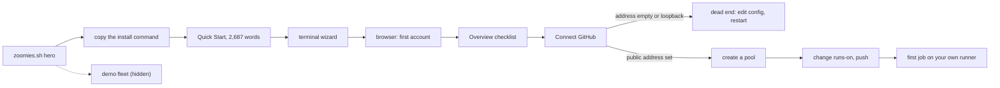

# UI audit — zoomies.sh and the first-run flow

Audited on 1 October 2026 at commit `0b4734c`. The docs site was built from
`mkdocs.yml` with the pinned requirements and inspected in Chromium at
1440×900 and 375×812, dark and light. The product was built from the same
commit (`make build`) and walked from an empty database with authentication on,
then again with `ZOOMIES_SEED_DEMO=true` for populated pages. Appendix E lists
what I could not test. Nothing in the repository was changed except this file.

## Read this first

### There is no paywall, trial or upsell to audit

I searched the site (`docs/`, `overrides/`, `hooks/`), the product (`web/src`,
`internal/`), the installer and the README for paywalls, upsells, billing,
pricing, premium tiers, trials, subscriptions, sponsor and donate prompts. There
are none. The only hits are:

* docs *about other people's prices* (`docs/costs.md`, `docs/hosted-runner-services.md`);
* "upgrade" meaning agent version skew (`web/src/lib/hosts/HostCard.svelte`), not a plan;
* `SUPPORT.md`, which says there is "no paid tier that would buy" support.

No modal opens on load, on the site or in the product. I have not invented
paywall findings. Instead the brief is mapped onto the funnel this product
really has:

| The brief says | Here it means |
| --- | --- |
| Start a free trial | Run the install command and get one job onto your own runner |
| Paywall before value | Any ask that arrives before value: the privileges the install requests, a dialog that refuses to proceed, a form that wants a config edit and a restart |
| Nagware | Warning stacks on day one; one optional feature promoted at every step |
| Onboarding goal ignored | A default the installer accepts that the product later refuses |

### Verdict

The visual system is not the problem. Tokens for both themes, measured contrast,
self-hosted fonts, reduced-motion handling, a 404 that helps: it is more
disciplined than most funded products. The funnel is the problem.

1. **The site is a docs site wearing a hero.** The header has no navigation and
   no call to action, the headline never says "self-hosted", and the one thing
   to click above the fold is a copy chip.
2. **The best conversion asset is hidden.** A seeded demo fleet that needs no
   GitHub already exists. It is mentioned once on the home page, in the last
   sentence of a section about migration.
3. **The first-run path has a dead end in the middle.** The checklist's one
   blue button opens a dialog that refuses to continue until you edit a config
   key and restart.
4. **The copy was written to be precise, not to be read.** 157–172 characters a
   line, 27-word sentences, and the site's strongest trust claim buried in a
   150-word sentence.
5. **A handful of defects are plainly bugs** and take minutes to fix: the phone
   install box, the empty-feed message, the off-centre headline, the orphaned
   card.

### The five that matter most

1. **C1** — No way to see the product without a Linux host, a GitHub App and an org owner.
2. **C2** — The hero says "Zoomies", not what it is, and has no button.
3. **C3** — Connect GitHub is a dead end for the installer's own default.
4. **C4** — The Quick Start buries the first job at word 1,822 and promises "five minutes" without evidence.
5. **C5** — On a phone the install command is clipped and overlapped by its own 24px button.

A sixth critical item, **C6**, breaks search and every diagram for visitors
whose network blocks `unpkg.com`.

### Scoreboard

| Section | Findings |
| --- | --- |
| Critical | 6 (C1–C6) |
| High impact | 15 (H1–H15) |
| Nice to have | 11 (N1–N11) |

---

## 1. Critical

### C1. There is no way to see the product without committing a host, a GitHub App and an org owner

**Pass:** First-time user

**Where:** `docs/index.md:14-36` (hero), `docs/index.md:238-240` (the only demo
mention on the home page), `docs/quickstart.md` (none), `docs/ui.md:18-22,580-583`,
`internal/controller/seed.go` (`SeedDemo`). Route `/`, 1440 and 375.

**Problem:** A seeded demo fleet exists and needs no GitHub. With
`ZOOMIES_SEED_DEMO=true` the controller wrote 4 pools, 3 hosts, 12 runners and a
populated Overview in my run. The home page mentions it once, as the last
sentence of "Moving what you have now", about 4,700px down a 7,400px page. The
hero offers one path: install on infrastructure you own, then create a GitHub App
as an organisation owner. That is a free-trial gate that asks for a credit card.
The only preview is a static screenshot, and it shows six warnings (H4). Search
finds "demo" (9 pages); "trial" and "playground" find nothing. An evaluator who
cannot see the product in a minute judges it from a picture and goes back to ARC
or a hosted service.

**Fix:**

1. Add `zoomies demo` to `cmd/zoomies`. It starts the controller with the demo
   seed, authentication off, a throwaway database from `os.MkdirTemp`, bound to
   `127.0.0.1` only, prints `http://127.0.0.1:8080` and opens a browser when there
   is one. Refuse any other bind: `auth.disabled` is an *error* on a public bind.
   A `docker run` one-liner cannot do this, because publishing a port needs a
   non-loopback bind inside the container, where auth-off is refused. So ship the
   subcommand, not a container recipe.
2. Add `## Try it first (two minutes, no GitHub)` above step 1 of
   `docs/quickstart.md`: download the static binary from
   `https://github.com/eyupio/zoomies/releases/download/<tag>/zoomies_<os>_<arch>`
   (the pattern `install.sh:1126-1127` uses) and run `./zoomies demo`. Until the
   subcommand exists the section can give the form I ran:
   `ZOOMIES_SEED_DEMO=true ZOOMIES_DISABLE_AUTH=true ZOOMIES_DB_PATH="$(mktemp -d)/demo.db" ./zoomies controller`.
3. Put a second button beside the install box: `Try the demo — no GitHub needed`
   → `quickstart.md#try-it-first`.
4. Acceptance: from a clean laptop to a populated Overview in under 90 seconds,
   timed.

### C2. The hero says "Zoomies", not what it is, and the only call to action is a copy chip

**Pass:** Designer and first-time user

**Where:** `docs/index.md:14-41`, `docs/stylesheets/zoomies.css:796-961`,
`web/src/routes/Login.svelte:619` (the better line). Route `/`, 1440 and 375.

**Problem:**

* The H1 is "Give your GitHub Actions runners the 🐾 Zoomies." — a pun, set at
  72px, with the product name in *grey* (`#868b94` in the dark scheme) as the
  "quiet" half.
  "Self-hosted", the one word that tells a visitor whether this is for them, is in
  neither the headline nor the lede, and the lede runs on jargon: "ephemeral",
  "autoscaling across your own hosts". The product's own sign-in page says it in
  seven words: **"GitHub Actions runners on machines you own."**
* The lede says "No Kubernetes, no database server." and the proof line 250px
  below says "without Kubernetes and without a database server." Same claim twice
  in one viewport.
* Above the fold at 1440×900 the clickable things are: the "NEW" Elastic CPU
  pill, the copy chip, five identical grey chips. There is no button. The first
  `.md-button--primary` on the page sits at y=1,864 (y=1,808 on a phone) and says
  **"Connect your private hosts"**; a feature CTA outranks the install CTA, which
  does not appear as a button until y≈7,030 and then links to the Quick Start,
  not to the command.
* The pill is the most prominent link above the H1 and leads off the funnel to a
  deep technical page. On a phone it wraps into a 74px, two-line lozenge with the
  badge on its own line and pushes the H1 to y=221.
* The install box is the right idea, but it carries no prerequisites, no
  expectation, and the `curl | sh` worry is answered 1,000px lower.
* The product is described six different ways: the H1; the closing CTA ("Give your
  CI the Zoomies."); the sign-in line; the CLI banner ("off the lead, on the
  job."); the lockup ("SELF-HOSTED GIT RUNNERS"); the page title ("free,
  open-source self-hosted GitHub Actions runners").

**Fix:** Lead with the sentence the product already wrote for itself, keep the
pun as the sub-line, and give the page one primary action.

```md
<p class="eyebrow">Free · open source · AGPL-3.0 · runs its own CI</p>

# GitHub Actions runners<br><span class="quiet">on machines you own.</span>

<p class="lede">
Zoomies starts a fresh runner for every queued job and destroys it when the job
is done. One binary. No Kubernetes. No database server.
</p>

[Get started in ten minutes](quickstart.md){ .md-button .md-button--primary }
[Try the demo — no GitHub needed](quickstart.md#try-it-first){ .md-button }

<install box>

<p class="prereq">Linux or macOS · Docker or Podman · a GitHub organisation or repository you own</p>
```

* Put the full-contrast brand name in the H1; use the playful line as the sub-head.
* Drop the Elastic CPU pill from the hero (H12). Replace the five "Popular" chips
  with three links: Quick start · See it running · Compared with ARC.
* Move "Piping a script into a shell deserves a second look…" next to the box as
  one caption: `Read it first: curl -fsSLO https://zoomies.sh/install.sh && less install.sh`.
* Use one descriptor everywhere: "GitHub Actions runners on machines you own."

### C3. Connect GitHub is a dead end for the installer's own default

**Pass:** First-time user

**Where:** `web/src/lib/overview/FirstRun.svelte:185-195` (the button),
`web/src/lib/installations/ConnectDialog.svelte:473-487` (the gate), `:859-880`
(the banner), `:1322` (`disabled={notReachable || …}`),
`internal/installer/installer.go:1946-1957` (the question that sets it),
`docs/quickstart.md` (never mentions it). Routes `/` → `/installations` → dialog,
1440 and 375.

**Problem:** Step 2 of "Finish setting up" is **Connect GitHub →**. It opens a
dialog whose primary button is disabled whenever `server.external_url` is empty
**or loopback**. The banner's whole remedy is "Set `server.external_url` … restart
the controller, and come back." There is no link to Settings, no field and no
restart command. I reproduced it on a fresh controller with an empty address: the
form is fully editable and "Continue to GitHub" is dimmed. From source, the
installer's own single-VM default, `http://localhost:8080`, takes the loopback
branch (the comment at `:476-485` says so, and adds that the terminal installer
refuses the same address). So an operator who keeps the installer's default, and
any home-lab operator without a public address, hits a wall at the step the
product says nothing can run without.

It also contradicts the product's other messages. `installer.go:1948-1950` says
a missing public address "still works" through the poller, and
`docs/home-lab.md:39-47` says the same, yet this dialog will not proceed. The
way through, the second tab **Use an App you already have**, is not mentioned,
and at 375px its label is clipped to "Use an App you already h". The same
missing value is also announced four other times (H6), none with a fix button.
The Quick Start never mentions the requirement: `external_url` does not appear
in `docs/quickstart.md`.

**Fix:**

1. In the blocked state replace the paragraph with two options.
   * **Give Zoomies the address GitHub will use.** An input prefilled from
     `location.origin` when that is not loopback and a Save button that writes
     `server.external_url` through the settings API. Then show the one restart
     command for this deployment (`systemctl restart zoomies` or
     `docker compose restart zoomies`; the installer knows which) with a copy
     button, and re-enable the form when `session.meta.external_url` changes after
     the reconnect. The dialog already keeps its progress (`saveProgress()`).
     `server.external_url` is restart-scoped (`docs/configuration.md:649`), so this
     cannot be instant without a hot reload; the flow is built around that.
   * **No public address (a home lab)?** "Connect an App you already have —
     Zoomies will poll GitHub instead" → switches to the second tab.
2. In `FirstRun.svelte`, when the address is not reachable, show a precondition
   under step 2 ("Needs a public address first — you are on `http://localhost:8080`")
   and label the button `Set the address`. The file's own header says why: never
   offer an action whose first screen is a refusal.
3. Shorten the tab labels to `New App` and `Existing App` so they fit at 375px.
4. In `docs/quickstart.md` step 3 add a "Before you click Connect GitHub"
   callout: GitHub must be able to reach the controller (a cloud VM, or a tunnel),
   or use polling only with an existing App. Link `home-lab.md`.

### C4. The Quick Start buries the first job, and "five minutes" is unevidenced

**Pass:** First-time user

**Where:** `docs/quickstart.md` (whole page), the claim at `quickstart.md:11`,
`docs/index.md:183,334-337`, `docs/docker.md:93`, `docs/ui.md:582`,
`docs/costs.md:110`. Route `/quickstart/`.

**Problem:** The page is 2,687 words, about twelve minutes of reading, under an
opening line that promises five minutes. I found no timing evidence in `docs/`,
`README.md` or `roadmap/`, and the project's own rule is that every claim names
what backs it. The roadmap's validation record lists the equivalent measurement for
marketplace images, "ten minutes or less from booted instance to green job,
measured", as **not run** (`roadmap/validation/marketplace-deployment.md:61`). The
first job appears at "5. Run something" after **1,822 words**.
Step 4 alone, "Your first pool", is 733 words and closes on Elastic CPU ("the row
to come back to") and operating-system variants, none of which a first job needs.
Step 2 forks three ways (Native, Compose, Docker) and a note says the fork moves
the administrator, the GitHub App and the first pool to the browser, yet steps 3
and 4 are written for the native path. There is no installer transcript, so the
reader cannot see what is coming; the only image is the Jobs page at the very
bottom. Prerequisites are missing or scattered: org-owner rights to install an
App, a public address (C3), a container runtime with a reachable socket.

**Fix:** Re-cut it as a spine that ends in a job.

1. A "Before you start" box: Linux or macOS · Docker, Podman or the process
   backend · GitHub org-owner (or repo-admin) rights · a public HTTPS address, or
   polling only with an existing App.
2. Five steps: Install → Connect GitHub → Create the default pool (accept the
   defaults) → Push this workflow → Watch it run.
3. Move the Native / Compose / Docker fork into `pymdownx.tabbed` tabs *inside*
   each step (already enabled in `mkdocs.yml`) so the page reads as one path.
4. Move Elastic CPU, operating systems and Docker-in-jobs out of step 4 into
   `## After your first job`.
5. Add a captured installer transcript after step 1 and the Overview ticking the
   checklist after step 3.
6. Replace "about five minutes" with a measured sentence ("median 9 min 40 s on a
   2-vCPU Ubuntu 24.04 VM, curl to first job, measured on <date>") from a timed
   clean run, or delete the claim from every place it appears (`quickstart.md:11`,
   `index.md:183,336`, `docker.md:93`, `ui.md:582`, `costs.md:110`).

### C5. On a phone the install command is clipped, overlapped by its own button, and the target is 24px

**Pass:** Designer

**Where:** `docs/stylesheets/zoomies.css:895-933` (`.zoomies-install`),
`docs/index.md:26-32` and `:190-192`, every single-line command in
`docs/quickstart.md`. Route `/`, 375×812.

**Problem:** The command is 507px wide inside a 343px box. At scroll position 0
the visitor reads `curl -fsSL https://zoomies.sh/i▮a`: the copy chip sits on top
of characters and `install.sh | sh` is off-screen. The stylesheet's comment
promises the opposite ("the command's tail scrolls clear of it"), but the
right-hand padding is part of the scrolling content and does not protect the
visible area. The copy button is 24×24 CSS pixels inside a 32×32 chip: the WCAG
2.2 AA minimum and no more (Apple and Google ask for 44 and 48). It is the single
most important control on the page, and it looks broken on the device many
visitors arrive on from a shared link.

**Fix:** Verified in the browser by injecting this CSS at 375px. The command wraps
over three lines, the box no longer scrolls, the button is 44×44 and the page
overflows by 0px.

```css
@media screen and (max-width: 44.9375em) {
  .md-typeset .zoomies-install pre > code {
    white-space: pre-wrap;
    overflow-wrap: anywhere;
    padding: 0.95em 1.1em 3.4em;
  }
  .md-typeset .zoomies-install .md-code__nav {
    top: auto;
    bottom: 0.5em;
    right: 0.5em;
    transform: none;
  }
  .md-typeset .zoomies-install .md-code__button {
    width: 2.2rem;
    height: 2.2rem;
  }
}
```

Give the second copy of the command (`index.md:190`) and the Quick Start's the
same wrapping, with a `{ .command }` attribute or a general rule under the same
media query.

### C6. Search and diagrams die when `unpkg.com` is unreachable, on 12 pages including the home page

**Pass:** Designer (robustness) and first-time user

**Where:** Material's bundle loads `https://unpkg.com/mermaid@11/dist/mermaid.min.js`
(`assets/javascripts/bundle.*.min.js`); `mkdocs.yml:105-113`. Pages with a mermaid
fence: `index`, `architecture`, `security`, `configuration`, `troubleshooting`,
`migration`, `hosts-and-pools`, `proxmox`, `elastic-cpu`, `marketplace`,
`connect-claude`, `api-surface`. Both viewports.

**Problem:** A controlled test on one build, five conditions. With the CDN
unreachable, the search box on `/` and `/migration/` stays on **"Initializing
search"** for as long as I watched (12 seconds, two uncaught `ReferenceError:
Invalid script` errors) and every diagram falls back to raw `flowchart LR …`
source. With the CDN reachable, search is ready in 0.5 seconds. Pages without a
diagram (`/quickstart/`, `/faq/`) work either way. The same repository's
`mkdocs.yml` explains why it self-hosts fonts: "when the host is slow or
unreachable the tab spins with nothing to show". It then loads a 3.5 MB script
(uncompressed) from a third-party host on the landing page to draw six boxes. The
audience for a self-hosted runner controller is the audience most likely to run
egress filtering, a Pi-hole or a privacy extension. (In my sandbox the failure was
a TLS-intercepting proxy; the failure mode is identical for any blocked or
unreachable CDN.)

**Fix:** Verified: Material checks `typeof mermaid` first, so shipping the library
as `extra_javascript` skips the CDN entirely. In a scratch build the search became
ready, the diagram rendered, and there were zero `unpkg.com` requests and zero
page errors.

```yaml
extra_javascript:
  - javascripts/mermaid.min.js   # vendored mermaid 11.x -- add a row to docs/dependencies.md
  - javascripts/animated-logo.js
```

* To avoid 3.5 MB on pages with no diagram, load it from the theme's `scripts`
  block in `overrides/main.html` behind ``.
  I tested the unconditional form above; the conditional is a restriction of it
  and is untested.
* Replace the home-page diagram with a CSS stepper (H9) so the landing page loads
  no Mermaid at all.

---

## 2. High impact

### H1. The GitHub App asks for write access to code, workflows and pull requests before one job has run

**Pass:** First-time user

**Where:** `internal/github/manifest.go:154-168`,
`web/src/lib/installations/ConnectDialog.svelte:448-463`,
`docs/quickstart.md:121-137`. Route `/installations` → dialog.

**Problem:** This is the closest thing the product has to a paywall before value.
At creation the App unconditionally requests `contents: write`,
`pull_requests: write` and `workflows: write`, for the migration wizard, an
optional feature, on top of `administration: write` (repository target) or
`organization_self_hosted_runners: write`. The docs are candid ("asked for now
rather than later because later is expensive… if you never migrate anything,
remove them") and the dialog lists the scopes, which is good. But the product
takes the maximum and tells the user to undo it by hand. The person who must
click Install is an organisation owner being asked for read and write access to
code, workflows and pull requests by a project they have not run yet. That is a
security review, not a click, and self-hosting is the audience most likely to
bounce on it.

**Fix:** Make it a choice on step 1 of the dialog, with the list shown first and
grouped.

* Group the permission list: **Needed to run jobs** and **Needed to migrate
  workflows**.
* Ask: "Should Zoomies open migration pull requests?" with **Not now (runners
  only)** as the default and **Yes** adding the three write scopes.
* Add a `migration` boolean to the manifest request (`api/openapi.yaml`,
  `manifest.go:156-162`, the `createAppManifest` client), then run
  `go run internal/api/gen_openapi.go` and `make openapi`.
* When someone opens **Migrate** on an App without those scopes, show the exact
  permission-upgrade link and what the owner will see. The dialog already
  explains GitHub's delay.

### H2. The landing page lives inside the docs chrome: no navigation, no call to action

**Pass:** Designer

**Where:** `mkdocs.yml:43-55` (no `navigation.tabs`), `docs/index.md:9-12`
(`hide: navigation, toc`), `overrides/partials/source.html`,
`docs/index.md:3` and `overrides/main.html:37-43`. Route `/`, 1440 and 375.

**Problem:** On the home page the header holds a logo, a theme toggle, the search
box and the repository block. There is no Docs, Quick start, Compare or Install
link, and `hide: navigation` removes the sidebar, so the only ways onward from the
top of the page are search and five chips. On a phone it is a hamburger, a title
and two icons. After the H1 scrolls away the header title becomes the truncated
tagline "Give your GitHub Ac…" because the page's front-matter `title` is the
tagline. Underneath the theme this is recognisably Material (header, search
overlay, sidebar, table-of-contents rail, previous/next cards), which is why the
page reads as "documentation" rather than "product".

**Fix:**

* Enable `navigation.tabs` and `navigation.tabs.sticky` in `mkdocs.yml` so
  desktop gets a top tab row once H3's section names exist.
* Add a persistent header action. `overrides/partials/source.html` is already
  overridden and renders in both the header and the phone drawer, so one line
  there reaches both:
  `<a class="md-button md-button--primary zoomies-header-cta" href="{{ 'quickstart/' | url }}">Install</a>`
  with a small-button style and `display: none` below 30em if space is short.
* Set `title: Zoomies` in the home page's front matter. The H1 lives in the body,
  and `overrides/main.html` already sends `social_title` to `<title>` and the
  sharing tags.

### H3. The navigation is ordered for operators; evaluators' pages come last, and the caching page is not in it

**Pass:** First-time user

**Where:** `mkdocs.yml:151-198`, `docs/persistent-caches.md`. Drawer at 375,
sidebar at 1440.

**Problem:** The comment in `mkdocs.yml` says the nav is ordered "the way a fleet
is run". An evaluator's questions are what is it, does it fit, is it safe, what
does it cost, how does it compare, and the pages that answer them (**Compared with
ARC**, **Compared with runner services**, **What it costs**, **FAQ**) sit after the
twelve-item Reference group, while **Security** is buried inside it. On a phone
the first four are a flat tail under "Reference", beside `Many repositories`,
`Runners in your home lab` and `Runners in Docker`.
There are two home-lab pages in different groups. The first group is titled
"Running the fleet from the web UI", which wraps in the sidebar.
`persistent-caches.md` is indexed, linked from three deep pages and absent from
the nav; the answer to "does an ephemeral runner start cold every time?" is an
orphan, and `mkdocs build` itself lists it as "not included in the nav".

**Fix:** Order it as the funnel runs.

```yaml
nav:
  - Start:
      - Home: index.md
      - Quick start: quickstart.md
      - See it first: ui.md
  - Evaluate:
      - What it costs: costs.md
      - Compared with ARC: actions-runner-controller.md
      - Compared with runner services: hosted-runner-services.md
      - Security: security.md
      - FAQ: faq.md
  - Operate:
      - Hosts and pools: hosts-and-pools.md
      - Runners in your home lab: home-lab.md   # fold private-hosts.md into it
      - Persistent caches: persistent-caches.md
      # ... migration, backup, two-step, upgrading, troubleshooting, proxmox
  - Other ways in: ...
  - Reference: ...
```

### H4. The hero screenshot shows a fleet in trouble, is unreadable on a phone, and ships in both themes

**Pass:** Designer

**Where:** `docs/index.md:43-49`, `docs/screenshots/overview-{dark,light}.webp`,
`docs/screenshots/overview-phone-{dark,light}.webp` (unused on the home page),
`make screenshots`. Route `/`, 1440 and 375.

**Problem:** The flagship image says "6 warnings need your attention", "1 failed",
"1 at the ceiling", "1 job queued"; the activity matrix on the same fixture shows
7 of 37 jobs failed. The picture says "your fleet will be on fire". At 375px it
renders at 343×215 CSS pixels from a 2880×1800 file: the figures are about 3px
tall and unreadable, while purpose-made phone captures sit in the repo and are
used only on `ui.md`. Both theme variants download (138 KB and 139 KB) though one
is shown, and neither has `width`, `height` or `loading`.

**Fix:**

* Recapture the hero with the demo's warnings dismissed and a failure rate that
  reads as normal. Add a "calm" capture mode to `make screenshots` so it stays
  reproducible.
* Add the phone capture as a second pair of images with a `.phone-only` class and
  hide the desktop pair below 45em:

```md
{ .zoomies-shot .desktop-only width="1440" height="900" loading=lazy }
{ .zoomies-shot .phone-only width="390" height="844" loading=lazy }
```

```css
@media screen and (max-width: 44.9375em) { .md-typeset .desktop-only { display: none; } }
@media screen and (min-width: 45em)      { .md-typeset .phone-only   { display: none; } }
```

### H5. The Overview greets a brand-new user with a dashboard of zeros and a feed that blames them

**Pass:** First-time user

**Where:** `web/src/lib/overview/EventsFeed.svelte:57-58,148-155`,
`web/src/lib/state/feed.svelte.ts:146`, `web/src/lib/feed/categories.ts:192-204`,
`web/src/routes/Overview.svelte:119-143`. Route `/` after first sign-in, 1440 and
375.

**Problem:**

* **A bug.** Two feed categories are off by default (`on: false`), so a fresh
  browser has `hidden === 2`, `everything` is false, and an empty feed says
  **"Nothing in the kinds you are watching — 2 kinds of event are switched off for
  this browser. Choose above turns them back on."** Nobody switched anything off.
  The first-run copy the team wrote ("Nothing has happened yet… Once there is a
  pool and a host, this is where the fleet says what it has been doing") is
  unreachable on a default configuration.
* Under the checklist the page still renders six tiles of `0` and `0ms`, "No pools
  yet — Create a pool" (a second copy of step 3's button), "Nothing is running
  right now" with a second **Other runners** switch (the same preference as the one
  in the page header) and a 620px host-capacity panel charting nothing. The activity
  matrix is the only block hidden during setup (`setupPending`).
* On a phone the checklist sits below a **Refresh** button and an **Other runners**
  toggle, a power-user concept, before the one action that matters.

**Fix:**

* Compare against the defaults, not against zero:
  `const customised = FEED_CATEGORIES.some((c) => prefs.feedChoice(c.id) != null && prefs.feedChoice(c.id) !== c.on)`
  and use it for the title and description. Add a unit test for the default-state
  empty copy.
* While `setupPending`, render the checklist and nothing else of the dashboard.
  The code already does this for `FleetActivity`; extend it to `FleetMetrics`,
  `PoolUtilisation`, `ActiveJobs`, `HostCapacityMap` and the header's **Other
  runners** switch until the first pool exists.

### H6. One missing setting is announced five times and nothing offers to fix it

**Pass:** First-time user

**Where:** `internal/config/validate.go:487-495` (`external_url.missing` is a
warning), `web/src/lib/problems/ProblemsBell.svelte`,
`web/src/lib/overview/ProblemsSummary.svelte`, the problems drawer,
`ConnectDialog.svelte:859`, `web/src/lib/installations/WebhookHealth.svelte:94-125`
rendered unconditionally at `web/src/routes/Installations.svelte:317`. Routes `/`
and `/installations`, 1440 and 375.

**Problem:** On a first start with no external URL I saw: a bell badge reading
**2**; an amber "2 warnings need your attention" strip; a drawer with
`agent.root` and `external_url.missing`; the Connect dialog's amber banner; and on
the empty Installations page a "Webhook delivery" panel announcing "Nothing has
ever arrived at Zoomies… it usually means GitHub cannot reach the webhook URL at
all", a **Check reachability** button and an amber "No webhook has been received"
notice. That last panel diagnoses a failure that cannot have happened, because no
GitHub App exists yet. Five surfaces, one cause, no one-click fix.
`external_url.missing` is a warning although, per `CLAUDE.md`, each warning
"names a setting that weakens the default posture", and polling is a designed
fallback, the product's own headline resilience claim.

Caveat: `agent.root` appeared because I started the binary as root; an
installer-made deployment runs as a service user. The external-URL surfaces do
not depend on that.

**Fix:**

* Make `external_url.missing` `SeverityInfo` while there are zero installations;
  severity that depends on circumstances is already supported (`auth.disabled`).
* Render `WebhookHealth` only when `installations.length > 0`.
* Fold day-zero findings into the checklist ("1 thing to fix before scale-up is
  instant") and keep the bell at 0 until the checklist is done or dismissed.
* Every card that names `server.external_url` gets the inline **Set the address**
  action from C3.

### H7. Line length and sentence length: the landing page is a wall

**Pass:** Designer

**Where:** `docs/stylesheets/zoomies.css:428-430` (`.md-grid { max-width: 66rem }`),
`docs/index.md:9-12` (both sidebars hidden), prose throughout `docs/index.md`,
`docs/quickstart.md`, `docs/ui.md`. Route `/`, 1440.

**Problem:** With both sidebars hidden the home page's body copy runs the full
1,288px column: **157–172 characters per line** at 16px, against a comfortable
45–80. At 1920px it is the same, because the column grows with the font. Pages
with sidebars are better but still 94–105. Average sentence length is 26.6 words
on the home page, 29.2 in the Quick Start and 34.3 in `ui.md` (the FAQ's 22 is the
best on the site). Em dashes run at 11 per 1,000 words on the home page and 16 in
the Quick Start. "What is qualified" is one 190-word paragraph built around a
single 150-word sentence, and it holds the site's best trust claim. These are the
habits that read as machine-polished: balanced, qualified, em-dash-chained, every
sentence carrying its own caveat.

**Fix:**

* CSS: keep grids, tables and screenshots wide and narrow the prose.

```css
.md-content__inner:has(.zoomies-hero) > :is(p, ul, ol, h2, h3) {
  max-width: 44rem;
  margin-inline: auto;
}
```

* Copy: at most 20 words a sentence and 60 words a paragraph on `index.md`.
* Rewrite "What is qualified" as a three-row table (Tested on every pull request ·
  Built, not run · Not yet run on real hardware) with the dogfooding line first.
* Add a 20-line hook that warns when a sentence on `index.md` exceeds 28 words, so
  it does not regress.

### H8. The feature grid is the stock icon-card template, with a hole in it at 1366px and wider

**Pass:** Designer

**Where:** `docs/index.md:84-181`, `docs/stylesheets/zoomies.css:964-1034`.
Route `/`, 768 and 1366–2560.

**Problem:** Nine equal-weight cards (icon chip, title, paragraph) plus one wide
card is the layout every generated landing page ships, and the order buries the
differentiators (one pull request per repository, ephemeral by default, no pasted
tokens) behind "A live web UI" and "Elastic CPU zoomies", two of the longest cards.
Nine cards do not divide into four columns: at 1366, 1440, 1536, 1920 and 2560 the
grid lays out 4 / 4 / 1, leaving "Safe defaults" alone on row three with three
empty cells. At 768 it is 2 / 2 / 2 / 2 / 1. Only 1024–1280 (three columns) is
clean.

**Fix:** Cut to three headline differentiators as large cards, each with a
one-line promise and a small visual, and move the other six into a compact
two-column "Also in the box" list. Interim CSS, verified at 1440 (rows 3 / 3 / 3):

```css
@media screen and (min-width: 48em) {
  .zoomies-grid { grid-template-columns: repeat(3, minmax(0, 1fr)); }
}
```

### H9. On a phone the ARC comparison hides the Zoomies column and the "How it works" diagram is illegible

**Pass:** Designer

**Where:** `docs/index.md:70-80` (diagram), `:290-303` (table),
`docs/stylesheets/zoomies.css:365-372,1037-1059`. Route `/`, 375.

**Problem:** The two most persuasive artefacts on the page both fail at 375px. The
comparison table scrolls horizontally (419px inside 375px) with no affordance, and
the column the section exists to sell is the *last* one, so a visitor reads
"Zoomi", "ye", "defau", "GitHu", "one comm". The diagram, once Mermaid loads, is
scaled into a 343×65px strip with node text about 3.5px tall.

**Fix:**

* Reorder the columns to `| | Zoomies | ARC | A few static runners |` and change
  the highlight selectors from `:last-child` to `:nth-child(2)`. Verified at
  375px: the Zoomies column is fully visible.
* Add a right-edge fade as a scroll hint (`mask-image` on `.md-typeset__scrollwrap`).
* Replace the diagram with an ordered list styled as a stepper (horizontal from
  60em, vertical below): six `<li>` elements, no JavaScript. Keep Mermaid for the
  architecture pages.

### H10. Weight: the logo is about 350 KB on every page, half the screenshots are never shown, and a below-the-fold image is `fetchpriority="high"`

**Pass:** Designer

**Where:** `overrides/partials/logo.html:10-11` and `copyright.html:14-19`
(1254×1254 PNGs shown at 30px: `paw-swish-white.png` 118 KB, `paw-swish-black.png`
243 KB), `docs/brand/animated-logo.html:7-15` (`logo-white-transparent.png`,
180 KB), `docs/index.md:43-44`, `docs/ui.md`, `mkdocs.yml`.

**Problem:** Measured; these formats are already compressed.

* Both logo variants download on every page, because `display: none` does not stop
  an ``: about 350 KB for a 30px icon.
* The home page fetches a 180 KB image about 6,800px below the fold, marked
  `fetchpriority="high"` with no `loading`, so it competes with the first paint.
* `/ui/` in the dark scheme downloads 22 light screenshots (2.94 MB) it never shows
  beside the 22 it does (2.94 MB), 7.9 MB in all. None of the 44 images has
  `width`, `height` or `loading`, so the page reflows as they land.
* Where Mermaid loads it adds 3.5 MB uncompressed; `search_index.json` is 1.1 MB
  raw (compressible).

**Fix:** Verified: adding `loading="lazy" decoding="async"` to the 44 screenshots
cut `/ui/`'s first load to 4 screenshots and 529 KB on desktop, and 1 screenshot
and 97 KB on a phone, with zero light-theme requests.

* Do it once in a hook (`hooks/` already holds three): `on_page_content` adds the
  two attributes to every content `` and reads `width` and `height` from the
  file header, with no new dependency.
* Replace the header and footer PNGs with 96px files (or SVG), about 4 KB each.
* Remove `fetchpriority="high"` from the animated-logo fallback and add
  `loading="lazy"`.

### H11. Trust signals are weak, scattered or buried

**Pass:** Designer and first-time user

**Where:** `overrides/partials/source.html`, `hooks/source.py` (stars and forks in
the header), `docs/index.md:262-281`, `README.md:22-30` (eight badges the site
lacks), `hooks/seo.py:128`.

**Problem:** The only social proof above the fold is "★52 ⑂43" in 11px type in the
header, the weakest number on the page shown first (figures from my build-time
query). The strongest proof is mid-sentence in a 190-word paragraph at y≈5,600:
this repository's own CI runs on a Zoomies fleet, inside containers the Docker
backend started, and a test fails if a job leaves it. The OpenSSF Scorecard and
Best Practices badges, CI status and coverage in the README are absent from the
site. The site never tells a human the project is young, while `llms.txt`
(`hooks/seo.py:128`) tells machines "It is an early beta" and the header says
v1.3.4. A visitor deciding whether to put CI on it needs one plain maturity
sentence next to the install box.

**Fix:**

* A proof row under the install box:
  `Runs its own CI on Zoomies · v1.3.4 · AGPL-3.0 · OpenSSF Best Practices · what is tested →`.
* The CI-status and Scorecard badges in the footer.
* Hide star and fork counts in the header until they carry weight; keep the
  release tag.
* One maturity sentence ("Tested on every pull request on Linux amd64 and arm64;
  the Windows agent has not yet run on real hardware"), and make `llms.txt` and
  the page say the same thing.

### H12. An optional feature is promoted at four points on the first-hour path, the product's nearest thing to an upsell

**Pass:** First-time user

**Where:** `docs/index.md:16,97-106`, `docs/quickstart.md:161,191-200`,
`web/src/lib/pools/StepSize.svelte`, `mkdocs.yml:162`. Routes `/`, `/quickstart/`,
`/pools/new`.

**Problem:** Elastic CPU zoomies is the "NEW" pill above the H1 (the most
prominent link on the page), card 2 of the grid (the longest), a "row
to come back to" paragraph inside Quick Start step 4 (three mentions on a page
that should end in a job), a default-on *observe* setting with two extra fields in
the pool wizard's Size step, and the third entry in the operator nav. A first-time
visitor wants a job running. This costs nothing, but it is the upsell pattern: an
optional feature competing with the primary action. The pill is honest today (the
first commit is 2026-09-24); nothing expires it.

**Fix:**

* Remove it from the hero and the Quick Start. Keep one grid card and the nav
  entry.
* Collapse the wizard's two Elastic fields behind the existing **Advanced** path.
* Give any "NEW" pill an expiry (`new_until: 2026-11-01` in front matter, rendered
  only before that date) so it cannot go stale.

### H13. Account creation: six fields, a card taller than the screen, an email nothing uses, and a token to carry across

**Pass:** First-time user

**Where:** `web/src/routes/Bootstrap.svelte:189-199,217-351`,
`internal/installer/container.go:925-995` (the installer already holds the URL and
the token), `internal/api/handlers_auth.go:124` (email saved),
`web/src/lib/settings/UsersPanel.svelte:451` (the only place it is shown). Route
`/` before any account exists, 1440 and 375.

**Problem:** The first screen after install asks for the setup token ("From the
controller's log: docker compose logs zoomies | grep 'setup token'", a Compose
command on a page the single-container install also lands on), then username,
password, confirmation and **Email — "Optional. Used only to identify the
account."** Nothing in the codebase sends mail: there is no SMTP anywhere, only
systemd `sd_notify`. Recovery is "An administrator can reset it" (`Login.svelte`).
The email appears as a grey sub-line in Settings → Users and as an OIDC claim. A
collected answer that is never used. The card is 1,300px tall at 1440×900 with the
submit button at y≈1,187, below the fold, and the logo tile takes 300px of it.
The installer already holds the token and must have you copy it by hand; the page
ignores URL parameters. When the container is published on loopback only, the
closing summary's next instruction is an `ssh -L` tunnel.

**Fix:**

* Remove Email from the bootstrap form. Keep it in Settings → Users, where OIDC
  mapping uses it.
* Read `location.hash` (`#setup=<token>`), prefill the token and hide the field.
  Have the installer print one link: `http://localhost:8080/#setup=<token>`
  (fragments never reach servers or logs). For a loopback publish print one block:
  `ssh -L 8080:127.0.0.1:8080 user@host`, then "open the link above".
* Shrink the lockup to 56px when `max-height: 900px`.
* Make the hint generic: "From the controller's log (`zoomies logs`,
  `docker compose logs zoomies`, or your platform's log viewer)."

### H14. Help and the evaluator's FAQ are missing

**Pass:** First-time user

**Where:** `overrides/partials/copyright.html:23-31` (footer links),
`mkdocs.yml:156-198`, `docs/faq.md` (21 questions), `docs/marketplace.md:325-327`
(the only "Getting help" section on the site), `SUPPORT.md`.

**Problem:** A tool whose installer asks for `sudo` on your infrastructure and
then runs your CI has no visible answer to "who do I ask when it breaks?". The footer reads Quick
start · Architecture · Configuration · Security · API · FAQ · Source. The honest,
well-written support policy (`SUPPORT.md`: Discussions for questions, Issues for
bugs, the problem code as the key to a fast answer) is linked from one page, in
the "Other ways in" group. The FAQ has no entry for help, for trying the product
without installing, or for whether ephemeral runners start cold every time.

**Fix:**

* Render `SUPPORT.md`'s table as `docs/help.md`; add **Help** to the footer links
  and to the end of Quick Start, Troubleshooting and the 404 page.
* Add three FAQ entries: "Where do I ask for help?", "Can I try it without
  installing?" (→ C1) and "Do ephemeral runners start cold every time?"
  (→ `persistent-caches.md`).
* Add a problem-code lookup link to the sign-in page's footer.

### H15. The UI tour leads with prose and opens its gallery on the sign-in screen

**Pass:** Designer and first-time user

**Where:** `docs/ui.md:1-120`. Route `/ui/`, 1440 (24,368px tall) and 375
(30,115px).

**Problem:** This is the page evaluators click from the hero ("See all twelve
pages"). It opens with two paragraphs, then a 150-word "Signing in" paragraph, and
the first image is the sign-in page; the Overview is the second section and the
activity matrix is a single 300-word paragraph. It tells evaluators about "the
Playwright suite". It is 7,098 words (about 31 minutes) and, with H10, 7.9 MB.

**Fix:** Make it a gallery: Overview first, then one tile per page with a one-line
caption linking to that page's anchor. Keep the long prose behind `<details>` or
on the per-page docs, delete the sign-in section from the intro and replace "the
Playwright suite" with "a demo fleet".

---

## 3. Nice to have

### N1. The hero's last line is off-centre

**Pass:** Designer

**Where:** `mkdocs.yml:89-91` (`toc: permalink: true`),
`docs/stylesheets/zoomies.css:832-840`. Route `/`, both.

**Problem:** The invisible `¶` permalink is inline inside the H1, so the visible
words "the 🐾 Zoomies." sit 25px left of centre on desktop and 16px on a phone. It
is also a hidden tab stop between the Elastic CPU pill and the copy button.

**Fix:** `.md-typeset .zoomies-hero h1 .headerlink { display: none; }`. Verified:
the line offsets go to 0.

### N2. The hero glow overflows the viewport by 24px on a phone

**Pass:** Designer

**Where:** `docs/stylesheets/zoomies.css:783-794`. Route `/`, 375.

**Problem:** `.zoomies-hero::before` uses `inset: -3rem -2rem 30%`, so the page is
399px wide in a 375px viewport. It is currently masked by `html { overflow-x: hidden }`
and could not be scrolled in my test, so this is latent, not observed. The mask
does not clip layout overflow.

**Fix:** `inset: -3rem 0 30%`. Verified: overflow 0px.

### N3. Light-scheme contrast is a hair under AA for small quiet text

**Pass:** Designer

**Where:** `docs/stylesheets/zoomies.css:58` (`--md-default-fg-color--lighter`).
Route `/`, light scheme.

**Problem:** `#6e737c` on `#f6f7f9` is 4.45:1. The 72px "quiet" headline line passes
as large text, but the 13.2px "Popular:" label fails AA by 0.05 and the 11–12px
footer text passes only narrowly (4.77). The dark scheme's minimum is 5.75.

**Fix:** `#636872`, about 5.2:1, in the light scheme only.

### N4. Touch targets under 44px on phones

**Pass:** Designer

**Where:** `web/src/lib/shell/TopBar.svelte` and Material's drawer. Product at 375
and docs at 375.

**Problem:** Product top bar: logo link 22×22 (below the WCAG 2.2 AA 24px minimum),
search 31×24, account 39×24, problems bell 61×24. Docs: header buttons 40×40,
drawer rows 31–34px, "Popular" chips 32px, CTA buttons 38px.

**Fix:** `min-width` and `min-height: 2.75rem` on the product's top-bar buttons at
`max-width: 640px`; `.md-nav__link { padding-block: 0.6em }` in the drawer.

### N5. The pool wizard says "Seven steps" above a stepper that says "Step 1 of 5"

**Pass:** First-time user

**Where:** `web/src/routes/PoolWizard.svelte:30`. Route `/pools/new`, both.

**Problem:** The subtitle describes the advanced path; the default (Automatic)
path shows five steps.

**Fix:** Derive the count from the chosen path ("Five steps" or "Seven"), or make
the sentence path-neutral: "A name and a label, or every setting if you want it."

### N6. Overview tiles stack one-up on a phone

**Pass:** Designer

**Where:** `web/src/lib/overview/FleetMetrics.svelte`. Route `/`, 375.

**Problem:** Six metric tiles stack at about 145px each (roughly 870px before the
pools panel), while the Runners page lays the same kind of tile two-up.

**Fix:** Two columns below 640px for the six tiles, as on Runners.

### N7. Docs drift: quickstart image list and "two pools"

**Pass:** First-time user

**Where:** `docs/quickstart.md:202-206`, `docs/ui.md:18-19`.

**Problem:** The Quick Start lists five runner images; the home page lists seven.
The home page says a test holds it to the catalogue; I found none that covers the
Quick Start's list. `ui.md` says the demo fleet has "two pools"; the seed logged
`pools=4`.

**Fix:** Generate both lists from `internal/naming/images.go` as the home page
table is, and put the pool count in the `internal/docs` test.

### N8. Header logo alt text and the product descriptor

**Pass:** Designer

**Where:** `overrides/partials/logo.html:10-11`,
`overrides/partials/copyright.html:21`.

**Problem:** The header images carry `alt="logo"` although the enclosing link
already has an accessible name. The footer descriptor ("Self-hosted Git runners")
and the lockup's ("SELF-HOSTED GIT RUNNERS") say "Git runners", which is ambiguous
(GitLab? Gitea?) next to a site that says GitHub Actions runners.

**Fix:** `alt=""` on both images; change the footer descriptor to "GitHub Actions
runners on machines you own"; the lockup artwork is the brand owner's call.

### N9. The first sign-in toast repeats the checklist it points at

**Pass:** First-time user

**Where:** `web/src/routes/Bootstrap.svelte:160-163`.

**Problem:** "Next: connect a GitHub App. The checklist on the Overview says what
is left after that." appears over a page whose first block is that checklist, and
it stays on top of the problems drawer.

**Fix:** Drop the second sentence, or skip the toast when the checklist is
visible.

### N10. The first-run checklist leaves a gap under step 1 on a phone

**Pass:** Designer

**Where:** `web/src/lib/overview/FirstRun.svelte:167`. Route `/`, 375.

**Problem:** The done step renders an empty `.action` block, which on a phone
stacks as an empty band between the step and its divider.

**Fix:** Render the action column only when it has content.

### N11. The header topic after scrolling reads "Give your GitHub Ac…"

**Pass:** Designer

**Where:** `docs/index.md:3`, `overrides/main.html:37-43`. Route `/`, 375.

**Problem:** Material shows the page's front-matter title in the header once the H1
scrolls out of view. On the home page that is the tagline, truncated.

**Fix:** See H2: set `title: Zoomies` in the front matter.

---

## Appendix A — "Specifically check for"

| Check | Result |
| --- | --- |
| Upgrade or paywall modals before value | None exist. Nothing opens on load; the first dialog a user meets is the one they open (Connect GitHub). Nearest analogues: the permission ask (H1) and the refusing dialog (C3). |
| Multiple simultaneous upsell touchpoints | No monetary ones. Analogues: five surfaces announcing one missing setting (H6) and one optional feature promoted at four points (H12). |
| Broken or cramped mobile layouts | Yes on the docs: C5, H9, N2, N4. On the product, none at page level: 0px horizontal overflow on all nine pages I loaded at 375px. Issues are the Connect dialog's tab labels (C3), top-bar targets (N4) and one-up tiles (N6). |
| Onboarding answers collected but never used | One: the email at bootstrap (H13). Everything else I traced is used: installer answers are stored in the database and drive the pool defaults ("Today that is 1.25 CPU and 7.0 GB on 1 host"); the Connect dialog's target, name and API base feed the manifest; Automatic versus Advanced is honoured; the Overview's Other runners switch persists. The inverse is the problem: the product *does not ask* where it should, taking the maximum GitHub scopes (H1). |
| Choices respected | The installer's accepted default `external_url` (`http://localhost:8080`) is silently accepted and later refused by the product (C3). |

## Appendix B — The first-time user's walk



| Step | What happened | Hesitation | Value yet? |
| --- | --- | --- | --- |
| 1. Land on the home page | Read the H1, lede and install box | "What is 'the Zoomies'? Is it self-hosted?" (C2) | No |
| 2. Look for a way to try it | Found only the install command | No demo visible (C1) | No |
| 3. Copy the command | On a phone the text is clipped (C5) | "Is it safe to pipe to sh?" is answered 1,000px lower | No |
| 4. Open the Quick Start | 2,687 words; the fork at step 2 changes steps 3 and 4 | "Which path am I on?" (C4) | No |
| 5. Terminal wizard (read from source) | Backend, bind and TLS, external URL, admin or deferred | The external-URL question decides step 9 and does not say so (C3) | No |
| 6. Installer summary | URL, setup token, and an `ssh -L` tunnel when loopback | Copy a token across (H13) | No |
| 7. Browser: first account | Six fields; token first; email nothing uses | Form taller than the screen (H13) | No |
| 8. Overview | The checklist is good: numbered, ticked from real state | Then a dashboard of zeros and a feed that blames me (H5) | No |
| 9. Connect GitHub | Dialog refuses until I edit a config key and restart (C3); the permission list asks for write scopes I may never use (H1) | Wanted to leave | No |
| 10. Create a pool | Automatic path is "Name it, label it, done" | "Seven steps" above "Step 1 of 5" (N5) | Not yet |
| 11. Push a workflow | Not run: needs real GitHub | | |
| 12. Watch the job | The payoff; the checklist retires itself | | **Yes** |
| 13. "Upgrade prompt" | None exists. Closest: the Hosts card "Update this agent to vX", a version-skew notice | | n/a |

## Appendix C — Measurements

| Metric | Desktop 1440×900 | Phone 375×812 |
| --- | --- | --- |
| Home page height | 7,428px | about 13,000px |
| Quick Start height | 8,974px | 14,161px |
| UI tour height | 24,368px | 30,115px |
| Configuration height | 66,775px | about 139,000px |
| Words: home / Quick Start / FAQ / UI / costs / configuration | 2,284 / 2,687 / 3,309 / 7,098 / 808 / 20,954 | |
| Home body copy, characters per line | 157–172 | |
| Docs body copy with sidebars, characters per line | 94–105 | |
| Average sentence length: home / Quick Start / FAQ / UI | 26.6 / 29.2 / 22.1 / 34.3 words | |
| Install box | 600px wide; command fits | 343px box, 507px command |
| Copy button | | 24×24 inside a 32×32 chip |
| First primary button | y=1,864 ("Connect your private hosts") | y=1,808 |
| Hero H1 last-line offset from centre | −25px | −16px |
| Feature grid rows | 4 / 4 / 1 | 1 per row |
| Header logos per page view | about 350 KB | about 350 KB |
| `/ui/` images fetched, dark scheme | 44 images, 5.9 MB (half never shown) | same |
| Contrast, dark scheme | all text at least 5.75:1 | |
| Contrast, light scheme | all at least 4.45:1; two items under 4.5 | |
| Product pages with horizontal overflow | 0 of 9 | 0 of 9 |

## Appendix D — What is working; do not break it

* **The token system.** Both themes, one source of truth, contrast measured and
  passing in dark everywhere. Every fix above uses the existing tokens.
* **Self-hosted fonts and reduced-motion handling**, and the discipline of not
  fetching third-party assets (C6 is the exception that proves the rule).
* **The first-run checklist's rule** — "never offer an action whose first screen
  is a refusal" — and its ticking from real fleet state. C3 asks the dialog to
  obey it too.
* **The sign-in page**, which says what the product is better than the home page
  does.
* **The Automatic pool wizard**: "Name it, label it, done", with the host's real
  numbers shown.
* **Honest copy where it counts**: `docs/costs.md` ("for public repositories
  GitHub's own runners are free and the safer choice") and `SUPPORT.md` ("no paid
  tier"). Candour like this is a trust asset; the fixes above surface it, they do
  not dilute it.
* **The 404** and the structured data, sitemap and `llms.txt` generated from the
  navigation.
* **No horizontal overflow** on any product page at 375px.

## Appendix E — Method and caveats

* **Docs.** `mkdocs 1.6.1` with `docs/requirements.txt`, built to a scratch
  directory and served statically. Sizes are uncompressed (the local server does
  not compress); images are already compressed, text assets will be smaller on
  the wire.
* **Browser.** Chromium via Playwright at 1440×900 (1×) and 375×812 (2×), dark and
  light, with reduced motion on so animation does not blur captures. Contrast
  ratios were computed from computed styles against the nearest opaque
  background.
* **Product.** Built with `make build`. First-run flow walked on a fresh
  controller (empty database, authentication on); populated pages from a second
  instance with `ZOOMIES_SEED_DEMO=true`. The sandbox has no Docker socket and no
  GitHub, so I did **not** run the installer, the GitHub manifest flow or a real
  job. Those steps are read from source and marked as such.
* **CDN finding (C6).** The sandbox's TLS-intercepting proxy blocks `unpkg.com`, so
  I compared the CDN blocked against the CDN served from a local copy, and the
  vendored form in a scratch build, rather than assuming.
* **"Verified" fixes** were injected into the live page in the browser and
  re-measured, or built in a scratch copy. Nothing in this repository was changed
  to test them.
* **Not covered.** Lighthouse or field data, real-device Safari, a screen-reader
  pass, the `install.sh` terminal UI, GitHub Enterprise paths, and the roughly
  thirty docs pages beyond the sample (home, Quick Start, UI, FAQ, configuration,
  migration, costs, private hosts, 404).
