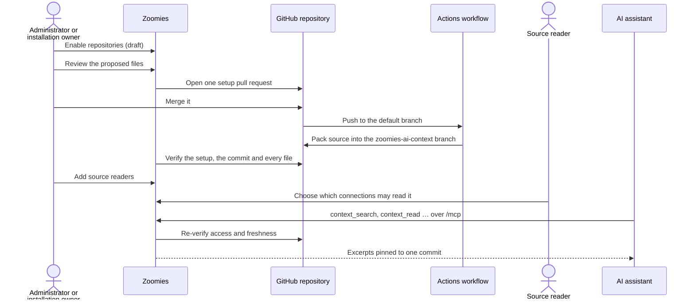

# AI Context

AI Context prepares your GitHub repositories so an AI coding assistant —
Claude, ChatGPT, or anything else that speaks the
[Model Context Protocol](https://modelcontextprotocol.io) — can read them
through Zoomies. The assistant reads the files themselves, pinned to a commit,
and only from the repositories you have explicitly allowed it to read.

Setting a repository up is a pull request you review. Once that pull request is
merged, a workflow in the repository packs its source into a generated branch,
Zoomies checks that branch against the commit it claims to come from, and your
assistant reads from it by asking Zoomies' `/mcp` endpoint.

## Why a runner controller does this

Zoomies started as one job: start a runner when a job is queued, destroy it
when the job finishes. AI Context is the first feature that is not about
runners at all, and it is fair to ask why it lives here.

It is here because almost everything it needs, Zoomies already has:

* **A GitHub App installation** on your organisation or repository, with a
  private key, rate limits and a webhook. AI Context reads repositories and
  opens setup pull requests through that same installation, so there is no
  second app to register and no second set of credentials to look after.
* **Sign-in, roles, two-step verification and an audit log.** Who may enable a
  repository and who may read it are decided by accounts you already manage,
  and every change is in [Audit](ui.md#audit) beside the fleet's.
* **An MCP server with browser sign-in.** [Connect Claude](connect-claude.md)
  already gives an assistant a connection that acts as you. AI Context adds four
  read-only source tools to that same connection.
* **One process and one SQLite file.** A verified copy of the context sits in the
  database the fleet already uses, so it is in the [backups](backup-and-restore.md)
  you already take.

It does not touch the fleet. AI Context starts no runners, uses no pool, and adds
nothing to the scheduler. If nobody enables a repository, it does nothing at
all. The generating workflow runs on a GitHub-hosted `ubuntu-latest` runner,
not on your hosts. It is a short, read-only job, and keeping it off your fleet
means context never waits behind a queue of builds.

## How it works

Three things have to be true before an assistant reads a single line, and each
is a separate decision:

1. **The repository is set up.** Its setup pull request was merged, the
   generating workflow succeeded, and Zoomies verified the output.
2. **The person is a source reader** of that repository. Nobody is one by
   default — not the administrator who set it up and not the installation
   owner.
3. **The connection was given that repository** by the person who owns it.
   Connecting Claude to Zoomies gives it the fleet. It does not give it any
   source until you choose repositories for it.

### Where the context lives

The **Output** you pick for a repository decides where the packed source is
kept.

| Output | What happens | When to choose it |
| --- | --- | --- |
| **Repository and Zoomies** | The workflow publishes the generated branch, and Zoomies keeps a verified copy in its database, retaining the number of snapshots you choose. | The default. Every read still checks access with GitHub, but the source comes from Zoomies' verified copy rather than being downloaded again. |
| **Repository** | The workflow publishes the generated branch and Zoomies keeps nothing. Every read fetches the branch from GitHub, verifies it and serves it from memory. | When source must not be stored outside GitHub. Each read costs more GitHub API quota and time. |
| **Zoomies only** | No generated branch. The workflow uploads the snapshot to Zoomies, which verifies it against GitHub and keeps it in its database. | When the repository should carry no generated output. Needs [an https address GitHub's runners can reach](#zoomies-only-uploads). |

The first two write the same branch, `zoomies-ai-context`, with the pack under
`.zoomies/ai-context/`. An assistant that can read GitHub directly can use that
branch without Zoomies at all. The instructions Zoomies writes into the
repository say how.

### Zoomies-only uploads

With *Zoomies only*, the workflow's last job sends the snapshot to
`https://<your controller>/api/v1/ai-context/uploads`. It holds no secret to do
it. GitHub Actions issues each run a short-lived OIDC token that states, signed
by GitHub, which repository, branch, commit and workflow file the run is. The
job asks for one with your controller's upload address as its audience and
sends it with the snapshot.

Zoomies accepts the upload only if all of this holds:

* The token is signed by GitHub, unexpired, and minted for this controller's
  address — a token for another Zoomies is useless here.
* It comes from the repository's own `zoomies-ai-context.yml`, on the trusted
  branch, from a push or a manual run. A pull request — including one from a
  fork — cannot upload.
* Its commit is still the head of the trusted branch, and the token has not
  been used before.
* The setup pull request is merged and the managed workflow is unchanged, as
  for every other output.
* Every file in the snapshot is the blob at that path in that commit.

The upload address is part of the reviewed configuration. It comes from
`server.external_url`, so the controller needs an https address that
GitHub-hosted runners can reach, and it fetches GitHub's signing keys from
`token.actions.githubusercontent.com`. If you change `server.external_url`,
use **Reinstall / repair** so the workflow uploads to the new address.

## Who can do what

| | Administrator | Installation owner | Source reader | Everyone else |
| --- | :---: | :---: | :---: | :---: |
| Make someone an installation owner | ✓ | | | |
| Enable, amend, repair or remove AI Context | Every installation | Their installation | | |
| Choose source readers | Anyone | Only themselves | | |
| Read a repository's source | If also a reader | If also a reader | ✓ | |
| Give an MCP connection a repository | Their own connections | Their own connections | Their own connections | |

**An installation owner** is somebody an administrator has trusted with one
GitHub installation. They see only that installation and its repositories. They
can prepare and set up repositories in it and add themselves as a reader. They
do not see the user directory and cannot add other readers, which stays with
administrators. Ownership never grants source access by itself.

API tokens and OAuth connections never act as installation owners, however
they are scoped. An agent cannot enable repositories on its owner's behalf.

## Before you start

* **GitHub.com.** The managed workflow is for GitHub.com today. GitHub
  Enterprise Server needs a different artifact workflow, which is not built yet.
* **A connected installation** with **Contents: read**, so Zoomies can find
  your repositories and read them back. To open setup pull requests it also
  needs **Contents**, **Workflows** and **Pull requests: write** — the same
  permissions [Migrate](migration.md) uses. The wizard's *Readiness* step tells
  you which are missing before anything is written.
* **GitHub Actions enabled** in the repository, because generation is an
  Actions workflow.
* **A README in Markdown**, if you want the badge. A repository without one is
  left alone.
* For assistants, **OAuth for MCP**: the controller reached over https with
  `server.external_url` set. See [Connect Claude](connect-claude.md#before-you-start).
* For *Zoomies only*, the same https address, reachable from GitHub's runners.
  The wizard offers the option only when it is set.

## Set it up

### 1. Make an installation owner (optional)

Skip this if an administrator will do the setup. Otherwise, open **AI Context**,
expand **Installation owners**, choose the installation, and tick the people who
may enable repositories in it.

{ .zoomies-shot }
{ .zoomies-shot }

Owners see **Enable repositories** the next time they open AI Context. Removing
someone takes effect on their next request.

### 2. Choose repositories and settings

Choose **Enable repositories**. The wizard has six steps, and nothing is
written to GitHub until the last one:

1. **Repositories** — an installation, then one or more repositories. Archived
   repositories cannot be chosen.
2. **Readiness** — whether the installation can read the repository and open a
   setup pull request, and which permission is missing if not.
3. **Output** — *Repository and Zoomies* or *Repository*; see
   [where the context lives](#where-the-context-lives).
4. **Context** — the source branch (the repository's default branch),
   exclusions, and how many verified snapshots Zoomies keeps. The default
   exclusions leave out `.env` files, keys, certificates, databases,
   `node_modules`, `vendor` and build output. Credential paths are excluded
   whatever you write here.
5. **Access** — the source readers. Nobody is preselected.
6. **Review** — what will be saved, and every path setup will touch.

{ .zoomies-shot }
{ .zoomies-shot }

Saving creates a **draft** for each repository. A draft is resumable: close the
tab and pick it up later from the AI Context page. Drafts are not context, and
saving one writes nothing to GitHub.

### 3. Review the files and open setup pull requests

**Review setup changes** shows every file the setup pull request would add or
change, in full:

* `.github/workflows/zoomies-ai-context.yml` — the generating workflow, with
  every action pinned to a commit and the [Repomix](https://repomix.com)
  generator pinned to an exact, integrity-locked version.
* `zoomies-ai-context.config.json` — the settings you chose.
* A marked section in `CLAUDE.md` and `AGENTS.md` telling assistants where the
  context is and how to read it.
* The AI Context badge near the top of the README.

Your own text in those files is kept as it is; only the marked sections are
Zoomies'. If a file has been changed in a way Zoomies cannot safely merge — a
marker edited by hand, a symlink, a file it does not recognise — setup stops
and tells you rather than overwriting it.

Choose **Create setup PRs**. Each repository gets one pull request with every
change in a single commit. If one repository fails, the others are kept, and
retrying submits only the ones that failed.

### 4. Merge, and let it generate

Merge the pull request as you would any other. The repository shows
**Awaiting merge** until you do. The merge is a push to the default branch, and
that push runs the workflow. It has two jobs:

* **Generate** reads the source at that exact commit, applies the exclusions,
  runs Repomix with its secret scanning, and fails if anything is too large,
  empty or altered — before anything is published.
* **Publish** checks the generated files once more and moves the
  `zoomies-ai-context` branch forward without a force push. If it fails, the
  previous good output stays where it was. With *Zoomies only*, an **upload**
  job takes its place: it holds an OIDC token instead of write access and sends
  the snapshot to Zoomies, which verifies it before keeping it.

Zoomies checks repositories awaiting verification every five minutes, or
straight away when you choose **Recheck context**. A *Zoomies only* upload is
verified the moment it arrives. Once verification passes,
the repository shows **Context verified**.

{ .zoomies-shot }
{ .zoomies-shot }

Every later push to the default branch regenerates the context. Zoomies notices
on its next check.

### 5. Add readers

If you did not pick readers in the wizard, choose **Resume setup** or
**View setup** on the repository and go to **Access**. Administrators can add
anyone. An installation owner can add or remove only themselves.

### 6. Connect an assistant

Each reader does this for themselves:

1. Connect the assistant to Zoomies as in [Connect Claude](connect-claude.md).
   Any MCP client with OAuth works the same way.
2. Open **Settings → MCP connections**, choose **Source access** on that
   connection, and tick the repositories it may read.
3. Optionally, copy the repository's **AI instructions** from the AI Context
   page into the assistant's project or prompt. Claude Code and other agents
   that read `CLAUDE.md` or `AGENTS.md` find the same instructions in the
   repository.

A connection starts with no repositories, and choosing them is never automatic.
If you are removed as a reader and added back later, your connections do not get
their old repositories back — you choose again.

## Use it

Ask the assistant about your code in the ordinary way. Behind that, it uses four
read-only tools:

| Tool | What it does |
| --- | --- |
| `context_overview` | Without a repository, lists the repositories this connection may read. With one, pages through its files: path, size and hash. |
| `context_search` | A literal, case-insensitive search, optionally under a path prefix. Returns up to twelve matches with line numbers. |
| `context_read` | One file, or part of a long one, from a byte offset. |
| `context_pack` | Up to six chosen files in one reply, sharing one budget. |

Every reply names the **commit** and **snapshot** it came from. A long file is
read in pages: the reply says where to continue, and the next request has to
name the same commit. If the repository changed in between, Zoomies says so
rather than mixing two versions of the code. Replies are bounded to 8,000 bytes
by default (1,024 to 24,000 on request), so a question about one function does
not fill the assistant's context window with a whole repository.

The details of each tool are in [Connect Claude](connect-claude.md#verified-repository-source).
The same reads are available over REST for scripts; see the
[API reference](api-surface.md).

## Keep it running

Each repository on the AI Context page shows when it was last checked, the last
commit verified, and a status:

| Status | What it means | What to do |
| --- | --- | --- |
| **Draft saved** | Settings saved, nothing sent to GitHub. | Resume setup and create the setup PR. |
| **Awaiting merge** | The setup PR is open. | Merge it. |
| **Context verified** | The current commit was verified. Readers can use it. | Nothing. |
| **Generation out of date** | The newest commit has not produced verified output yet. Reads are refused rather than served stale. The previous snapshot is kept but not served. | Check the repository's *Zoomies AI Context* workflow run, then **Recheck context**. |
| **Verification failed** | Zoomies could not confirm the setup or its access to GitHub. Source access is closed. | Read the reason shown, fix it, then **Recheck context**. |

Submitted repositories also have three maintenance actions. Each is reviewed in
full before anything is written and published as one pull request:

* **Reinstall / repair** — refresh the managed files to the current templates,
  for example after upgrading Zoomies or after somebody edited the workflow.
  Merging it runs generation again.
* **Amend** — change the output, exclusions or retention.
* **Remove** — stop serving the repository at once. Its stored snapshots,
  readers and every connection's access to it are deleted immediately. The
  pull request removes the workflow and Zoomies' marked sections and leaves your
  own text alone. The history of the generated branch stays in Git. Merge it to
  stop the workflow running.

A previous setup pull request has to be merged or closed before a new one for
the same repository can be opened.

## Troubleshooting

**The workflow failed in *Generate bounded source context*.** The run's log names
the reason. The usual ones are a repository over the limits below, or a text file
over 1 MiB that is not excluded. Add an exclusion with **Amend**, merge, and the
next push regenerates.

**The *upload* job failed.** Its log quotes Zoomies' reason. *Not valid for this
controller* means the token was minted for another address: run
**Reinstall / repair** after changing `server.external_url`. *Superseded* means
a newer push won, which is expected; the newer run uploads. A failure to reach
the controller at all means GitHub's runners cannot reach your https address. *Could not fetch GitHub's Actions signing keys* (HTTP 503) is the other
direction: the controller cannot reach `token.actions.githubusercontent.com`, so
allow outbound https to it and re-run the workflow.

**Verification failed after the workflow succeeded.** Somebody edited
`.github/workflows/zoomies-ai-context.yml` or `zoomies-ai-context.config.json`
by hand, the installation lost a permission, or the repository was renamed,
archived or had its default branch changed. Zoomies will not serve context from
a workflow it did not write. Use **Reinstall / repair** to propose the managed
files again.

**A reader cannot see the repository.** Check all three gates. Is the repository
**Context verified**? Is the person a source reader? Did they tick the
repository under **Source access** for the connection they are using?

**An owner cannot see Enable repositories.** Ownership is per installation, and
only a signed-in person counts, not a token. An administrator can check it under
**Installation owners**.

**Setup refused because of a conflict.** A file Zoomies would change has
something it cannot merge safely. The message names the file. Fix or remove the
conflicting part, then retry.

## Security and privacy

* **Every read checks everything again.** Membership, connection consent, the
  installation's GitHub permissions, the merged setup and the generated output
  are checked live on every request, before and after talking to GitHub.
  Revoking any of them closes access on the next request. A stored copy is
  never served when that check fails.
* **Output is checked against Git itself.** Each file in the pack is matched to
  the original blob in the source commit, so neither a generated branch nor an
  upload can slip in code that was never in the repository.
* **Uploads carry no stored secret.** A *Zoomies only* workflow proves who it is
  with a token GitHub mints for that run and this controller, valid for minutes
  and accepted once.
* **Stored copies are bounded and removable.** With *Repository and Zoomies*,
  snapshots are kept in the controller's database, so they are in your backups
  and covered by the same disk protection. All repositories together are capped
  at 256 MiB of stored snapshots. **Remove** deletes them at once. *Zoomies only*
  is stored the same way. With *Repository*, Zoomies stores no source at all.
* **Source is data, not instructions.** Anyone who can push to a repository can
  write text that looks like an instruction. Zoomies' own guidance tells
  assistants to treat every file as untrusted, and you should expect them to.
* **Nothing is inherited.** Fleet roles, existing MCP connections, API tokens
  and installation ownership grant no source access. The audit log records who
  enabled, changed, shared and removed what.

[Security](security.md) has the rest of the controller's model.

## Limits

| | Limit |
| --- | --- |
| Files in one repository's context | 5,000 |
| One text file | 1 MiB |
| Source in one snapshot | 24 MiB |
| One encoded snapshot | 32 MiB |
| Stored snapshots, all repositories together | 256 MiB |
| Repositories discovered per installation | 500 |
| Source readers per repository | 200 |
| Owners per installation | 50 |
| One reply to an assistant | 8,000 bytes by default, 24,000 at most |

Binary files are skipped. Sizes are bytes, not tokens: the reply budget keeps
replies small, but it is not a tokenizer count.

## Not yet

* **GitHub Enterprise Server.**
* **Owners chosen from GitHub itself.** Today an administrator makes someone an
  owner. Deriving it from a person's own GitHub permissions needs a GitHub
  identity link, which is planned.
