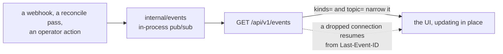

# Zoomies API surface

This is the authoritative list of endpoints. `internal/api` implements exactly
this, `api/openapi.yaml` describes exactly this, and the UI's generated
TypeScript client is derived from that document. **Nothing is reachable from the
UI that is not reachable from the API**, so if a page needs data, it comes from
a route below.

Conventions:

* Base path `/api/v1`. JSON in, JSON out, UTF-8.
* The long lists (`/runners`, `/jobs`, `/provisioning`, `/machines` and
  `/audit`) take `limit` (default 50, max 500), `offset`, `sort` and `order`
  (`asc`/`desc`) and return `{ "items": [...], "total": <int>, "limit": <int>,
  "offset": <int> }`. Every other list returns `{ "items": [...] }` whole;
  `/scaling-events` and `/webhook-deliveries` take a `limit` and return the
  newest that many.
* Every API response carries `Cache-Control: no-store`; nothing under `/api/v1`
  is meant to be cached by a browser or a proxy.
* A `GET` that sends `Accept-Encoding: gzip` gets a gzipped body when the answer
  is JSON, YAML or CSV (an answer that declares itself under a kilobyte is left
  alone), with `Vary: Accept-Encoding`. Streams
  (the event stream, a runner's log), anything that is not a `GET`, and the
  routes that carry a credential (`/auth/*`, `/tokens`, `/join-tokens`,
  `/users`, `/mcp-clients`, `/mcp-connections`, `/backups` and the agent API)
  are never compressed. The UI's own files are served gzipped to a client that
  asks, from the same binary.
* Errors return `{ "error": { "code": "...", "message": "...", "field": "...",
  "detail": "..." } }` with a message written for a human. Codes:
  `bad_request`, `unauthorized`, `forbidden`, `not_found`, `conflict`,
  `unprocessable`, `too_large`, `rate_limited`, `limit_reached`, the `update.*`
  refusals and `update.check_failed` listed under [Updates](#updates), and `internal`.
* Timestamps are RFC 3339 with a `Z` offset. Durations are Go duration strings
  (`"5m"`, `"1h30s"`).
* Mutating requests require `Content-Type: application/json` and, for cookie
  auth, an `Origin`/`Sec-Fetch-Site` check (same-origin unless
  `server.allowed_origins` says otherwise). Bearer-token requests are exempt
  because they are not subject to CSRF.
* `Role` is the minimum role required. `—` means unauthenticated.

## Meta and health

| Method | Path | Role | Notes |
| --- | --- | --- | --- |
| GET | `/healthz` | - | Liveness. Always 200 once the process is serving. |
| GET | `/readyz` | - | Readiness: database reachable, migrations applied. `schema` says which: how many, and the name of the latest, which is the only schema version there is. `bootstrap_required` says whether the instance still has no account, so a provisioner waits on this one endpoint for "can I use this yet"; it is reported, not a reason to answer 503, because the first-run page is what an instance with no account should be serving. |
| GET | `/api/v1/meta` | - | Version, whether bootstrap is needed, whether OIDC is enabled, feature flags, and the fallback poller's state (`poller_enabled`, and `poller_last_poll_at` once it has completed a sweep). Safe to call before login; it is what the login page uses to decide what to render. |
| GET | `/metrics` | viewer¹ | Prometheus text format. ¹Unauthenticated when `metrics.public` is true. |
| GET | `/api/v1/status` | —² | The fleet's name-free status: a projection, and the one response here that is deliberately not a resource's `GET` shape. `state` (`healthy`, `degraded` or `blocked`, from the worst of the fleet's own problems), `since`, `version`, `queued` and `running` as bands (`none`, `few`, `many`, `backed_up`), the median and p95 queue wait in whole minutes, `reasons` carrying `code`, `severity` and `since` and nothing else, and `explanations`, the public sentence for each of those codes from [Problem codes](problem-codes.md#what-the-status-page-says). No pool, host, repository, runner or job name, and never a platform problem. ²Decided by `status.mode`: 404 to everyone while it is `off`, the default; any signed-in role when `authenticated`; anyone when `public`. |
| GET | `/status` | —² | The status page: its own small document, not a route of the app, which polls `/api/v1/status` every thirty seconds and never opens `/api/v1/events`, because every frame on that stream is a resource view and carries names. |
| GET | `/status.svg` | —² | The fleet's state as a self-contained SVG badge, for a team's wiki or a repository README. |
| GET | `/api/openapi.yaml` | - | The spec this document describes. |
| GET | `/robots.txt` | - | Declines crawling unless `server.allow_indexing` is on. Rendered per request, because it has to name this controller's own address. |
| GET | `/sitemap.xml` | - | The interface's top-level pages, absolute. Nothing about the fleet: a pool or runner address is gone by tomorrow. |
| POST | `/mcp` | viewer | The fleet over the [Model Context Protocol](https://modelcontextprotocol.io)'s Streamable HTTP transport, for an agent that reaches the controller directly; see [`zoomies mcp`](cli.md#zoomies-mcp). One JSON-RPC message per POST, answered with JSON; stateless, so no session ID and no event stream, and `GET` is 405. A **bearer token only**: a session cookie is refused, and so is an `Origin` that is not this controller's. Every tool is a call to a route on this page with the caller's token, so each one needs that route's role, `rerun_job`, `drain_runner`, `update_pool`, `update_host` and `apply_remedy` are offered only to a token whose role reaches them. With `security.mcp_oauth` on it also takes an MCP access token from the OAuth flow below, which works here and nowhere else, and a 401 carries `WWW-Authenticate: Bearer resource_metadata=…` so a client such as Claude can start that flow; see [Connect Claude to Zoomies](connect-claude.md). |
| GET | `/.well-known/oauth-protected-resource` | - | RFC 9728 protected resource metadata for `/mcp`: `resource` is `<external URL>/mcp` exactly, and the controller is its own authorisation server. Also served at `/.well-known/oauth-protected-resource/mcp`, which a client tries first. 404 while `security.mcp_oauth` is off, as is everything down to `/oauth/revoke`. |
| GET | `/.well-known/oauth-authorization-server` | - | RFC 8414 authorisation server metadata: the code flow with S256 PKCE only, `none`, `client_secret_basic` and `client_secret_post` at the token endpoint, the `iss` parameter on every redirect (RFC 9207), and, while `security.mcp_open_registration` is on, a registration endpoint and client ID metadata documents. There is no OpenID Connect discovery document: this server issues no ID tokens. |
| POST | `/oauth/register` | - | RFC 7591 dynamic client registration, JSON. Always a public client that must use PKCE; redirect URIs must be https, or http to loopback. Twenty an hour per address, then 429. 403 while `security.mcp_open_registration` is off. |
| GET | `/oauth/authorize` | - | Checks the request and sends the browser to the consent page, `/oauth/consent`, which asks the person to sign in first, password, two-step or single sign-on as usual. A client or redirect that cannot be trusted is refused on this controller's own page and never followed; every other refusal goes back to the client with `error`, `state` and `iss`. A `client_id` that is an https URL is fetched as a client ID metadata document, https only, no redirects, public addresses only unless `security.allow_private_egress` is on, five seconds and five kilobytes. |
| POST | `/oauth/token` | - | Form-encoded. `authorization_code` (single use, five minutes, PKCE checked, `redirect_uri` and `resource` must match) or `refresh_token` (rotated on every use). Answers a one-hour access token and a thirty-day refresh token. A code or refresh token presented a second time revokes the connection it belongs to. Sixty requests a minute per address. |
| POST | `/oauth/revoke` | - | RFC 7009. Revoking a refresh token ends its connection; revoking an access token ends that token. Answers 200 whether or not the token existed. |

## Authentication

| Method | Path | Role | Notes |
| --- | --- | --- | --- |
| POST | `/api/v1/auth/bootstrap` | - | Create the first account, which holds the platform role: whoever can read the setup token out of the log already operates the process. **Refuses once any user exists**; that check is the whole security of this route. |
| POST | `/api/v1/auth/login` | - | `{username, password}` → sets the session cookie, returns the identity. Rate limited per source address. An account with two-step verification on (or without it where `security.require_two_step` is set) gets a **202** `{two_step: verify\|enrol, username, expires_at}` and a five-minute pending-sign-in cookie instead of a session. |
| POST | `/api/v1/auth/two-step/verify` | - | `{code}`: six digits from the authenticator app, or a recovery code. Needs the pending-sign-in cookie; sets the session and returns `{identity, recovery_code_used, recovery_codes_left?}`. Charged to the sign-in limits; five wrong codes end the pending sign-in. |
| POST | `/api/v1/auth/two-step/enrol` | - | For a pending sign-in whose step is `enrol`: a new key, as for `/auth/two-step/setup`. |
| POST | `/api/v1/auth/two-step/enrol/confirm` | - | `{code}` from the new authenticator: turns two-step on, signs in, and returns the ten recovery codes, shown once. |
| POST | `/api/v1/auth/logout` | viewer | Clears the session. |
| POST | `/api/v1/auth/logout-others` | viewer | Ends every other session of the caller's account and every MCP connection it holds; this browser stays signed in. Returns `{mcp_connections_ended}`. A session only. Audited as `auth.logout_others` and `mcp_connection.revoke_all`. |
| GET | `/api/v1/auth/session` | viewer | The current identity: id, name, role, scopes, `must_change_password`. |
| GET | `/api/v1/auth/preferences` | viewer | The current account's private table widths and column order. Non-account identities receive an empty document. |
| PUT | `/api/v1/auth/preferences` | viewer | Replace the signed-in account's private table-layout document. API tokens cannot save one because they are not an account. |
| GET | `/api/v1/auth/problem-dismissals` | viewer | The problems the signed-in account has dismissed or snoozed, so a decision made in one browser holds in every other. Expired snoozes are not returned. `stored` is false for non-account identities, whose client keeps them in the browser. |
| PATCH | `/api/v1/auth/problem-dismissals` | viewer | Add or remove dismissals as one batch (`set`, `remove`) and return what the account now holds. Never changes what `GET /problems` reports. |
| POST | `/api/v1/auth/password` | viewer | `{old_password, new_password}` for the caller's own account. Invalidates the caller's other sessions and ends every MCP connection the account holds (audited as `mcp_connection.revoke_all`). Wrong guesses at the old password share the login rate limits and answer `429` with `Retry-After`. |
| GET | `/api/v1/auth/two-step` | viewer | The caller's own two-step state: `available` (false for single sign-on), `enabled`, `enabled_at`, `recovery_codes_left`, `required`. Refused for an API token, which is never asked for a code. |
| POST | `/api/v1/auth/two-step/setup` | viewer | A new key (`secret`, `otpauth_uri`, and `qr_svg`, the address drawn as a QR code by the controller) not in force until confirmed. 409 when two-step is already on. |
| POST | `/api/v1/auth/two-step/confirm` | viewer | `{code}`: turns two-step on, ends the account's other sessions, and returns ten single-use `recovery_codes`, shown once. |
| POST | `/api/v1/auth/two-step/disable` | viewer | `{password, code}`: turns it off. The code may be a recovery code. |
| POST | `/api/v1/auth/two-step/recovery-codes` | viewer | `{password, code}`: replaces every recovery code and returns the new ones. |
| GET | `/api/v1/auth/mcp-requests/{id}` | viewer | What the consent screen shows about an MCP sign-in waiting for the signed-in person: the client, the redirect's host, whether every redirect it registered is on the person's own machine, and the roles they may give the connection; no higher than their own, never above operator. A session only; an API token is refused. |
| POST | `/api/v1/auth/mcp-requests/{id}/approve` | viewer | `{role}`: creates the connection and returns `{redirect_to}`, the client's redirect with a single-use code, for the browser to follow. Audited as `mcp_connection.grant`. |
| POST | `/api/v1/auth/mcp-requests/{id}/deny` | viewer | Discards the request and returns `{redirect_to}` carrying `access_denied`. |
| GET | `/api/v1/auth/mcp-connections` | viewer | The signed-in person's MCP connections: client, role, scope, when it was made and last used. |
| DELETE | `/api/v1/auth/mcp-connections/{id}` | viewer | Disconnect one of your own; its tokens stop working at once. Audited as `mcp_connection.revoke`. |
| GET | `/api/v1/auth/oidc/start` | - | 302 to the identity provider. |
| GET | `/api/v1/auth/oidc/callback` | - | Completes the flow, sets the cookie, 302 to `/`. |

## Overview

| Method | Path | Role | Notes |
| --- | --- | --- | --- |
| GET | `/api/v1/stats` | viewer | Queued/running counts, the window's completed jobs split into `succeeded`, `failed`, `cancelled` and `unknown` (the four add up to `completed`; `unknown` is a conclusion that is none of the others, including a job GitHub stopped reporting, and is never counted as a success), live runner counts by state, median and p95 queue wait, per-pool utilisation, and a `fleet` object carrying the same job figures narrowed to the jobs this fleet has a hand in, one an enabled pool claimed, one that ran on a runner started here, or one still queued that no pool claims. GitHub reports every job in an installed repository, so on an organisation that also uses hosted runners the unscoped figures are mostly somebody else's; both travel in one payload because the same numbers arrive over the event stream, which is one frame for every viewer. `?window=1h`. |
| GET | `/api/v1/samples` | viewer | Fleet samples for the sparklines. `?since=` or `?window=1h`. |
| POST | `/api/v1/problems/apply` | operator | Apply the change a problem proposes. Some problems carry a `remedy`: a change the controller has worked out and priced against the fleet, as the update that makes it, with what it costs in `effect`. The request is `{ "code", "target_id", "remedy_id"? }`; the problem, never the change, so a client cannot make the controller edit anything it is not proposing. The problems are worked out again and only a remedy among them is applied; with `remedy_id` a proposal that has since changed is a 409, as is one that no longer applies. The update then runs as the caller through the same code as `PATCH /pools/{id}` or `PATCH /hosts/{id}`: it needs the `operator` role and `problems.apply`, and then that route's own action as well (`pools.write` or `hosts.write`), so a token scoped to one resource cannot change another by naming a problem about it, it is refused for what that route refuses (including a change that would leave a pool with no host that could run it, which `confirm` is never sent to override) and it writes that route's audit row plus a `problem.remedy_applied` row. Answers `{ "applied": true, "remedy": {...}, "result": <what the update answered> }`. |
| GET | `/api/v1/problems/auto-applied` | viewer | The changes the controller made on its own in the last 30 days, newest first, with whether each was undone and whether it still can be. `enabled` says whether `security.auto_apply_remedies` is `on` now and `mode` which of `off`, `shadow` and `on` it is; in shadow mode `would_apply` lists what it would have changed. The list is returned either way. |
| POST | `/api/v1/problems/auto-applied/{id}/undo` | operator | Put back what an automatic change replaced, through `PATCH /pools/{id}` or `PATCH /hosts/{id}` as the caller, so it needs that route's role. 409 if it was already undone or the pool or host was edited since. An undone proposal is not made again. Audited as `problem.remedy_undone`. A sidecar memory share the controller changed is also put back by the controller itself, within a week, if a job in the pool is killed for memory afterwards; that row carries `auto` and the reason, and a pool edited since is only marked `superseded`. |
| GET | `/api/v1/problems` | viewer | The problems drawer: unhealthy hosts, failed registrations, webhook delivery failures, unmatched queued jobs, jobs whose runner stopped under them in the last hour, and every configuration warning from `config.Validate`. Returns `{ "items": [...], "ok": true }`, `ok` is true and `items` empty when there is nothing wrong. **Answers by audience**: each problem carries an `audience`, and a caller below `platform` gets the fleet's (its pools, hosts, runners and jobs) while the process's own (its lease, its loops, its backups, the release it could be running, and every `config.Validate` finding) reach `platform` only. `ok` is computed after that filter, so a fleet with nothing of its own wrong is told so. On a single-team instance the one account holds `platform` and the list is undivided. |
| GET | `/api/v1/catalog` | viewer | Every problem code and Kennel check, with what each means, what to change, how to see that it worked and where it is documented; the same document the docs site publishes at `/catalog.json`, built into this binary so it is this release's. Answers whether or not Kennel Club is on. Carries an `ETag` and answers 304 to a matching `If-None-Match`, because an agent asks for it at the start of every session and it changes only with a release. |
| GET | `/api/v1/scaling-events` | viewer | Recent scheduler decisions with their reason strings. `?pool_id=&limit=`. |
| GET | `/api/v1/events` | viewer | **SSE.** All live updates. Honours `Last-Event-ID`, and opens with a `resync` frame when it cannot replay the gap. Query `kinds=` and `topic=` narrow it. Sends a `heartbeat` comment every 20s. |

## Installations

| Method | Path | Role | Notes |
| --- | --- | --- | --- |
| GET | `/api/v1/installations` | viewer | Never includes key material. Carries `settings_url`, the App's own page on GitHub, once its slug is known. |
| POST | `/api/v1/installations` | admin | `{app_id, installation_id, target, target_type, api_base_url, private_key, webhook_secret}`. The key is sealed before it touches the database. |
| GET | `/api/v1/installations/{id}` | viewer | |
| PATCH | `/api/v1/installations/{id}` | admin | |
| DELETE | `/api/v1/installations/{id}` | admin | Cascades to its pools, and removes their runners **now**, interrupting any job they are running: the runners have to be deregistered while the installation's credentials still exist, which is before the row goes. The response says how many pools and runners went. Drain the pools first (`DELETE /pools/{id}`) if the jobs matter. |
| DELETE | `/api/v1/installations/{id}?purge=true&confirm=<target>` | admin | Also removes the installation's history (exactly the set the export below writes, and never another installation's rows) and cannot be undone, so it wants the target typed as `confirm` (a 422 otherwise). The one row left is the `installation.purge` audit entry. |
| POST | `/api/v1/installations/{id}/export` | admin | Everything about one installation as one archive: pools, runners, jobs and their events, deliveries, scaling events, runner sessions, usage days, capacity samples and the audit rows that name any of them. `{"passphrase": …}` in the body seals the App's private key and webhook secret under it (argon2id, AES-256-GCM) so another instance can import them without this one's key; without it no credential leaves. Audited. |
| POST | `/api/v1/installations/import` | admin | `{"archive": …, "passphrase": …}`. All of it or none; rows keep their IDs; runner rows are left out because they name hosts only the exporting instance has. A 409 means a row in the archive is already here, a 422 a wrong passphrase or an archive that is not one. Audited. |
| POST | `/api/v1/installations/{id}/verify` | operator | Probes credentials and permissions. On 403 the message names the missing permission. Also answers *which repositories these credentials reach* (`repository_selection` is GitHub's own `all` or `selected`, with a count and the first names) because an App with every permission correct, installed on "only select repositories" and not on the one somebody pushes to, is a fleet where nothing ever queues and no page says why. A failure to list them costs that line and not the verify. Records the App's slug, which is how a hand-added installation learns it. |
| GET | `/api/v1/installations/{id}/runner-groups` | viewer | Populates the pool editor's runner group select. |
| GET | `/api/v1/installations/{id}/rate-limit` | viewer | Remaining GitHub API quota. |
| GET | `/api/v1/installations/{id}/report` | viewer | How the fleet served one installation over `?window=` (a duration, `720h` by default, at most `8784h`), moved back to the UTC midnight it begins in: the counts and the exact p50 and p95 timings of the [per-installation report](metrics.md#per-installation-report). Gated on `usage.read`, like the Usage page it is a section of. `counts_from` and `timings_from` say where each half is complete from, and `unavailable` says the same in words. The body names no repository; the installation's `target` is included only for a caller who may read installations and, when the target is a repository, jobs. |
| POST | `/api/v1/installations/manifest` | admin | Builds the GitHub App manifest and returns the URL to POST it to. `migration` (default `false`) adds the three repository permissions the migration wizard needs; without it the App asks for the runner permissions alone. |
| POST | `/api/v1/installations/manifest/handoff` | admin | A browser navigation, not a JSON call: the setup page submits GitHub's manifest back here as a form and is answered with a `307` to GitHub, so the POST body is carried on unchanged. The controller checks the pending handshake, the manifest and the destination first, because the redirect is what decides where a credential-creating form is posted. The state is spent by the exchange below, not by this. |
| POST | `/api/v1/installations/manifest/exchange` | admin | Exchanges the manifest `code` for App credentials and creates the installation. |
| GET | `/api/v1/webhook-deliveries` | viewer | Recent deliveries. `?status=rejected`. Each carries `installation_id`: the installation whose webhook secret verified the delivery, which is not necessarily the one covering the repository; when none does, every configured secret is tried and this says which one answered. |
| POST | `/api/v1/webhook-test` | operator | Asks GitHub to redeliver / pings the configured URL and reports whether this controller is reachable, with the specific fix when it is not. |

## Pools

| Method | Path | Role | Notes |
| --- | --- | --- | --- |
| GET | `/api/v1/pools` | viewer | Includes live per-state runner counts and utilisation. `effective_minimum` is the minimum in force: `resources.min_cpus` / `min_memory_mb` where the pool set them, and the fleet's `runners.minimum_*` where it left them at 0, each flagged `*_inherited`. `resources` keeps the pool's own figures, so a pool sent back unchanged keeps following the fleet. |
| POST | `/api/v1/pools` | operator | Full pool object. Server-side validation mirrors the pool editor's. Omitting `resources.cpus` and `resources.memory_mb` is how a pool says the host decides: each runner is then given one slot's share of whichever machine it lands on. `cpu_burst` is the [elastic CPU](elastic-cpu.md) policy on top of that share, `mode` and `max_cpus`, and a qualifying pool that omits it is created on `observe`. `memory_burst` is the [elastic memory](elastic-memory.md) policy, `mode` (`off`, `observe` or `automatic`), `max_memory_mb`, the most one runner may hold, and `spill_mb`, the swap each container may use as the last resort, and a new Docker or Podman pool that omits it is created on `observe`, whatever its size. The response's `sizing` reads `automatic`, `elastic`, `profile` or `fixed`. `size_from_profile` is the third way to size a pool: each runner is the standard size of the [runner profile](hosts-and-pools.md#runner-profiles-how-big-a-runner-is-on-one-host) of the host it lands on, or the fleet's default (`fleet_standard`) where a host names none. It is refused together with `resources.cpus` or `memory_mb`, a pool being sized by the host or stating a size and never both, and moving a pool from a stated size to it clears them in the same request. `runner_settings` overrides the fleet's runner timings per pool, and distinguishes an absent field from an explicit `null`. `tmpfs` keeps the runner's `work` folder and `tmp`, and a Docker-in-Docker pool's `daemon` image store, in memory, `{work: {enabled, size_mb}, tmp: {enabled, size_mb}, daemon: {enabled, size_mb}}`, off when omitted, replaced whole when sent, and refused on the process backend; the dry run proposes the memory limit it needs as `pool.tmpfs_memory_tight`. |
| POST | `/api/v1/pools/validate` | operator | Dry run: returns field errors, the dangerous-setting warnings the pool would produce, and how the fleet answers it, `selected_hosts` (what its host selector reaches), `matching_hosts` (what could actually run it) and `excluded_hosts` (each host in the gap, with the reason; a host whose runner profile keeps the pool off it has the code `profile`). `room.hosts` carries, for each host the pool could land on, how a runner is sized there, `sizing` has the standard, the floor and the ceiling, each figure with its source (`pool`, `host` or `global`), and a host the profile keeps the pool off is listed with `excluded` and no room, rather than dropped. Creates nothing; the pool editor calls it as the draft changes, from the first render, and a pool's page asks it the same question. |
| GET | `/api/v1/pools/defaults` | viewer | What a new pool is, and separately what a size form should open on. `resources` is empty, because a pool that names no size leaves it to the host each runner lands on; `suggested_resources` is the fleet's own figures, for a form offering a fixed size instead. `runner_settings` carries the fleet's runner timings so a form can say what an override is overriding, here rather than on `/settings`, because creating a pool is an operator action and reading the settings page is an administrator's. |
| GET | `/api/v1/pools/export` | viewer | Every pool as a file another instance can import: platform, labels, limits and runner settings, and nothing the instance made up about it; no id, no counts, no timestamps. The installation is named by the organisation or repository it covers (`installation: acme`), never by its `ins_` id, which means nothing on another instance. No environment value is ever in it; `env_keys` names the variables to set by hand. Runner-setting overrides a pool does not make are written as `null`, so importing hands them back to the fleet. `?format=json` (the default) carries when and where from; `?format=yaml` is the same list for a repository. Audited as `pools.export`. The pools the controller keeps from this instance's hosts are left out. |
| POST | `/api/v1/pools/import` | operator | `{document, dry_run, skip}`. Each pool in a pools export is matched by name and planned through the same checks a create or an edit makes, and reported as `create`, `change`, `unchanged` or `refused`, with the current and incoming value of every setting that would move and the reason for a refusal. An edit that would leave a pool with no host that could run it is refused, as `PATCH` refuses it; a new pool no host could run yet is created with a warning, as the pool editor allows. A dry run writes nothing; a real run refuses the whole document while any pool is refused, and writes the rest in one transaction, so it is one change or none. New pools count against `limits.pools` together: a document that would leave the instance over it is refused with 409, dry run or not, and nothing is written. `skip` names the pools to leave out. A pool the document does not name is left alone, and a setting an entry leaves out keeps its current value. An entry that names a pool the controller keeps from this instance's hosts is refused, because the next pass would undo it. Audited as `pools.import`, with the usual `pool.create` and `pool.update` rows for what it wrote. |
| GET | `/api/v1/pools/platforms` | viewer | The runner image catalogue: every operating system and release a `zoomies-runner` image is published for, and the architectures each is built for. Served rather than hard-coded in a client, so a pool cannot be offered a platform no image exists for. |
| GET | `/api/v1/pools/{id}` | viewer | |
| PATCH | `/api/v1/pools/{id}` | operator | Answers `409` when the change would leave this pool with no host in the fleet that could ever run it, while a host can run it as it stands; the message names the machine it no longer fits and by how much. `?confirm=true` saves it anyway, which is right for a pool sized for machines that have not joined yet. A pool the controller keeps from the hosts it has (it carries `auto`, and is made only while [`scheduler.auto_pools`](configuration.md) is not `off`) has only `idle_timeout`, `memory_burst` and `auto`, `warm` (runners to keep ready), `cap` (the most runners to allow, `0` for none) and `paused`, for an operator to change, and `enabled`, which is read as the pause; any other field is a `422` naming it, because it is worked out by the controller or is set up one way for every such pool. A pass of the controller's reconciler is run before the answer, so the cap or the pause is already in force in it, for a pool it is keeping. For one it is not (`auto.kept` is false), a pause or the end of one still takes effect at once, and a cap or a warm count is stored and applies when the controller keeps the pool. |
| DELETE | `/api/v1/pools/{id}` | operator | `?drain=true` (default) drains runners first; `?force=true` removes them immediately, interrupting their jobs. Deleting a pool deletes its runners' records with it, so it answers `409` while any of them is still finishing; the refusal has already asked them to stop, so call it again once they have gone. A pool whose runners are idle goes in one call, because an idle runner is removed outright rather than drained. The response says how many runners were affected. A pool the controller keeps answers `409` while it is keeping it (`auto.kept` is true: `scheduler.auto_pools` is `on` and the pool belongs to the installation the pools are kept for), because it would be made again on the next pass; pause it instead. One it is not keeping (the switch is `shadow` or `off`, or the pool belongs to another installation) is a leftover and goes like any other. |
| POST | `/api/v1/pools/{id}/prewarm` | operator | Queues an image pull on every host the pool could be placed on, so the first job does not pay for it. `202` with the per-host state. |
| POST | `/api/v1/pools/{id}/enable` | operator | For a pool the controller keeps, lifts the operator's pause; whether it is then in use is the controller's to work out from its hosts, or, for a pool it is not keeping (`auto.kept` is false), whether it has room for a runner. |
| GET | `/api/v1/toolchains` | viewer | The latest workflow scan: for each pool id, every `setup-python`, `setup-node`, `setup-go`, `setup-java` and `setup-dotnet` version its jobs ask for, with how many jobs and which repositories. A job counts against the pool the scheduler would give it. A version the workflow does not state is listed with `unresolved` saying why, rather than guessed. `unmatched` is what no pool would run, and `installations` says how each was read. `fills` is, per pool that keeps a tool cache, its latest fill on each host: `pending`, `succeeded` or `failed`, and what became of each version. Empty until a scan has finished; `running` says whether one is under way. |
| POST | `/api/v1/toolchains/scan` | operator | Starts a scan in the background and answers `202` at once. `409` while one is already running. It reads every workflow file every installation can see, from the GitHub quota the scheduler shares. When it finishes, every pool that keeps a tool cache is filled with what it found. Audited as `toolchains.scan`. |
| POST | `/api/v1/pools/{id}/disable` | operator | Existing runners drain; no new ones are made. For a pool the controller keeps, this is the operator's pause, which holds whatever its hosts do. |
| GET | `/api/v1/auto-pools` | viewer | The state of [size routing and automatic pools](auto-pools.md) as the controller's reconciler last found it: `size_routing` and `auto_pools` (`off`, `shadow` or `on`), the `installation` the pools belong to and the `problem` that says why there is none, the `pools` it keeps with the `hosts` that count towards each and the `slots` they give, the `skipped` hosts that count towards none and why, the `findings` it could not act on with what to change, and, under `shadow`, what is `pending`. `classes` is what each size class is: how large a host in it is, and how large a runner. |
| GET | `/api/v1/size-pins` | viewer | Every job, and every repository, an operator has put in a size class by hand. |
| PUT | `/api/v1/size-pins` | operator | `{repo, workflow, job_name, class}`. Names one job, with both `workflow` and `job_name`, or a whole repository, with neither; replaces the pin already there. A pin takes the place of what the job's runs measured, for the jobs that arrive and for the ones already waiting, and the answer says how many of those changed class (`reclassified`). A job that names its class in `runs-on` is still taken at its word. Audited as `size_pin.set`. |
| DELETE | `/api/v1/size-pins` | operator | `?repo=`, and `workflow=` with `job_name=` for one job's pin. The jobs it covered go back to the class their runs say, the ones waiting included. `404` for a pin that is not there. Audited as `size_pin.delete`. |

A pool's `cache` is disposable build acceleration mounted at
`/opt/zoomies-cache`, not workflow storage, and two of its fields have rules
worth stating plainly.

`cache.size_limit` is enforced, not advisory: as a runner starts, whole cache
entries are deleted least-recently-modified-first until the cache is back under
the limit, but only when no other runner is using that cache. A pool that runs
several runners at once shares one cache between them, so evicting whenever a
runner starts would delete files out from under a job already running, and a
start that finds the cache busy leaves it alone until one finds it idle. It
bounds how far a cache drifts over its limit across jobs; it is not a filesystem
quota, and one job can still fill a disk before the next runner starts. Only a
directory can be measured, so a non-zero limit requires `cache.source` to be an
absolute host path; a limit on a named volume is refused rather than accepted
and ignored.

`cache.scope: repository` gives each repository its own cache. A
repository-targeted installation says which repository that is; an
organisation-targeted one (one app over a whole organisation, which is the
usual deployment) does not, so the pool names it in `cache.repository` as
`owner/name` under the installation's owner. That is what lets a shared fleet
give each repository a cache without an installation per repository.

## Runners

| Method | Path | Role | Notes |
| --- | --- | --- | --- |
| GET | `/api/v1/runners` | viewer | Filters: `pool_id`, `host_id`, `state` (repeatable), `q`, `include_removed`. |
| GET | `/api/v1/runners/{id}` | viewer | Includes the current job and the host, and what the runner was given: `allocated_cpus` and `allocated_memory_mb` (each omitted when the runner has no limit on that field) with `allocation_source`, `pool` when the pool set the limit and `host` when it is the host's default share, omitted when the runner has neither. Recorded at create, so a pool edited since does not change the answer. `cpu_resource` is the live [elastic CPU](elastic-cpu.md) state for a runner with an enforced CPU quota: a `state` to branch on (`observing`, `guaranteed`, `zoomies`, `maximum_zoomies`, `throttled`), a `label` for people, a `reason`, and `guaranteed_cpus`, `current_cpus` and `ceiling_cpus`, with `sized_for_cpus` when the runner's toolchains were started sized for its ceiling. `memory_resource` is what the [memory valve](elastic-memory.md) has done for it, absent for a runner it has nothing to say about: a `state` to branch on (`watching`, `observing`, `lent`, `spilled`), the `mode` the agent was told, `blocked` with the code of what stopped it lending more (`at_ceiling`, `pool_empty`, `host_floor`, `unmeasured`, `unsupported`, `failed`), a `reason`, and `guaranteed_mb`, `current_mb`, `ceiling_mb` and `lent_mb`, with `spill_mb` and `would_lend_mb` where there is swap or an observing valve to report. `scratch` says which of its folders were kept in memory when it was created and what it was given of each, with `why` and a `note` for one that is on disk. Both are in the event stream's `runner.updated` as well. |
| GET | `/api/v1/runners/{id}/timeline` | viewer | State transitions with durations, for the detail page. |
| POST | `/api/v1/runners/{id}/drain` | operator | Stop taking new work and exit. A job still running is given five minutes to finish; if it takes longer the runner is stopped and GitHub marks that job failed. Draining a busy runner is therefore refused with `409` unless `?confirm=true` says you accept that. A runner that is not busy drains without it. |
| DELETE | `/api/v1/runners/{id}` | operator | `?force=true` kills immediately; without it, behaves as drain-then-remove. Deregisters from GitHub. |
| POST | `/api/v1/runners/bulk` | operator | `{action: "drain"\|"delete", ids: [...], force?: bool}`. Returns per-id results so a partial failure is visible. |
| GET | `/api/v1/runners/{id}/logs` | viewer | **SSE.** Live log tail relayed from the agent. `?tail=&follow=`. |
| GET | `/api/v1/runners/{id}/logs/download` | viewer | `text/plain` snapshot with a `Content-Disposition` filename. `?tail=N` returns only the last N lines; without it, the whole log. |

## Jobs

| Method | Path | Role | Notes |
| --- | --- | --- | --- |
| GET | `/api/v1/jobs` | viewer | Filters: `repo`, `workflow`, `run_id` (GitHub's run ID, sent with `repo`: how the Workflows page opens a run to the jobs inside it), `pool_id`, `runner_id`, `state`, `conclusion`, `label`, `q`, `since`, `until`, `controller_version` (`unknown` is the never-stamped), `host_id`, `job_name` (exact, where `q` is a substring; commas are not separators), `hosted` (`true` or `false`; anything else is a 400), `unmatched`, `managed`, `failed`, `faulted`, `workflow_failed`, `fault`, `provisioning`. `cancelling` narrows by whether a cancellation has been asked of GitHub and not yet confirmed, leaving it off is every job, and `cancelling=false` is what a list of work still in hand wants, which is why the Jobs page sends it with its Running and Queued views. `provisioning` (`ready`, `expedited`, `paused`, `deleted`, repeatable) narrows to what an operator has done to a queued job's demand; the Jobs page sends `ready`, `expedited` and `paused` for its Queued view, because a job removed from the queue stopped counting as work this fleet is waiting on and the queue depth beside the list no longer counts it either. `since` is included and `until` is not. Every item carries `provisioning`, `provision_now` and `cancel_requested_at` so a client can say which without asking again, and `controller_version`, `controller_channel`, `agent_version` and `host_id`: the build that claimed the job and the host and agent that ran it, each stamped once and never rewritten, and absent on a job recorded before they existed or one no pool here claimed. `granted_cpus`, `granted_memory_mb` and `granted_source` (`pool`, `host`, `profile`, `reduced` or `history`) are the size of the runner that took the job and where that size came from, copied when it took it and never rewritten, so a profile or a pool changed later does not alter what an earlier job ran on; absent on a job from before sizes were recorded and on a runner created with no limits. `size` (repeatable) filters by the size of the runner, written the way the `size` group of `/jobs/stats` names it, `3 CPU / 8 GB`, with `unknown` for a job no size was recorded for. `limit` and `offset` page as before; `before` pages by cursor instead (pass the `next` of the previous page back unchanged, and a job queued in between cannot repeat or hide a row) and cannot be combined with `offset`, `sort` or `order`. `include_steps=false` returns short summaries (`id`, `repo`, `workflow`, `job_name`, `state`, `conclusion`, `fault_domain`, the three timestamps, `queue_wait_ms`, `duration_ms`, `pool`, `host`, `runner` and the version fields) without the step list; the default is `true`, so a caller that sends none of the new parameters sees what it always did. `managed=true` narrows the list to what this fleet has a hand in (a pool claims it, a runner here ran it, or it is queued and unclaimed with labels that could have asked for a pool here) which is what the Jobs page asks for by default. A queued job whose labels all name GitHub's own runners or a vendor's is left out with the finished ones: nothing here will ever run it. `failed=true` keeps the jobs that went wrong on either side: a conclusion GitHub counts as a failure, or a runner that stopped under the job, including one GitHub still believes is running. Each item carries `matched`, `hosted` (every label names GitHub's own runners or a hosted-runner vendor's, so a job no pool claims is theirs to run rather than stuck), `installation_id` (read-only: the installation covering the job's repository, resolved when the job was first recorded, and empty when none does; a pool only runs work in its own installation's target, so a pool whose labels fit is still not eligible unless this matches it), `queue_wait_ms`, `duration_ms`, the job's `steps` as GitHub last reported them, `failed_step` (the first step that did not succeed, or null), `head_branch`, `head_sha`, `run_attempt`, `run_number` (GitHub's own sequential number for the workflow run -- the "#1009" its Actions UI shows next to the workflow name, for cross-referencing the two; zero until a workflow_run lookup backfills it, since the webhook that recorded the job never carries it), and `runner_fault` when the fleet's runner stopped before GitHub reported the job over. `faulted=true` and `workflow_failed=true` are the two halves of `failed`, whose failure it was, and sending both is a 400. `fault` repeats to narrow a fleet failure to particular categories, and a category this build does not know is a 400 rather than a filter that quietly matches everything. Each item also carries `fault_kind`, `fault_domain` (`fleet` or `workflow`, empty on a job that did not fail) and `fault_fix`, which is what to do about a fault of that kind. GitHub records both domains as "failure", which is why the split is computed here rather than left to each client: a tile, a list and the CLI working it out separately is three places to disagree about whose bad afternoon it was. `size_class`, `size_basis` (`explicit`, `pin`, `history` or `default`), `size_reason`, `size_floor_mb`, `routed_class`, `routed_note`, `ran_class` and `throttled_share` say how the controller classed the job, where it sent it, which class of host took it and how much of its CPU time its runner was held back; they are absent on a job nobody classed, which is every job while `scheduler.size_routing` is `off`, and `routed_class` is absent while it is only being watched. |
| GET | `/api/v1/jobs/stats` | viewer | Completed jobs counted and timed, computed in SQL from the job rows and grouped by up to two `group_by` keys: `controller_version`, `day`, `host`, `pool`, `job_name`, `size`. Per group: `count`, `succeeded`, `failed`, `cancelled`, `fleet_failed` with `fleet_failed_by_kind` and `fleet_failure_rate`, and `samples`, `p50_ms` and `p95_ms` for `duration`, `queue_wait` and `startup` (null when nothing could be measured). Selects jobs by when they were queued over `[since, until)` (`until` defaults to now and `since` to a week before it) and takes the `/jobs` filters, `job_name` and `hosted` among them. Duration leaves out cancelled and skipped jobs and says so in `duration_excludes` and `notes`. Jobs never stamped with a controller version, and jobs no pool here claimed, are the group `unknown`. A window longer than `limits.job_stats_window` (90 days unless set) is a `400` naming the setting, and jobs older than `retention.jobs` are gone whatever the window. Startup needs the runner's own record, so it is empty once `retention.runners` has pruned it. More than 500 groups are cut and `truncated` is true. |
| GET | `/api/v1/label-advice` | viewer | What to change in the `runs-on` of the jobs whose measured runs call for something other than what they ask for, the costliest first: `too_small` (it names a class too small for what it uses, so it can only run on hosts that are too small), `unguaranteed` (it names none and needs more than the default class, so it is routed there best effort, which is not a promise) and `too_large` (it names a class larger than it uses). Each has a `message` and a `fix`. `?kind=` narrows to one kind, `limit` and `offset` page, and `counts` is how much there is of each whatever page or kind was asked for. Only a job with at least five measured runs is advised on, a job an operator pinned is left out, and there is none while `scheduler.size_routing` is `off`. |
| GET | `/api/v1/jobs/{id}` | viewer | |
| POST | `/api/v1/jobs/{id}/rerun` | operator | Ask GitHub to run this job again; the remedy for a job the fleet broke, without going to GitHub to press the button there. It re-runs **that job and any job that names it in `needs`**, which is the narrowest thing GitHub's API offers. A job recorded without a GitHub job ID falls back to the run-level call, which re-runs every failed job in the run, and the job's timeline says which of the two was used. Returns `202` when GitHub accepts it, with `fault_domain` echoed back. Refuses a job that has not finished and one that did not fail; it does not check whose fault the failure was, because an operator who has looked at one and decided to run it again is entitled to; the fault category decides where the action is offered, not whether it is allowed. Nothing local changes: the rerun arrives as new deliveries with a higher `run_attempt`. Needs the App's Actions write permission. |
| POST | `/api/v1/jobs/{id}/cancel` | operator | Ask GitHub to cancel the entire workflow run containing this job. Body: `{ "force": false }`; force bypasses conditions that can leave an ordinary cancellation stuck. Returns `202` when GitHub accepts it. Available only when `github.allow_workflow_cancellation` is enabled and the App has Actions write permission. Once GitHub accepts the run-scoped request, Zoomies immediately pauses every locally queued job in that run, removes runners executing its jobs, and stamps `cancel_requested_at` on every job the run still owned. Job states stay pending/running until GitHub confirms their terminal state, GitHub owns the conclusion, but the stamp is what takes them out of the queue depth, the running count and the Jobs page's Running and Queued views straight away, rather than leaving the fleet reporting work nobody is going to do for as long as GitHub takes. |
| GET | `/api/v1/jobs/{id}/events` | viewer | The job's timeline: what Zoomies observed and did about it, oldest first, each entry a sentence with its `kind` (`queued`, `waiting`, `approved`, `claimed`, `unmatched`, `started`, `completed`, `runner_lost`, `runner_returned`, `cancel_requested`, `runner_start_failed`, `rerun_requested`) and `source` (`webhook`, `poller`, `agent`, `controller`, and `recovery` for a re-run the fleet decided on rather than a person). Written from what each delivery changed rather than from the delivery itself, so a redelivery adds nothing. `runner_lost` is the one entry GitHub cannot produce: the runner died under the job, and GitHub will report an ordinary failure. `runner_start_failed` is the failure that touches no job at all: a runner this pool started died before it could take one, so this job is still queued and the next runner may run it, written here because a pool that cannot start a container otherwise looks exactly like a pool that is merely busy. `waiting` and `approved` bracket a deployment review: the time between them is GitHub's, and the queue wait starts at `approved`. Every change to it is accompanied by a `job.updated` frame, which is when the UI refetches it. |
| GET | `/api/v1/jobs/{id}/explanation` | viewer | Why this job is where it is: one sentence with a detail and, where there is something to do, a fix; its `class` from a closed set with a `confidence` and the reason when that is not high; `evidence` a person can check; the catalog `problem_code`; `next_steps` in order; and `log_excerpt`, the runner's kept lines up to the one that decided the class (`?logs=N`, default 12, `0` for none, at most 40). Computed on the controller from the last scheduler plan, the pool that claimed it, and the runner and host behind it, so `blocked` distinguishes a fleet that is merely busy, which clears itself, from one that will never place this job. It is a separate route rather than a field on the job because it is computed from the fleet around the job rather than from its row, and a copy of the job delivered by the event stream would carry a stale one. |
| GET | `/api/v1/jobs/facets` | viewer | Distinct repos, workflows and conclusions, for the filter menus. |
| GET | `/api/v1/workflow-runs` | viewer | One row per workflow run (the "#1009" GitHub's Actions tab lists) summing up the jobs GitHub reported under it over the latest attempt of each job, the way GitHub's own run page does: `state` and `conclusion` are the run's own, `jobs` counts how its jobs are getting on (including `expedited`, `paused` and `removed`, what an operator has done to the queued ones' demand, each part of `queued` rather than beside it) and `queued_at`, `started_at` and `completed_at` are the first job queued, the first started and the last finished. Nothing is stored for a run; it is derived from its jobs, so a run and the jobs `/jobs?repo=&run_id=` lists for it cannot disagree. Takes `/jobs`'s filters, read at the run's level: the status ones (`state`, `conclusion`, `failed`, `faulted`, `workflow_failed`, `cancelling`) name the run's own status (a run with one job running and another queued is running, and a run whose only failure was re-run to success has not failed) and every other filter keeps a run whenever any job of it matches, so a run arrives whole rather than reduced to the job that matched. This is what the Workflows page lists. |
| POST | `/api/v1/workflow-runs/cancel` | operator | What the Workflows page's own run rows call, since a run has no ID of its own, only `repo` + `github_run_id`, to reach through `/jobs/{id}/cancel` the way JobDrawer does. Body: `{ "repo": "owner/name", "run_id": 1, "force": false }`; behaves exactly like cancelling through one of the run's jobs, down to the same config gate, GitHub App permission, and local pausing of queued and running work, except every job of the run still in hand gets the timeline entry, not only whichever job a caller happened to have in hand. Returns `202` with `jobs`, how many of the run's jobs this fleet knows about. `404` for a run this fleet has never heard of; `409` when every job of it has already completed. |
| POST | `/api/v1/workflow-runs/provisioning` | operator | `/provisioning/bulk` for a whole run, and what the Workflows page's run rows call for Run now, Pause and Resume. Body: `{ "repo": "owner/name", "run_id": 1, "action": "pause"\|"resume"\|"run_now" }`. Acts on the run's queued jobs this fleet has a hand in, in every provisioning state but removed, a job an operator deleted from the queue was stood down on purpose, and is restored from the Queue page's Removed view rather than swept back in by a Run now on its run, and returns the same per-job `results`. Delete is not offered at the run's level: a removal is a decision about one job. `404` for a run this fleet has never heard of; `409` when it knows the run but no job of it is waiting for a runner here. Audited per job, with the run named beside it. |

## Provisioning queue

The demand behind the runners, rather than the runners: one row per queued job
this fleet would build a runner for. Suppressing demand is not cancelling a
job (GitHub still has it, and a runner that already exists may still pick it
up) which is why these are their own routes rather than a field on `/jobs`.

| Method | Path | Role | Notes |
| --- | --- | --- | --- |
| GET | `/api/v1/provisioning` | viewer | Always queued jobs this fleet has a hand in. Takes `/jobs`'s filters plus `branch` and `provisioning` (`ready`, `expedited`, `paused`, `deleted`), and carries `counts` beside the items, computed with every filter applied **except** the provisioning status, so selecting one status does not empty the other three cards. |
| GET | `/api/v1/provisioning/selection` | viewer | The IDs matching the current filters, at most 5,000. The point is the snapshot: a bulk action applies to the IDs the operator was looking at, so work that queues between the two calls cannot be swept in silently. |
| POST | `/api/v1/provisioning/bulk` | operator | `{ids, action: "pause"\|"resume"\|"delete"\|"run_now"}`. Returns a result per unique id, so a partial failure is visible; a job that started or finished in the meantime is skipped with its own error. `run_now` resumes and expedites within the pool's priority tier and bypasses the scale-up delay only, pool and host limits, quotas, backoff and recovery fencing all still apply. |

## Usage

| Method | Path | Role | Notes |
| --- | --- | --- | --- |
| GET | `/api/v1/usage` | viewer | `from` and `to` are required RFC 3339 instants no more than 366 days apart; `group_by` is `pool` (default), `installation`, `repository`, `workflow` or `host`. Each row carries a history of buckets, hourly for a range of two days or less and daily beyond; `interval` chooses instead, `hour`, `day`, or a whole number of hours a day divides into (`2h`, `3h`, `4h`, `6h`, `8h`, `12h`), and buckets narrower than a day are bounded to 336 a row, so hourly ones cover at most 14 days, four-hour ones 56 and eight-hour ones 112. `history_from` says where the job and runner history the figures come from begins, and a range that reaches past either is complete only from that instant on. Runner time and cost are read from the usage ledger (the daily roll-up for the whole UTC days it covers, runner rows and sessions for the rest) so `runners` is where the ledger begins, not where `retention.runners` cuts the rows. |
| GET | `/api/v1/usage.csv` | viewer | The same aggregate as a `text/csv` attachment. A value the grouping cannot produce is an empty cell, not a zero. Every row ends with `history_from_jobs` and `history_from_runners`, the same instants as the JSON's `history_from`, blank where that history is never pruned. Grouped by `installation`, each row then carries the [per-installation report](metrics.md#per-installation-report)'s counts (`jobs_observed`, `jobs_eligible`, `jobs_created_for`, `jobs_ran_here`, `jobs_ran_elsewhere`, `jobs_fleet_fault`, `cleanup_pending`, `cleanup_converged`) over the UTC days the range touches, and `counts_from`, the instant they are complete from; any other grouping leaves those columns empty. |

Two things about the shape are worth knowing before a figure is quoted at
anyone.

**The job counts are additive.** `jobs` counts jobs *queued* inside the
interval, `jobs_started` those that began running in it, and `jobs_completed`
those that finished in it. Each job contributes to exactly one interval per
count, so two adjacent reports sum to the report over both. A job that is
merely *present* (queued last week and still queued) is not counted again in
every window it spans. `job_execution_seconds` and `peak_concurrency` are
clipped to the interval and are about time rather than counts, so they behave
the same way.

**`null` is not zero.** `average_queue_wait_seconds` is the mean over the
`jobs_started` jobs, which is the population with an observed wait, and is
`null` when nothing started in the interval, during an incident that reads as
"no job got off the queue" instead of a flatteringly small average.
`allocated_runner_seconds` and `estimated_cost` are `null` for the repository
and workflow groupings, because a runner idles on behalf of a pool and never on
behalf of a repository; the response's `allocation_attributable` says so once
for the whole report, so a client can drop the column rather than print zeroes.

## Hosts and agents

| Method | Path | Role | Notes |
| --- | --- | --- | --- |
| GET | `/api/v1/hosts` | viewer | Includes health, capacity, active runners, backend capabilities, and `upgrade_command`, `upgrade_version`, `upgrade_note` when a remote agent needs version guidance. The copyable command contains no credentials. Also `protocol_version` and `incompatible`: a host whose agent speaks a protocol this controller does not is excluded from placement exactly as a cordoned one is, and nothing else; its runners keep working and are drained as normal. The throttle is four fields: `effective_capacity` (always present; the configured capacity stepped down by the throttle, equal to it when there is none, and what `free` is measured against), `throttle_reason` (always present, empty when not throttled: the operator sentence), `throttle` (only while throttled: `level` 1–3, `since`, `changed_at`, `calm_since` and `reason`) and `unlimited_runners` (omitted when zero: live runners here created with no CPU quota, the ones a sustained CPU hold can mean something about). `usage` carries `load_average_1m` beside the CPU and memory samples. `slots` is how many runners the host takes before any throttle (its capacity, or what its machine holds of its standard runner size up to the capacity) with `slots_limited_by` (`cpu`, `memory` or `capacity`) saying what sets it where a standard did. `runner_profile` is what the operator said, absent when nothing is, and `effective_profile` is what a runner is held to with the fleet's settings standing in for every field the host leaves out, each figure with its source (`host` or `global`). `tags` lists what a pool's `host_selector` can ask of the host; the labels stored on it (`source: operator`) and the ones the controller derives from the machine and never stores (`source: automatic`: `os`, `arch` and, while a size switch is not `off`, `size`), with the value an operator's tag replaced where it did. `size_class` says which [size class](auto-pools.md) the host is in, from where (`measured` or `tag`), what its measurements name now and when it moves if a change is being held, and `auto_pool` which automatic pool its slots count towards or why they count towards none. `elastic_memory` says whether its agent can carry out the [memory valve](elastic-memory.md), and `memory_pool` is what the controller last worked out the host may lend (`capacity_mb`, `lent_mb`, `pool_mb`, the `floor_mb` it keeps back, the ledger lines behind them and what `binding` limited it) present only for a host with a runner the valve applies to |
| GET | `/api/v1/hosts/samples` | viewer | Every host's minute samples for the capacity map: slots taken and in use, measured CPU, load average and available memory, what the scheduler had promised away, and disk. A figure the host had not measured, or one that was stale when the minute was sampled, is absent rather than zero. `?since=` or `?window=1h`, and `?host_id=` for one host. Kept for `retention.samples`. |
| GET | `/api/v1/hosts/{id}` | viewer | |
| PATCH | `/api/v1/hosts/{id}` | operator | Capacity, labels, the reserve (`reserve_cpus`, `reserve_memory_mb`, `reserve_disk_mb`), what the machine keeps for itself, in the units the host reports its own figures in, and `runner_profile`, what an operator says about how big a runner is here: a `minimum` and a `standard` size with a `burst_max_cpus` ceiling, and a `tmpfs` policy (`disabled`, `max_mb`) for pools' in-memory folders, every field optional and a field left out following the fleet's `runners.*` setting. A profile replaces the whole of the host's, so `{}` clears it and a figure left out stops being overridden; a figure below a quarter of a core or 512 MB, a minimum above its standard, a ceiling below it, and one above what the host's machine can place are refused. A standard size makes the host's slots what its machine holds of it, up to its capacity. Each field is independent, and a reserve on a figure the host has never reported, or one that would leave nothing to place on, is refused rather than clamped. The reserve is written by its own statement, never by the path a heartbeat takes: a host cannot talk its way out of the room its operator kept for it. A change to the capacity or to any reserve also clears a standing throttle, since it was decided against figures that have just moved. Answers `409` when the reserve or the labels described would leave a pool that runs here today with no host in the fleet that could run it; the message names the pool and the shortfall, and `?confirm=true` saves it anyway, which is right when the pool is on its way out. While `scheduler.size_routing` or `scheduler.auto_pools` is not `off` a `size` label is the host's class and must be `small`, `medium` or `large`; with both off it is an ordinary label. |
| POST | `/api/v1/hosts/{id}/cordon` | operator | `{cordoned: bool}`. Keeps existing runners, accepts no new ones. A cordon keeps a throttle. |
| POST | `/api/v1/hosts/{id}/throttle/clear` | operator | Lifts the throttle the controller has this host on, whatever rung, and answers with the host. The operator's way out once the cause is fixed rather than a way to switch throttling off: nothing pins a clear, and the next heartbeat puts the host back on the first rung if the pressure is still there. A host on no rung is returned unchanged. Audited as `host.throttle_clear` under the caller's identity; the ladder's own steps are `host.throttle` and `host.throttle_lift` under the system's. |
| POST | `/api/v1/hosts/{id}/health-check` | operator | No body. Asks the host's agent to run its read-only OS checks once and send the report back, instead of waiting for its next periodic report. Nothing on the host changes, and the controller never dials the agent: the request goes out on the agent's own poll. Answers `202` with the host, whose `health_check.state` is `asked`; the report arrives as an ordinary `host.updated` event. Only a native Linux agent that advertises `host-check` can answer; a host that is not connected, an incompatible agent, an agent in a container (Compose with the host-health service included) or one older than this feature is refused with `409` and a sentence saying why. A host asked in the last 15 seconds answers `429` with `Retry-After`, and asking again while a request is still waiting changes nothing. Scope `hosts:check`. Audited as `host.check_requested`, only when a request was queued. |
| PUT | `/api/v1/hosts/{id}/check-acceptances` | operator | `{check_id, seen_current, reason, expires_at}`. Stops Zoomies counting one warning on this host as deliberate: the check keeps its row, marked accepted, and leaves the counts, the problems, the metrics and the pill. It changes nothing on the host. Only a counted warning on a check this build has can be accepted, never an error, a skip, a suggestion, the pending reboot or the two disk checks, each a `422` on `check_id` with the reason. `reason` is 10 to 500 characters and is shown to everyone who can see the host; `expires_at` is required, in the future and at most 365 days away. `seen_current` is what the person read: a check that reads anything else now answers `409` with the new value, and the acceptance ends by itself if the value changes later. Deciding again replaces the first decision. Scope `hosts:accept`. Audited as `host.check_accepted`, reason included. Answers the host. |
| DELETE | `/api/v1/hosts/{id}/check-acceptances/{check_id}` | operator | Takes the decision back, so the check counts again at once. Idempotent: revoking one that is not there answers the host too, and only a revoke that ended something is audited, as `host.check_revoked`. Answers the host. |
| DELETE | `/api/v1/hosts/{id}` | admin | Refuses while the host has live runners unless `?force=true`. |
| GET | `/api/v1/join-tokens` | admin | Outstanding and spent join tokens. Never the secret. |
| POST | `/api/v1/join-tokens` | admin | `{ttl, labels, capacity, controller_url}` → returns the plaintext token **once**, plus the ready-to-paste install command. `controller_url` is optional and replaces `server.external_url` in that command; `capacity` 0 lets the agent decide from the host's CPU count. |
| GET | `/api/v1/join-tokens/{id}` | admin | One token's state. Once redeemed, `used_by_id` is the host it became, which is what the Add-a-host page waits for. |
| DELETE | `/api/v1/join-tokens/{id}` | admin | Revokes an unused token. |

### Agent routes

Authenticated with the agent's own token, never a user session. An agent may
only touch its own host's runners. They are in `api/openapi.yaml` too, marked
`x-internal: true`, so the document is the whole surface it says it is; a
client generator should skip them, and `internal/agent/protocol.go` owns the
wire types.

| Method | Path | Notes |
| --- | --- | --- |
| POST | `/api/v1/agent/join` | Redeems a join token, returns host id + agent token. |
| POST | `/api/v1/agent/heartbeat` | Liveness, backend capabilities, runner observations. |
| GET | `/api/v1/agent/tasks` | Long-poll, up to 25s, returns a `TaskBatch`. |
| POST | `/api/v1/agent/results` | Task outcomes. |
| POST | `/api/v1/agent/report` | Out-of-band runner state reports. |
| POST | `/api/v1/agent/logs/{stream_id}` | Chunked outbound log relay for a UI viewer. |

Each host has limits sized so a working agent never meets them, because one
host's misbehaving agent must not slow every other host's. Heartbeats, results
and reports share a per-host budget derived from `agent.heartbeat_interval`
(twenty calls a second of it, never fewer than two hundred an interval), and a
call over it is a 429 with `Retry-After`. A host holds one task poll at a time:
a second is answered at once with an empty batch. A heartbeat or report may
carry at most a thousand runners, and more is a 413. A log relay stream may
send a megabyte a second after an eight-megabyte burst, and anything over that
is read and dropped rather than waited on. Every refusal is counted in
`zoomies_agent_requests_limited_total` or
`zoomies_log_relay_dropped_bytes_total`.

## Providers and machines

A provider is one place machines can be rented from. Its credential goes in
once, sealed with the instance key, and never comes back: every read reports
`credentials_configured` instead, because an audit row and a screenshot both
outlive the person who took them. A provider on a network the controller cannot
route to, a hypervisor at home, is reached through a `zoomies gateway`
running beside it, and the gateway's Tailcat address is handled the same way:
`tailcat_address` goes in once, sealed, and every read reports
`connection: tailcat`. Choosing `connection: direct` is what clears it. See
[Private hosts and providers](private-hosts.md#private-providers).

| Method | Path | Role | Notes |
| --- | --- | --- | --- |
| POST | `/api/v1/provider-setups` | admin | Generate a Proxmox connection command, valid for one hour; identical uploads can be retried. Defaults to a private Tailcat callback. |
| GET | `/api/v1/provider-setups/{id}` | admin | Poll connection readiness and detected name/address. Never returns credentials or private addresses. |
| POST | `/api/v1/provider-setups/{id}/complete` | setup capability | Accept one sealed connection upload; cannot create providers or enrol runner hosts. Also admitted by the private listener. |
| GET | `/api/v1/providers` | viewer | Each provider with its machines by state, how many still hold a resource, and `held`, why no new machine may be bought right now, in one sentence, or absent when one may. |
| POST | `/api/v1/providers` | admin | Creates one renting nothing: `max_machines` defaults to zero, so a fleet that turns a provider on says in the same breath how many machines it is willing to pay for. 422 names the offending field. |
| POST | `/api/v1/providers/validate` | admin | A dry run over a draft. Always 200 (the verdict is in the body) and it writes nothing and dials nothing, so a form can run it as somebody types. `?id=` says the draft is an edit to that provider, so the name check does not refuse it about itself. |
| POST | `/api/v1/providers/discover` | admin | What a draft's credential can see, before the draft is saved, so the wizard offers a menu of nodes, storages, bridges and templates. Refused with the create's own field errors when the draft could not be saved; a hypervisor that does not answer is 200 with empty lists and the reason in `unavailable`. |
| GET | `/api/v1/providers/kinds` | viewer | What this build can rent from, and the questions each driver's form has to ask. |
| GET | `/api/v1/providers/{id}` | viewer | |
| PATCH | `/api/v1/providers/{id}` | admin | Every field independent; what is not named is left alone. A `credential` or `tailcat_address` of `""` leaves the stored one alone, so a form with a blank password box does not erase it. A provider's kind cannot be changed; the machines it owns are that kind. |
| DELETE | `/api/v1/providers/{id}` | admin | 409 while any of its machines still holds a resource, naming how many. The rows are the only record of what was rented. |
| POST | `/api/v1/providers/{id}/check` | operator | The live preflight. Read-only at the hypervisor, audited here, and recorded on the row so a check run in a terminal quiets the warning the UI is showing. |
| GET | `/api/v1/providers/{id}/discovery` | operator | The nodes, storages, bridges and templates this credential can see. 409 from a driver that cannot list them, and the form asks for identifiers instead. |
| GET | `/api/v1/providers/{id}/orphans` | admin | The three sections of the review page: resources with no row, rows holding no resource, and machines nobody can vouch for. |
| POST | `/api/v1/providers/{id}/pause` · `/resume` | operator | The kill switch. It blocks new machines only (drains, deletes, recovery and ownership checks carry on) and pressing either twice is not an error. Audited as `provider.pause` / `provider.resume`. |
| GET | `/api/v1/machines` | viewer | Paged, filtered by `?provider=`, `?pool=`, `?host=`, `?state=`, `?q=` and `?include_deleted=`. |
| GET | `/api/v1/machines/{id}` | viewer | Includes the phase timeline the detail page reads as a life rather than a row of timestamps. |
| POST | `/api/v1/machines/{id}/drain` | operator | Cordons its host and lets its runners finish. Reversible until the delete starts: demand coming back takes a draining machine back to ready rather than paying for a new one. |
| DELETE | `/api/v1/machines/{id}` | admin | Answers 200 with the machine in `deleting`, because a delete is finished when the resource can no longer be found, not when the provider returns. Cordons its host, so nothing is placed on a VM that is about to go. 409 while runners are still going unless `?force=true`. A quarantined machine is **never** deletable, forced or not. |
| POST | `/api/v1/machines/{id}/release` | admin | Forgets a row and touches nothing, for the machine nobody can safely delete. The machine's name must be in the body. Audited with the provider's identifiers for the resource, because after this the audit row is the only record of them. |

**There is no `POST /machines`.** A machine exists because demand asked for one:
one creation path means one accounting path, and a hand-made machine would be
supply the reconciler would then decide to delete. An operator who wants more
machines raises the provider's ceiling.

`DELETE /api/v1/hosts/{id}` refuses a host that is a machine Zoomies created,
and says to delete the machine instead; that removes the VM too. `?force=true`
still works and forgets the host while leaving the VM running, which is a thing
somebody may genuinely want and never a thing to do by accident. It forgets the
machine's row too, and audits that as a `machine.release` carrying the provider's
identifiers for the VM, because a row left behind would have the machine loop
drain and delete the VM it was promised would be left alone. A machine that is
already being deleted is the exception: its delete carries on.

`GET /api/v1/meta` includes the non-secret `providers_available` flag: this
build ships at least one driver and `provider.enabled` is on.

## Migrations

Moving a repository's workflows from GitHub's runners onto this fleet. The plan
writes nothing; the second call is the only thing in Zoomies that writes to a
repository, and it needs three App permissions the rest of Zoomies does not use:
Contents (write), Pull requests (write) and Workflows (write). An App created
through `POST /installations/manifest` asks for them only when the request says
`"migration": true`.

| Method | Path | Role | Notes |
| --- | --- | --- | --- |
| POST | `/api/v1/migrations/plan` | operator | `{installation_id, repos?, mapping?, overrides?, cursor?}`. Returns the rewrites, the skips and a unified diff per file. With no mapping, proposes one from the pools that exist. Repositories come a page at a time: pass the response's `next_cursor` back as `cursor` for the next one. Each repository carries `archived` and `on_zoomies`, which are the two reasons it cannot be migrated; an archived one's workflows are not read at all. |
| POST | `/api/v1/migrations/pull-requests` | operator | `{installation_id, repos, mapping?, overrides?, workflows?, title?, body?, commit_message?, badge?}`. One pull request per repository, each on its own branch. `workflows` narrows a repository to the files named for it. `badge` (default `true`) also adds the "CI has the Zoomies" badge to each README; each result says what became of it. Re-plans from the repository's current contents rather than trusting the client. |

`mapping` is one answer per hosted-runner label for every repository. `overrides` are the exceptions to it: each is `{repo, path, job, to}` naming one job in one workflow file, with a `to` of `""` meaning that job stays on the runner it names today. Either one alone is enough to open a pull request.

## Audit

| Method | Path | Role | Notes |
| --- | --- | --- | --- |
| GET | `/api/v1/audit` | viewer | Filters: `actor_id`, `action`, `target_kind`, `target_id`, `q`, `since`, `until`. |
| GET | `/api/v1/audit/actions` | viewer | Distinct action names for the filter menu. |

## Users, tokens, settings

| Method | Path | Role | Notes |
| --- | --- | --- | --- |
| GET | `/api/v1/users` | admin | |
| POST | `/api/v1/users` | admin | `{username, password?, email, display_name, role}`. |
| GET | `/api/v1/users/{id}` | admin | |
| PATCH | `/api/v1/users/{id}` | admin | Refuses to demote or disable the last enabled admin. |
| DELETE | `/api/v1/users/{id}` | admin | Same refusal. |
| POST | `/api/v1/users/{id}/password` | admin | Admin reset; sets `must_change_password`. |
| DELETE | `/api/v1/users/{id}/two-step` | admin | Reset a lost authenticator: removes the account's key and recovery codes and ends its sessions. Audited as `user.two_step_reset`. |
| GET | `/api/v1/tokens` | viewer | Metadata only, with the `user_id` that minted each. Your own; everybody's for an administrator (`tokens:read`). |
| POST | `/api/v1/tokens` | viewer | `{name, role, scopes, expires_in}` → the plaintext **once**. Anybody signed in mints their own, never above their own role. Audited as `token.create`. |
| DELETE | `/api/v1/tokens/{id}` | viewer | Your own; anybody's for an administrator (`tokens:write`), and somebody else's is a 404 below that. Revokes; the row stays, marked `revoked`. With `?purge=true`, deletes a token that is already revoked or expired, and answers `409` for one that still works. Both are audited by prefix (`token.revoke`, `token.delete`). |
| POST | `/api/v1/tokens/purge` | viewer | Below administrator only your own, and `user_id` naming anybody else or `all` is a 403. Deletes every revoked or expired token: the caller's own, one account's with `{user_id}`, or every visible one with `{all: true}`. Returns `{deleted}`. Tokens that still work are never touched. |
| GET | `/api/v1/mcp-clients` | admin | Every OAuth client that may ask for an MCP connection (an administrator's, a self-registered one, or a client ID metadata document) with how many live connections each holds. Never a secret. |
| POST | `/api/v1/mcp-clients` | admin | `{name, redirect_uris?, confidential?}`: a client ID to type into an MCP client's OAuth settings. `redirect_uris` defaults to Claude's, `https://claude.ai/api/mcp/auth_callback`. With `confidential` the response carries `client_secret` **once**; the client proves it with Basic or form authentication at the token endpoint, and still uses PKCE. Audited as `mcp_client.create`. |
| POST | `/api/v1/mcp-clients/{id}/secret` | admin | Rotate a confidential client's secret: the old one stops working at once, and the new one is in this response only. Audited as `mcp_client.secret_rotate`. |
| DELETE | `/api/v1/mcp-clients/{id}` | admin | Revoke a client and end every connection it holds. Audited as `mcp_client.revoke`. |
| GET | `/api/v1/mcp-connections` | admin | Everybody's MCP connections. |
| DELETE | `/api/v1/mcp-connections/{id}` | admin | End anybody's. Audited as `mcp_connection.revoke`. |
| GET | `/api/v1/settings` | admin | Every setting with its value, its kind, the layer it came from and whether it can be changed here, plus the same configuration as a nested object and the validator's findings. No secret's value is ever sent. **Answers by audience**: a caller below `platform` is not shown platform-scoped keys at all (what the process binds, trusts, stores, logs or dials from its own machine) nor `config_path`, `database_path` or the subscriber count, and those keys are absent from `pending_restart`, `pinned_by_environment` and `restart_required_keys` too. On a single-team instance the account that installed it holds `platform` and sees what an administrator saw before. |
| PATCH | `/api/v1/settings` | admin | Change the fleet's settings. Keys may be nested or dotted; `null` clears one, so it goes back to the file or the default. An accepted change is always stored: one the running process can apply does so at once, and one it cannot is named in `pending_restart`. Refused: a key read before the database opens, one belonging to a standalone agent's own host, one an environment variable is pinning, a platform-scoped key changed by a caller below `platform`, and any change that would leave a controller which will not start. |
| GET | `/api/v1/settings/export` | admin | Every setting somebody has set (stored here, set in the file, or pinned by the environment) as a file: `?format=json` (the default) wraps the tree with when, where from and which secrets were configured but not exported; `?format=yaml` is the tree alone, in the shape `zoomies.yaml` takes, so the download can be started from. Defaults are left out because they are computed on the host that reads them, and no secret's value is ever in it. Audited. |
| POST | `/api/v1/settings/import` | admin | `{document, dry_run, skip}`. The document is an export or a `zoomies.yaml`, as text. Every key is planned through the same checks a PATCH makes and reported as `change`, `unchanged`, `unset` or `refused` with the reason; a dry run reports and writes nothing, and a real run refuses the whole document while any key is refused, so it is one change or none. `skip` names the keys to leave out; the refused ones, or the ones the operator unticked. A document carrying platform-scoped keys imported by an administrator refuses those keys by name, which is what makes a whole-instance export safe to hand to the fleet. Applying returns the settings page as well, so a client can repaint without a second request. Audited. |

## Recovery

| Method | Path | Role | Notes |
| --- | --- | --- | --- |
| GET | `/api/v1/recovery` | viewer | Whether this fleet is held for recovery, and why. |
| POST | `/api/v1/recovery/unfence` | platform | Lift it. Audited under its own action; lifting an unfenced instance succeeds and changes nothing. |

`zoomies restore` marks a restored database for recovery, and a controller
reading that mark decides as normal and applies none of it: no runner is
created, drained or removed, nothing is reaped from GitHub, and the fallback
poller does not sweep. The plan is still computed and published, so the
Overview shows exactly what would happen the moment the fence is lifted; the
difference between "nothing to do" and "not allowed to".

`/readyz` answers 503 while the fence is on, so a load balancer takes the
instance out of rotation and a deployment does not go green. Liveness is
deliberately unaffected: the container image's health check is `/healthz`, so a
fenced controller is not restarted by its own runtime.

## Backups

| Method | Path | Role | Notes |
| --- | --- | --- | --- |
| GET | `/api/v1/backups` | platform | Every backup in `backup.directory` and every copy the store took before migrating, newest first, each with what its manifest says and whether a restore of it would be refused (`restorable`, `restore_problem`); the schedule and its last outcome; the restore waiting for a restart, if any; and what became of the last one. |
| POST | `/api/v1/backups` | platform | Take one now: `VACUUM INTO`, integrity checked, with its manifest. Retention runs afterwards. `409` while another is being taken. |
| POST | `/api/v1/backups/upload` | platform | `multipart/form-data`: the archive in `file`, and for an encrypted one its `passphrase`. Unpacked into a staging directory, verified, then listed under the name its manifest gives it. Bounded by its own limit rather than the API's, since an archive is the whole database. |
| GET | `/api/v1/backups/{id}` | platform | |
| DELETE | `/api/v1/backups/{id}` | platform | `409` while the backup is staged to be restored. |
| POST | `/api/v1/backups/{id}/verify` | platform | Re-read it: the digest against the manifest, `PRAGMA integrity_check`, and whether this build can open it. A POST because it reads the whole file. |
| GET | `/api/v1/backups/{id}/download` | platform | `<id>.tar.gz`: manifest, database and, only when it was taken with it, the key. Audited. |
| POST | `/api/v1/backups/{id}/download` | platform | `{passphrase}` → `<id>.tar.gz.enc`: argon2id and chunked AES-256-GCM, so a file cut short or altered does not open as a shorter backup. |
| POST | `/api/v1/backups/{id}/restore` | platform | **Stages** a restore: every check `zoomies restore` makes is made now, and the restore is written down for the next controller to apply before it opens the database. Body `{revoke_api_tokens, reset_agent_tokens}`, the command's flags. `202` with the staged restore; `422` names the check that failed. Nothing changes until the restart. |
| DELETE | `/api/v1/backups/restore` | platform | Cancel the staged restore. |
| POST | `/api/v1/backups/restore/apply` | platform | Stop this controller so its service manager starts the next, which applies the staged restore. `202`, then the process exits with code 3. `409` when nothing is staged. |
| DELETE | `/api/v1/backups/restore/outcome` | platform | Dismiss what became of the last restore. |
| POST | `/api/v1/backups/remotes` | platform | Add an S3-compatible destination. The secret key and the passphrase are sealed with the instance key and never served back; a name `backup.remotes` already uses is refused, because the file has the last word. |
| POST | `/api/v1/backups/remotes/check` | platform | Test a destination that is not saved yet, against exactly the body a create would store, which is how a secret key is proved when it is typed. A body with no secret falls back to the one stored under that name. |
| PATCH | `/api/v1/backups/remotes/{name}` | platform | Change a stored destination. The two secrets follow the credential convention: absent leaves what is stored, a value replaces it, an empty string clears it. A destination the file describes answers `409`. |
| DELETE | `/api/v1/backups/remotes/{name}` | platform | Forget a stored destination. What its bucket holds is left alone. |
| POST | `/api/v1/backups/offsite` | platform | Make every remote under `backup.remotes` hold what the backup directory holds: list it, send what it is missing oldest first, apply its retention. The pass the controller runs after each backup and hourly, on demand. A destination that refuses is reported in `error` while the others still go; `409` while a pass is running. |
| POST | `/api/v1/backups/prune` | platform | Apply retention now: the copies beyond `backup.keep` here, and the ones beyond each destination's own `keep` in its bucket. Retention otherwise runs only as part of taking a backup, which leaves a fleet that has just lowered `backup.keep` holding the old number until the next one. The answer lists what went, per destination; `409` while a backup or an offsite pass is running. |
| GET | `/api/v1/backups/remotes/{name}/copies` | platform | What one remote holds, read live from the bucket rather than from anything remembered; the question is whether the offsite copy is actually there, and a remembered yes is worth nothing. |
| POST | `/api/v1/backups/remotes/{name}/check` | platform | Test it: one listing, which is the whole of what has to work for a backup to reach it. A remote that refuses is `200` with `ok: false` and the service's own words. |
| POST | `/api/v1/backups/remotes/{name}/copies/{id}/fetch` | platform | Bring one copy back into `backup.directory`, decrypted with the remote's passphrase or the body's, and verified as an upload is. It is then an ordinary backup; restoring it is the staged restore above. |
| DELETE | `/api/v1/backups/remotes/{name}/copies/{id}` | platform | Remove one copy from the bucket. Audited, like deleting a local backup. |

A backup is the whole database, so `backups:read` on a token is the fleet: every
account's password hash and every sealed credential. `backups:restore` is its
own action rather than `backups:write` because it is the one that replaces the
fleet. [Backup and restore](backup-and-restore.md) is the operator's page.

## Updates

| Method | Path | Role | Notes |
| --- | --- | --- | --- |
| GET | `/api/v1/updates` | viewer | What an update would take, and why. `mode` and `soak` are the settings as the controller acts on them. `running` is the build, with whether it came from a `release`. `latest` is the newest release that can be installed on this system (`tag`, `url`, `published_at`; `url` is empty when GitHub's address is not an absolute https URL), and `target` is what the mode would do about it: `newer` says whether it is a later release than the build, and `due_at` is the end of the soak in `auto` and null in `manual`. `reason` is a sentence or two, and always says something. `checked_at` is when the release list was read. While `mode` is `off`, and until the list has been read, `latest`, `target` and `checked_at` are null and `reason` says why; a list that was read and holds nothing that can be installed has a `checked_at`, no `latest`, and a sentence that says what a complete release is. A build that is not from a release is left alone, and the sentence says so. `helper` says whether the update helper is installed on the controller's host (`state` is `ready` or `missing`, with a `reason` and, when missing, the `install_command` to copy). `controller` is the controller's latest update attempt (`id`, `state`, `from`, `to`, `trigger`, `requested_at`, `finished_at` and the `error` it ended with), in every mode, or null when it has never had one. Computed, not stored. |
| POST | `/api/v1/updates/check` | admin | Ask GitHub for the release list now, and answer with the status once it has been read; the same status is sent to every open page as `updates.updated`. At most one request goes out a minute, and a press inside the minute answers the status as it stands. Refused with `update.check_disabled` while `updates.check_interval` is `0`. Takes no body. |
| POST | `/api/v1/updates/controller` | platform | Ask the update helper on the controller's host to replace its binary, with the newest release that can be installed on this system or with the optional `tag` in the body (`{ "tag": "v1.3.5" }`). Answers `202` with the status, whose `controller` is the attempt just opened. A field the body does not define is a `422` naming it. Audited as `update.controller_requested` once it is accepted. |

It takes no role above `viewer`: it names a public release and the build this
controller runs, and nothing of the fleet's. It is, though, the first route a
viewer can read that carries the platform-scoped `mode` and `soak`, which is
accepted because they say what the controller will do and not how to get in. It answers `200` in every mode,
because the page that reads it is the one an operator opens to find out why
nothing is offered.

Below `platform` the `error` of the controller's attempt, which is often the
helper's own sentence or the controller's about a folder it could not write, is a
fixed sentence for the attempt's state, in `GET /updates`, in the answer to the
check and in the `updates.updated` event alike. The event stream filters it per
subscriber, as it does the problems list, so no frame carries the text to an
administrator.

Refusals of an update are `409`s with a code of their own, because each asks
something different of the person: `update.mode_off` (switch `updates.mode` on),
`update.check_disabled` (`updates.check_interval` is `0`), `update.helper_missing`
(install the helper on the controller's host), `update.in_progress` (an update is
already open for that target), `update.not_a_release` (the build did not come
from a release), `update.nothing_newer` (no newer release in the list the
controller read, or a tag that is not one), `update.host_cannot_update` and
`update.rollout_halted`. A controller that is fenced for recovery, or does not
hold the database's lease, is the plain `conflict`. A release check that GitHub, or the
network to it, would not let finish is a `502` with `update.check_failed`, whose message
says what failed and what to try; it is logged as a warning, because it is not a fault of
this controller.

## Diagnostics

| Method | Path | Role | Notes |
| --- | --- | --- | --- |
| GET | `/api/v1/diagnostics/bundle` | admin | This instance in one JSON document, for a bug report. Admin because it contains the settings section, which is. It stays the fleet's to collect ("send me a bundle" is the platform's first support question) but below `platform` the `instance` section is reduced to the build it all ran on (version, commit, date and Go), and the configuration section carries only fleet-scoped keys. |

The bundle is assembled from the same renderings the routes above serve, so a
section that is secret-free on its own route is secret-free here; the
configuration in particular is the key-by-key rendering `/settings` uses, which
a secret added to `config.Config` tomorrow cannot appear in by default. The one
exception to "what the route serves" is a pool's environment: the bundle keeps
the variable names and blanks every value, for every role, because the file is
made to be handed on.

It never carries workflow log bodies. There is no redaction pass for them and
there cannot be a reliable one (a log holds whatever a workflow printed) so
the document carries runner IDs and the `/logs/download` route instead, and an
operator attaches logs deliberately.

Assembly is section by section: a section that fails costs its own contents and
lands in `errors` rather than failing the whole document, because the moment a
bundle is taken is the moment a query is most likely to fail. Sections are
capped by row count and the whole document by bytes; anything shortened says so
in `truncated`. `zoomies diagnostics` is the wrapper that writes it to a file.

## Kennel Club

Kennel Club checks the repositories this fleet serves against the standards that
affect CI and the fleet. It is off until an administrator sets `kennel.enabled`.
While it is off `GET /kennel` still answers, with `enabled: false` and nothing
else filled, because the page needs a document to say why it is empty; every
route that needs a repository's row answers 409 with the setting to turn on.

| Method | Path | Role | Notes |
| --- | --- | --- | --- |
| GET | `/api/v1/kennel` | viewer | The Overview: how many repositories are in each standing (`repositories` counts the ones Kennel Club is tracking, and `not_tracked` the ones it has been told not to look at, which are in no other number), open findings by severity, the checks with how many repositories have each open, the ten that most need attention, how far each source could be read, and the installations whose reads are not getting through. Computed, not stored. |
| GET | `/api/v1/kennel/checks` | viewer | What is checked: every check with its area, severity, what it detects and the GitHub permission it needs, and whether the operator turned it off. It is the registry the evaluator runs, so it needs no row and answers while Kennel Club is off. |
| GET | `/api/v1/kennel/repositories` | viewer | Paged (`limit`, `offset`). Narrow with `q` (a name fragment), `severity` (`error`, `warning` or `info`: an open finding of that severity), `code` (a check), `state` (`pending`, `partial`, `attention` or `best_in_show`), `installation`, `active` (`true` for the repositories the fleet has had a hand in a job for in the last thirty days, `false` for the rest; left out, both) and `tracked` (`true` for the repositories Kennel Club is looking at, `false` for the ones it has been told not to; left out, both, so one that is not tracked is always listed), `incomplete` (`true` for the repositories that are only partly checked, `partial` or `pending`: what the Overview's Partly checked count adds up, though that counts only the ones being tracked, so add `tracked=true` to match it; it cannot be combined with `state`) and `waived` (`true` for the repositories with at least one waived finding, `false` for the ones with none). A value that is not one of those is a 400 naming the parameter, not an empty page. |
| GET | `/api/v1/kennel/repositories/{id}` | viewer | One repository: its standing, open and waived findings, waivers that no longer cover a finding, per source whether it could be read, with the sentence that says why not and the permission that would fix it, and `tracking`: whether Kennel Club is looking at it and, for one it is not, who stopped it, when and why. A repository that is not tracked is as if nothing had looked at it: `pending`, with no findings, counts or coverage, and due for nothing. |
| POST | `/api/v1/kennel/repositories/{id}/recheck` | operator | Makes the repository due and wakes the loop, and answers `202` with the repository. It reads nothing itself, so a recheck waits on the same API budget and installation hold as everything else. Asking again for the same repository inside five minutes is a `429` with `Retry-After`. A repository that is not tracked has nothing to read, and answers `409`. Audited as `kennel.recheck`. |
| PUT | `/api/v1/kennel/repositories/{id}/waivers` | operator; admin for an error | Waives one open finding: `code`, optional `subject`, `reason` (10 to 500 characters) and `expires_at` (in the future, at most 365 days away). Answers `200` with the repository, already worked out again. Waiving the same finding again renews the waiver and keeps its ID. A `422` lists every field that is wrong, not the first; one for a finding that is not open is refused as well, because a waiver made ahead of a finding is an exception nobody has looked at. A repository may carry 50 (`409` beyond that), and one that is not tracked has no findings to waive (`409`). Audited as `kennel.waive`, with the reason. |
| DELETE | `/api/v1/kennel/repositories/{id}/waivers/{waiver_id}` | operator | Ends a waiver, anybody's, and answers `200` with the repository, the finding open again. A waiver named through a repository it does not belong to is a `404`. Audited as `kennel.unwaive`, with the waiver as it was. |
| PUT | `/api/v1/kennel/repositories/{id}/tracking` | operator; admin to stop | Body `{tracked, reason}`. Stops Kennel Club looking at a repository (`tracked: false`, with a `reason` of 10 to 500 characters), or starts it again. A repository that is not tracked is not read from GitHub and not evaluated, raises no finding and no problem, and is counted apart as `not_tracked`; its waivers are kept and do nothing until it is tracked again. Starting makes it due at once. Asking for the state it is already in answers `200` and changes and audits nothing, the first decision included. A `422` lists every field that is wrong. Audited as `kennel.untrack`, with the reason, and `kennel.track`, with the decision it ended. |

Waiving an error finding is an action of its own, `kennel.waive_error`, held by
the `admin` role. The route asks for `kennel.waive` first and the handler asks
for the wider one when the finding turns out to be an error, so a `403` names the
finding and the role it takes, and a token needs the `kennel:waive_error` scope
for one (which also covers `kennel:waive`) as well as the role. An error is a
stranger running code on the fleet, and the decision that it is acceptable is not
an operator's to take alone. Ending a waiver needs only `kennel.waive`, because
ending one only makes Kennel Club stricter.

Tracking is split the same way. Stopping Kennel Club looking at a repository
silences every error it would have raised there, so it is an action of its own,
`kennel.untrack`, held by the `admin` role; starting again is `kennel.track`,
which an `operator` holds, because it only makes Kennel Club stricter. The route
asks for `kennel.track` and the handler asks for `kennel.untrack` when the body
says to stop, so a `403` names the role it takes, and a token needs the
`kennel:untrack` scope to stop (which also covers `kennel:track`) as well as the
role.

## Webhooks

| Method | Path | Role | Notes |
| --- | --- | --- | --- |
| POST | `/webhooks/github` | - | HMAC-verified. Body capped at 1 MiB, answered with a 413 above it; a `workflow_job` delivery is tens of kilobytes. Acts on `workflow_job` and `ping`; records every delivery either way. Path is configurable via `github.webhook_path`. |

## SSE event kinds

Emitted on `/api/v1/events`; the `event:` field carries the kind and `data:` the
JSON payload. One stream carries the lot, and a client narrows it rather than
opening several:


```mermaid
flowchart LR
    src["a webhook, a reconcile pass,<br/>an operator action"] --> bus["internal/events<br/>in-process pub/sub"]
    bus --> sse["GET /api/v1/events"]
    sse -->|"kinds= and topic= narrow it"| ui["the UI, updating in place"]
    sse -.->|"a dropped connection resumes<br/>from Last-Event-ID"| ui
```

`runner.created` · `runner.updated` · `runner.deleted` · `pool.created` ·
`pool.updated` · `pool.deleted` · `job.updated` · `host.updated` ·
`host.deleted` · `scaling` · `installation.updated` · `installation.deleted` ·
`problems.updated` · `stats` · `audit` · `webhook.delivery` ·
`provider.updated` · `provider.deleted` · `machine.updated` ·
`machine.deleted` · `kennel.updated` · `kennel.deleted` · `kennel.summary` ·
`updates.updated` · `heartbeat` · `resync`

Every frame but `heartbeat` and `resync` carries an `id` of the form
`<epoch>.<sequence>`, where the epoch names one run of the controller. A client
sends the last one it saw as `Last-Event-ID` (or `?last_event_id=`, when it has
opened a fresh connection) and receives what it missed. When it cannot -- the
server's buffer has moved on, or the controller restarted and the sequence began
again -- the first frame on the new connection is `resync`, and the client
should fetch the resources again rather than trust what it holds. The UI does
exactly that.

`resync` also arrives **mid-stream** when more than 64 runner rows are removed
at once, which is what the hourly prune does to everything past the retention
window. Announcing thousands of deletions one at a time overruns every
subscriber's 256-deep queue, and a subscriber that falls behind is dropped: the
stream ends, every open tab reconnects and refetches everything. One `resync`
carries the same news for the cost of one frame. A `resync` frame from the bus
carries an `id` like any other, and its payload names the reason.

Three rules are what make the stream enough to keep a page current, so that no
client ever has to poll or ask the operator to reload:

* **A `*.created` or `*.updated` frame is the resource's `GET` response**, in
  exactly that shape: `host.updated` carries `healthy`, `free`,
  `effective_capacity` and `throttle_reason` (so a throttle stepping up or
  lifting repaints the card with the slots it actually has), `runner.updated`
  carries `pool_name` and `host_name`, `pool.updated` carries
  its counts and warnings. A client replaces the row it holds rather than
  merging into it. The views are rendered once, in
  `internal/controller/views.go`, for both transports, so the two cannot drift.
  A `*.deleted` frame carries `{ "id": … }` and nothing else.
* **`stats`, `problems.updated` and a host's own numbers are computed, not
  stored**, so no row change can announce them. The controller works them out
  after every reconcile pass and every housekeeping tick, and sends each only
  when its JSON changed. `stats` summarises the same one-hour window
  `GET /stats` defaults to; `problems.updated` is the whole `GET /problems`
  response, narrowed to each subscriber's audience as it is sent; the frame is
  rendered once and filtered per connection, the way a pool frame's `env` values
  are blanked for a viewer. A host is the same idea per row: `active_runners` is counted from
  the runners table when the host is read, and the heartbeat behind
  `last_heartbeat` writes one column nothing publishes, so a runner starting or
  an agent checking in moves the card with no row change to announce it. Each
  host whose rendered view differs from the one last sent gets a `host.updated`;
  a host nobody has touched marshals to the same bytes and gets nothing. None of
  this is computed while nobody is connected to the stream. `kennel.summary` is
  the same idea for Kennel Club: it is `GET /kennel` whole, sent when it changes,
  because nothing writes a row when an evaluation grows older. `kennel.updated`
  is one repository's `GET` shape and `kennel.deleted` carries `{ "id": … }`.
  `updates.updated` is `GET /updates` whole, sent when it changes, because nothing
  writes a row when a soak ends and the sentence in it moves with the clock.
* **An operator's change is announced by the handler that made it.** Creating,
  editing, enabling, disabling or deleting a pool; editing, cordoning, clearing
  the throttle on or deleting a host; adding, editing or removing an
  installation -- each publishes before its response is written, so every
  other open dashboard sees it. The controller's own throttle steps are
  published the same way, from the heartbeat that decided them. Removing an installation announces each of its pools as deleted first.

## CLI mapping

The CLI is a client of this API and nothing more. Every command below is one or
two calls to a route above.

```text
zoomies pools list | get | create | edit | delete | enable | disable | prewarm
zoomies runners list | get | drain | delete | logs
zoomies jobs list | get
zoomies hosts list | cordon | uncordon | delete
zoomies hosts join-token create
zoomies providers list | check | pause | resume | machines | orphans
zoomies installations list | verify
zoomies audit list | tail
zoomies users list | create | passwd | delete
zoomies tokens list | create | revoke
zoomies status                # the Overview, in a terminal
```

`--output json|table|yaml` on every read command. Credentials come from
`ZOOMIES_URL` + `ZOOMIES_TOKEN`, or `~/.config/zoomies/cli.yaml`.


### Private agent enrolment

`POST /api/v1/join-tokens` accepts `connection: "tailcat"` (admin only).
Omit `controller_url` for private enrolment. The returned `command` and
`join_command` contain credentials and must be treated as secrets; they are not
returned by token list/get endpoints. Failed tunnel setup returns 422 without
minting a token. The default `connection` is `direct` for existing clients.

`GET /api/v1/meta` includes the non-secret `tailcat_available` capability flag.
Host responses and `host.updated` include `connection: "direct" | "tailcat"`,
observed at enrolment and heartbeat. The tunnel accepts agent endpoints only;
operator routes are not available through it.

## AI Context

| Method | Path | Role | Notes |
| --- | --- | --- | --- |
| GET | `/ai-context/installations` | viewer | The installations the caller may enable AI Context for: every installation for an administrator, otherwise only those they own, with a label and nothing more. |
| GET | `/ai-context/installations/{id}/owners` | admin | The users an administrator has made owners of an installation. |
| PUT | `/ai-context/installations/{id}/owners` | admin | Replace up to 50 owners. Requires an explicit `user_ids` array; an empty array removes every owner. Ownership grants no source access and no connection consent. |
| GET | `/ai-context/discovery?installation_id=…` | admin or installation owner | Discover up to 500 repository candidates with stable GitHub IDs. Reports Contents read permission separately from managed setup write permissions; `capped` warns of possible truncation. Creates no grants, drafts or repository files. |
| GET | `/ai-context/repositories` | admin or installation owner | Configuration metadata only; `limit` defaults to 50 (max 100), `offset` defaults to 0. Returns `items`, `total`, `limit`, `offset`. |
| POST | `/ai-context/repositories` | admin or installation owner | Prepare an unavailable draft from a discovered installation/repository ID and default branch; no automatic source membership. Duplicate selection returns 409. |
| PATCH | `/ai-context/repositories/{id}/config` | admin or installation owner | Save destination, exclusions and retention with a revision check. Keeps the discovered source branch; stale revisions return 409. |
| GET | `/ai-context/repositories/{id}/members` | admin or installation owner | Explicit source reader IDs; source membership is independent of fleet roles. |
| PUT | `/ai-context/repositories/{id}/members` | admin or installation owner | Replace up to 200 source readers. Removing membership also clears that person's connection consent. Requires an explicit `user_ids` array. |
| GET | `/auth/mcp-connections/{id}/repositories` | signed-in owner | Paged eligible source repository names plus the complete eligible selection. Checks live user, membership, connection and client state. |
| PUT | `/auth/mcp-connections/{id}/repositories` | signed-in owner | Replace up to 100 explicit source grants. Empty `repository_ids` removes all grants; omitted/null fields are refused. API tokens and MCP credentials cannot approve themselves. |
| GET | `/ai-context/repositories/{id}` | admin or installation owner | Resume one server-backed configuration draft. |
| GET | `/ai-context/repositories/{id}/setup` | admin or installation owner | Preview pinned managed files, original blob identities and plan hash; no GitHub writes. Live setup permissions and regular files are required. |
| POST | `/ai-context/repositories/{id}/setup` | admin or installation owner | Approve revision/plan hash explicitly. Persist and freeze the reviewed configuration before atomically publishing one setup branch/PR. Retries recover the same proposal; no source availability or connection grants. |
| GET | `/ai-context/draft?installation_id=…&repository_id=…` | admin or installation owner | Resolve an existing draft by stable identity and the installation's server-resolved GitHub host. Supports safe retry after an uncertain creation response. |
| POST | `/ai-context/uploads` | none (Actions OIDC) | A Zoomies-only workflow's snapshot. The bearer credential is the run's GitHub Actions OIDC token, minted for this controller's upload address; it must come from the managed workflow on the trusted branch, for the current head commit, and each token is accepted once. Every file is matched to its Git blob before the snapshot is stored. 404 when `server.external_url` is not https. |
| GET | `/ai-context/access` | source reader | Paged available repository names with live explicit membership. Owned `context:read` tokens may use it; unowned tokens and fleet roles alone cannot enumerate source repositories. |

The administrator configuration list also accepts `q` (literal name search, at most 200 characters) and `installation_id`. The reader list accepts `q`. Both filter before paging. Discovery supplies canonical exclusion and retention defaults so the setup wizard does not maintain a second copy of them.

**Installation owners.** The configuration routes above are open to an administrator and to anyone an administrator has made an owner of the installation concerned, and to nobody else: a refusal is a 404, so the answer does not reveal which installations or drafts exist. An owner cannot be a token or an OAuth connection, sees only their own installations and repositories, and may add or remove only themselves as a reader (the members route shows an owner nothing about other readers; an administrator assigns those). Ownership never confers source access: readers and per-connection consent stay explicit, and removing an owner takes effect on the next request.

Submitted AI Context configuration cannot be changed through the draft PATCH endpoint. The setup lease expires after five minutes so a controller restart can retry the same persisted proposal; a lost PR response is reconciled on the same immutable branch. User changes to that branch or closure of an uncertain PR are preserved and require attention. Submitted proposals now enter bounded background verification. The administrator-only `POST /ai-context/repositories/{id}/recheck` verifies existing setup/output and returns the repository with its current `freshness` record; verification failures are represented in that record with a source-free reason. It does not dispatch Actions or modify repository files. A failure reason says what to do about it -- restore a permission, repair the setup, run the workflow, or simply wait for it to catch up with a push -- and never carries GitHub's own error text. `POST /ai-context/repositories/{id}/regenerate` is the one call that starts the managed workflow: after the same checks a verification makes, including that the workflow on the trusted branch is still the reviewed one, it asks GitHub to run it on that branch. It needs the App's Actions write permission, answers 409 with the permission to grant when it is missing, and returns `202` with the repository. It admits nothing itself; the new context is admitted by the next recheck or background verification. The configured repository GET/list shapes include last checked time, desired commit, last verified commit and snapshot identity. A successful Both-mode verification opens availability; every failed verification closes it while retaining the previous snapshot. New workflow/repair proposals and source REST/MCP retrieval remain follow-on work.

### Compact AI Context source reads

`GET /ai-context/source/{id}/overview`, `/read`, `/search` and `/pack` require
`context.read` plus explicit repository membership. MCP connections additionally
require consent for that connection. Unowned automation tokens cannot read
source. Repository discovery through `/ai-context/access` now accepts connections
and returns only their consented subset; it does not perform live GitHub checks.

Source requests repeat credential and access checks after live verification and
before writing the response. In-process MCP calls revalidate the original
credential without forwarding OAuth tokens to REST. A caller cannot use retained
source after a failed check. Inaccessible repositories return 404 without
revealing whether they exist; unowned tokens return 403.

All source responses use `Cache-Control: no-store`. Query `budget` bounds the
fully escaped JSON body (1,024–24,000 bytes; default 8,000). Read uses `path` and
UTF-8 byte `offset`; pack uses 1–6 repeated `path` parameters with offset zero.
Overview pages at most 100 file summaries, search at most 12 literal matches.
Every reply carries `commit` and `snapshot`. Continuation offsets require the
returned `commit`; a different current commit returns 409. Verification failure
closes availability and returns no source. Search and overview use top-level
`next_offset`; each truncated pack/read excerpt has its own `next_offset`.
A file the snapshot lists but does not carry appears in the overview with an
`omitted` reason (`too_large`, `over_budget` or `flagged`) and its size in Git; a
read of it returns that reason, its `bytes` and empty `text`; and every page,
searches included, carries `omitted_total` when it is not zero. See
[files that are listed but not carried](ai-context.md#files-that-are-listed-but-not-carried).
MCP wraps these routes as `context_overview`, `context_read`, `context_search`
and `context_pack`, with a separate 32,000-byte encoded tool-result ceiling.

### Assistant notes

`GET /ai-context/source/{id}/notes` lists the latest version of each note
without bodies (`limit` 1–100, `offset`); `GET /ai-context/source/{id}/notes/{slug}`
returns one with its body, the latest unless `version` names another. Both need
`context.read` and the same membership and connection consent as source reads.
`POST /ai-context/source/{id}/notes` takes `slug`, `kind`, `title` and `body`,
needs `context.publish`, and returns the stored version with 201. A user, or an
owned token with the `context:publish` scope, publishes as any reader can; an MCP connection also needs publish
consent, sent as `publish_repository_ids` on
`PUT /auth/mcp-connections/{id}/repositories` (a subset of `repository_ids`;
leaving it out keeps the current choice). A note that breaks a rule is a 422
naming the rule; a repository whose context is not verified, or already has 100
notes, is a 409. MCP wraps these as `context_notes` and `context_publish`.

## Host OS health

`GET /api/v1/hosts` and `GET /api/v1/hosts/{id}` include an optional `doctor`
report, supplied by the authenticated agent heartbeat. It carries the check
time, OS, distribution, report scope, reboot flag and bounded check results.
`host.updated` events use the same shape, so badges and details refresh live.
Older agents omit the report, and so does a host that has not sent one yet:
`doctor` is then absent rather than an object of zeros. The UI shows health
unavailable. These routes provide observations only, with no OS tuning endpoint.

Beside `results`, `doctor.summary` is the controller's own count of the report:
`counted`, `warnings`, `errors`, `skipped` and `suggestions`, five integers that
are always present. It counts only the checks that matter to a host's health;
the `safe` tier, without `optional` results. A warning in the `aggressive` or
`dedicated` tier, or one marked `optional`, is a choice an operator has not made
rather than a fault, so it is counted as a `suggestion` and nowhere else.
`counted` is how many checks count whatever they found, so a client can tell
every check passing from every check being skipped (`skipped` equal to
`counted`).

A pending reboot is counted once. `doctor.reboot_pending` carries it, and the
`kernel.pending` warning that says the same thing is left out of `summary`, so a
host whose only finding is a reboot has no warnings. `zoomies doctor` counts the
tier it was asked to run and does not make that exception, so its own total is
one higher for that check.

The summary is worked out on every read from the results beside it. It is never
stored, and an agent cannot send one: a heartbeat whose report carries a
`summary` has it ignored, so a host cannot claim a count of its own. `results`
stays in the payload in full, as the agent wrote it, so a client that wants a
different reading of the tiers can still make one. The text in `results` is
written by the host and is untrusted.

Any signed-in viewer can read `doctor`, with no separate permission and no
change from before the summary. A token reads it with `hosts:read`, with
`runners:read` (a runner's detail carries its host) or with `events:read`
(`host.updated`). `stats:read`, which opens the problems, shows less: the titles
of up to three failing checks per host and no values. See
[Who can read the check detail](host-health.md#who-can-read-the-check-detail).
