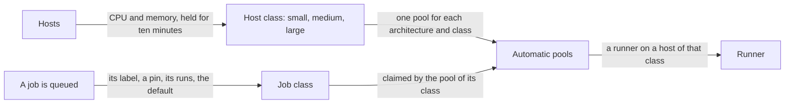

# Size classes and automatic pools

A fleet of mixed machines has two questions the pool settings do not answer: *which
of my machines should this job run on*, and *who makes the pool for a machine I have
just added*. This page is about the part of Zoomies that answers both. It is off by
default, it can be turned on in two steps that change nothing until the second, and
a pool you made yourself is never touched by it.

It has three parts, each useful alone:

1. **Host classes and tags.** Every host is *small*, *medium* or *large*, worked out
   from the CPU and memory it has to place runners on, and carries tags a pool can
   select on.
2. **Automatic pools.** The controller keeps one pool for each architecture and class
   among the hosts it has, and sizes it by the hosts in it.
3. **Job classes and routing.** Each job is put in the class its own runs say it
   needs, and the pool for that class is the one that claims it.



## Turning it on

There are two switches, and each takes `off`, `shadow` or `on`.

| Setting | `off` (the default) | `shadow` | `on` |
| --- | --- | --- | --- |
| [`scheduler.auto_pools`](configuration.md) | The controller makes no pool. | Says what pools it would make, change and put out of use, and does none of it. Hosts are still given a class. | Makes and keeps the pools. |
| [`scheduler.size_routing`](configuration.md) | No job is classed. | Classes each job and records where it ran, and sends nothing anywhere. | Sends each job to the pool of its class. |

Nothing changes on upgrade. The sensible order is to set both to `shadow`, let a
week of jobs go by, and read what they would have done (`zoomies auto-pools` for
the pools, the Jobs page and `zoomies jobs advice` for the jobs, and the
`zoomies_jobs_ran_by_class_total` metric for how often a job ran on a class other
than the one it was put in) then set `scheduler.auto_pools` to `on`, and
`scheduler.size_routing` after it. With routing on and automatic pools off there is
no pool kept for a class, so jobs are only answered by a pool of yours that carries
the class label, and the validator says so.

Neither switch moves a runner that is already running. Changing
`scheduler.size_routing` does put the jobs already waiting through the new mode, a
moment after the change: turning it on gives a job that was queued earlier the class
and the route it would have had, and turning it off, or back to `shadow`, takes the
route off the jobs that had one. A job keeps its class either way, and its timeline
says what happened.

## Host classes and tags

A host is in the lower of the classes its allocatable CPU and its allocatable memory
each name. Allocatable is the machine less its reserve, which is what the scheduler
places onto, so an operator who holds half a machine back for something else is
describing a smaller host than the agent measured. The limits are settings:

| Class | A host has up to | Setting |
| --- | --- | --- |
| small | 4 CPUs and 16 GB | `scheduler.size_small_max_cpus`, `scheduler.size_small_max_memory_mb` |
| medium | 12 CPUs and 48 GB | `scheduler.size_medium_max_cpus`, `scheduler.size_medium_max_memory_mb` |
| large | anything larger | |

A 12-CPU, 32 GB machine has 11.4 CPUs and about 30 GB allocatable, so it is medium;
the same machine with 17 GB held back for something else would be small on memory
alone.

**A host moves class slowly.** A machine whose measurements sit on a limit would
otherwise hop between pools every time a heartbeat read a little differently. The
controller keeps the class it has until the measurements have named a different one
without a break for `scheduler.size_class_hold` (ten minutes), and a reading that
goes back to the held class clears the wait. The host's card says when a change is
pending and when it will take effect. A runner already running is never touched by
a host changing class: only the runners made afterwards go to its new pool.

**Tags.** The labels on a host are its tags, and a pool's `host_selector` asks for
them, `host_selector: {rack: b4}` runs a pool only on hosts with that tag. A host's
card and `zoomies hosts list` show them, and each is marked as yours or as one the
controller works out from the machine and never stores: `os`, `arch` and, while
either switch is on, `size`.

```sh
zoomies hosts edit hst_k3f9qz2m --tag rack=b4 --tag gpu     # gpu is gpu=true
zoomies hosts edit hst_k3f9qz2m --untag rack
```

`size` is the class. Writing it yourself, `--tag size=large`, puts the host in
that class whatever its machine measures, and the host says so, and what it would
have been. While either switch is on it has to be exactly `small`, `medium` or
`large`, in lower case and without spaces, because a pool's host selector compares
the tag as it is written: the API, the UI and the CLI refuse `Large` or `huge` when
the tag is set, and a join token's labels are held to the same rule. A host whose
stored tag is anything else is in no class, counts towards no automatic pool, and
is raised as `host.auto_pool_skipped` with the tag to correct. With both off `size`
is an ordinary label.

A host that joins again keeps the tags an operator added, and the class it held.
The order of authority is the join token's, then what its agent declares now, then
what was stored: a label the token pins or the agent declares is taken from there,
so an edit of the agent's configuration is heard at the next join, and a tag the
agent never declared (a rack, a `size`) survives a rebuilt machine. Two
consequences are worth knowing. An operator's edit of a label the agent also
declares is put back at a re-join, which is what *declares* means; and a label
dropped from the agent's configuration stays until it is removed with
`zoomies hosts edit --untag`, because nothing says it was the agent's. Before this,
a re-join discarded every label edited since the host first joined.

## Automatic pools

With `scheduler.auto_pools` on, the controller keeps one pool for each architecture
and class that has a host in it, for one GitHub App installation; the only one, or
the one named in `scheduler.auto_pools_installation` where there are several. A pool
is made when the first host of its kind arrives, and kept after its last one leaves.

| | An automatic pool |
| --- | --- |
| Name | `zoomies-medium`; for arm64, `zoomies-arm64-medium`. |
| Labels | `zoomies`, `zoomies-medium`, `linux` and `x64` or `arm64`; the class label is what a workflow writes to ask for it by name. |
| Hosts | Those in its class, and of its architecture. A host is in exactly one. |
| Runner size | The standard of the host's own [runner profile](hosts-and-pools.md#runner-profiles-how-big-a-runner-is-on-one-host), or where it has none the runner of the class: 1 CPU and 2 GB, 2 CPUs and 4 GB, 4 CPUs and 8 GB (`runners.small_*`, `runners.medium_*`, `runners.large_*`). |
| Docker | `none`, or `dind` with `scheduler.auto_pools_docker_mode`. The host's own socket is never offered to a pool the controller makes. A `dind` pool divides its slot evenly between the runner and its daemon. |
| In-memory folders | Off: the work folder, `/tmp` and the daemon's image store stay on disk. A host's own [in-memory folder policy](hosts-and-pools.md#keeping-the-work-folder-in-memory) still applies where a pool turns them on. |
| Runner group | On an organisation installation, Zoomies' own runner group, which is what a pool created by hand there gets where it names none; a repository's installation has no groups. |
| Maximum | The slots of the hosts that count towards it. |
| Minimum | The warm runners an operator asked for, and never more than the maximum. |

**The maximum follows the hosts.** It is the sum of what each host that counts holds
of the pool's runner; the host's slots as the scheduler counts them, so a throttle
that has stepped a host down lowers it, and a host's own capacity is its ceiling.
A host counts unless it is cordoned, on an agent the controller cannot place work
on, in no class, of an architecture other than amd64 and arm64, without Docker or
Podman, or silent for longer than `scheduler.auto_pools_host_grace` (ten minutes,
which has to be longer than the five after which the fleet gives a silent host's
runners up, so a brief network drop reshuffles nothing). A host that comes back counts
again.

A host's free disk does not move the maximum. A host below its disk reserve is one
the scheduler places nothing on until it has room again, but it is still a host of
the pool, and a maximum that followed the free space would change (and be written to
the audit log) every time a host dipped below the reserve and came back. Silence is
counted from the later of a host's last heartbeat and the moment the controller began
listening, so a controller that was down for an hour does not drop every host, and put
every pool out of use, on its first pass.

| What happens | What the pool does |
| --- | --- |
| A host of its kind joins | Its maximum rises by the host's slots, and the scheduler is woken, because queued jobs are waiting for exactly that. |
| A host is cordoned, or goes quiet past the grace | Its maximum falls. Its running jobs finish; nothing the pool does touches a runner. |
| A host is removed | Its maximum falls. |
| The last host of its kind goes | The pool is put out of use and kept, with its history. |
| A host of its kind returns | The pool is back in use. |
| A host moves class | It leaves one pool's count and joins another's, once it has held the new class. |

Every one of those is a row in the audit log, under the system identity, with the
sentence that says why (*maximum runners 5 → 10: host build-2 joined*) and the
Overview's feed shows the sentence. The controller recomputes every figure from the
hosts as they are once a minute and whenever a host joins, leaves, is edited or
cordoned, so a missed event costs at most a minute, and running it twice changes
nothing the second time.

**What an operator may change.** Its idle timeout, and three settings of its own:
runners to keep *warm*, a *cap* on the most runners it may have however many slots
its hosts give, and a *pause* that takes it out of use whatever its hosts do. On the
pool's page, with `zoomies pools edit <pool-id> --warm 2 --cap 6`, or with `auto` on
`PATCH /api/v1/pools/{id}`; `pools enable` and `pools disable` are the pause. Any
other field is refused, naming it: the ones the controller works out are said to be
worked out, and the rest are set up one way for every automatic pool, so for those you
make a pool of your own; a different split of a Docker-in-Docker slot, or folders kept
in memory, for example. The advice on how such a pool divides its slot is not given for
an automatic pool for the same reason. It cannot be deleted while the controller is keeping it
(`scheduler.auto_pools` is `on` and the pool belongs to the installation the pools are
kept for) because it would make the pool again: pause it, or set the switch to
`shadow` or `off`. A pool it is not keeping is a leftover that nothing would make
again, and is deleted like any other. An export of pools leaves it out, and an import
refuses to write over it.

**A pool the controller is not keeping.** Under `shadow` or `off`, or for a pool left
on an installation the pools no longer belong to, a pool holds the limits it had. Its
page and `auto.kept` in the API say so, and say what that means for what you asked: a
pause takes effect at once, because nothing else would take the pool out of use, and
the end of one puts it back in use if it has room for a runner; a cap or a warm count
is stored, and applies when the controller keeps the pool again.

**It never touches a pool you made.** If a pool of yours already has the name the
controller would give a pool, or already answers to the class label, the controller
makes none for that class and raises `pool.auto_blocked`, saying which and what to
change. Two pools answering to one class label would split the jobs that ask for it
between a pool you tune and one you did not ask for. Under `shadow`, the same
collision is reported and nothing else.

**Moving them to another installation.** Pool names are unique across the instance,
so when `scheduler.auto_pools_installation` is changed the pools kept for the old
installation still hold the names the new ones need. They are put out of use and
left, as a pool with no hosts is, and the controller says which pool stands in the
way (`auto_pool.name_taken`, in the panel and as `pool.auto_blocked`). Delete it (it
is no longer kept, so nothing makes it again) and the pool for the new installation
is made on the next pass.

## Job classes

A job is classed when it is queued, in this order, and the first that applies wins.
Only a job that a pool of this fleet answers is classed: a job for GitHub's own
runners, or another provider's, carries no class, however many of them an
organisation sends.

1. **A size label in its own `runs-on`.** `zoomies-large` says *large*, and is the
   author's word.
2. **An operator's pin**, for the job or for its repository, the job's winning.
   `zoomies size-pins set acme/widgets --class large`. It reaches the jobs already
   waiting, and those GitHub is holding for a deployment review.
3. **What its earlier runs used.** The smallest class whose runner holds the ninetieth
   percentile of the job's peak memory over its newest twenty measured runs, within
   fourteen days, with a fifth added; the margin history sizing already uses. A kill
   for memory moves it up at once, because a percentile of twenty runs ignores the
   two largest and a kill is exactly one of them. Being held back by its CPU limit for
   a quarter of the time or more in at least half of its sampled runs, of at least
   three, which run for a median of three minutes or more, moves it up too: the peak CPU of a build is its limit and
   says nothing about whether it wanted more, but being throttled does. Moving
   *down* takes ten measured runs over at least a week since the class last moved,
   none killed, none CPU-bound, all fitting the smaller class, and goes one class at
   a time; and the newest twenty runs have to fit the smaller class too, so a job is
   never moved down only to be moved straight back up. The runs behind a move down
   are read from up to 2,000 of the job's runs, so a job that runs more than about
   285 times a day cannot show a week of them and keeps its class until it is pinned.
   Only an agent that reports the counters gives the CPU evidence; a job on an older
   agent is classed on memory alone. The counters are a runner's for as long as its
   container lives, so only the first job a runner takes is given them: on a pool
   that is not ephemeral, whose runners take one job after another, each job after
   the first has no CPU evidence and is classed on memory alone, rather than being
   charged with the throttling of the jobs before it.
4. **The default class**, `medium` (`scheduler.size_default_class`), for a job
   nothing is known about. It is the size of the fleet's own default runner, so a
   job with no history gets the runner it had before there were classes.

The class and the sentence that says why, *classed large because its memory needs
about 6.2 GB (the 90th percentile of 12 runs, with a fifth added), which a large
runner holds*, are on the job, in the drawer, in `zoomies jobs get`, in the API and
in the MCP tools, with the class of the host that took it. The class is kept between
runs of a job, which is what lets moving down be slower than moving up, and is
pruned with the job history: a job that has not finished a measured run for
`retention.jobs` starts again in the default class.

## Routing: what is guaranteed and what is not

A workflow can ask for a class in two ways, and they are not equally strong.

| The workflow writes | What is guaranteed |
| --- | --- |
| `runs-on: [self-hosted, zoomies, zoomies-large]` | The job can only run on a runner that carries `zoomies-large`, because GitHub gives a job only to a runner that has every label it asks for. Zoomies never moves it to another class: if no host of that class is enrolled, it waits, and `jobs.unmatched` says why. |
| `runs-on: [self-hosted, zoomies]` | Best effort. Zoomies puts the job in a class and makes the runner for it in a pool of that class, but GitHub decides which waiting job a runner takes, so the job can still land on a runner that was made for another. |

A job that names no architecture is answered by x64 pools; write `arm64` to ask for
arm. The sentence on the job says which of the two it had.

**When best effort can be wrong.** A runner made for one job can be taken by
another while it is still starting: when an idle runner of another class already
exists, when two classes have jobs queued at once and their runners swap, and when
an organisation-level runner takes a job from another repository. The honest
measure of how often is `zoomies_jobs_ran_by_class_total`, which counts each job by
the class it was put in and the class of the host that took it, so `shadow` tells an
operator the rate on their own fleet before anything routes. A workflow that must
run on a large host writes `zoomies-large`.

**When a job's own class has no room.** Two cases, and both leave a note on the job.

* **No pool.** No host of the class is enrolled, so no pool exists. The job is sent
  at once to the next size up that has a pool, or, where no larger class has one
  either, to the nearest smaller class, and the note says it may be too small,
  because a job waiting for a host that does not exist waits for ever, and one that
  runs and is killed for memory says why.
* **No room.** The pool exists and its hosts are full. A job that has waited
  `scheduler.size_fallback_wait` (two minutes) and is among those the pool has no
  runner for is offered other classes: a larger one first, because a larger host
  always has what the job needs; a smaller one only if its runner holds the memory
  the job's runs showed it needing. Only a job with no runner coming is ever moved,
  so two classes that are both short of room do not pass a job between them.

A job that asked for its class by name is never moved in either case.

## Label advice

`zoomies jobs advice`, the Jobs page and `GET /api/v1/label-advice` list the
workflows whose `runs-on` could say something better, from what the jobs measured,
at most one entry in the problems drawer pointing at them (`jobs.label_advice`):

| Advice | What it means | What to write |
| --- | --- | --- |
| `too_small` | It names a class smaller than its runs need, so it can only run on hosts too small for it, and is killed when it needs more than they have. | The class its runs call for. |
| `unguaranteed` | It names none and needs more than the default class, so it is routed there best effort. | Add the class label, which makes it a guarantee. |
| `too_large` | It names a class larger than it uses, so it occupies a host another job needs. | The smaller class, unless the job needs the host for something that is not measured, such as its disk or its network. |

It is given only for a job with at least five measured runs, never for a job an
operator has pinned, and never for a job that names a label of a pool of its own. A
job with fewer runs is listed all the same, as a row in the `not_enough_data` state
with its count, so "no advice" is never mistaken for "not enough known yet". The
list is always worked out when it is asked for; the count in the problems drawer is
kept for a minute, because it is asked for after every scheduling pass, and is worked
out again at once when a pin changes.

Each row carries the figures it rests on: the p50, p95 and max of memory and CPU
that the job's runs used, over a window (`--window`, `?window=`; fourteen days unless
asked otherwise, and never longer than `retention.jobs` keeps, which the answer says
when it applies), with how many runs they were taken from; the class it recommends
with the rule's own reason; and whether any host in the fleet carries that class,
naming it when none does.

### How the figures are computed

The constants are named here so a reader can find them in the code, and a test
holds this section to their values.

* **The class rule** takes the newest twenty measured runs of a job over the last
  fourteen days and keeps the 90th percentile of their peaks (`ProfilePercentile`),
  by the nearest-rank method: one run that pulled a cold cache should not size
  every run after it, and one that did less than usual should not shrink them.
* **Memory gets a margin**: a fifth added on top of that percentile
  (`ProfileMemoryMargin`), because a job that used 5 GB on its heaviest ordinary
  run is killed at exactly 5 GB the next time its test data grows. CPU gets none,
  because a build uses every core it is given and a margin would ratchet it up to
  the largest host.
* **A run the kernel killed** for memory is taken to have needed
  one and a half times the limit it hit (`ProfileOOMGrowth`): the peak it recorded
  is by definition not enough, and half as much again moves the next run off a
  host that has already failed it.
* **Nothing is said before five measured runs** (`AdviceMinRuns`). A class worked out
  from one run is a guess, and advice to rewrite a workflow is not something to put
  on the strength of one.

The `observed` figures beside each row are the measurements, not the rule: the p95
and max are what the runs did, with a killed run at the peak it recorded, so a reader
can put them beside the class's reason and see the margin and the growth applied.

### What is deliberately not inferred

* No class from a single run, and no advice before `AdviceMinRuns` runs: a sparse
  job is a row that says how many runs it has, nothing more.
* No class from a pinned job's history. The pin is an operator's decision and takes
  the place of the measurements; the job is left out of the advice entirely.
* No figure from runs that retention has pruned. A window longer than
  `retention.jobs` is cut to it and the answer says so, rather than promising a
  fortnight of figures over a week of history.
* No "fits" from whether a host is free. The fit says whether the fleet has a host
  of the class at all, cordoned and quiet hosts included; this minute's room is the
  scheduler's question, not the advice's.

## Where to look

| To see | Where |
| --- | --- |
| A host's class, why it is in it, a move it is waiting out, its tags and whether its slots count towards a pool | The host's card on [Hosts](ui.md#hosts), and `zoomies hosts list`. **Edit** changes the tags, as does `zoomies hosts edit --tag`. |
| What the controller keeps, would keep and could not, the hosts left out, and where each class begins | The panel above the grid on [Pools](ui.md#pools), and `zoomies auto-pools`. It opens by itself when something needs an operator. |
| One automatic pool, and what its maximum is made of | Marked **Automatic** in the grid; its own page lists the hosts that count. **Settings** sets the warm count, the cap and the idle timeout; **Pause** and **Resume** are the switch. |
| A job's class, why, the pool it was sent to, where it ran, and whether that was a fallback | The job's drawer on [Jobs](ui.md#jobs), `zoomies jobs get`, and a **Size class** column you can switch on. |
| The jobs that would benefit from a size label, and the pins | **Size labels and pins** on Jobs, `zoomies jobs advice` and `zoomies size-pins`. |
| Why the controller changed something | The Overview's feed and the [Audit](ui.md#audit) log: `pool.auto_resize`, `host.size_class`, `size_class.move` and the rest, each with its sentence. |

## A worked example

Five machines, each with a capacity of eight: a 32-CPU, 128 GB machine, two 12-CPU,
32 GB ones, and two 4-CPU, 16 GB ones.

| Host | Allocatable | Class | Runner | Slots |
| --- | --- | --- | --- | --- |
| `big-1` | 30.4 CPUs, 121 GB | large | 4 CPUs, 8 GB | 7; its cores run out first |
| `build-1`, `build-2` | 11.4 CPUs, 30 GB | medium | 2 CPUs, 4 GB | 5 each |
| `tiny-1`, `tiny-2` | 3.5 CPUs, 15 GB | small | 1 CPU, 2 GB | 3 each |

With `scheduler.auto_pools` on, the controller makes three pools: `zoomies-large`
with a maximum of 7, `zoomies-medium` with 10 and `zoomies-small` with 6. Then:

* `lint`, which has never been measured, is `medium` by default and is claimed by
  `zoomies-medium`.
* `e2e` writes `zoomies-large`. Only `zoomies-large` answers it, so it waits for a
  large host rather than running on a smaller one.
* `build` writes only `zoomies`. Its last twelve runs used 6 GB, which a large
  runner holds, so it is classed `large` and routed to `zoomies-large`; label advice
  suggests `zoomies-large` in its `runs-on` to make that a promise.
* `docs` used 300 MB, so it is `small` and goes to `zoomies-small`.

Cordoning `build-2` lowers `zoomies-medium` to 5 and leaves the runners already on
it alone. The reasons and the figures are on the pool's page and in the audit log.
The slots in this example are checked by a scheduler test, so the page and the code
cannot disagree.

## When something is not as expected

| What you see | Why, and what to do |
| --- | --- |
| A host is in no pool | Its card says why: cordoned, silent beyond the grace, on an agent the controller cannot place work on, a `size` tag that is not a class, an architecture neither amd64 nor arm64, or no Docker or Podman. `host.auto_pool_skipped` is raised for the ones you can fix. |
| No pool was made for a class | A pool of yours already has its name or its class label: `pool.auto_blocked` says which. Or several installations are configured and `scheduler.auto_pools_installation` names none. |
| A job asking for `zoomies-large` waits | No enabled pool carries it: no large host counts, or you paused the pool. `jobs.unmatched` and the job's own explanation say so, and it is not moved to another class. |
| A job ran on a different class from the one it was put in | For a job that wrote only `zoomies`, GitHub chose the runner. The job's page shows both classes; write the class label for a guarantee. |
| A job is in a class that looks wrong | The sentence on the job says what decided it. Pin the job or its repository, which also moves the jobs already waiting. |
| A pool's maximum is lower than expected | Its page says what it is made of: which hosts count and the slots they give, and any cap you set. A throttled host gives fewer. |
| A pool was not made after you changed `scheduler.auto_pools_installation` | The pool kept for the old installation still holds the name: `pool.auto_blocked` says which to delete. It is no longer kept, so it can be. |
| A pool's page says it is not being kept | Automatic pools are `shadow` or `off`, or the pool belongs to an installation they are no longer kept for. It holds the limits it had, and can be deleted. |
| A job for GitHub's own runners has no class | Intended: only a job a pool of this fleet answers is classed. |

## What it does not do

* It does not move a runner that is running, or a job from a host.
* It does not predict how a job will do on a class it has never run on; the default
  class is a starting point and the history takes over from the first measured run.
* The controller keeps pools for amd64 and arm64 hosts with Docker or Podman only.
* The pools belong to one installation. A fleet with several names the one.
* The classes are three, with limits you can move but not add to.
* A job that runs more than about 285 times a day keeps the class it has until it is
  pinned, because its history cannot show the week a move down needs.
* A label dropped from an agent's configuration stays on the host after a re-join,
  because nothing says it was the agent's: remove it with `zoomies hosts edit --untag`.
* It does not make a machine: that is [a provider's](providers.md) work, and a
  machine a provider makes joins as a host and is classed like any other.
