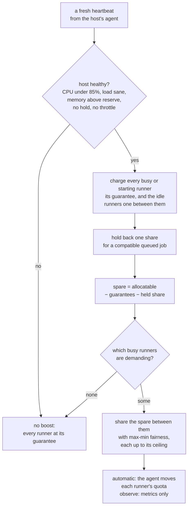

# Elastic CPU zoomies

A runner is given one slot's share of its host, as a real CPU quota, and most
of the time that is the right size. But a host with eight cores and two busy
runners is idling on more than half of itself, while each of those runners
compiles inside a quota of under two cores. **Elastic CPU zoomies** lends that
spare CPU to the runners that are actually using theirs, takes it back the
moment anything else needs it, and never touches memory. A job that would have
taken four minutes at its guarantee finishes in two, and the fleet's accounting
does not change by a single slot.

It is a pool setting, on by default in its measuring form for every new pool,
and the runner page and the Overview feed say when it is happening in the
product's own words: **Squirrel spotted — maximum zoomies**.

The runners table uses one **Status** column. A runner normally shows its
lifecycle state, such as **Registering** or **Busy**. While a boost or throttle
is active, **Squirrel spotted**, **Rabbit spotted**, or **Leash tightened** takes
its place. Hover, focus, or tap the status for its lifecycle state, the reason
and its current, guaranteed and ceiling CPU allocations. Startup, draining,
failed and removed states stay visible even if an older CPU sample remains.

The original paw-and-swish status icons move in short, staggered bursts with
quiet pauses between them. Reduced-motion preferences disable the animation.
Status labels wrap when a saved column width is narrow; they are not clipped.

## What it promises

The design starts from what it must never do, because a scheduler that lends
CPU carelessly is a scheduler that starves a job it never noticed.

* **Every runner keeps its guarantee.** A runner's share of the host is what it
  was created with, and elasticity only ever adds to it. A busy or starting
  runner's guarantee is charged in full before a single hundredth of a core is
  lent to anyone. Idle runners — warm capacity waiting for a job — are charged
  one guarantee between them, the largest, because only one of them can be
  handed a job before the next plan; the rest of what they are not using is
  lent. [Idle runners](#idle-runners) says what that costs.
* **The next job keeps its room.** When a job is queued that this host could
  run, one runner's worth of CPU is held back before any is lent, so a burst of
  fast jobs cannot crowd the next one off the machine. A job whose runner is
  already starting on the host is not held back for twice: that runner's
  guarantee is already charged.
* **The host's own reserve is untouched.** The agent, the container daemon and
  the operator's `reserve_cpus` come first, as they do for placement. Only what
  is left after all three — the guarantees, the imminent start and the reserve
  — is spare.
* **Host pressure always wins.** A host climbing the [throttle
  ladder](hosts-and-pools.md#current-usage-and-automatic-holds) is a host that
  has been overwhelmed, and a throttle reduces every limited runner on it
  whether or not its pool is elastic. A boost is never applied to a throttled
  host, and a throttle can take a runner below its guarantee. **Leash tightened
  — host under pressure** is the runner page's word for it.
* **Memory never moves while a job runs.** Lowering a live memory limit can
  kill the job it was meant to help, and raising one changes nothing the job
  can feel until it is too late. Elasticity is CPU only, by design.

## How a decision is made

Every heartbeat from an agent carries a fresh sample for each of its runners:
CPU used, and the cgroup's throttling counters, which count the periods in
which a runner wanted more CPU than its quota allowed. From one coherent
heartbeat the controller makes one host-wide plan.


```mermaid
flowchart TD
    hb["a fresh heartbeat<br/>from the host's agent"]
    guard{"host healthy?<br/>CPU under 85%, load sane,<br/>memory above reserve,<br/>no hold, no throttle"}
    ledger["charge every busy or starting runner<br/>its guarantee, and the idle<br/>runners one between them"]
    next["hold back one share<br/>for a compatible queued job"]
    spare["spare = allocatable<br/>− guarantees − held share"]
    demand{"which busy runners<br/>are demanding?"}
    fair["share the spare between them<br/>with max-min fairness,<br/>each up to its ceiling"]
    apply["automatic: the agent moves<br/>each runner's quota<br/>observe: metrics only"]
    none["no boost:<br/>every runner at its guarantee"]

    hb --> guard
    guard -- no --> none
    guard -- yes --> ledger --> next --> spare --> demand
    demand -- none --> none
    demand -- some --> fair --> apply
```

A runner is **demanding** when its latest sample shows it using at least 80% of
its guarantee, or when its throttling counters rose since the last sample —
which is the cgroup saying, in its own terms, that the job wanted more than it
was allowed.

### Keeping a loan, and giving it back

Once a runner is lent CPU, whether it keeps the loan is judged against the
loan, not the guarantee. A runner keeps it while it uses its guarantee plus at
least a quarter of what it was lent. A runner lent two cores above a guarantee
of two keeps them while it uses 2.5 or more; one that settles at 2.1 is using
its guarantee and a sliver, and the loan is CPU a neighbour could have had.

A `dind` pair's loan goes to its busier half alone, so that half is what is
judged: its own use against its own half of the slot plus a quarter of the
loan. A daemon building on two lent cores keeps them while the runner half
beside it idles, where the pair's sum would have read the loan as barely
touched.

Three fresh samples in a row under that line — a minute and a half at the
default sample interval — and the loan is taken back. One low sample is a link
step or a test waiting on a socket; three is a job that has settled below what
it was given. A heartbeat that carries the same sample again counts for
nothing.

A runner whose loan was taken back **backs off**: it is not lent again for five
minutes, even though it is filling its guarantee and so looks demanding. That
is the point — a build that sized itself to a little over its guarantee fills
its guarantee without a loan and wastes one with it, and without a memory it
was lent, reclaimed and lent again every few heartbeats. Each loan wasted again
straight after a backoff doubles the next one, up to half an hour, and a loan
the runner uses clears the count.

A backoff ends early for one reason: the runner presses against its guarantee
now, and it did not while it held the wasted loan. A job that used less than
its guarantee under a loan and now fills it has started doing something else,
and is lent again at once. A runner that finishes its job starts its next one
with no memory of the last.

| The runner | The decision |
| --- | --- |
| At 80% of its guarantee or more, or throttled at it | Lent CPU |
| Lent, and using at least a quarter of the loan | Keeps it |
| Lent, under a quarter of the loan for one or two samples | Keeps it, and is watched |
| Lent, under a quarter of the loan for three samples | Loan taken back; backs off for five minutes |
| Backing off, filling its guarantee as it did under the loan | Not lent until the backoff ends |
| Backing off, filling a guarantee it did not fill under the loan | Lent again at once |

Every decision carries a reason in plain words — *"loan taken back: used at
most 2.20 CPUs of 4.00 for 3 samples in a row; not lent again for 5m0s unless
its demand changes"* — and the controller logs it when a loan is taken back or
a backoff ends early. The decisions metric counts them as the `reclaimed` and
`backing_off` outcomes. The memory lives in the controller's process: a
restarted controller forgets a backoff, which costs at most one wasted loan per
runner.

Only runners that will actually be boosted — an `automatic` pool on an agent
that can move a quota — share the spare the agent is sent. An `observe` runner
beside them keeps its guarantee in that plan, because a share it was handed
would be CPU nobody used and nobody else was lent. What `observe` reports is
worked out separately, as the share it *would* have had.

The spare is shared by **max-min fairness**, filled like water rather than
divided once. Two demanding runners split it evenly; if one of them has a
ceiling it reaches first, what it cannot use goes to the other instead of being
stranded. Each target is floored to the hundredth of a core the daemon works in,
so rounding can never promise more than the machine has, however many runners
share it.

The plan is complete on every heartbeat — every runner the controller leaves out
goes back to its guarantee — so a runner whose demand ended is never left
holding a boost. A controller that stops answering sends no plan at all, so the
agent keeps count: after three heartbeats in a row go unanswered it gives back
every boost itself, since a few missed beats are a restart and more are a
controller not coming back soon. A throttle standing at that moment stays, as
the safe direction to be wrong in, until the controller returns to lift it.

### Worked example

An 8-CPU host at capacity 4 keeps half a core for its daemon and the agent,
which leaves 7.5 allocatable, and gives each runner a guarantee of 1.87 CPUs.

| Situation | Each busy runner is given | Factor | The runner page says |
| --- | --- | --- | --- |
| Two busy runners, nothing queued | 3.75 CPUs | 2.0× | Squirrel spotted — maximum zoomies |
| Two busy runners, one compatible job queued | 2.81 CPUs | 1.5× | Rabbit spotted — extra zoomies |
| Two busy runners, ceiling of 3 CPUs on the pool | 3 CPUs | 1.6× | Rabbit spotted — extra zoomies |
| Two busy and two idle runners, nothing queued | 2.81 CPUs | 1.5× | Rabbit spotted — extra zoomies |
| Host at 90% CPU from other work | 1.87 CPUs | 1.0× | Steady paws — guaranteed pace |
| Host throttled one rung | 1.40 CPUs | 0.75× | Leash tightened — host under pressure |

The fifth row is about CPU the plan did not lend. The first row's two runners,
using their boosts, put the host above 90% themselves, and a host busy only
because of what it was lent is not a busy host: the test for "under 85%" is
made on the host's CPU less the lent CPU its runners are using. Judged on the
raw figure instead, a boost that worked withdrew itself on the next heartbeat,
the host fell quiet, and the one after lent it again — every other heartbeat,
for as long as the job ran. Outside work, a runner with no limit, or the
daemon still count in full, and still stop a boost.

The same holds for the host's start hold and throttle. A host above 95% CPU
for 30 seconds holds new starts, and a host that is not calm stays on its
throttle rung; both are judged on the host's CPU less the lent CPU in use, and
the host records that figure as `lent_cpu_percent` beside the raw
`cpu_percent`. A boost that is working is never what holds a start.

### Idle runners

The fourth row is the one warm capacity decides. The two idle runners are
charged one guarantee between them rather than one each: only one of them can
be handed a job before the next heartbeat, and CPU they are not using is the
whole point of lending. Charging each in full left a fleet with `min_runners`
above zero — sixteen CPUs, four slots, one busy job and three warm runners —
with nothing to lend at all.

The cost is a bounded oversubscription. If a second idle runner is handed a
job before the next plan, it and the boost compete for the host until that
plan arrives. It does: the plan is recomputed on every heartbeat, a runner
that has turned busy is charged in full in it, and the agent replaces its whole
set of boosts from each plan, so the lent CPU comes back within one heartbeat
interval and a quota update. Nobody's quota is ever cut below its guarantee in
that window; the newly busy runner competes for cores with a boosted
neighbour, briefly, and then has them.

## The three modes

| `cpu_burst.mode` | What it does | Who gets it |
| --- | --- | --- |
| `off` | Nothing. Runners stay at their creation quota, and the runner page shows CPU state only when the host is throttling. | Every pool that existed before elasticity did, so an upgrade changes no running quota. |
| `observe` | Makes every decision above and publishes it to Prometheus, but moves no quota. The runner page says **Nose to the wind — watching spare CPU**. | Every automatically-sized Docker or Podman pool created in the pool editor, the CLI or the API without saying otherwise. The one the installer creates during setup starts `off`. |
| `automatic` | Applies the target: the agent moves the runner's CPU quota live, and the runner page and the feed say so. | A pool you have switched on, after watching `observe`. |

`observe` exists so that switching a fleet on is a decision made with evidence
rather than hope. Leave a new pool on it for a few days, then read the two
metrics it publishes:

| Metric | What to look for |
| --- | --- |
| `zoomies_elastic_cpu_decisions_total{pool, mode, outcome}` | How often the plan found room. Read `burst` against everything else: `base` is a calm host with nothing to spare, and `host_busy` is a host too busy to lend at all — held, throttled, or high on CPU, load or memory. Both are heartbeats a boost would not have helped, so leaving `host_busy` out would overstate how often one would. `unsupported_agent` says an agent needs upgrading before `automatic` will do anything on its host. Under `automatic`, `reclaimed` is a loan taken back unused and `backing_off` a runner waiting out its backoff: a pool where they are common has jobs that do not scale past their guarantee, and a lower ceiling suits it. |
| `zoomies_elastic_cpu_target_factor{pool, mode}` | A histogram of the target divided by the guarantee. A p50 around 1.0 means the host is usually full; a p50 at 2.0 means half of it is routinely idle while a job waits on its quota. |

A pool whose factor histogram never leaves 1.0 gains nothing from `automatic`
and loses nothing from staying on `observe`. A pool whose factor is often above
1.5 is the one to switch.

### The ceiling

`max_cpus` is the most one logical runner may be lent up to, in cores. Zero —
the default — is the host's allocatable CPU, which is the right answer for a
job that can use everything it is given. Set a ceiling for a pool whose jobs do
not scale — a test suite that runs single-threaded gains nothing past two
cores, and a ceiling leaves the rest for a runner that can use it — or when you
want the machine shared more evenly than fairness alone would.

The ceiling is also never above the core count the host's container daemon
reports. A Docker Desktop or VM daemon can be smaller than the machine the
agent measured, and refuses a quota above its own cores outright.

A ceiling cannot take a runner below its guarantee. A pool edited to a ceiling
under a running runner's share keeps that runner at its guarantee, and the
runner page shows the guarantee as the ceiling rather than the smaller figure.

A host can set a ceiling of its own, `burst_max_cpus` in its [runner
profile](hosts-and-pools.md#runner-profiles-how-big-a-runner-is-on-one-host),
for a machine whose owner wants a limit on how much of it one job may take
whatever the pool says. Where both are set the smaller applies, so the host's
ceiling can lower a pool's and never raise it, and where only one is set that one
does. The pool's per-host table shows whose ceiling is in force on each host.

## Turning it on

=== "The pool editor"

    Elasticity is in the **Size** section of the pool editor, one tap from
    any other section, under **One share of each host**. It is a property of a pool sized by its
    host, and the fixed size radio hides it, because a fixed size *is* the
    guarantee and has no share to grow into.

    **Elastic CPU** offers the three modes: *Off*, *Observe only* and
    *Automatic boost*. **Boost ceiling** is `max_cpus`; leave it empty for the
    host ceiling. Choosing *Automatic boost* adds a line under the fields
    saying what you will see — busy runners sprint, quiet runners keep their
    guarantee, memory stays fixed — so the decision is made with its
    consequences in view.

    It also says whether the hosts will honour it. Choosing *Automatic boost*
    checks the agent on every host the pool can land on: either every one of
    them can lend CPU, or the step names the ones that cannot and points at
    the Hosts page, where each such host's card carries the upgrade command.
    The review step repeats it as a warning, `pool.elastic_cpu_unsupported`,
    so the pool is never saved as elastic without saying where it will not be.

    An existing pool is changed on its page: **Edit** opens the same wizard on
    the same step. The change is **live**: the controller reads the pool's
    policy on every heartbeat, so switching to *Automatic boost* can lend CPU
    to a job that is already running, lowering the ceiling can take a boost
    back, and switching to *Off* restores every runner of the pool to its
    guarantee at the next heartbeat. "Live" means within a heartbeat or
    two, not instantly: a runner is lent CPU only once a sample shows it
    demanding, and samples and heartbeats each come every 30 seconds by
    default, so allow up to a minute. Nothing is ever taken below the
    guarantee, and memory is never touched, so a running job is slowed at
    most back to the quota it started with.

=== "The command line"

    `pools create` and `pools edit` take the policy as two flags:

    ```sh
    zoomies pools edit pool_k3f9qz2m --cpu-burst automatic
    zoomies pools edit pool_k3f9qz2m --cpu-burst-max 4
    zoomies pools create --name zoomies-linux-x64 --labels zoomies-linux-x64 \
      --installation ins_k3f9qz2m --cpu-burst observe --dry-run
    ```

    The two go to the API as one object, so an edit that types only the
    ceiling carries the mode forward from the pool as it stands rather than
    resetting it. `pools get` shows the policy beside the pool's sizing, and
    `--dry-run` on a create gives the pool editor's own verdict — including the
    refusal below — without creating anything.

=== "The API"

    `cpu_burst` is a field of the pool object, on `POST /api/v1/pools` and
    `PATCH /api/v1/pools/{id}`:

    ```sh
    curl -X PATCH https://zoomies.example.com/api/v1/pools/pool_k3f9qz2m \
      -H "Authorization: Bearer $ZOOMIES_TOKEN" \
      -H "Content-Type: application/json" \
      -d '{"cpu_burst": {"mode": "automatic", "max_cpus": 0}}'
    ```

    The pool's `sizing` reads `elastic` when the policy is observing or
    enforcing, `automatic` when it is off and the host decides, and `fixed`
    when the pool typed a size. `GET /api/v1/runners/{id}` carries the live
    state as `cpu_resource`: `state`, a `label`, a `reason`, and the
    guaranteed, current and ceiling CPU. Clients branch on `state` — the label
    is for people.

Whichever way it is set, the server checks the same three things and refuses
the pool rather than accepting a policy that would bind nothing:

* **The pool must be sized by its host.** The host share is the guarantee,
  and a pool that typed a fixed `cpus` has no share to grow from. Clear the
  fixed size, or leave elasticity off.
* **The backend must be Docker or Podman.** Only they can measure a live cgroup
  and move its quota; the `process` backend applies no limit at all, so there
  is nothing to lend and nothing to protect.
* **A ceiling below a quarter of a core** cannot run the runner itself.

`automatic` also needs an agent that advertises live elastic CPU, which every
agent since the feature shipped does. An older agent is not refused: its
runners stay at their guarantee, the decision is still published, and the
`unsupported_agent` outcome in the metrics says which host to upgrade. Nothing
breaks on a mixed fleet; it just does not speed up until the agent does.

That is the one thing a host needs for elastic CPU, and the only one the
controller cannot do for you: agents connect outbound, and a binary is
replaced on the host. So it says so instead, everywhere the question comes up.
The controller records what each agent advertises (`features` and
`elastic_cpu` on the host), the editor's **Size** section says whether every host the
pool can land on can lend CPU and names the ones that cannot, the controller's
check at the foot of the page warns (`pool.elastic_cpu_unsupported`) with the same names, and each such
host's card carries a **Cannot lend CPU** badge with the upgrade command folded
beneath it. Nothing else about a host is part of it — no slot, reserve or
capacity setting changes for an elastic pool.

## What you see

**On the runner's page and in runner lists**, one status combines the lifecycle
with an active boost or throttle. Its tooltip keeps the lifecycle and CPU
figures together. When no adjustment is active, the lifecycle label remains
and the tooltip explains observation, guaranteed pace or a held allocation.
The API and Overview feed retain these full labels and stable state values:

| Label | `state` | What is true |
| --- | --- | --- |
| Squirrel spotted — maximum zoomies | `maximum_zoomies` | Lent at least 1.75× its guarantee. |
| Rabbit spotted — extra zoomies | `zoomies` | Lent something, under 1.75×. |
| Steady paws — guaranteed pace | `guaranteed` | At its guarantee, in a pool that is observing or enforcing. |
| Nose to the wind — watching spare CPU | `observing` | An `observe` pool; the decision was made and no quota moved. |
| Sit and stay — CPU held at its share | `sit_and_stay` | A pool with elastic CPU off: held at exactly its share, not moving and doing as it was told. A held quota is not an unmeasured one, so this is a state rather than a blank. |
| Leash tightened — host under pressure | `throttled` | The host's throttle has taken it below its guarantee. Shown for any limited runner, elastic pool or not. |

**On the Overview feed**, a runner lent spare CPU or slowed by its host is an
entry alongside the scheduler's decisions and the jobs that finished, under the
same label. The feed's switches on **Settings → Events** decide whether that
kind is shown.

**In Prometheus**, the two series above, labelled by pool and mode. There is no
per-runner label, on purpose: a fleet makes and destroys thousands of runners,
and a series per runner is a cardinality problem that outlives every runner in
it.

## Docker-in-Docker and the process backend

A `dind` pool's runner and its sidecar are **one logical runner** throughout:
the guarantee and the ceiling cover both, and the boost is the pair's. It is
given to whichever half is using more of its own quota at the moment of the
update — the daemon for a `docker build`, the runner container for a job whose
steps run there, such as `go build` after `setup-go` — and the other half stays
at its own share. With no sample to judge by, the sidecar has it. A throttle
still reaches both.

Demand is judged on the pair's sum and on its busier half. A daemon compiling
flat out on its half of the slot while the runner beside it waits reads as a
pair about half busy, so the agent reports how much of its own quota the busier
container is using, and a pair is demanding when that is at 80% or more. An
agent too old to report it is judged on the sum, as before.

The `process` backend stays static. It starts a runner as a plain process with
no cgroup, which is why a pool on it cannot be elastic and why the pool editor does
not offer it there.

## When a boosted runner's CPU does not rise

A boost raises a runner's CPU quota — the most it *may* use. It does not make a
job use more, and a runner can show **Squirrel spotted — maximum zoomies** while
its CPU stays at about its guarantee. The quota is moved on the live container
(the Docker Engine's container update, which Podman's compatible API also
serves), so the limit really is higher; what is flat is the job.

The usual reason is a build that sized its parallelism when it started.
Several toolchains read the container's CPU quota once, at start-up, and never
look again:

| Toolchain | What it reads, and when |
| --- | --- |
| Rust (`cargo`, `std::thread::available_parallelism`) | The cgroup quota, when the build starts. |
| The JVM (Gradle, Maven, `ActiveProcessorCount`) | The cgroup quota, when the JVM starts. |
| .NET (`Environment.ProcessorCount`) | The cgroup quota, when the runtime starts. |
| Go 1.25 and later (`GOMAXPROCS`) | The quota at start, and again periodically — a raise does reach it. |
| `nproc`, `make -j$(nproc)`, Node's `os.availableParallelism()` | The CPUs the process may be scheduled on, not the quota: every core of the host, from the start. |

A job whose workers were sized to its guarantee before the boost arrived keeps
that many workers, so it saturates its guarantee — which is exactly what makes
it look demanding — and cannot use the rest. Two things now answer that.

**Builds are sized for the ceiling.** A runner of an `automatic` pool starts
with its toolchains told to size for the pool's CPU ceiling, in whole cores,
rather than for the guarantee they would read for themselves:

| Variable | Set to | For |
| --- | --- | --- |
| `CARGO_BUILD_JOBS` | the ceiling | Cargo's parallel jobs |
| `DOTNET_PROCESSOR_COUNT` | the ceiling | .NET's `Environment.ProcessorCount` |
| `JAVA_TOOL_OPTIONS` | `-XX:ActiveProcessorCount=` the ceiling, appended | every JVM the job starts, Gradle and Maven included |

A variable the pool's env or the fleet's `runners.env` already sets is left
exactly as it is, since that is an operator's explicit answer. `JAVA_TOOL_OPTIONS`
carries every other JVM flag too, so the processor count is added to the end
of a value the pool sets, unless that value names a processor count of its own.
The runner page's **Resource usage** panel says what a runner was sized for,
as it was when the runner started.

`GOMAXPROCS` is deliberately not set. Go 1.25 and later read the quota at start
and again as it changes, so a loan reaches them without help, and setting the
variable would switch that tracking off. Go before 1.25 ignores the quota and
starts a thread per host core, which is already more than any ceiling.

On a host with nothing to lend, the extra workers share the guarantee, which
costs a little in context switches and memory — each JVM or Cargo job holds
its own. A pool whose jobs are memory-tight at their guarantee can turn it
off: **Size builds for the ceiling** under *Automatic boost* in the pool editor,
`--cpu-burst-size-builds=false` on the command line, or `"size_for_ceiling":
false` in the pool's `cpu_burst` in the API. It is on by default, applies only
to `automatic` pools — `observe` lends nothing, so there is nothing to size
for — and takes effect from the next runner started, never a running one. A
ceiling no higher than the guarantee sets nothing, because it would say only
what the toolchain reads for itself.

In a `dind` pool the variables reach the runner container, where a job's own
steps run. They do not reach the daemon's sidecar, and a `docker build` runs
its `RUN` steps in containers the daemon starts, with the Dockerfile's
environment rather than the runner's: pass the count as a build argument
(`--build-arg CARGO_BUILD_JOBS=$CARGO_BUILD_JOBS`) to size a build inside an
image.

**An unused loan is taken back.** A job that cannot use its loan is no longer
allowed to keep it merely by filling its guarantee — see [keeping a loan, and
giving it back](#keeping-a-loan-and-giving-it-back).

What to check on a host where this happens:

* **Is the quota really raised?** `docker inspect -f '{{.HostConfig.NanoCpus}}'
  <container>` shows the live quota in billionths of a core; divide by 10⁹ and
  compare it with the runner page's current CPU. For a `dind` pool, look at
  both the runner and its sidecar.
* **What does the job size itself by?** A step that prints `nproc` and the
  toolchain's own figure — `cargo`'s job count, the JVM's
  `Runtime.availableProcessors()` — shows whether it read the guarantee.
* **Is the pool sizing its builds?** The runner page's **Resource usage**
  panel says so, and `printenv CARGO_BUILD_JOBS` in a step shows it. A pool's
  own env value wins, so a `CARGO_BUILD_JOBS` set there to the guarantee keeps
  the old behaviour. `make -j` takes no variable; pass it `$CARGO_BUILD_JOBS`
  yourself.
* **Or set a ceiling.** A pool whose jobs cannot use more than their guarantee
  gains nothing from a boost, and a `max_cpus` at the guarantee leaves the spare
  for a runner that can.

## Where it sits among the other sizing rules

Elasticity is the last of four things that decide what CPU a runner has, and
the only one that moves while a job runs:

1. The **host's reserve** — the daemon's floor and the operator's `reserve_cpus`
   — is held back first. [What a runner
   reserves](hosts-and-pools.md#what-a-runner-reserves).
2. The **guarantee** is one slot's share of what is left, the standard size of
   the host's [runner
   profile](hosts-and-pools.md#runner-profiles-how-big-a-runner-is-on-one-host)
   for a pool that takes its size from the host, or the pool's fixed `cpus`.
   [Default allocations](hosts-and-pools.md#default-allocations).
3. The **throttle** reduces every limited runner when the host is overwhelmed,
   and outranks everything below it. [Current usage and automatic
   holds](hosts-and-pools.md#current-usage-and-automatic-holds).
4. **Elastic CPU** lends what is left after all three to the runners using
   theirs.

None of them changes how many runners a host holds. Capacity is a slot count
and elasticity spends CPU inside it, so a pool's `max_runners` and a host's
capacity mean exactly what they did before.
