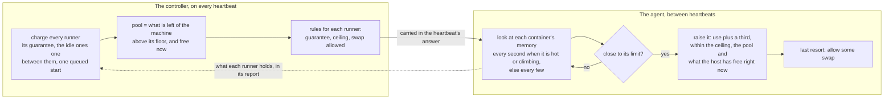

# Elastic memory

A runner is given a memory limit when it is created, and a job that needs more
than that is killed by the kernel the moment it asks: no warning, an exit code
of 137, and a failed job that GitHub records as an ordinary failure. Most of the
time the host the runner is on has gigabytes nobody was promised — a four-slot
machine with one busy runner is holding three runners' worth of memory for
three runners that are not using it. **Elastic memory** is the valve between
the two. It watches each runner's memory, and when a job is about to hit its
limit it raises the limit, out of what is spare on the host, before the kernel
has to choose.

Memory is not CPU, and the difference is the whole design. A CPU quota can be
lent and taken back a heartbeat later without anyone noticing; a memory limit
that is lowered kills the process that was holding the difference. So the valve
only ever **raises** a limit, what it lends stays with the runner until the
runner is gone, and the host's side of the arithmetic — what is spare, and what
the host keeps back for itself — is worked out with that in mind. [Elastic
CPU zoomies](elastic-cpu.md) is the page for the CPU half.

It is a pool setting, on in its watching form for every new container pool, and
nothing is lent until somebody turns it on.

## What it promises

* **A runner keeps what it was created with.** The valve adds to a limit and
  never takes from one. A runner that is lent nothing is exactly the runner it
  would have been without it.
* **Nothing promised to another runner is lent.** Busy and starting runners are
  charged their whole guarantee before a megabyte is lent to anyone. Idle
  runners — warm capacity waiting for a job — are charged the largest guarantee
  among them, because only one of them can be handed a job before the next
  plan, and a job that is queued for this host has one runner's worth held back
  as well.
* **The host keeps its floor.** Its own reserve, and a twentieth of the machine
  on top, stay free whatever is asked, because a loan that leaves the machine
  exactly as much room as it was measured to need is how a host gets into
  trouble itself. A loan is made out of memory the host measures as free *now*,
  not only out of memory the books say nobody promised.
* **A loan is never taken back.** Lowering a live limit is what kills the job a
  loan was meant to save, so there is no taking back: what a runner was lent it
  holds until it is removed, and the placement ledger charges the host for it,
  so the next runner sees the room the loan used. On an ephemeral pool — the
  default — that is one job. On a pool that reuses its runners, a loan outlives
  the job that needed it.
* **A restart does not kill a job.** The agent keeps the last rules it was sent,
  and acts on them while the controller is away. What each runner holds is read
  back from the container runtime rather than remembered.

## How it works

Two halves do the work, because they know different things.



The controller decides **how much the host as a whole may give away**. It does
not decide what each runner is to have, because a kernel that is about to kill
a compiler does not wait for a heartbeat thirty seconds away: the agent hands
the pool out as runners need it, one container at a time, inside the rules the
last heartbeat gave it. The one decision the agent makes for itself is the one
that cannot wait.

### The host's pool

A host's pool is what no runner's share needs and the host measures as free,
above a floor it keeps for itself.

| Line | Example: a 32 GB host, four 6 GB slots |
| --- | --- |
| The machine | 32768 MB |
| less the floor — the host's reserve, and a twentieth of the machine | − 3276 MB |
| less three busy runners' guarantees | − 18432 MB |
| less the largest idle runner's guarantee | − 6144 MB |
| less a queued start, if a compatible job is waiting | − 0 MB |
| **may be lent, by the ledger** | **4916 MB** |

If the host measures less free memory than the ledger allows — a page cache
that is not coming back, something else on the machine — the free memory is the
limit instead, and the host card says which of the two it was. What has been
lent already is part of the total and comes off what is left: after a runner is
lent 1216 MB, the pool above is 3700 MB.

### What the agent does for one container

How closely a container is watched follows how close it is. The agent looks every
second while a container is using seven tenths of its limit, or is gaining memory
fast enough to reach its limit within ten seconds at the pace of its last two
looks, and every five seconds otherwise. The pace is read as well as the share
because a raise leaves a container with a wide margin and so reading cold, while
the build that needed the raise may be climbing still, and a look five seconds on
would find it at its new limit. A job that goes from quiet to the end of its limit
between two looks is faster than anything polled, and is one of the kills [listed
below](#when-a-job-is-still-killed) that the valve cannot prevent.

A container's limit is kept a third above what it is using, rounded up to 64 MB,
which leaves room for the allocation a compiler makes between two looks. While
it is, nothing happens. When use climbs past that point the agent raises the
limit to restore the margin — by at least 128 MB where there is room for that
much, because a raise is a call to the daemon — and only as far as four things
allow, asked in the order an operator would fix them:

| What stopped the raise | The decision | What to do about it |
| --- | --- | --- |
| The runner already holds the most it may | `at_ceiling` | Raise the pool's [memory ceiling](#the-ceiling) — or the host's cap, if that is the lower of the two — or give each runner more to start with. |
| The host's pool is empty | `pool_empty` | The host's slots add up to its machine. Lower its capacity, give its runners a smaller share, or put this pool on a larger host. |
| The host's free memory is at its floor | `host_floor` | The same, or look for what else is using the machine. |
| The host's free memory could not be read | `unmeasured` | Nothing is lent: a loan that cannot be checked is not made. The valve is offered where the host's memory can be read, which is Linux. |

A raise that went through says `raised`; a container well inside its limit says
`healthy`. Two more codes are about the container runtime and not the host:
`unsupported`, a runtime that refused to change a limit that is already set —
it is not asked again — and `failed`, a refusal for any other reason, which is.
`failed` is also what a runner says when three looks in a row could not read its
memory from the runtime: a valve that cannot see a runner protects nothing, and
an observing pool's evidence would otherwise be an empty page that reads as a
quiet one.

Each decision carries its reason in plain words, with the numbers it had: *"raised
the limit from 6144 to 6656 MB: it was using 5400 MB"*, or *"it is using 7900 MB
of its 8192 MB limit and wants more, but the host has no spare memory left to
lend"*. The runner's page shows the latest one that was not `healthy`.

### Swap as the last resort

Swap turns a kill into a slowdown, and some operators would rather have the kill,
so a pool allows none until somebody says how much. When a container cannot be
raised any further — the ceiling, an empty pool, a host at its floor — and it is
using nine tenths of its limit, the agent lets it use swap beyond the limit, up
to the allowance the pool gives each container and no more than the host has
free. The job slows down instead of being killed, and the runner's page says it
may be using swap. It is the one thing the valve does that costs speed, which is
why it is a setting of its own and not part of "on".

### Docker-in-Docker, and folders kept in memory

A `dind` pool's runner and its sidecar are **one logical runner**: the ceiling
covers both and the loan is the pair's, but each container is looked at on its
own, because the build that is running out of memory is in one of them and not in
the sum.

A folder kept in memory is charged to the runner's memory limit, so it is what
the valve sees filling up. The valve raises the container's limit; it does not
resize a folder, whose size was fixed when the container was created, so a work
folder that fills to its own size is still full. What it prevents is the kernel
killing the container because the folder and the job together outgrew the limit.
[Keeping the work folder in memory](hosts-and-pools.md#keeping-the-work-folder-in-memory)
says what each folder costs.

## The three modes

| `memory_burst.mode` | What it does | Who gets it |
| --- | --- | --- |
| `off` | Nothing. Runners keep exactly what they were created with. | Every pool that existed before the valve did, and every pool on the `process` backend, which has no container to raise the limit of. An upgrade changes no running limit. |
| `observe` | Makes every decision above and records it, and changes nothing. The runner's page says what the valve *would* have lent. | Every new Docker or Podman pool, whatever its size is decided by. |
| `automatic` | Raises the limit of a running container, and says so. | A pool you have switched on, after watching `observe`. |

`observe` exists so that turning the valve on is a decision made with evidence.
A pool is observed the way it will be run: the agent keeps a virtual limit for
each runner that moves as an automatic one's would, and a pool of observers
shares the pool the way real borrowers would, so what it reports is what would
have happened. Leave a new pool on it for a few days, then read what it
published:

| Metric | What to look for |
| --- | --- |
| `zoomies_elastic_memory_near_limit_total{pool, mode}` | Runners that came within a tenth of a memory limit, once each. A pool that never moves this has no use for the valve, and can stay on `observe` for good. |
| `zoomies_elastic_memory_decisions_total{pool, mode, outcome}` | What the valve reported of each runner, once per heartbeat. Read `raised` against `pool_empty` and `host_floor`: a pool that wants memory and finds none is a pool whose hosts are too full for the valve to help, which a larger host or a smaller share fixes better than a higher ceiling. |

The mode is the operator's on every pool, **including the pools the controller
keeps** from your hosts: it is a policy, not a figure worked out from the
machines, and without that the pools most fleets run on would be the ones that
could never turn it on. A pool the controller makes starts on `observe` and an
existing one stays `off`, like any other.

### The ceiling

`max_memory_mb` is the most one logical runner may hold, its own share and what
it is lent together. Zero — the default — is half as much again as it starts
with, which is enough to turn most kills that a build just failed to fit under
into a job that finished, and little enough that one runaway job cannot take a
machine from the runners beside it. Set one for a pool whose jobs are known to
need more, or to keep one job from taking more than a given share of a host.

The ceiling is also never above the memory of the host, or of the daemon the
runner runs on where that is the smaller machine — a Docker Desktop or VM daemon
refuses a limit above its own memory outright, so a ceiling past it would be a
loan that fails every time — and never below what the runner started with, because
a ceiling under a runner's own share would be a request to take memory back.

A host can set a ceiling of its own, `burst_max_memory_mb` in its [runner
profile](hosts-and-pools.md#runner-profiles-how-big-a-runner-is-on-one-host),
for a machine whose owner wants a limit on how much of it one job may take
whatever the pool says. It is a cap: it lowers whatever the pool asked for — a
ceiling it named, or the default of half as much again — and never raises it, so
a host capped at 32 GB does not give a pool that left the figure alone 32 GB.

## Turning it on

In the pool editor, **Elastic memory** is in the Size section, a choice of three
with a ceiling and the swap it may fall back on beside it:

{ .zoomies-shot }
{ .zoomies-shot }

For a pool the controller keeps, **Settings** on the pool's page has the same
choice. From the command line:

```sh
zoomies pools edit pool_k3f9qz2m --memory-burst automatic
zoomies pools edit pool_k3f9qz2m --memory-burst-max 12288 --memory-burst-spill 2048
zoomies hosts edit hst_k3f9qz2m --burst-max-memory-mb 16384
```

Or over the API — `memory_burst` on a pool, `runner_profile.standard.burst_max_memory_mb`
on a host — which is the shape `zoomies pools export` writes and `import` reads:

```json
{ "memory_burst": { "mode": "automatic", "max_memory_mb": 12288, "spill_mb": 2048 } }
```

What it needs of a host is an agent that can raise a limit between heartbeats.
An agent that predates the valve, or that is not on Linux, is sent no rules and
a runner there keeps the memory it was created with; the pool editor names those
hosts beside the choice, and `pool.elastic_memory_unsupported` says it where the
pool is saved.

## What you see

**On the Runners page**, a runner the valve has something to say about wears a
small pill, and a runner whose pool keeps folders in memory wears another. The
pills are in the Memory column, under the figure — a column a narrow window
leaves out, in which case they are on the runner's page. Hover, focus, or tap a pill
for its card: what it means, the runner's memory as a bar and three figures
(guaranteed, current and ceiling), and the agent's own sentence for why.

{ .zoomies-shot }
{ .zoomies-shot }

| Pill | What is true |
| --- | --- |
| **+1.5 GB**, in the accent colour | The runner was lent 1.5 GB beyond what it was created with. A small dot on it means the runner wants more and cannot have it. |
| **Swap**, in the caution colour | The runner may also use swap past its limit: the last resort. |
| **At ceiling**, **Host full** | The runner wanted more and was refused, with no loan to show for it: it holds the most it may, or its host had no spare memory. |
| **Unmeasured**, **Unsupported**, **Raise failed** | The valve could not act on this runner: its host's memory could not be read, its runtime cannot change a live limit, or the runtime refused. |
| **~1.0 GB**, dashed | An `observe` pool's valve would have lent this much. Nothing was lent. |
| A folder and a clock, with a size | The runner was given its work folder and `/tmp` in memory, and the pill says what they come to. One icon for each folder that is in memory. |
| **On disk**, dashed | The pool asked for folders in memory and this runner was not given any, as its card says why. |

A runner the valve has nothing to say about wears nothing, so a pool that uses
none of this reads as the grid always has.

**On a runner's page** the same pills sit beside its status, and a **Memory and
folders** panel draws the cards open. Under **Resource usage**, the memory figure
is measured against what the runner may hold now, with the loan counted: *4.9 GB
of 5.5 GB allowed, 1.5 GB of it lent*.

**On a host's card**, **Memory to lend** is the pool as a bar drawn against the
whole machine — what is promised, what the host keeps back, what is lent, and
what is left — with the ledger behind it, line by line, in the card that opens
from it on hover, focus or a tap. A host that has refused a runner memory in the
last quarter of an hour says when, and why.

**In the problems drawer**, three codes say where the valve is short, each with
what to change:

| Code | Raised when |
| --- | --- |
| `host.memory_pool_exhausted` | A runner on a host needed memory and the host had none to lend. |
| `pool.memory_ceiling_reached` | A runner held everything it may be lent and still wanted more. |
| `pool.elastic_memory_unsupported` | A pool has the valve on and some host it can land on cannot carry it out. |

**In Prometheus**, the two series above, and `zoomies_host_memory_pool_bytes` and
`zoomies_host_memory_lent_bytes` for each host. There is no per-runner label, on
purpose: a fleet makes and destroys thousands of runners.

## When a job is still killed

A job that is killed on a pool with the valve says whether it was in play. The
explanation on the job ends with one of three sentences:

* *The memory valve had lent it 1.5 GB on top of its 4 GB, so it held 5.5 GB
  when it was killed* — it was given what the pool allowed and it was not
  enough. Raise the ceiling, or give each runner more to start with.
* *The memory valve was on for this pool and lent it nothing: …* followed by
  why — the host had none to spare, or the runner was at its ceiling. The fix is
  the one in the decision table above.
* *The memory valve was only observing for this pool, so it lent nothing; it
  would have given the runner up to 1 GB more* — the evidence that turning it
  on would have saved the job.

A kill is still possible with the valve on, and some are not its to prevent. A
spike faster than the margin between two looks can reach the old limit, which
is a limit of the idea and not something a faster poll fixes. A job that needs
more than the machine has needs a bigger machine. And a runner on a host whose
agent cannot carry the valve out is, for this, exactly what it was.

## What it does not do

* It does not move the `process` backend: a plain process has no container limit
  to raise.
* It does not lend CPU. That is [elastic CPU](elastic-cpu.md), which can take
  what it lends back, and which is judged on a host's busyness where this is
  judged on its free memory.
* It does not take a loan back, shrink a folder or free a page cache. What it
  adds is the one thing it can: a higher limit on a container that is still
  running.
