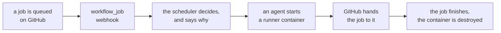

---
hide:
  - navigation
  - toc
---

<div class="zoomies-hero" markdown>

{ .off-glb }

<p class="tagline">Off the lead, on the job.</p>

<p class="lede">
A lightweight, self-hosted GitHub Actions runner fleet controller. Ephemeral
runners by default, GitHub App auth, webhook-driven autoscaling, multi-host
agents, a live web UI, and a one-line installer. Single Go binary, SQLite, no
Kubernetes.
</p>

<div class="zoomies-install" markdown>

```sh
curl -fsSL https://zoomies.sh/install.sh | sh
```

</div>

<ul class="pills">
  <li>Open source</li>
  <li>Self-hosted</li>
  <li>MIT licensed</li>
</ul>

</div>

Point Zoomies at a GitHub organisation. It watches for queued jobs, starts a
fresh runner for each one, and destroys the runner when the job finishes.



<div class="zoomies-grid" markdown>

<div markdown>
### Ephemeral by default
One job per runner, then the container is gone. Nothing leaks from one workflow
run to the next — not a clone, not a cache, not a credential.
</div>

<div markdown>
### No pasted tokens
Zoomies authenticates as a GitHub App and mints single-use JIT registrations
itself. There is no long-lived token sitting in a dotfile beside a runner.
</div>

<div markdown>
### Event-driven
`workflow_job` webhooks, with polling only as a fallback — so a misconfigured
webhook slows your fleet down instead of silently stopping it.
</div>

<div markdown>
### Multi-host
One controller, any number of agents. Agents only ever connect outbound, so a
host behind NAT needs no inbound firewall rule.
</div>

<div markdown>
### Actually observable
SQLite for state, Prometheus metrics, structured logs, live log streaming, job
history with queue waits, and an audit row for every mutating action.
</div>

<div markdown>
### Safe by default
Loopback bind, authentication on, no Docker socket in your jobs, no root. Every
deviation is named at startup and in the UI's problems panel.
</div>

<div markdown>
### One pull request per repository
The migration wizard rewrites `runs-on` across your repositories and opens a
pull request on each one — after showing you the exact diff, and only for the
jobs it is sure about. [How it works](migration.md).
</div>

</div>

## Five minutes to a running fleet

The installer detects your OS, architecture, container runtime and init system,
then walks you through the rest: service user, encryption key, backend, TLS, the
GitHub App — created for you through the manifest flow with exactly the
permissions Zoomies needs — and your first admin account.

```sh
curl -fsSL https://zoomies.sh/install.sh | sh
```

Prefer to read it first? That is the intended way, and the script is written to
be read:

```sh
curl -fsSLO https://zoomies.sh/install.sh
less install.sh
sh install.sh
```

It can deploy three ways — the binary under systemd, a `docker compose` stack
with a fully populated `.env`, or a single container — and it will only offer
the ones your host can actually run. See the [quick start](quickstart.md).

## Why not something else

Zoomies is what you want when
[ARC](https://github.com/actions/actions-runner-controller) is too much
machinery — you have a VM or three, not a cluster — but a handful of
hand-registered long-lived runners is too little.

| | ARC | A few static runners | Zoomies |
| --- | --- | --- | --- |
| Needs Kubernetes | yes | no | no |
| Ephemeral runners | yes | rarely | default |
| Autoscaling | yes | no | yes |
| Multi-host | yes | no | yes |
| Auth model | GitHub App | a PAT per runner | GitHub App |
| Web UI | no | sometimes | yes |
| Audit log | no | no | yes |
| To install | Helm, CRDs, a cluster | manual | one command |

## A word about self-hosted runners

A self-hosted runner executes code from your repositories, and on a public
repository that means anyone who can open a pull request. GitHub's own guidance
is blunt about this, and Zoomies does not change it. What it does is make the
blast radius of each execution as small as it reasonably can:

- one job per runner, then the container is destroyed;
- no reusable registration credential on the host;
- no Docker daemon reachable from the job unless you explicitly ask for one;
- a non-root user, dropped capabilities, `no-new-privileges`.

Every setting that trades any of that away is named at startup, listed in the
UI, and documented in [Security](security.md) with what it actually costs you.
