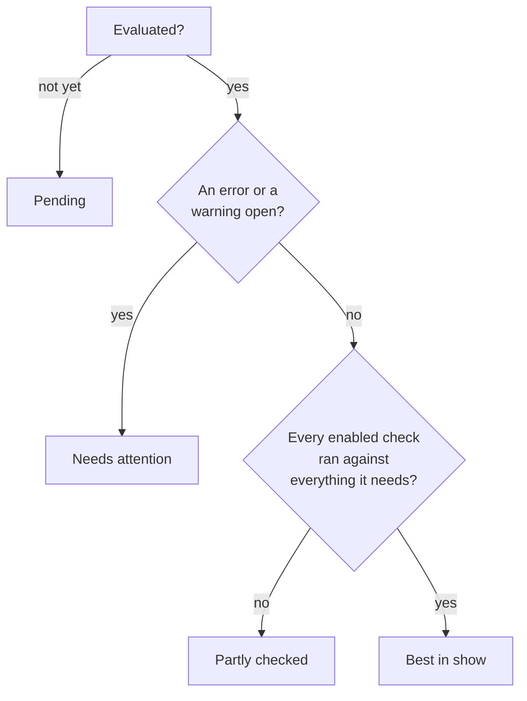

# Kennel Club

Kennel Club looks at the repositories your fleet serves and says which of them
could hurt the fleet or stop its CI. It answers one question about each
repository, and a check that cannot answer it does not belong here:

> Does this affect running CI, or the fleet that runs it?

So it is not a linter, and it has no opinion about your code. It says that a
public repository's jobs run on a pool a stranger's pull request could damage,
and that jobs have been waiting ten minutes for a label no pool serves.

It is **off by default**, and off means off: nothing is read from GitHub,
nothing is stored, and [AI Context](ai-context.md) carries on exactly as it was.
Turn it on with the **Check repository standards** setting
(`kennel.enabled`, see [Configuration](configuration.md)), and it appears in the
UI under **Kennel Club**.

## What it checks

There are six checks, in two areas. Each has a stable code, so a waiver, a
metric or a `disabled_checks` entry keeps meaning the same thing from one
release to the next.

| Code | Usual severity | Detects |
| --- | --- | --- |
| `exposure.public_repo_on_fleet` | warning | A public repository ran jobs on this fleet, or has jobs waiting for it. |
| `exposure.public_repo_weak_pool` | error | The pool that ran a public repository's jobs is persistent, mounts the host Docker socket, gives its jobs a privileged Docker daemon, runs as root or uses no container. |
| `exposure.fork_code_ran` | error | A run from a fork's pull request executed on this fleet. |
| `exposure.target_event_ran` | warning | A workflow that strangers can trigger (`pull_request_target`, `workflow_run`, `issue_comment`, `issues`) ran on this fleet in a public repository. |
| `capacity.unserved_label` | warning | Jobs waited more than ten minutes for a label no pool serves. |
| `capacity.job_hit_default_limit` | warning | A job ran until GitHub stopped it at its six-hour default limit. |

**Exposure** is about strangers. Code from outside your project should never
run on a machine that keeps state between jobs, can reach the host's Docker
daemon, or sits somewhere you would mind losing. A public repository on a
self-hosted runner is the textbook way to hand a stranger a shell on your
network, which is why the weak-pool and fork checks are errors and the
softer two are warnings.

**Capacity** is about the fleet failing the people who use it. A job waiting for
a label no pool serves will wait for ever, and a job that runs for six hours is
usually stuck and not slow. Neither is a security problem, and both stop CI.

Each finding is written for the repository it is about: what is wrong, what to
change, the pools and runs involved, and where to look. The sentences come from
Kennel Club and never from the repository, so a pull request title or a branch
name cannot put words into an operator's page.

**One finding can be worse than its usual severity.** On its own,
`exposure.public_repo_on_fleet` is a warning: a public repository using your
fleet is a fact to know, and often a deliberate one. When
`exposure.public_repo_weak_pool` or `exposure.fork_code_ran` is open beside it,
it is raised to an **error**, because a stranger can already reach something
that matters. The raising happens before waivers are applied, so a waiver of the
milder finding does not quietly cover the worse one.

The same table is served by `GET /api/v1/kennel/checks`, so a script can read
what is checked without scraping this page.

## How to read a repository's standing

Every repository is in one of four standings, and the badge never says more than
it knows.

| Standing | Plain words (Status style Off) | Means |
| --- | --- | --- |
| **Best in show** | No open findings | Every check that is turned on ran against everything it needs, and nothing worse than a note is open. |
| **Needs attention** | Needs attention | An error or a warning is open. It outranks *Partly checked*, so an open error is never hidden behind "we could not read everything". |
| **Partly checked** | Partly checked | Nothing is open, but something could not be read, so this is **not an all clear**. |
| **Pending** | Pending | Kennel Club has not looked at the repository yet. |

*Best in show* is a playful name for a serious claim, and it is earned the
hard way. A repository that could not be fully read is not the best of
anything, a repository with every check turned off is never given the badge,
and a finding that is only a note does not take it away. A waived finding does
not take it away either, but it is never hidden: the Overview counts the waived
findings beside the badge.

The dog-park name is the **Status style** in **Settings → Appearance**: with it
on *Cute* or *Standard* the badge says *Best in show*, and with it *Off*, which
is where a browser that has never chosen starts, it says *No open findings*.
What it means is the same either way.

One more thing looks like a standing and is not one: **Not tracked** means
somebody told Kennel Club not to look at the repository. See
[Stopping Kennel Club looking at a repository](#stopping-kennel-club-looking-at-a-repository).

## What it reads

Every check names the facts it needs, and a check whose facts cannot be read is
**skipped and says why**. It is never judged against half the picture.

| Source | What it is | Permission it needs |
| --- | --- | --- |
| **What this fleet observed** | Which pool ran a job, which label nothing served, how long a job ran. Already in Zoomies' database. | None. It costs no GitHub request and is always readable. |
| **Repository details** | The repository's own record, above all whether it is public. | *Repository permissions: Metadata: Read-only* |
| **Workflow runs** | What triggered the runs this fleet ran, and which repository they came from. Read for **public repositories only**. | *Repository permissions: Actions: Read-only* |

A source can be in one of these states, and the Kennel Club page shows it beside
the repository it affects:

* **Read in full.** The usual case.
* **Partly read.** A page cap was reached, or the read was a sample. A finding
  found in a partial read stands, but finding nothing is not an all clear.
* **Not permitted.** GitHub refused for want of a permission the installation
  has not been given. The page names the permission. If you chose not to grant
  it, that is a choice and not a fault, so it is shown on the repositories it
  affects and does not become a problem.
* **Not available.** This GitHub does not offer it, or the repository does not
  have it. Never a finding.
* **Held back.** Reads are paused for this installation, either because GitHub
  rate-limited it or because Kennel Club has spent what its budget allows this
  hour.
* **Failed.** A transient failure, tried again at the next refresh.

A private repository costs no read beyond the repository listing Zoomies already
makes, because the checks that need run history are about public repositories.

### Every GitHub request it may make

The reader is held to a list, and a test runs it against a fake GitHub and fails
on any request that is not on the list, so a new call is a visible change in
review and not something found in a log. All of them are `GET`s.

| Request | What for |
| --- | --- |
| `GET /installation/repositories` | The repositories the App can see, which Zoomies already lists. A refresh GitHub answers "not modified" costs nothing against the rate limit. |
| `GET /repos/{owner}/{repo}` | One repository's own record: whether it is public. |
| `GET /repos/{owner}/{repo}/actions/runs/{run}` | One workflow run the fleet ran in a public repository. **Four fields are read**: the event that triggered it (held to a short allow-list before anything sees it), the repository it ran in, and the repository its head commit is in, which differ for a pull request from a fork, and the run's ID. Who triggered it, its branch, its title and its workflow's path are written by whoever opened the pull request, and are never read. |
| `GET /orgs/{org}/actions/runner-groups` | Whether the organisation runner group a pool joins allows public repositories, so a finding can say so. |
| `GET /rate_limit` | The limit the installation reports, which the budget is a share of. GitHub does not count this request against the limit. |

## What it never does

* **It reads and does not write.** In this release Kennel Club makes no change
  to GitHub, to a pool, to a runner or to a job. A finding is advice.
* **It reads no source code.** It looks at who ran what, where, and how long a
  job took. AI Context is the part of Zoomies that reads source, and Kennel Club
  does not touch it, which is also why turning one off leaves the other alone.
* **It does not repeat a stranger's words.** The text of a finding is written by
  the check, from a fixed set of sentences. Anything in a repository that a
  stranger could write, such as a branch name, a pull request title or a
  workflow name, is kept out of the sentences, and a test fails if one gets in.
* **It does not starve scaling of GitHub requests.** Registering runners and
  scaling use the same rate limit. Kennel Club never starts a read for an
  installation GitHub has rate-limited, it spends at most
  `kennel.api_budget_percent` (5 to 50 per cent, 20 by default) of the limit
  that installation last reported, and it stops altogether when less than half
  of the limit is left. A read GitHub answers with "not modified" costs
  nothing against the limit, so a refresh that finds nothing changed is free.

## Choosing what it looks at

`kennel.scope` says which repositories it checks:

* **`served`** (the default) checks the repositories this fleet has run a job
  for. A repository nobody has used you for has nothing to say about your fleet.
* **`installation`** checks every repository the GitHub App can see, which also
  finds the ones that *could* send you a job but have not yet.

`kennel.refresh_interval` is how stale what Kennel Club read from GitHub may get
before it is read again. What your own fleet observed is not subject to it: that
is re-checked as the fleet changes, and costs GitHub nothing.

### Turning a check or an area off

`kennel.disabled_checks` takes check codes (`exposure.fork_code_ran`) or whole
areas (`exposure`, `capacity`). A misspelt name is refused when you save it,
because a name that matches nothing would leave running the check you meant to
turn off.

A check that is turned off is **shown as turned off**, not hidden, so nobody
reads its silence as a clean bill of health. And a repository with every check
turned off is never given the *Best in show* badge.

## Waiving a finding

Some findings are decisions you have made. A repository that deliberately runs
public jobs on a disposable pool has a finding for it, and you may be content
with that. A **waiver** records the decision, instead of hiding the finding.

* **It needs a reason**, of at least ten and at most five hundred characters,
  because whoever reads the audit log in a year will want to know why.
* **It needs an end**, at most a year away. A decision nobody is asked to make
  again is how an exception becomes the rule.
* **It names who decided**, and it is in the audit log.
* **It is never hidden.** A waived finding is listed under **Waived** with who
  decided, why and until when, and the Overview counts it.
* **It comes back by itself if it gets worse.** A waiver covers the finding at
  the severity it had when it was made, so a warning waived last month does not
  excuse the error it has since become.

Waiving an **error** is an administrator's decision. An operator can waive a
warning or a note. Any operator can end a waiver, since ending one only makes
Kennel Club stricter.

## Stopping Kennel Club looking at a repository

Every repository is **tracked** until somebody says otherwise. A scratch
repository that runs public jobs on purpose, or one that is archived in all but
name, can be told to be left alone. On the repository's page, **Track this
repository** is a switch.

* **An administrator stops it**, and is asked for a reason first, in the same
  length a waiver's is held to: stopping silences the repository's errors, so
  whoever finds it quiet in a year will want to know why.
* **An operator starts it again** with one press and no reason, because that can
  only make Kennel Club stricter. Anybody else sees the state and who can
  change it, instead of a switch that would answer 403.
* **A repository that is not tracked is not read and nothing is evaluated for
  it.** It has no findings, raises no problem, is counted on the Overview as
  **Not tracked** and in no other number, and has no *Recheck*. Having no
  findings is not an all clear, and its page says so.
* **Its waivers are kept** and do nothing until it is tracked again.
* **It is kept however long it has been quiet.** A repository nobody has run a
  job for in ninety days is normally forgotten, but not one somebody chose to
  stop, so a sandbox does not come back tracked, and read, the day somebody
  pushes to it.

The repository list leaves untracked repositories out unless you ask for them,
so that a card's number and the rows behind it agree. The **Tracking** filter
brings them back.

## Where it shows up

* **The UI.** Under **Kennel Club** in the side menu: the **Overview** (how many
  repositories are in each standing, what is open by severity, and which to open
  first), **Repositories** (the list, narrowed by standing, severity, check and
  tracking, every filter in the address so that a view is a link to send), and
  each repository's own page, with an **Overview** of what the fleet knows, a
  **CI** tab with Kennel Club's findings and a tab for its **AI Context**. See
  [the UI, page by page](ui.md#kennel-club) for each page.
* **Problems.** Two kinds reach the problems list, and no others:
  `kennel.exposure`, one problem for the fleet with the count of repositories
  that have an open, unwaived *error* in its title and none of them named, and
  `kennel.unavailable`, which says Kennel Club has been unable to read an
  installation for six hours. A warning on its own raises nothing: it appears in
  Kennel Club and nowhere else. See [problem codes](problem-codes.md).
* **The API.** `GET /api/v1/kennel` and the routes beneath it, and two event
  kinds on the stream. See [the API](api-surface.md#kennel-club).
* **Assistants.** The `kennel_overview`, `kennel_repository` and `kennel_findings`
  tools, which read the same API and can do nothing the caller's token could
  not. See [Connect Claude](connect-claude.md).
* **Metrics.** `zoomies_kennel_*` counters: findings opened, closed and waived
  by check, GitHub requests by outcome, and rate-limit holds. See
  [metrics](metrics.md).

## Roles

| Can | Role |
| --- | --- |
| Read everything above | viewer |
| Recheck a repository, waive a warning or a note, end a waiver, start tracking again | operator |
| Waive an error, stop tracking a repository | administrator |

Tokens carry the same split in scopes, so a token can be allowed to waive
warnings without being allowed to waive errors.

## Turning it off again

Set `kennel.enabled` back to false. It stops reading at once, and the stored
evaluations are kept, so turning it on again does not start from nothing. While
it is off the UI says so and shows nothing as if it were a verdict, and nothing
Kennel Club raised stays in the problems list.
