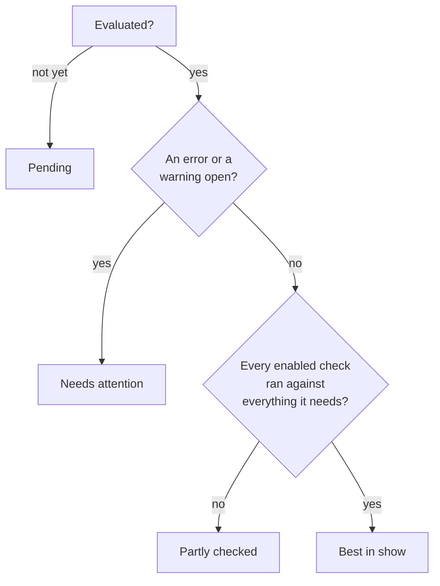

# Kennel Club

Kennel Club looks at the repositories your fleet serves and says which of them
could hurt the fleet or stop its CI. It answers one question about each
repository, and a check that cannot answer it does not belong here:

> Does this affect running CI, or the fleet that runs it?

So it is not a linter, and it has no opinion about your code. It says that a
public repository's jobs run on a pool a stranger's pull request could damage,
and that jobs have been waiting ten minutes for a label no pool serves.

One optional area bends that rule, and says so: the **setup** checks report what
a repository lacks that makes it harder to maintain, such as a README or a
security policy. They are off until you turn them on, and informational when they
are on. See [the optional checks](#the-optional-checks).

It is **off by default**, and off means off: nothing is read from GitHub,
nothing is stored, and [AI Context](ai-context.md) carries on exactly as it was.
Turn it on with the **Check repository standards** setting
(`kennel.enabled`, see [Configuration](configuration.md)), and it appears in the
UI under **Kennel Club**. This is its Overview for the demo fleet:

{ .zoomies-shot }
{ .zoomies-shot }

## What it checks

There are twenty checks, in five areas. Six of them, in **exposure** and
**capacity**, run whenever Kennel Club is on; the other fourteen are opt-in,
and [the switches that turn them on](#the-optional-checks) are described after
them. Each has a stable code, so a waiver, a metric or a `disabled_checks`
entry keeps meaning the same thing from one release to the next, and the same
codes are published with every problem code in
[`catalog.json`](https://zoomies.sh/catalog.json) and served by a running
controller at `GET /api/v1/catalog`, each with what to change and how to see
that it worked.

The list below is generated from the registry the evaluator runs by
`make generate`, so it cannot disagree with what a repository's page shows,
and a test fails the build when a check is added without it being run.

<!-- zoomies:catalogue-begin -->

#### `exposure.public_repo_on_fleet` { #exposure-public_repo_on_fleet }

Area
:   exposure

Severity
:   warning

Detects
:   A public repository ran jobs on this fleet, or has jobs waiting for it.

Fix
:   Decide whether this fleet should run a public repository's jobs at all; if it should, keep them on an ephemeral pool with no host socket, no privileged daemon and no root, so a stranger's pull request cannot reach the host.

Verify
:   Press Recheck once the pool is ephemeral and unprivileged, or once the repository no longer sends jobs here; the finding closes when the next read sees neither.

#### `exposure.public_repo_weak_pool` { #exposure-public_repo_weak_pool }

Area
:   exposure

Severity
:   error

Detects
:   The pool that ran a public repository's jobs is persistent, mounts the host Docker socket, gives its jobs a privileged Docker daemon, runs as root or uses no container.

Fix
:   Move the public repository's jobs to a pool that is ephemeral, does not mount the host Docker socket, runs no privileged daemon and does not run as root, or make this pool so.

Verify
:   Press Recheck after the pool's settings change; the finding closes when every run of the repository in the window landed on a pool without those settings.

#### `exposure.fork_code_ran` { #exposure-fork_code_ran }

Area
:   exposure

Severity
:   error

Detects
:   A run from a fork's pull request executed on this fleet.

Fix
:   Require approval for workflows from fork pull requests in the repository's Actions settings, or stop routing its pull-request jobs to this fleet.

Verify
:   Press Recheck after the setting changes; the finding closes once no run from a fork's pull request has executed here in the window.

#### `exposure.target_event_ran` { #exposure-target_event_ran }

Area
:   exposure

Severity
:   warning

Detects
:   A workflow that strangers can trigger (pull_request_target, workflow_run, issue_comment, issues) ran on this fleet in a public repository.

Fix
:   Read the workflows these events trigger and make sure none of them checks out or executes the pull request's own code; if one must, run it on an isolated, ephemeral pool.

Verify
:   Press Recheck once the workflow has been reviewed or moved; the finding closes when no run for those events has executed here in the window.

#### `capacity.unserved_label` { #capacity-unserved_label }

Area
:   capacity

Severity
:   warning

Detects
:   Jobs waited more than ten minutes for a label no pool serves.

Fix
:   Add the label to a pool that can run the job, or change the workflow's runs-on to a label a pool serves.

Verify
:   Press Recheck after the pool or the workflow changes; the finding closes once no job has waited ten minutes for an unserved label in the last seven days.

#### `capacity.job_hit_default_limit` { #capacity-job_hit_default_limit }

Area
:   capacity

Severity
:   warning

Detects
:   A job ran until GitHub stopped it at its six-hour default limit.

Fix
:   Set timeout-minutes on the job from its own usual duration, so a hung run is stopped in minutes rather than hours.

Verify
:   Press Recheck after the next run of the job; the finding closes once no run in the window was cancelled at the six-hour limit.

#### `setup.readme` { #setup-readme }

Area
:   setup

Severity
:   info

Detects
:   No repository-local README was found on the default branch.

Fix
:   Add a README with the project purpose, prerequisites and the commands to build, test and run it.

Verify
:   Press Recheck once the file is on the default branch; the finding closes when the next tree read finds it.

#### `setup.licence` { #setup-licence }

Area
:   setup

Severity
:   info

Detects
:   No repository-local licence was found on the default branch.

Fix
:   Choose an appropriate licence with the project owner and record it in a root licence file.

Verify
:   Press Recheck once the file is on the default branch; the finding closes when the next tree read finds it.

#### `setup.security` { #setup-security }

Area
:   setup

Severity
:   info

Detects
:   No repository-local security policy was found on the default branch.

Fix
:   Add SECURITY.md with a private reporting route and supported versions, or confirm that the account default provides them.

Verify
:   Press Recheck once the file is on the default branch; the finding closes when the next tree read finds it.

#### `setup.contributing` { #setup-contributing }

Area
:   setup

Severity
:   info

Detects
:   No repository-local contribution guide was found on the default branch.

Fix
:   Add CONTRIBUTING.md with setup, test and pull request guidance, or confirm that the account default provides it.

Verify
:   Press Recheck once the file is on the default branch; the finding closes when the next tree read finds it.

#### `setup.code_of_conduct` { #setup-code_of_conduct }

Area
:   setup

Severity
:   info

Detects
:   No repository-local code of conduct was found on the default branch.

Fix
:   Add CODE_OF_CONDUCT.md with an enforcement contact, or confirm that the account default provides it.

Verify
:   Press Recheck once the file is on the default branch; the finding closes when the next tree read finds it.

#### `setup.issue_template` { #setup-issue_template }

Area
:   setup

Severity
:   info

Detects
:   No repository-local issue template was found on the default branch.

Fix
:   Add an issue form or template under .github/ISSUE_TEMPLATE, or confirm that account defaults provide one.

Verify
:   Press Recheck once the file is on the default branch; the finding closes when the next tree read finds it.

#### `setup.pull_request_template` { #setup-pull_request_template }

Area
:   setup

Severity
:   info

Detects
:   No repository-local pull request template was found on the default branch.

Fix
:   Add a pull request template with a change summary and validation prompts, or confirm that the account default provides one.

Verify
:   Press Recheck once the file is on the default branch; the finding closes when the next tree read finds it.

#### `setup.codeowners` { #setup-codeowners }

Area
:   setup

Severity
:   info

Detects
:   No repository-local CODEOWNERS file was found on the default branch.

Fix
:   Add CODEOWNERS in .github, the repository root or docs and assign owners for the CI workflows; review enforcement separately.

Verify
:   Press Recheck once the file is on the default branch; the finding closes when the next tree read finds it.

#### `setup.dependency_updates` { #setup-dependency_updates }

Area
:   setup

Severity
:   info

Detects
:   No repository-local dependency update configuration was found on the default branch.

Fix
:   Configure Dependabot or Renovate for the package ecosystems and GitHub Actions, or confirm that an external service manages updates.

Verify
:   Press Recheck once the file is on the default branch; the finding closes when the next tree read finds it.

#### `setup.workflows` { #setup-workflows }

Area
:   setup

Severity
:   info

Detects
:   No repository-local CI workflow was found on the default branch.

Fix
:   Add a workflow under .github/workflows that runs the relevant build and tests, or confirm that CI is provided elsewhere.

Verify
:   Press Recheck once the file is on the default branch; the finding closes when the next tree read finds it.

#### `ci.no_timeout` { #ci-no_timeout }

Area
:   ci

Severity
:   warning

Detects
:   Executable jobs have no timeout-minutes.

Fix
:   Set timeout-minutes on each executable job in the default-branch workflows, from its usual duration with a margin for a slow run.

Verify
:   Press Recheck after the change reaches the default branch; the finding closes when every executable job declares a timeout.

#### `ci.no_concurrency` { #ci-no_concurrency }

Area
:   ci

Severity
:   info

Detects
:   Pull-request-only workflows do not cancel superseded runs at workflow or job level.

Fix
:   Where a superseded pull-request run may be cancelled, add a concurrency group scoped to the workflow and the pull request with cancel-in-progress on.

Verify
:   Press Recheck after the change reaches the default branch; the finding closes when every pull-request-only workflow cancels superseded runs.

#### `ci.action_not_pinned` { #ci-action_not_pinned }

Area
:   ci

Severity
:   warning

Detects
:   External actions or reusable workflows use mutable refs, or Docker actions use no image digest.

Fix
:   Pin every external action and reusable workflow to a reviewed full commit, and every Docker action to an image digest, and let an updater move the pins.

Verify
:   Press Recheck after the change reaches the default branch; the finding closes when no external reference is a tag or a branch.

#### `token.permissions_unset` { #token-permissions_unset }

Area
:   token

Severity
:   warning

Detects
:   Jobs inherit token permissions without a declaration at workflow or job level.

Fix
:   Declare the least permissions each workflow or job needs, after reading what its actions and publishing steps use.

Verify
:   Press Recheck after the change reaches the default branch; the finding closes when every job has a permissions block of its own or its workflow's.

<!-- zoomies:catalogue-end -->

**Exposure** is about strangers. Code from outside your project should never
run on a machine that keeps state between jobs, can reach the host's Docker
daemon, or sits somewhere you would mind losing. A public repository on a
self-hosted runner is the textbook way to hand a stranger a shell on your
network, which is why the weak-pool and fork checks are errors and the
softer two are warnings.

**Capacity** is about the fleet failing the people who use it. A job waiting for
a label no pool serves will wait for ever, and a job that runs for six hours is
usually stuck and not slow. Neither is a security problem, and both stop CI.

Each finding is written for the repository it is about: what is wrong, what to
change, the pools and runs involved, and where to look. The sentences come from
Kennel Club and never from the repository, so a pull request title or a branch
name cannot put words into an operator's page.

The whole registry, all twenty, is served by `GET /api/v1/kennel/checks`, so a
script can read what is checked without scraping this page.

**One finding can be worse than its usual severity.** On its own,
`exposure.public_repo_on_fleet` is a warning: a public repository using your
fleet is a fact to know, and often a deliberate one. When
`exposure.public_repo_weak_pool` or `exposure.fork_code_ran` is open beside it,
it is raised to an **error**, because a stranger can already reach something
that matters. The raising happens before waivers are applied, so a waiver of the
milder finding does not quietly cover the worse one. On acme/site the first
finding below is an error because the second is open beside it, and each says
what to change:

{ .zoomies-shot }
{ .zoomies-shot }

### The optional checks

Fourteen checks read what is in a repository. Each group has a switch of its own
and is **off by default**. Until a switch is on, its checks are shown as **Turned
off** on the Overview, and nothing is read for them.

| Area | Checks | Turned on by | What it reads | What a finding is |
| --- | --- | --- | --- | --- |
| `setup` | 10: a README, a licence, a security policy, a contribution guide, a code of conduct, issue and pull request templates, `CODEOWNERS`, dependency updates and a CI workflow | `kennel.repository_setup` (**Check repository setup**) | The default branch's file names, as one Git tree request for each repository. No file contents. | Informational. It never lowers a repository's standing. |
| `ci` | 3: `ci.no_timeout`, `ci.no_concurrency`, `ci.action_not_pinned` | `kennel.workflow_checks` (**Check workflow best practices**) | The default branch's workflow files. | A warning, except `ci.no_concurrency`, which is a note, as is `ci.action_not_pinned` when only GitHub's own actions are affected. |
| `token` | 1: `token.permissions_unset` | the same switch | The same files. | A warning for a public repository, a note for a private one. |

A setup finding says **repository-local**, because an account's default guidance
may stand in for a file the repository does not have, and a missing file is
advice, not proof. Empty files and symlinks do not count as present. A tree
GitHub truncates leaves the repository **partly checked** and produces no
"missing" finding, and so does a workflow file that is too large or too odd to
read: findings from the files that were read stay, but the repository cannot earn
an all clear.
[Configuration](configuration.md#repository-setup-advice) lists each setup check
and what its absence makes harder, and
[the workflow checks](configuration.md#workflow-best-practice-checks) say what
each detects and what is excluded.

## How to read a repository's standing

Every repository is in one of four standings, and the badge never says more than
it knows.

| Standing | Plain words (Status style Off) | Means |
| --- | --- | --- |
| **Best in show** | No open findings | Every check that is turned on ran against everything it needs, and nothing worse than a note is open. |
| **Needs attention** | Needs attention | An error or a warning is open. It outranks *Partly checked*, so an open error is never hidden behind "we could not read everything". |
| **Partly checked** | Partly checked | Nothing is open, but something could not be read, so this is **not an all clear**. |
| **Pending** | Pending | Kennel Club has not looked at the repository yet. |

*Best in show* is a playful name for a serious claim, and it is earned the
hard way. A repository that could not be fully read is not the best of
anything, a repository with every check turned off is never given the badge,
and a finding that is only a note does not take it away. A waived finding does
not take it away either, but it is never hidden: the Overview counts the waived
findings beside the badge.

The dog-park name is the **Status style** in **Settings → Appearance**: with it
on *Cute* or *Standard* the badge says *Best in show*, and with it *Off*, which
is where a browser that has never chosen starts, it says *No open findings*.
What it means is the same either way.

One more thing looks like a standing and is not one: **Not tracked** means
somebody told Kennel Club not to look at the repository. See
[Stopping Kennel Club looking at a repository](#stopping-kennel-club-looking-at-a-repository).

## What it reads

Every check names the facts it needs, and a check whose facts cannot be read is
**skipped and says why**. It is never judged against half the picture.

| Source | What it is | Permission it needs |
| --- | --- | --- |
| **What this fleet observed** | Which pool ran a job, which label nothing served, how long a job ran. Already in Zoomies' database. | None. It costs no GitHub request and is always readable. |
| **Repository details** | The repository's own record, above all whether it is public. | *Repository permissions: Metadata: Read-only* |
| **Workflow runs** | What triggered the runs this fleet ran, and which repository they came from. Read for **public repositories only**. | *Repository permissions: Actions: Read-only* |
| **Repository setup files** | The default branch's file names. Read only when `kennel.repository_setup` is on. | *Repository permissions: Contents: Read-only*, needed for private repositories |
| **Workflow best practices** | The default branch's workflow files, read for timeouts, concurrency, action pins and token permissions. Read only when `kennel.workflow_checks` is on. | *Repository permissions: Contents: Read-only*, needed for private repositories |

A source can be in one of these states, and the Kennel Club page shows it beside
the repository it affects:

* **Read in full.** The usual case.
* **Partly read.** A page cap was reached, or the read was a sample. A finding
  found in a partial read stands, but finding nothing is not an all clear.
* **Not permitted.** GitHub refused for want of a permission the installation
  has not been given. The page names the permission. If you chose not to grant
  it, that is a choice and not a fault, so it is shown on the repositories it
  affects and does not become a problem.
* **Not available.** This GitHub does not offer it, or the repository does not
  have it. Never a finding.
* **Held back.** Reads are paused for this installation, either because GitHub
  rate-limited it or because Kennel Club has spent what its budget allows this
  hour.
* **Failed.** A transient failure, tried again at the next refresh.

A private repository costs no read beyond the repository listing Zoomies already
makes, because the checks that need run history are about public repositories.
The two opt-in sources are the exception: with either on, a private repository's
tree is read too, which is why they ask for *Contents*.

### Every GitHub request it may make

The reader is held to a list, and a test runs it against a fake GitHub and fails
on any request that is not on the list, so a new call is a visible change in
review and not something found in a log. All of them are `GET`s, and the last two
are made only when one of the opt-in switches is on.

| Request | What for |
| --- | --- |
| `GET /installation/repositories` | The repositories the App can see, which Zoomies already lists. A refresh GitHub answers "not modified" costs nothing against the rate limit. |
| `GET /repos/{owner}/{repo}` | One repository's own record: whether it is public. |
| `GET /repos/{owner}/{repo}/actions/runs/{run}` | One workflow run the fleet ran in a public repository. **Four fields are read**: the event that triggered it (held to a short allow-list before anything sees it), the repository it ran in, and the repository its head commit is in, which differ for a pull request from a fork, and the run's ID. Who triggered it, its branch, its title and its workflow's path are written by whoever opened the pull request, and are never read. |
| `GET /orgs/{org}/actions/runner-groups` | Whether the organisation runner group a pool joins allows public repositories, so a finding can say so. |
| `GET /rate_limit` | The limit the installation reports, which the budget is a share of. GitHub does not count this request against the limit. |
| `GET /repos/{owner}/{repo}/git/trees/{tree}` | The default branch's file names, one conditional request for each repository on each refresh, for the setup checks and to find the workflow files. Inspection stops at 10,000 entries, and a truncated tree produces no "missing" findings. |
| `GET /repos/{owner}/{repo}/git/blobs/{blob}` | One workflow file, pinned to the immutable blob the tree named. At most 50 files a refresh, each at most 256 KiB. The file is parsed and never executed, and what is kept is counts: no path, job name, expression or text. |

## What it never does

* **It reads and does not write.** In this release Kennel Club makes no change
  to GitHub, to a pool, to a runner or to a job. A finding is advice.
* **It reads no source code.** It looks at who ran what, where, and how long a
  job took. The only files it can read are the default branch's file names and
  its workflow files, and only if you turned on `kennel.repository_setup` or
  `kennel.workflow_checks`. AI Context is the part of Zoomies that reads source
  for assistants, and Kennel Club does not touch it, which is also why turning
  one off leaves the other alone.
* **It does not repeat a stranger's words.** The text of a finding is written by
  the check, from a fixed set of sentences. Anything in a repository that a
  stranger could write, such as a branch name, a pull request title or a
  workflow name, is kept out of the sentences, and a test fails if one gets in.
* **It does not starve scaling of GitHub requests.** Registering runners and
  scaling use the same rate limit. Kennel Club never starts a read for an
  installation GitHub has rate-limited (the tree and file reads included), it
  spends at most
  `kennel.api_budget_percent` (5 to 50 per cent, 20 by default) of the limit
  that installation last reported, and it stops altogether when less than half
  of the limit is left. A read GitHub answers with "not modified" costs
  nothing against the limit, so a refresh that finds nothing changed is free.

## Choosing what it looks at

`kennel.scope` says which repositories it checks:

* **`served`** (the default) checks the repositories this fleet has run a job
  for. A repository nobody has used you for has nothing to say about your fleet.
* **`installation`** checks the repositories the GitHub App can see, which also
  finds the ones that *could* send you a job but have not yet. It reads **at most
  500** repositories for each installation, so on a larger one the rest are never
  discovered, and Kennel Club says nothing about them. It also multiplies the
  requests Kennel Club makes, which is why it is a choice and not the default.

`kennel.refresh_interval` is how stale what Kennel Club read from GitHub may get
before it is read again. What your own fleet observed is not subject to it: that
is re-checked as the fleet changes, and costs GitHub nothing.

### Turning a check or an area off

`kennel.disabled_checks` takes check codes (`exposure.fork_code_ran`) or whole
areas (`exposure`, `capacity`, `setup`, `ci`, `token`). Turning off every setup
check stops its file-name reads, and turning off both `ci` and `token` stops the
workflow reads. A misspelt name is refused when you save it,
because a name that matches nothing would leave running the check you meant to
turn off.

A check that is turned off is **shown as turned off**, not hidden, so nobody
reads its silence as a clean bill of health. And a repository with every check
turned off is never given the *Best in show* badge.

## Waiving a finding

Some findings are decisions you have made. A repository that deliberately runs
public jobs on a disposable pool has a finding for it, and you may be content
with that. A **waiver** records the decision, instead of hiding the finding.
**Waive** on a finding asks for the reason and for how long:

{ .zoomies-shot }
{ .zoomies-shot }

* **It needs a reason**, of at least ten and at most five hundred characters,
  because whoever reads the audit log in a year will want to know why.
* **It needs an end**, at most a year away. A decision nobody is asked to make
  again is how an exception becomes the rule.
* **It names who decided**, and it is in the audit log.
* **It is never hidden.** A waived finding is listed under **Waived** with who
  decided, why and until when, and the Overview counts it.
* **It comes back by itself if it gets worse.** A waiver covers the finding at
  the severity it had when it was made, so a warning waived last month does not
  excuse the error it has since become.

Waiving an **error** is an administrator's decision. An operator can waive a
warning or a note. Any operator can end a waiver, since ending one only makes
Kennel Club stricter.

## Stopping Kennel Club looking at a repository

Every repository is **tracked** until somebody says otherwise. A scratch
repository that runs public jobs on purpose, or one that is archived in all but
name, can be told to be left alone. On the repository's page, **Track this
repository** is a switch, and turning it off says what it will do before it does
it:

{ .zoomies-shot }
{ .zoomies-shot }

* **An administrator stops it**, and is asked for a reason first, in the same
  length a waiver's is held to: stopping silences the repository's errors, so
  whoever finds it quiet in a year will want to know why.
* **An operator starts it again** with one press and no reason, because that can
  only make Kennel Club stricter. Anybody else sees the state and who can
  change it, instead of a switch that would answer 403.
* **A repository that is not tracked is not read and nothing is evaluated for
  it.** It has no findings, raises no problem, is counted on the Overview as
  **Not tracked** and in no other number, and has no *Recheck*. Having no
  findings is not an all clear, and its page says so.
* **Its waivers are kept** and do nothing until it is tracked again.
* **It is kept however long it has been quiet.** A repository nobody has run a
  job for in ninety days is normally forgotten, but not one somebody chose to
  stop, so a sandbox does not come back tracked, and read, the day somebody
  pushes to it.

Afterwards the repository's page says who stopped it, when and why, and that it
is not looking:

{ .zoomies-shot }
{ .zoomies-shot }

The repository list leaves untracked repositories out unless you ask for them,
so that a card's number and the rows behind it agree. The **Tracking** filter
brings them back.

## Where it shows up

The Repositories list opens on the tracked repositories that have run a job in
the last thirty days. **Active on Zoomies** widens it to every repository Kennel
Club knows, a choice each person's browser remembers, and the Overview's cards
open it widened, so that a number and the rows behind it agree:

{ .zoomies-shot }
{ .zoomies-shot }

* **The UI.** Under **Kennel Club** in the side menu: the **Overview** (how many
  repositories are in each standing, what is open by severity, and which to open
  first), **Repositories** (the list, narrowed by standing, severity, check and
  tracking, every filter in the address so that a view is a link to send), and
  each repository's own page, with an **Overview** of what the fleet knows, a
  **CI** tab with Kennel Club's findings and a tab for its **AI Context**. See
  [the UI, page by page](ui.md#kennel-club) for each page.
* **Problems.** Two kinds reach the problems list, and no others:
  `kennel.exposure`, one problem for the fleet with the count of repositories
  that have an open, unwaived *error* in its title and none of them named, and
  `kennel.unavailable`, which says Kennel Club has been unable to read an
  installation for six hours. A warning on its own raises nothing: it appears in
  Kennel Club and nowhere else. See [problem codes](problem-codes.md).
* **The API.** `GET /api/v1/kennel` and the routes beneath it, and three event
  kinds on the stream: `kennel.updated`, `kennel.deleted` and `kennel.summary`. See [the API](api-surface.md#kennel-club).
* **Assistants.** The `kennel_overview`, `kennel_repository` and `kennel_findings`
  tools, which read the same API and can do nothing the caller's token could
  not. See [Connect Claude](connect-claude.md).
* **Metrics.** `zoomies_kennel_*` counters: findings opened, closed and waived
  by check, GitHub requests by outcome, and rate-limit holds. See
  [metrics](metrics.md).

## Roles

| Can | Role |
| --- | --- |
| Read everything above | viewer |
| Recheck a repository, waive a warning or a note, end a waiver, start tracking again | operator |
| Waive an error, stop tracking a repository | administrator |

Tokens carry the same split in scopes, so a token can be allowed to waive
warnings without being allowed to waive errors.

## Turning it off again

Set `kennel.enabled` back to false. It stops reading at once, and the stored
evaluations are kept, so turning it on again does not start from nothing. While
it is off the UI says so and shows nothing as if it were a verdict, and nothing
Kennel Club raised stays in the problems list.
