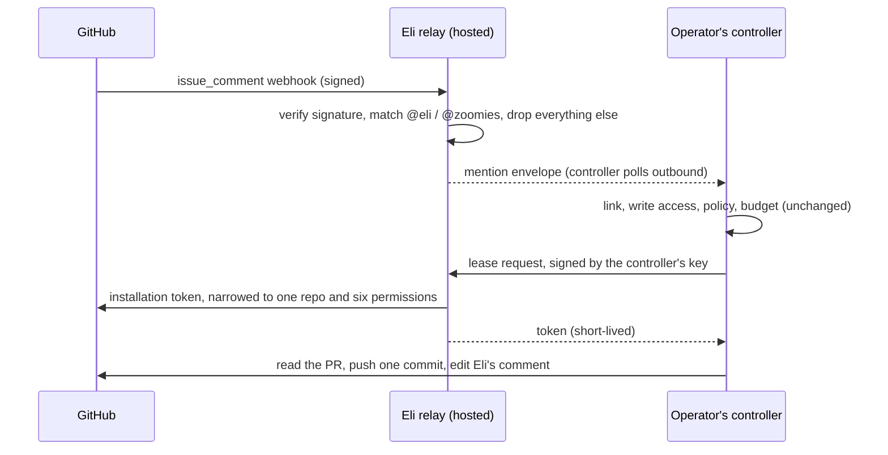

# 0012: A shared Eli GitHub App is a relay for mentions, and nothing else

**Status**: proposed, for the owner to ratify. Written on 10 October 2026 after
the owner asked whether Zoomies could offer one GitHub App that everyone uses
alongside the App each install creates for itself, and asked for a design that
works with `@eli` and `@zoomies` mentions. Nothing here is built. The questions
only the owner can answer are at the end.

## Context

Every install creates its own GitHub App through the manifest flow
(`internal/installer/manifest.go`). Its private key and webhook secret stay on
the operator's server and its webhooks go straight to the operator's controller.
That is the self-hosted promise: nothing sits in the middle and nobody else can
read the operator's repositories.

It has a cost that shows most in PR repairs. A comment such as `@eli fix` is
recognised from its text (`repairCommand` in `internal/controller/eli_repairs.go`),
because `eli` is not a GitHub account. GitHub does not autocomplete it, link it
or draw an avatar beside it, and the commits and comments come from
`<operator's app name>[bot]` with whatever picture the operator gave it. Other
tools show a real name and icon because they are one App that everybody installs.

Two facts shape the design:

* The controller never accepts an inbound connection from anything but GitHub's
  signed webhook, and agents only dial out (AGENTS.md). A shared App must not
  quietly reverse that.
* The controller already treats GitHub as untrusted input. After a webhook it
  re-reads the requester's linked identity, their repository write permission
  and the repair policy before it acts, and again before it pushes. That
  authorisation belongs on the controller and stays there.

## Decision

Run one hosted GitHub App, **Eli**, whose only job is PR repair mentions. Run it
as a **relay**: a `zoomies relay` subcommand of the one binary, operated by the
project. It receives the App's webhooks, keeps the App's private key, and gives
each operator's controller two things over an outbound connection: the mentions
meant for it, and short-lived installation tokens for the repositories involved.
The operator's own App stays the default, and stays the only App that registers
runners and scales the fleet. Both can be present on one installation.

The shared App never sees `workflow_job`, never registers a runner and never
asks for the runner permission. It subscribes to `issue_comment` and nothing
else.

### Mentions

One matcher decides what a mention is, and both halves import it. Move
`repairMention` and `repairCommand` into a small package that depends on the
standard library only (`internal/prrepair/mention`), so the relay and the
controller cannot drift apart. It accepts `@eli`, `@zoomies`, the shared App's
slug, and an operator's own App slug, each with an optional `[bot]`, followed by
`fix` or `repair`, at the start of a line outside a quote or a code fence. The
controller passes the slug it already stores as `Installation.AppSlug`; the relay
passes the shared slug.

The relay applies the matcher at the edge for one reason: it must hold as little
as possible. It drops every delivery that is not a newly created comment on a
pull request, by a human, whose author is the sender, and whose text contains a
command. It stores the envelope below and never the comment body beyond the
command line, which is capped at 4000 bytes as the controller caps it.

The controller does not trust the relay's filter. It runs the same matcher on
the envelope's command line and then every existing admission check. A malicious
or buggy relay can therefore make a controller consider a repair, never perform
one the operator's own rules would refuse.

### Pairing an installation with a controller

An envelope has to reach the right controller, and only that one. Pairing proves
two things: the operator controls a controller, and the person pairing may act
on the GitHub installation.

1. Settings, Eli AI Assistant, **Connect to the Eli app**. The controller makes
   an Ed25519 key pair and keeps the private half sealed with the same key that
   seals provider credentials. It sends the public half to the relay.
2. The relay runs GitHub's device flow for the operator. GitHub returns the
   installations the user can access, and the operator picks which to bind.
   Only an installation the user can administer is offered.
3. The relay records `installation_id -> controller key`. One installation
   binds to one controller. A second binding replaces the first only with a
   fresh device flow, and the old controller is told.

The relay stores no repository content, no tokens and no user list. It stores
the binding, a delivery counter per installation and an audit line per token
issued.

### The controller's side

An installation gains a `kind`: `own` (today) or `shared`. For `shared` the
controller has no private key. `clientCache.get` builds a client whose token
source calls the relay instead of signing an App JWT. Everything above the token
source is unchanged: `RepairClient`, the worker, the policy, the budget and the
comment editor all see an ordinary `github.Client`. The relay's inbox is a third
way into `enqueueRepairWebhook`, beside the signed webhook and the UI request,
and the existing dedup key (`comment:<repo>:<comment id>`) already absorbs the
case where an installation has both Apps and the same comment arrives twice.

The controller long-polls `GET /v1/inbox` with a request signed by its key,
acknowledging each envelope after it is queued. This is the agent's transport
shape, so a controller behind NAT needs no inbound rule.

### Tokens, and why the relay is the risky part

A relay that holds one private key with write access to every customer's
repositories is the most sensitive thing this project would run. The design
assumes it will be attacked and limits what the key can do:

* **Leases, not a token tap.** The relay issues a token only for a repository
  that has an open mention for the requesting controller, within 15 minutes of
  the envelope. A stolen controller key cannot mint tokens on its own schedule.
* **Narrowed tokens.** Each token is scoped through GitHub's `repositories` and
  `permissions` parameters to the one repository and the six permissions
  repairs need: contents, pull requests and issues write, and actions, checks
  and commit statuses read. Workflow editing is never requested; the policy
  opt-in for `.github/workflows` stays an own-App feature.
* **No extractable key.** The App key lives in a KMS or HSM and the relay asks
  it to sign the JWT. Compromising the host does not yield the key.
* **Per-installation limits** on envelopes and tokens, and a kill switch per
  installation and for the whole App.
* **Nothing stored that GitHub does not already have.** No source, logs,
  comment bodies or model output pass through the relay: the controller talks to
  GitHub directly with the token, and to the model provider directly.
* **Open source and an audit line per token**, with the installation, the
  repository and the lease it answered, so an operator can see exactly what was
  issued for them.

### When something is missing, say so

Two cases today produce silence, which is the worst answer to a mention. The
relay can answer them, because it is the App and has a token for the comment:

* No controller is bound to the installation, or it has not polled for five
  minutes: reply once, in Eli's voice, that the kennel is closed and what to do.
* The envelope expires unclaimed after an hour: the same, naming the repository.

It does not answer for the controller's own refusals (unlinked user, no write
access, budget spent). Those depend on who is asking, and telling an unlinked
stranger why they were ignored leaks the admission rules. Surfacing them to the
linked operator is a separate piece of work, noted below.

### Commits and comments carry Eli's face

Commits are authored by `eli[bot]` with the App's avatar, and the progress
comment is posted by it. This is the visible win the owner asked for, and it
arrives with the App itself: the dog avatar and the name are set once, on the
App.

## Consequences

* **A hosted service the project must run and defend.** That changes the
  "one process, one SQLite file, nothing in the middle" description for anyone
  who opts in. It is opt-in, labelled as such in the UI and docs, and `own`
  remains the default. If the owner will not run it, none of this ships, and the
  fallback is to rename each operator's own App to Eli with the dog avatar,
  which needs no code.
* **The matcher moves to a shared package**, and `repairCommand` takes the slug
  it already takes. This part is worth doing whatever is decided about the relay.
* **Two Apps, one repository.** If two different Zoomies installations both bind
  a repository, both would answer. One binding per installation prevents it at
  the relay; the claim for a comment is an `eyes` reaction by Eli, which a second
  controller checks before it starts. This needs a decision on whether the
  reaction is worth its extra API call.
* **Fleet scaling does not move.** Runner registration needs the runner
  permission on an organisation or repository and is the operator's own business.
  Putting it behind a shared key would make the relay load-bearing for CI, and a
  relay outage would stop jobs. The relay can fail without stopping a single job.
* **A new trust boundary needs tests like the others.** The relay must be pure
  at its edges in the way `internal/scheduler` is: a package that takes a
  delivery and returns an envelope or a refusal, with a table of what is dropped.
  A purity test should forbid it from importing `internal/store`.

## Work packages, if ratified

1. Extract `internal/prrepair/mention`, import it from the controller, and add
   the table test that both halves share. No behaviour change.
2. `Installation.Kind` and a token-source interface in `clientCache`, with a fake
   relay for tests. No network.
3. `zoomies relay`: webhook edge, bindings, inbox, lease and token endpoints,
   KMS signing behind an interface with a local-key fake.
4. Pairing in Settings and `zoomies init`, with the device flow.
5. The hosted deployment, runbook, retention statement and the Eli App's public
   listing.

## For the owner

* Will the project operate the relay, and under what domain? Everything above
  rests on this.
* Is `eli` available as the App slug on GitHub? If not, `@eli` stays a text
  command beside a differently named real handle.
* Retention: is "envelope kept for one hour, binding kept until revoked, token
  audit kept for ninety days" acceptable, or should the audit line be shorter?
* Should the relay also tell a linked maintainer why their mention was refused,
  through the Zoomies UI or a PR comment? It is outside this decision and worth
  its own.
