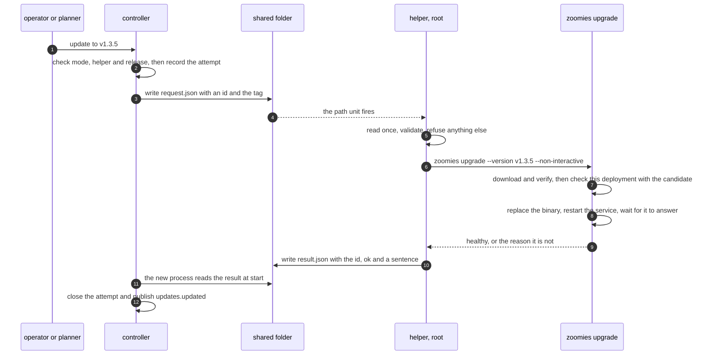
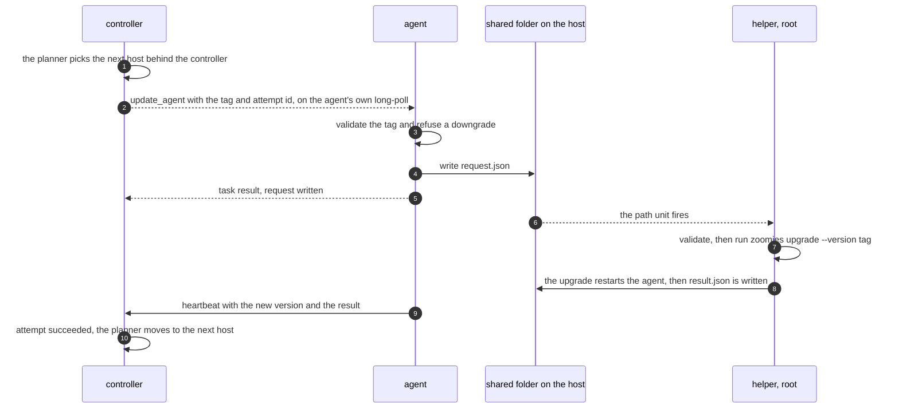

# ZF-229: updating Zoomies from the web UI

**Status**: proposed. The owner approved the shape on 8 October 2026 and chose
the update path ([decision 0011](decisions/0011-an-operator-may-let-zoomies-update-itself.md));
this text is waiting for their review. Nothing is built.

An operator should not have to run `sudo zoomies upgrade` by hand on the
controller and then on every agent host. Updating becomes a choice with three
settings:

* **off** — as today: a notice that a release exists, and a command to copy;
* **manual** — an Update button in the web UI, for the controller and for hosts;
* **auto** — Zoomies does it, within limits an operator can read.

It is mostly orchestration. The engine already exists. What is missing is a way
to act with the right privilege, and a policy on top.

**Success looks like this.**

* With the mode `off`, nothing changes on any installation and nothing new is
  created.
* With `manual`, an administrator can bring the controller and every host that
  opted in to the newest release from the browser, and sees why a host cannot be
  brought.
* With `auto`, a fleet whose hosts opted in follows each release without anyone
  running a command. It never installs a release that was replaced within the
  soak, and it stops at the first failure with a sentence that says what to do.
* None of it interrupts a running job.

## What is already here

* **The notice.** The controller asks GitHub which release is current
  (`internal/controller/updates.go`, every `updates.check_interval`, 24 hours by
  default, `0` never asks) and raises `controller.update_available`. It
  downloads nothing.
* **The engine.** `zoomies upgrade` is `installer.SelfUpdate` and
  `installer.Upgrade`. The first downloads a release, checks its sha256 against
  the release's `checksums.txt`, runs the candidate once, replaces the binary
  atomically and refuses a downgrade. The second reviews the deployment's
  layout, restarts the service — systemd, launchd, Compose or Docker — and, for
  a controller, waits for `/healthz`.
* **The host command.** A remote host's card shows
  `sudo zoomies upgrade --mode agent --version <tag>`
  (`internal/controller/host_upgrade.go`), aimed at the controller's own
  release, so an agent is never ahead of its controller.
* **Restart safety.** An agent restarted over running jobs adopts them
  ([upgrading](../docs/upgrading.md#what-happens-to-work-in-flight)). It
  advertises capabilities in `Features`, and a task kind it does not know is
  failed without harming the runner (`lifecycleTask` is an allowlist).
* **The settings group.** `updates.*` is platform-scoped (decision 31), and the
  registry already has enums.
* **A pattern for a consented root unit.** `zoomies-host-health.service` runs the
  host's own binary beside a container deployment and is offered through the
  upgrade's layout review.

## What stops it being a button

1. **A service cannot update itself.** Both unit templates
   (`internal/installer/templates/`) run the process as an unprivileged user,
   `zoomies` by default, with `ProtectSystem=strict` and only the state
   directory writable. The binary is root-owned in `/usr/local/bin`, and restarting a unit
   needs root.
2. **The delivery rules, and a deferral.** Rule 9 (off by default), rule 12 (no
   auto-upgrade as a recovery shortcut), rule 16 (the platform's hand on a host
   is the agent) and decision 25's deferral of controller-driven agent
   upgrades. [Decision 0011](decisions/0011-an-operator-may-let-zoomies-update-itself.md)
   reads them: this is opt-in policy, never recovery, and it updates Zoomies'
   own binary only.
3. **Releases are superseded within hours, and are public before they are
   complete.** `v1.3.1` was published at 14:59 on 25 September and `v1.3.2`
   replaced it at 19:23. The release workflow uploads assets one at a time, and
   `V1.1.0` is a published full release with no assets at all. "Latest" is not
   "ready".
4. **Migrations are one way.** There is no automatic rollback
   ([upgrading](../docs/upgrading.md#there-is-no-downgrade)), so an unattended
   update has to find what would stop it before it replaces anything.
5. **Hosts that predate the feature** cannot update themselves. One last manual
   upgrade installs the helper.

## 1. The three modes

| Mode | What it does |
| --- | --- |
| `off` (the default) | Nothing new. The notice and the copyable command stay. No helper is created. |
| `manual` | The Update buttons appear: the controller, one host, or every host that is behind. Nothing moves without a click. |
| `auto` | The controller takes the newest release once it has stood unreplaced for the soak, and hosts then follow the controller's release, one at a time. The buttons stay, and mean "now, skip the soak". |

**Settings**, both platform-scoped and live, so only the `platform` role changes
them:

* `updates.mode` — `off | manual | auto`, default `off`.
* `updates.soak` — a duration, default `24h`, `0` allowed. It applies to `auto`
  only: a person pressing the button is the soak.

`updates.check_interval` is unchanged and is still the air-gap switch. With `0`
this feature has nothing to go on, so a mode other than `off` beside it is a
warning (`updates.mode_without_check`). `auto` also raises an info finding that
names the setting, so unattended updating is never silent (the rule in
[internal/config/CLAUDE.md](../internal/config/CLAUDE.md)).

**Who may press what.** `platform` changes the mode and updates the controller;
`admin` updates hosts; `operator` and `viewer` read. With the mode `off` nobody
can press anything: the platform decides whether the capability exists, and a
fleet's administrators use it.

**Which release.** A *complete* release is a tag of the form `vX.Y.Z` (so the
stray `V1.1.0` is out), not a prerelease or draft, that carries `checksums.txt`
and the binary for the host's OS and architecture.

* `manual` takes the newest complete release, newest by version.
* `auto` takes it too, but only once it has been public for `updates.soak`,
  counted from its `published_at`. A newer release restarts the wait, so a
  release that is replaced quickly is never installed. With a 24-hour soak,
  `v1.3.2` arriving four and a half hours after `v1.3.1` means `v1.3.1` is
  skipped, and `v1.3.2` is taken a day after its own publication. The cost is
  that a project publishing faster than the soak would never be updated by
  `auto`; the status sentence says so, and the button still works.
* A build that is not from a release (`main-sha-…`, a local describe) is never
  updated by this feature. The existing development notice stays.

**Hosts follow the controller.** A host's target is the controller's running
release (`version.InstallTag`), never "latest", so an agent is never ahead of
its controller (the skew policy in
[upgrading](../docs/upgrading.md#version-skew)). A controller that is not a
release build gives hosts no target, as the host command does today.

## 2. The helper

A pair of systemd units on a host that wants to be updatable:

```ini
# zoomies-update.path
[Path]
PathExists=/var/lib/zoomies/shared/update/request.json
Unit=zoomies-update.service

# zoomies-update.service -- runs as root, one request at a time
[Service]
Type=oneshot
ExecStart=/usr/local/bin/zoomies updates helper run
TimeoutStartSec=45min
```

The paths are rendered from the host's real shared folder and binary. The
service's hardening is as tight as an upgrade allows. It must write the binary,
unit files and Compose files, so not `ProtectSystem=strict`, but
`NoNewPrivileges`, `PrivateTmp`, `ProtectHome` and the kernel protections. It
consumes the request — the file is removed once read — so the path unit fires
once per request.

**The channel is a folder, not a socket.** The service account writes
`<shared>/update/request.json`, and the helper writes `result.json` beside it.
The shared folder (`config.SharedDir()`, `/var/lib/zoomies/shared`) is under the
state directory, so the service can write it, and a container that runs runners
already has it mounted at the same path. The upgrade's layout review adds the
mount for those, and the helper's own offer adds it for any container that lacks
it. A root-owned `helper.json` beside the two says the helper is installed,
which is how the controller knows to offer the button.

**The request names one thing:**

```json
{ "v": 1, "id": "upd_k3f9qz2m", "tag": "v1.3.5",
  "requested_by": "user:alice", "requested_at": "2026-10-08T09:00:00Z" }
```

**The root side is the trust boundary, and it fails closed.** The service is the
less privileged party, so the helper treats the file as hostile.

* The shared folder is opened with `os.OpenRoot` and the request is read once
  through one descriptor. It must be a regular file, at most 4 KiB, owned by the
  service account, with known fields only. What was read is validated, not the
  path, so there is nothing to swap between the check and the use.
* `tag` must match `^v[0-9]+\.[0-9]+\.[0-9]+$`. The request carries no URL, path,
  command or flag, and the release source comes from the helper's own
  root-owned environment (`ZOOMIES_BASE_URL` and `ZOOMIES_REPO`, as
  `SelfUpdate` reads them), never from the request.
* A tag older than or equal to what is installed is answered as already done,
  by the existing no-downgrade guard.
* It keeps its own state — the ids it has seen and the attempts per tag — in a
  root-owned directory outside the shared folder, as `zoomies-host-tune` does,
  so the service cannot reset it. At most two attempts per tag and one per ten
  minutes; a repeated id is refused.
* It writes `result.json` through the same root handle, creating a new file and
  renaming it, and never follows a link the service might have planted. A
  request it refuses is answered too, with the reason.

**Then it runs the existing engine, unattended:**
`zoomies upgrade --version <tag> --non-interactive`, never `--yes`. Anything
that needs consent stops and says so, and the result reads "needs an operator:
run `sudo zoomies upgrade --yes`".

**Two changes to the engine, which manual upgrades get as well:**

* *Pre-flight with the candidate.* Today the binary is replaced first and the
  new release's own layout checks run second, so an unattended run can swap the
  binary and then stop on a change the new release needs. `SelfUpdate` is split
  into fetch (download and verify to a temporary file) and install (replace).
  Between the two the candidate is run as `upgrade --check --non-interactive`
  against the installed binary's deployment. A failed check leaves the old
  binary in place and the service untouched.
* *The previous binary is kept* as `zoomies.previous` beside the installed one,
  so a manual rollback has something to go back to.

**Consent lives on the host.** Nothing creates the helper while the mode is
`off`, and the mode cannot create it. `zoomies init` and `zoomies agent join`
offer it, as a question that defaults to no and a flag for unattended installs.
The upgrade's layout review offers it on an existing host, exactly as it offers
the host-health unit. `sudo zoomies updates helper install` does it
directly, and `helper remove` and `zoomies uninstall` take it away. A host whose
owner did not install it is never updated, whatever the controller's mode says.
The helper is listed in
[What the agent owns on a host](../docs/security.md#what-the-agent-owns-on-a-host).

**It outlives releases.** The unit calls a stable entry point, and the request
and result carry `"v": 1`. A release that changes either bumps it, and the
upgrade's layout review refreshes the unit.

## 3. Orchestration

### The controller



The old process watches for `result.json` after writing the request, so a
pre-flight failure shows in seconds rather than after a timeout. The new process
reads it at start and closes the attempt. With no result and no change of
version in 45 minutes the attempt is failed, loudly.

If the new controller never comes up, nothing in the UI can say so. The unit's
journal, `result.json` and `zoomies updates helper status` can, and the previous
binary and the pre-migration copy of the database are where
[upgrading](../docs/upgrading.md#there-is-no-downgrade) says they are.

### A host



* The controller queues `update_agent` only to a host whose agent advertises a
  new `self-update` feature, which an agent does only when its helper is ready.
  An older agent fails an unknown task kind harmlessly, and the host card says
  why it cannot update itself.
* Success is the host heartbeating the target version, not a task result. A task
  lost to a restart changes nothing: the next pass sees a host still behind and
  asks again, within the attempt limits.
* A failure reaches the controller on the agent's heartbeat, which carries the
  last `result.json` until it is acknowledged.

### The rollout

* One host at a time, the one with the fewest active runners first, then by
  name. No cordoning: a restart is
  safe with jobs running, and the controller never touches an operator's cordon.
* The first failure or timeout *halts* the rollout and raises
  `host.update_failed` until an operator resumes or cancels it. A halted rollout
  starts nothing.
* No host update starts while the controller's own attempt is open.
* An embedded agent is updated with the controller, not as a host.

### The planner

`internal/updates.Decide(snapshot) Plan` is pure, as the scheduler is: no clock
read, no database, no network. The snapshot carries the mode and soak, the
running version, the releases GitHub listed, the helper's state, the open
attempts and rollout, and each host's version, features, health and runner
count. The plan is the actions to take and the sentence the UI shows, for
example "Waiting: v1.3.5 has been public for 6 hours and auto waits for 24; it
can be taken in 18 hours." That is where every decision's reason string comes
from, as in the scheduler.

It is level-triggered. Each pass recomputes from rows, so a missed event costs
one pass and a restart loses nothing. It runs on its own loop with a one-slot
wake channel, outside `reconcileMu`, as the machine loop and the automatic pool
reconciler do.

### What is stored

Two small tables, written only by `internal/store`:

* `update_attempts` — id, scope (`controller` or `host`), host, from, to,
  trigger (`manual` or `auto`), requested_by, state (`requested`, `succeeded`,
  `failed`, `timed_out`, `cancelled`), error, requested_at, finished_at.
* `update_rollouts` — id, target, trigger, state (`running`, `halted`, `done`,
  `cancelled`), started_by, halted_reason, started_at, finished_at.

They are pruned with the other retention keys. After a failure the planner waits
30 minutes, and after two failures of one tag it waits for an operator.

## 4. Surfaces

**REST first** (rule 4). The UI and the CLI are clients of it.

| Route | Role | Does |
| --- | --- | --- |
| `GET /api/v1/updates` | viewer | The status: mode, soak, running and eligible release, the helper, the open attempt and rollout, and the planner's sentence. Machine paths are blanked below `platform`. |
| `POST /api/v1/updates/check` | admin | Ask GitHub now; at most once a minute; refused when `check_interval` is `0`. |
| `POST /api/v1/updates/controller` | platform | Update the controller to the newest eligible release, or to `tag`. |
| `POST /api/v1/updates/hosts` | admin | Start a rollout of every host behind the controller, or of `host_ids`. |
| `POST /api/v1/updates/rollout/resume` | admin | Resume a halted rollout. |
| `DELETE /api/v1/updates/rollout` | admin | Cancel it. |
| `POST /api/v1/hosts/{id}/update` | admin | Update one host. |

Refusals carry a stable code: `update.mode_off`, `update.check_disabled`,
`update.helper_missing`, `update.in_progress`, `update.not_a_release`,
`update.nothing_newer`, `update.host_cannot_update`, `update.rollout_halted`.

* **Events.** `updates.updated` carries the status in the `GET` shape. A host's
  `update` block (state, whether it can update, the reason, the attempt) rides on
  `host.updated`, beside the `upgrade_command` that stays as the fallback.
* **Problems**, each with its row in `docs/problem-codes.md`:
  `controller.update_available` (exists; its fix names the button when one
  works), `controller.update_helper_missing`, `controller.update_failed`,
  `host.update_failed`, and an info `host.update_unavailable` for a host that is
  behind and cannot update itself.
* **Audit.** A row for every request, resume and cancel. The planner's carry the
  system identity as `system:auto-update`.
* **CLI.** `zoomies updates status | check | apply | resume | cancel` and
  `zoomies updates helper install | remove | status`, which are clients of the
  routes. `helper run` is what the unit calls. `zoomies upgrade` is untouched and
  is still the engine.
* **UI.** A **Settings → Updates** section: the mode with a sentence of
  consequence under each choice, the soak, the running and eligible release, the
  helper's state with the install command to copy, and the last result. The
  Update button beside the existing notice. On **Hosts**, an Update button on
  each card and one for every host that is behind, with the copied command kept
  beneath as the fallback. An open tab already picks up the new build on its
  next navigation (`web/src/lib/state/upgrade.svelte.ts`).
* **MCP.** Status only, if at all. An assistant does not get a tool that
  restarts the controller.
* **Metrics.** Attempts by scope and result, and whether an eligible release is
  waiting. Names follow `docs/metrics.md`.

## 5. When it goes wrong

| What goes wrong | What happens | What the operator sees |
| --- | --- | --- |
| No helper on the host | The button is disabled | The reason, and the install command |
| The helper refuses the request | Nothing runs | `result.json` says why; the attempt fails |
| The download or checksum fails | `zoomies upgrade` stops before replacing anything | The attempt fails with the message |
| The candidate fails its pre-flight | The old binary stays and the service is not restarted | "Needs an operator", with the command |
| Something else holds `upgrade.lock` | The run stops at once | The attempt fails; the planner retries after its wait |
| The new controller does not come up | The agents keep working | Only the host can say; see section 3 |
| A host is not back at the target version in 45 minutes | The attempt times out | `host.update_failed`; the rollout halts |
| The controller restarts mid-rollout | The planner reads the rows and carries on | Nothing |
| GitHub is unreachable | The check keeps its last answer | An update attempt fails at the download |

## 6. Security

| Threat | How it is bounded |
| --- | --- |
| A compromised controller asks root for something | It can name a tag in a fixed shape, never a URL, path or flag. The source is the helper's own environment, and a downgrade is a no-op. At most two attempts per tag and one per ten minutes. The worst it can do is move a host to a published release, which an administrator could do with the button. |
| A forged or compromised release | Trusted as far as `zoomies upgrade` is today: a sha256 from the same release, over TLS. Unattended, that is a larger bet. The soak and the completeness rule are this package's mitigations. Each release already carries a provenance attestation that nothing checks inside the product; verifying it, or a signature, is the recorded follow-up. |
| A planted symlink, or an oversized or swapped file | `os.OpenRoot`, one descriptor, a size limit, an owner check, known fields only. `result.json` is created through the same handle. |
| A replayed request | The ids seen are kept in state the service cannot write. |
| A host that did not agree | The helper exists only where someone on the host installed it. |
| A runaway loop | The helper's limits, the planner's wait, and a halted rollout. |

## 7. Testing

Each behavioural test is run once against the code with its rule removed and
seen to fail (rule 14).

* `internal/updates`: table tests for the soak edges, the `v1.3.1` then `v1.3.2`
  sequence (the first is never taken), an incomplete release, the uppercase tag,
  a prerelease, a non-release build, the mode gates, one at a time, idle first,
  halt, timeout, resume, an embedded host, an ahead agent and a missing helper.
* `internal/installer`: request validation (a symlink, a directory, an oversized
  file, the wrong owner, an unknown field, a bad tag, a repeated id, the rate
  limit); unit rendering; the helper offered with consent and skipped
  unattended; a failed pre-flight leaving the binary; `zoomies.previous` kept.
* `internal/controller`: a fake release list and an injected clock; the attempt
  lifecycle, including recovery after a restart; the event equal to the `GET`
  shape.
* `internal/agent`: the task validated, the feature advertised only with a ready
  helper, the request written, the result carried on the heartbeat.
* `internal/api`: the role matrix and every error code.
* `internal/docs`: the problem-code rows, the new fact in `agent_owns_test.go`,
  the settings table.
* `test/drill`: an update with a job running keeps the job, and a controller
  restart mid-rollout carries on. `test/upgrade`: the helper driven with a fake
  `systemctl`.
* `web/tests`: Playwright, desktop and mobile with the accessibility pass, for
  Settings → Updates and the host button.

## 8. Delivery

Six pull requests, in this order, each shippable alone because the mode defaults
to `off`. Each carries its own API, client and documentation changes (rule 6)
and its progress-row update. The last adds the drills and the narrative page.

| # | Behaviour | Exit criterion |
| --- | --- | --- |
| 1 | The mode and soak are stored; the release list and the eligible release are computed and shown, with `internal/updates` starting as the pure eligibility rule; the status route and a read-only panel | A mode is stored and shown and nothing acts; the soak edge is a table test |
| 2 | The helper: request and result, the units, install and remove, the layout offer, the pre-flight, `zoomies.previous` | A request makes an upgrade run against a fake `systemctl`; every refusal has a test |
| 3 | Controller update from the button | An attempt is recorded and closed across a restart; the failure problem carries the helper's sentence |
| 4 | Host update: the feature, the task, the heartbeat result, the route and the button | A host moves to the controller's release with a job running on it, and the job survives |
| 5 | `auto`: the planner, the rollout, the loop, halt and resume | The planner's tables hold; a halted rollout starts nothing; the soak holds a release back |
| 6 | Drills, `docs/upgrading.md` and the screenshots | The drills run in CI; the page says what each mode does |

## 9. Not in this package

| Left out | Why | Revisit when |
| --- | --- | --- |
| A maintenance window | The registry has no schedule type, and the soak covers the commonest reason for one | Someone asks |
| A per-host hold | Not installing the helper on a host is already one | A host must be pinned and still be managed |
| Automatic rollback | Migrations are one way; `zoomies.previous` and the pre-migration copy make a manual one possible | It is its own package: `zoomies upgrade --rollback` |
| Verifying the release's attestation or a signature | A new dependency or a signing key, and a decision about which | Before `auto` is recommended to anyone |
| Updating several hosts at once | One at a time is the safe default, and each upgrade also pulls runner images | A fleet is large enough that a rollout takes too long |
| Separate modes for the controller and the hosts | One selector is what was asked; `updates.hosts` would be additive | Someone wants hosts to follow a controller they update by hand |
| macOS, Windows, PaaS | A launchd helper needs `WatchPaths`, `SelfUpdate` skips Windows, and a PaaS redeploys itself | A fleet runs one and asks. They show as manual, with the reason |
| Dev builds | A build from `main` is tracked on purpose | Not planned |
| Serving binaries to air-gapped hosts | Those fleets set `check_interval: 0` and stay manual | Someone with an air-gapped fleet asks |

## 10. Open points for the plan

* The CLI group name. `zoomies updates` sits next to the `update` alias for
  `upgrade`; `zoomies release` is the alternative. Recommend `updates`, for
  parity with the `/updates` routes, and a help text that says which is which.
* The helper's exact hardening list, and where its own state lives
  (`/var/lib/zoomies-update/`, mirroring `zoomies-host-tune`).
* One `GET /releases` request or two, and its share of the unauthenticated rate
  limit.
* Table shapes, and the retention key for attempts.
* The Settings → Updates layout, which wants its own pass against
  `docs/ui-guidelines.md`.
